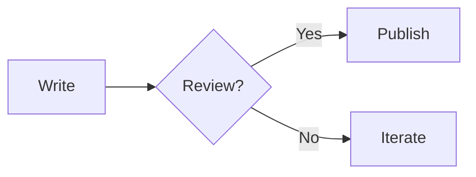

# Content

This directory is the source of truth for writing and career material.

```txt
blog/         Technical writing, ideas, learning notes
weekly/       Weekly reviews and personal logs
projects/     Project records and portfolio pages
career/       Resume bullets, STAR stories, profile material
ai-tracker/   AI 信息摄取与长期追踪 (`.md` 为主,允许 `.mdx`)
book-list/    读书笔记 — 读过的书 + 摘要 + 个人收获 (`.md`)
inbox/
  ideas/         → blog
  logs/          → weekly
  project-notes/ → projects
  career-notes/  → career
  ai-notes/      → ai-tracker
  book-notes/    → book-list
```

Default format is Markdown (`.md`). Use MDX (`.mdx`) only when a page needs React components, richer layout, diagrams, or embedded demos.

## Status Values

- `draft`: not public
- `published`: visible on public pages
- `archived`: kept in the repository but hidden from primary lists

Hermes agent may create and edit drafts. Hermes must not change content to `published` unless explicitly instructed by the owner.

## Mermaid Diagrams

Mermaid diagrams render on the **client** via the official `mermaid` library. The site provides two ways to embed them, both routed through the `<Mermaid>` client component:

### Option 1 — Fenced code block (recommended for most cases)

````md

````

`components/mdx-content.tsx` overrides the `pre` element to detect `language-mermaid` and hand the chart text to `<Mermaid>`. Other fenced blocks (TypeScript, JSON, etc.) render normally as `<pre><code>`.

### Option 2 — `<Mermaid>` component directly

Useful when the chart source is computed or interpolated:

```mdx
<Mermaid
  chart="graph TD
    A[Start] --> B[End]"
/>
```

The `chart` prop must be a **plain string**. Do not use a JSX template-literal expression (`chart={`…`}`) — the MDX → RSC serializer drops the value. Use double-quoted strings (regular or multi-line) instead.

### Behavior and limitations

- **File extension**: both forms require the file to be `.mdx` (not `.md`), because the component is registered in the MDX component map.
- **First render**: a `mermaid-loading` placeholder is shown while the browser fetches and runs Mermaid. The SVG replaces it after hydration.
- **Errors**: invalid Mermaid syntax falls back to a `<pre class="mermaid-error">` containing the original chart text plus a `mermaid-error-message` span. The page does not crash.
- **Security**: Mermaid runs with `securityLevel: "strict"`, so click events in flowcharts and external scripts are disabled.
- **Client JS cost**: Mermaid is a ~600 KB client bundle loaded only on pages that contain a `<Mermaid>` component.

## JSX Serialization Gotcha

The MDX pipeline (`next-mdx-remote/rsc`) sends JSX props across the React Server → Client boundary as part of the RSC payload. Two patterns **silently drop the value** and the prop arrives as `undefined` at runtime:

1. **Template literals as attribute values**
   ```mdx
   <Mermaid chart={`graph LR\nA-->B`} />   {/* chart arrives as undefined */}
   ```
2. **Array literals as attribute values** — including arrays of objects and arrays containing JSX children
   ```mdx
   <Timeline items={[{ label: "Mon", title: "..." }]} />   {/* items arrives as undefined */}
   <Tabs tabs={[{ label: "Tab 1", children: <>...</> }]} />   {/* tabs arrives as undefined */}
   ```

### Workarounds

- **Pass data as a plain string** (the value is JSON-encoded) and parse it in the component. Works for Mermaid's `chart` prop; ugly for rich JSX.
- **Import data from a separate file** at the top of the MDX file:
  ```mdx
  import { timelineItems } from "./w15-data"
  <Timeline items={timelineItems} />
  ```
  The import resolves to a module export that the RSC serializer can walk. Co-locate `w15-data.ts` next to `w15.mdx`.
- **Use plain Markdown** (tables, lists) and skip the component entirely. The page does not need `<Timeline>` for a list of dated events.

All three custom MDX components (`Callout`, `Timeline`, `Tabs`) render a helpful "missing data" placeholder when their required array prop is undefined, so a partially-broken MDX file no longer crashes the whole page — it just renders an explanatory note in place of the component.

## AI Tracker frontmatter

AI Tracker is a knowledge-radar / reading-log column — not Blog, not Weekly. Each entry is a tracked source (paper, tool, article, …) with my own takeaways, questions, and links to related posts across the site.

### Required fields

- `title`, `date`, `summary`, `status` — same as other collections
- `tags` — fine-grained labels (e.g. `["GPT-5", "OpenAI", "evaluation"]`)
- `topics` — coarse grouping (2–4 entries, e.g. `["模型", "研究方法"]`); the list page groups cards by topic, and a post may appear in multiple groups
- `sourceType` — one of `paper | product | model | agent | tool | article | video | podcast | discussion | other`
- `signal` — `1 | 2 | 3`; how strongly I want to remember this one
- `signalLabel` (optional) — short tag next to the number, e.g. `"高价值"`

### Optional fields

- `sourceUrl` / `sourceTitle` / `author` / `publishedAt` — provenance block on the detail page
- `takeaways` — `string[]`, my distilled conclusions
- `questions` — `string[]`, things I still don't know
- `relatedLinks` — `[{ title, url }]`, external references
- `relatedPosts` — `{ blog?: string[]; weekly?: string[]; projects?: string[]; career?: string[] }`, cross-collection slug links
- `lang`, `englishSummary` — same as Blog

### Drafts

`status: draft` entries are filtered out of `/ai-tracker` and the detail route. Use drafts for in-progress tracking.

### RSS 订阅 → `/ai-tracker/feed.xml`（RSS 2.0，只 published）

## Book List frontmatter

Book List 是读书笔记栏目 — 记录读完的书、核心观点、个人收获与可执行改变。每条 = 一本书(不是一章)。

### 必填字段

- `title`, `date`, `summary`, `status` — 与其他 collection 一致
- `author` — 作者全名
- `genre` — 单字段粗分类,见 `docs/agent/book-list-template.md` 的 `genre` 枚举
- `tags` — 细粒度标签(2-5 个,概念而非形容词)

### 可选字段

- `lang` — 默认 `zh`
- `englishSummary` — 1-2 句英文摘要

### Drafts

`status: draft` 条目被 `/book-list` 列表和详情路由过滤掉,草稿期间不可见。Coya 手动改为 `published` 后才会公开。

### 转化路径

`content/inbox/book-notes/` 的碎片通过 `/book-list-from-inbox` 整理为 `content/book-list/<date>-<slug>.md`。

