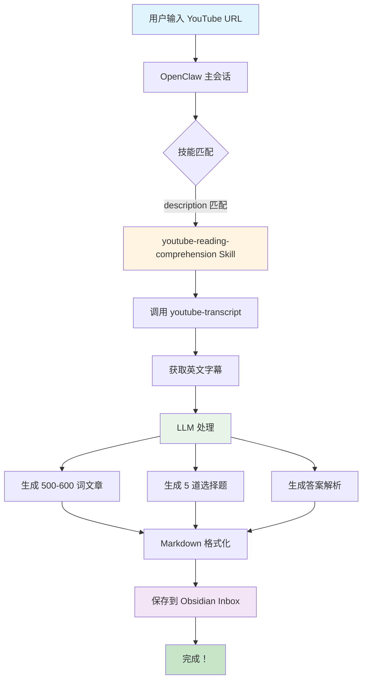
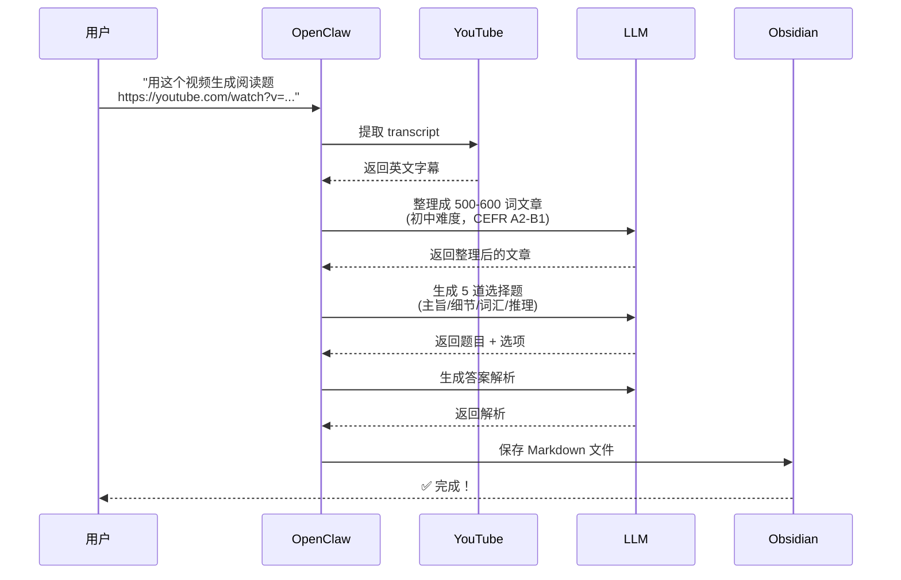
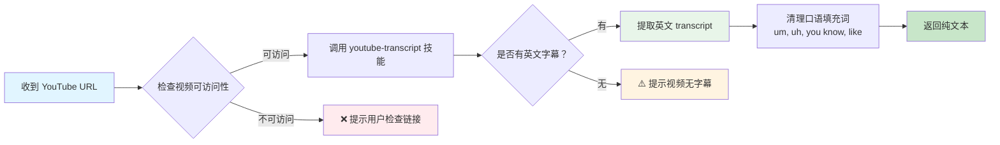
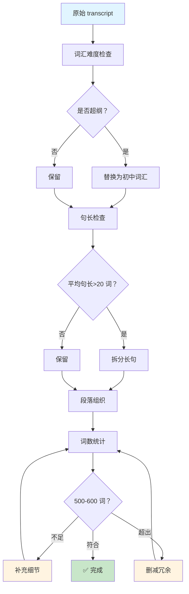
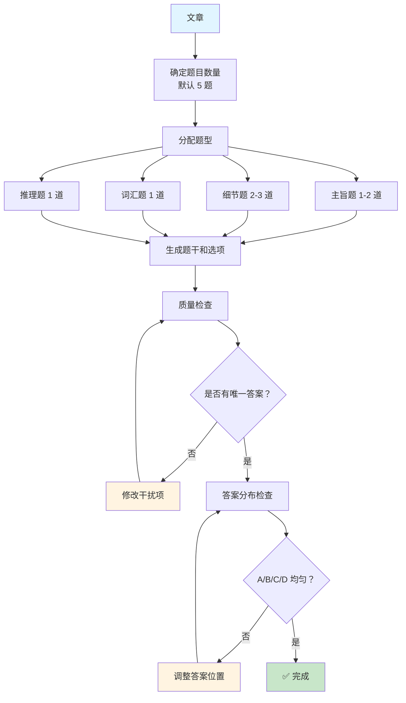
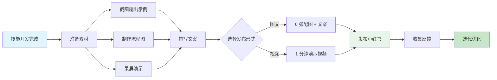

# 从零到发布：我用 OpenClaw 做了一个 YouTube 阅读理解生成器

> 来源：Obsidian 笔记 · 2026-03-21

## 缘起：一个实际的需求

我朋友是初中英语老师，每周都要出阅读理解题。她的流程是这样的：

1. 找一个合适的 YouTube 视频（通常是 TED-Ed）
2. 手动听写，把视频内容转成文字
3. 编辑整理成 500-600 词的文章
4. 绞尽脑汁想 5 道选择题
5. 写答案解析
6. 排版成打印格式

**全程耗时：2-3 小时**

她说最痛苦的是出题环节——要确保每道题都有依据，选项要有干扰性但不能有歧义，答案要均匀分布（不能全是 C）。有时候为了想一个合理的干扰项，能卡住半小时。

我就想：这个过程，能不能自动化？

## 需求分析

先拆解她的核心需求：

| 需求 | 具体要求 |
|------|---------|
| **文章长度** | 500-600 词（严格控制，方便课堂使用） |
| **难度等级** | 初中水平（CEFR A2-B1，2500-3500 词汇量） |
| **题目数量** | 5 道题（可配置 3-10 道） |
| **题型分布** | 主旨题 1-2 道 + 细节题 2-3 道 + 词汇题 1 道 + 推理题 1 道 |
| **输出格式** | 中国考试风格（A/B/C/D 选项，带解析） |
| **保存位置** | Obsidian 知识库，方便后续整理 |

## 技术选型：为什么是 OpenClaw？

我调研了几个方案：

| 方案 | 优点 | 缺点 |
|------|------|------|
| **Python 脚本** | 灵活，可定制 | 需要单独部署，用户门槛高 |
| **Web 应用** | 界面友好 | 需要服务器，维护成本高 |
| **OpenClaw Skill** | 零部署，直接对话触发，自动保存 Obsidian | 依赖 OpenClaw 环境 |

最终选 OpenClaw，因为：
- 用户已经在使用 OpenClaw
- 可以直接调用现有的 `youtube-transcript` 技能
- 输出自动保存到 Obsidian，符合用户工作流
- 技能可以发布到 ClawHub，其他人也能用

## 系统架构

整个技能的技术架构如下：



## 核心工作流程

### 整体流程（6 步）



### Transcript 提取流程



### 文章生成流程



### 题目生成流程



## 输出格式设计

### 中国考试风格

一开始我用的是西式博客风格：

```markdown
# 📖 Reading Passage

## How to Sleep Less and Feel Amazing

Have you ever had that moment...

---

# ❓ Comprehension Questions

**1. What is the main idea?**
- A. ...
- B. ...
```

但用户反馈说，这不符合中国学生的使用习惯。她想要的是**考试卷子**的感觉，不是博客文章。

所以我改成了中国考试风格：

```markdown
阅读下列短文，从每题所给的 A、B、C 和 D 项中，选出最佳选项。

1. According to the passage, what is the main factor?
A. How many hours you sleep
B. How efficiently your brain moves through sleep cycles
C. How early you go to bed
D. How comfortable your bed is

---

### 参考答案与解析

1. B
[解析：主旨大意题。由第三段"it's not about how long you sleep..."可知]
```

这个改动很关键——格式对了，用户用起来才顺手。

## 效率对比

```mermaid
xychart-beta
    title "传统出题 vs AI 出题：时间对比（分钟）"
    x-axis ["找文章", "听写", "出题", "排版", "总计"]
    y-axis "时间（分钟）" 0 --> 180
    bar [30, 60, 60, 20, 170]
    bar [2, 0, 2, 3, 7]
```



**效率提升：24 倍**

最明显的优化是听写环节——AI 直接提取 transcript，这个 60 分钟的环节直接归零。

## 难点与解决

### 难点 1：词数控制

LLM 天生不擅长数数。一开始生成的文章要么 300 词（太短），要么 800 词（太长）。

**解决方案：**
- 在 prompt 里明确要求"严格控制在 500-600 词"
- 生成后用代码统计词数
- 如果超出范围，让 LLM 重新生成

### 难点 2：题目质量

早期生成的题目有问题：
- 干扰项太明显（一眼看出答案）
- 题干有歧义
- 答案全是 C

**解决方案：**
- 增加质量检查环节
- 要求每题必须有明确的文章依据
- 检查答案分布，强制均匀分布

### 难点 3：难度控制

第一版生成的文章用了太多高级词汇（metacognition, neuroplasticity），初中生看不懂。

**解决方案：**
- 在 SKILL.md 里明确词汇范围（CEFR A2-B1，2500-3500 词）
- 要求平均句长 15-20 词
- 禁止使用复杂从句和虚拟语气

## 发布计划

技能开发完成后，我计划发布到小红书。这是内容规划：

### 文案生成流程



### 小红书笔记结构

| 图序 | 内容 | 说明 |
|------|------|------|
| P1 | 封面 | "AI 自动生成英语阅读题！初中教师必备神器🔥" |
| P2 | 整体流程图 | 彩色简化版 Mermaid 图 |
| P3 | 效率对比图 | 170min vs 7min 柱状图 |
| P4 | 输出示例 1 | 完整文章截图 |
| P5 | 输出示例 2 | 题目 + 答案截图 |
| P6 | 获取方式 | GitHub 二维码 |

### 文案核心

```
作为英语老师，你是不是也经常：
❌ 想找合适的阅读材料，翻遍全网
❌ 出题出到怀疑人生，选项想破头
❌ 想因材施教，但没时间定制

现在，一个 AI 工具全搞定！✨

📌 功能亮点：
✅ YouTube 视频 → 500-600 词阅读文章
✅ 自动生成 5-10 道选择题（可配置）
✅ 难度适配初中/高中（CEFR A2-B1）
✅ 输出格式专业，直接打印可用
✅ 免费！开源！

全程 2 分钟，自动化完成！⚡
```

## 技术栈

| 组件 | 技术 |
|------|------|
| **框架** | OpenClaw |
| **技能类型** | Pure LLM Skill（无代码） |
| **Transcript 提取** | youtube-transcript 技能 |
| **文章生成** | LLM（qwen3.5-plus） |
| **保存位置** | Obsidian（~/Documents/LucasSecondBrain/Resources/Inbox/） |
| **文件格式** | Markdown + YAML Front Matter |

## 后续迭代方向

1. **多语言支持** - 目前只支持英文视频，后续可以支持其他语言
2. **难度分级** - 增加小学/高中/大学等级别
3. **听力材料** - 同视频生成听力题（填空、听写）
4. **批量处理** - 一次处理多个视频，生成整套试卷
5. **Web 界面** - 给非 OpenClaw 用户提供一个简单的网页版

## 结语

这个项目从需求分析到技能发布，全程用了不到一周。最核心的经验是：

**好的 AI 工具不是炫技，而是解决真实问题。**

我朋友现在每周用这个技能出阅读题，她说省下来的时间可以用来研究教学方法和关注学生个体——这才是技术该有的价值。

---

**项目地址：** （待发布到 ClawHub）
**使用文档：** （待补充）

**相关技能：**
- `youtube-transcript` - 提取 YouTube 字幕
- `youtube-to-article` - YouTube 视频转文章
- `edge-tts` - 文字转语音（发音示范）