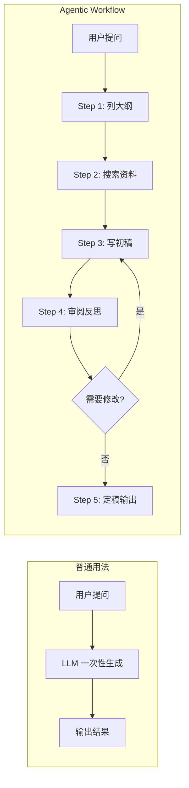
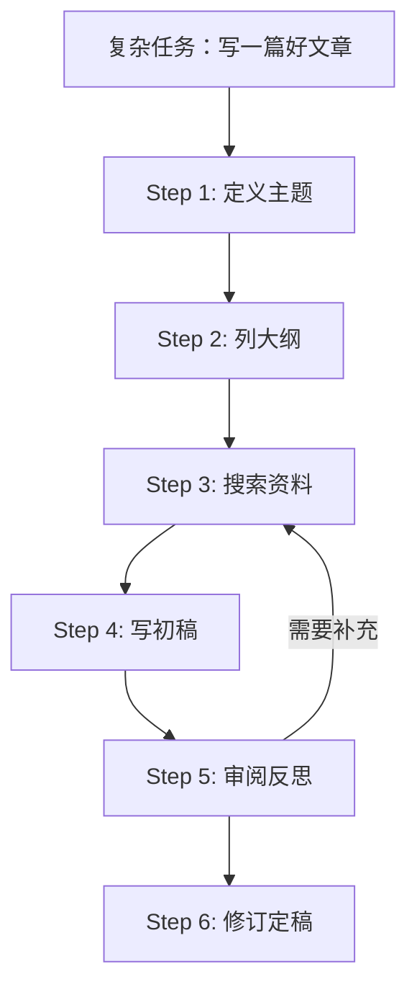
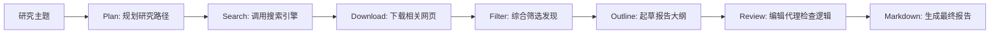
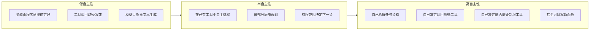

# Agentic AI 工作流：不是一口气写完，而是分阶段完成

> 来源：DeepLearning.AI · Andrew Ng · Agentic AI 课程笔记

---

## 什么是 Agentic AI？

Andrew Ng 提出 **agentic** 这个词，是为了描述一种重要且增长极快的趋势：人们开始用新的方式构建基于 AI 的应用。

如果我们忽略炒作，真正有价值、能落地的 Agentic AI 应用确实在非常快地增长。它们已经被用来构建：

- 客服智能体
- 深度研究代理（撰写高质量研究报告）
- 复杂法律文档处理工具
- 医疗场景中的患者信息分析与辅助诊断系统

> **学会构建 Agentic AI 应用，已经成为当下 AI 领域最重要、也最有价值的能力之一。**

---

## 普通用法 vs Agentic Workflow

### 普通用法：一口气写完

今天很多人使用 LLM 的方式是直接说：「请帮我写一篇关于 X 的文章。」

这就像要求一个人从第一句话写到最后一句，中间不能停下来、不能回头修改、不能按退格键。即便如此，大语言模型居然还能写得相当不错——这本身已经很厉害了。

### Agentic Workflow：分阶段完成

采用 Agentic Workflow 后，整个过程变成：

1. 先写一个文章大纲
2. 判断是否需要联网做研究
3. 搜索并下载相关网页
4. 根据资料写出第一版草稿
5. 回过头阅读这版草稿
6. 判断哪些部分需要修改、哪些部分还需要补充研究
7. 继续修订
8. 如有需要，加入人工审核步骤

这个过程更像是真正写作者的工作方式：先想 → 再查 → 再写 → 再改 → 再想 → 再完善。

> **所谓 Agentic AI workflow，本质上就是把复杂任务拆成多个步骤来完成。**

---

## 核心能力：学会拆任务

真正的难点不在于「会不会谈概念」，而在于：

- 你怎么拆步骤？
- 每一步该怎么设计？
- 每一步由什么组件来完成？
- 步骤之间如何衔接？

这些都不是完全显然的，但它们正是你能不能做出高质量 agentic 应用的关键。

---

## 案例：构建一个研究代理（Research Agent）

课程围绕一个持续出现的案例：构建一个**研究代理**。比如输入：「如果我想创办一家火箭公司，与 SpaceX 竞争，我需要知道什么？」

这个 agent 的工作流程：

最终产出一份结构化的研究结果：引言 → 背景 → 关键发现 → 结论与建议。通过查找多个来源、下载真实资料、深度思考与综合，结果比直接对 LLM 说「帮我写篇文章」扎实得多。

---

## Agentic AI 的自主性连续光谱

Agent 的自主性不是非黑即白，而是一个**连续光谱**。

| 类型 | 特点 | 稳定性 | 适用场景 |
|------|------|--------|---------|
| **低自主性** | 步骤固定、工具写死、模型只管生成 | ⭐⭐⭐ 高 | 标准化任务、企业落地首选 |
| **半自主性** | 在有限范围内自主决策 | ⭐⭐ 中 | 最常见的实用方案 |
| **高自主性** | 自己拆任务、选工具、甚至写新函数 | ⭐ 低 | 前沿研究、灵活性优先 |

---

## 重要洞察：不是越自主越好

很多人一提到 agent，就会自动想到那种「几乎像数字员工一样」的高自主系统。但现实里：

> **真正已经在企业中大量创造价值的应用，很多都在光谱偏左的位置。**

很多低自主或半自主的系统已经非常有用，而且商业价值很高。它们通常更容易控制、更稳定、更容易落地。

---

## 构建 Agentic 系统的关键能力

真正擅长构建 agentic workflow 的人，和只是听过概念的人之间，最大的差距在于：

- ✅ 做好评测（evals）
- ✅ 做好错误分析（error analysis）

> 这两个能力，是构建高质量 agentic 系统的核心。

---

> 📚 来源：DeepLearning.AI · Agentic AI 课程 · Andrew Ng
