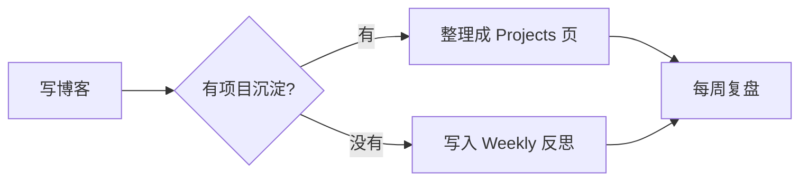

这里记录个人网站启动时的想法。

可以写：

- 为什么要维护这个网站
- 最近想沉淀的技术主题
- 项目和求职材料如何连接

## 表格示例

下面是一段 GFM Markdown 表格，验证渲染管线：

| 渠道 | 频率 | 主要受众 |
| --- | --- | --- |
| Blog | 每周 | 技术读者 |
| Weekly | 每周日 | 自己 |
| Projects | 不定期 | 招聘方 |

表格的展示效果应该与正文阅读宽度协调，深墨蓝表头，行 hover 时为金杏 soft 底色。

## Mermaid 示例（围栏语法）

下面是一段 Mermaid 图，用标准 Markdown 围栏语法书写，验证构建期 SVG 渲染：

图表底色应与正文卡片一致，深墨蓝 / 炭灰线条。

## Mermaid 示例（MDX 组件）

下面用 `<Mermaid>` 组件直接渲染（适合动态/复杂图表场景）：

<Mermaid
  chart="graph LR
  X[写代码] --> Y{有可复用价值?}
  Y -->|有| Z[提炼为 Projects]
  Y -->|没有| W[归入 Weekly 复盘]"
/>

组件语法在 `.mdx` 文件中可用，`.md` 文件不支持——所以本文件已重命名为 `.mdx`，URL 不变。
