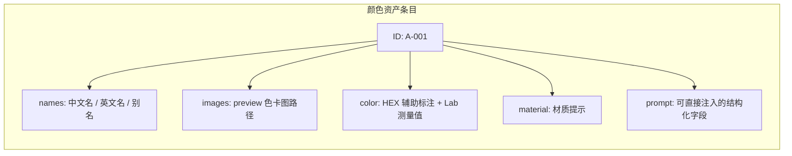
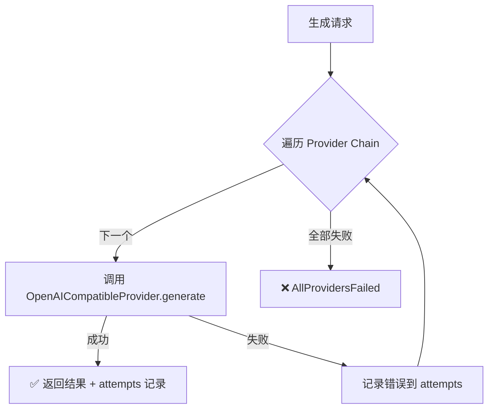

# 怎么让车辆渲染到我们合适的色卡中？

> 基于 `ymyy-sales-agent` profile 中 `ark-seedream-car-preview` skill 的完整实现。这个版本比早期工作版有了本质升级——从单脚本生图演进为模块化、多 Provider、带色彩资产库的生产级系统。

---

## 一、整体架构


> 🏗️ 上图由 Archify 生成。包含四个子系统：输入层（客户/销售→Hermes）、资产层（color_assets.json 色彩资产库）、生图核心（wrap_preview Python 包 + ProviderRouter 链式轮询）、输出校验层（dimensions.py 比例校验 + 保存回传）。Provider Chain 从左到右按优先级排列：xinghu_third → 4sapi_primary → apiyi_primary → relay_backup。

---

## 二、色彩资产库：从「手写色值」到「结构化资产」

### 2.1 为什么需要资产库？

早期版本（工作 vault 里的 `ark-seedream-car-preview`）需要销售**手动传**色号、色名、HEX、材质等参数。这意味着：

- 每调用一次生图，销售都要手写一串参数
- 色卡图需要手动传路径
- HEX 可能有标注错误，颜色不准确
- 膜面材质描述不一致

**ymyy-sales-agent 版本的核心升级**：引入 `references/color_assets.json` 色彩资产库。

### 2.2 资产库结构

每条颜色资产是一个结构化的 JSON 对象：



**查询方式**：

```bash
# 按色号
python3 scripts/query_color_assets.py A-001

# 按名称（支持模糊搜索）
python3 scripts/query_color_assets.py "宝马阿布扎比蓝"

# 按色系
python3 scripts/query_color_assets.py 蓝色系 --limit 5
```

### 2.3 资产库的数据来源

```
MGS-PET改色膜 飞书色卡画廊 Excel
         │
         ├── 色卡编号、中文名、英文名
         ├── 色系分类
         └── 膜面材质（哑光/亮光/金属/珠光/变色龙）
         
Card-color 数据库
         │
         ├── preview_hex（人工标注的参考色值）
         └── Lab 色卡实测值

assets/previews/
         │
         └── A-xxx / B-xxx / C-xxx / D-xxx 色卡实物图片
```

通过 `build_color_assets.py` 脚本自动关联三方数据生成最终的 `color_assets.json`。

---

## 三、核心执行流程


> ⏱️ 上图由 Archify 生成。展示了从 `--asset-id A-001` 到客户收到预览图的完整时序：资产查询（color_assets.json → swatch+HEX+Lab）→ Prompt 组装（build_prompt）→ 参考图校验（validate_reference_images）→ Provider 链式轮询生图（generate）→ 比例校验（assert_aspect_ratio）→ 返回 files + media_tokens。

### 3.1 `service.py` — 流程编排核心

`generate_wrap_preview()` 是主入口，一次调用完成全部流程：

```python
# 简化的核心调用链
def generate_wrap_preview(request):
    color_asset = apply_color_asset(request)     # 1. 查资产库
    prompt = build_prompt(request)                # 2. 组装 Prompt
    validate_reference_images(request)            # 3. 校验参考图
    target_dim = read_image_dimensions(ref)       # 4. 记录实车图尺寸
    
    configs = load_provider_configs(...)          # 5. 加载 Provider 链
    result = ProviderRouter(configs).generate(...) # 6. 链式轮询生图
    
    files = save_generated_images(result)         # 7. 保存图片
    assert_output_aspect_ratios(files, target)    # 8. 比例校验
    return {...}                                  # 9. 返回结果
```

---

## 四、多 Provider 链式轮询

### 4.1 为什么需要多 Provider？

单一生图 API 中转站存在不稳定性：

- **xinghu_third** 偶发瞬断（~10% 请求返回 "Remote end closed connection without response"）
- **4sapi_primary** 要求输出尺寸宽高均能被 16 整除
- **apiyi_primary** 输出尺寸可能与请求尺寸略有偏差

**解决方案**：`ProviderRouter` 按优先级链式回退——任一成功即返回。

### 4.2 Provider 配置

```bash
# 链式顺序 = 优先级
WRAP_PROVIDER_CHAIN=xinghu_third,4sapi_primary,apiyi_primary,relay_backup

# 每个 Provider 独立配置
WRAP_PROVIDER_XINGHU_THIRD_BASE_URL=https://xinghuapi.com/v1
WRAP_PROVIDER_XINGHU_THIRD_API_KEY=sk-xxx
WRAP_PROVIDER_XINGHU_THIRD_REQUEST_STYLE=extra_body    # xinghu 专用格式

WRAP_PROVIDER_4SAPI_PRIMARY_BASE_URL=https://4sapi.com/v1
WRAP_PROVIDER_4SAPI_PRIMARY_API_KEY=sk-xxx

WRAP_PROVIDER_APIYI_PRIMARY_BASE_URL=https://api.apiyi.com/v1
WRAP_PROVIDER_APIYI_PRIMARY_API_KEY=sp-xxx
```

### 4.3 三种请求风格

不同 Provider 对 `image` 字段的格式要求不同：

| 风格 | image 格式 | 适配 Provider |
|------|-----------|--------------|
| `refs_array` | `["data:...", "data:..."]` 数组 | 4sapi, apiyi |
| `single_image` | `"data:..."` 单字符串 | 单图中转站 |
| `extra_body` | `extra_body.image` 嵌套单字符串 | xinghu |

### 4.4 ProviderRouter 核心逻辑（router.py）



**关键设计**：每个失败的 Provider 都会记录尝试日志（`provider_attempts`），输出中包含完整的错误摘要，方便排查。

---

## 五、比例校验：最终安全门

### 5.1 为什么需要严格校验？

生图 API 有时会返回与客户实车图**比例不一致**的图片。如果把比例变形的预览图发给客户——"看起来怪怪的"——直接影响客户对膜色的判断和信任。

### 5.2 校验逻辑（dimensions.py）

```python
def assert_output_aspect_ratios(files, target):
    dimensions = read_files_dimensions(files)
    for path, actual in zip(files, dimensions):
        if not aspect_ratio_matches(actual, target):  # 差值 > 0.01
            raise RuntimeError(
                "Generated image aspect ratio does not match customer vehicle image. "
                "Do not send this result to the customer or Feishu."
            )
```

**容差**：`|output_ratio - target_ratio| ≤ 0.01`

### 5.3 尺寸匹配实战

以实车图 270×148（比例 ≈ 1.824:1）为例：

| 请求尺寸 | 比例 | 差值 | 可被 16 整除？ |
|---------|------|------|---------------|
| 1824×1000 | 1.8240 | ✅ 0.0003 | 宽 1824÷16=114 ✅ 高 1000÷16=62.5 ❌ |
| 1808×992 | 1.8226 | ✅ 0.0017 | 宽 1808÷16=113 ✅ 高 992÷16=62 ✅ |

不同 Provider 对「宽高能被 16 整除」的约束不同，需要根据 Provider 特性选择尺寸。

---

## 六、已知问题与解决方向

### 6.1 🟡 xinghu_third 偶发瞬断

| 项目 | 说明 |
|------|------|
| 现象 | ~10% 请求返回 "Remote end closed connection without response" |
| 影响 | 对终端用户无影响——链式回退自动切换到下一 Provider |
| 处理方式 | **不降级优先级**。保持 xinghu 在首位，失败自动回退 |
| 临时方案 | 如果必须只用 xinghu，重试 1-2 次即可 |

### 6.2 🟡 不同 Provider 的尺寸约束不一致

| Provider | 约束 | 说明 |
|----------|------|------|
| 4sapi | 宽高均须被 16 整除 | 否则 API 拒绝请求 |
| apiyi | 无约束 | 但输出尺寸可能偏差（如请求 1824×1000 → 返回 1693×929） |
| xinghu | 可能返回固定 4:3 比例 | 导致比例校验失败 |

### 6.3 🟡 色卡图与实车图的光照差异

| 问题 | 影响 |
|------|------|
| 色卡图在室内标准光源下拍摄 | 实车图在户外自然光下拍摄 |
| 两张图的光照/色温不一致 | AI 可能误判目标颜色 |

**方向**：正在探索在 Prompt 中加强「以色卡图可见颜色为准，不要根据光照环境调整」的约束。

### 6.4 🟡 复杂遮挡和局部贴膜

当前模型不是精确像素级编辑器。以下场景仍建议人工复核：

- 车辆被其他物体部分遮挡（柱子、其他车、行人）
- 高反光区域（玻璃反射、金属镀铬条）
- 局部贴膜（只贴前盖、只贴车顶）
- 双色/多色贴膜方案

---

## 七、与早期版本的关键差异

| 维度 | 工作 vault 版 | ymyy-sales-agent 版 |
|------|-------------|-------------------|
| 架构 | 单脚本 `gen.py` | 模块化 Python 包 `wrap_preview/` |
| 色彩管理 | 手动传 HEX/色名 | JSON 资产库 + 查询脚本 + 自动注入 |
| 生图 API | 单一 Ark 端点 | 多 Provider 链式轮询 + 自动回退 |
| 比例校验 | 无 | 严格校验（容差 0.01）+ 失败阻止发送 |
| 回传渠道 | 飞书 Bot | 飞书 + 微信（OpenClaw） |
| 测试 | 无 | 12 个单元测试文件 |
| 环境变量 | 单一 API Key | Provider Chain + 命名空间前缀 + 多级加载 |

---

> ⚠️ **当前状态**：xinghu 瞬断和不同 Provider 尺寸约束差异仍在持续观察中。色卡图与实车图光照差异导致的颜色偏差，正在通过 Prompt 优化迭代。系统整体可用——4-provider chain 已覆盖绝大多数生图场景，比例校验保证不发不合格图片给客户。
