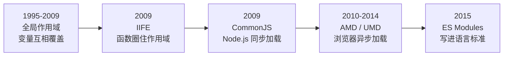
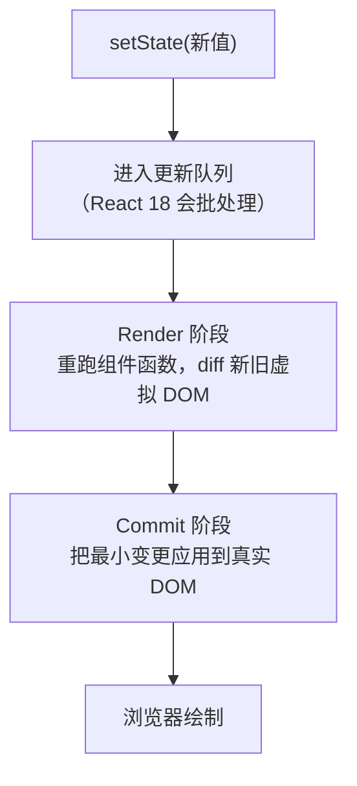

## 我往老项目里加了变量 result，页面就崩了

2019 年我接手过一个 jQuery 老项目，所有 JS 文件靠 `<script>` 一个接一个往下加载。我在新加的文件里写了个变量叫 `result`，刷新页面直接报错。查了三个小时，才在另一个文件里翻出同名的 `result`。

那次我才知道，所有 `<script>` 里的 `var` 都挂在同一个 `window` 上，谁都能覆盖谁的。文件少的时候靠命名自觉还能撑住，文件上百个就撑不住了。

后来我从那个项目往外学，一路上撞到四个卡点。这篇按我卡住的顺序写，跟教材的章节顺序对不上。

## 卡点一：我的变量怎么会被别的文件改掉

模块化要解决的头一件事，是让一个文件的变量跑不到另一个文件里去。最早的解法是把代码包进一个立即执行的函数里，只把要用的东西挂到返回对象上。

```js
// IIFE：用函数作用域把变量圈住
var MyModule = (function () {
    var privateVar = "外面看不到我";

    return {
        get: function () {
            return privateVar;
        }
    };
})();
```

我那套老项目里到处是这种写法。它能挡住变量外泄，但每个库自己写一套，加载顺序还得人肉保证。

Node.js 出现之后带来 CommonJS，用 `require` 读文件、`module.exports` 导出。服务端读本地磁盘，同步加载没问题。浏览器不行，它要发 HTTP 请求，同步等会把页面卡死。于是浏览器侧又出了 AMD 做异步加载，UMD 把两种写法塞进同一份代码里，jQuery 那一代库普遍这么干。

真正的转折是 ES2015 把 `import` 和 `export` 写进了语言标准。

```js
// math.js
export function add(a, b) { return a + b; }
export const PI = 3.14;

// main.js
import { add, PI } from './math.js';
```

我一开始觉得这只是换了个写法，后来才意识到差别在哪：`require` 是函数调用，路径可以运行时拼出来；`import` 是语法，路径必须是字面量。工具在编译阶段就能看全所有依赖关系，这是后面一切优化的前提。



这条线走到 2026 年，新项目基本都是 ES Modules 了。中间几次迭代先补上了作用域隔离，再补上依赖声明和浏览器异步加载，最后统一成标准语法。

### 静态两个字带来什么

`import` 能被静态分析，打包器就知道哪个导出没人引用，直接把代码删掉。这叫 Tree Shaking。

```js
// utils.js
export function used() { return '我被用了'; }
export function unused() { return '我没人用'; }

// app.js
import { used } from './utils.js';
```

打包结果里只有 `used`，`unused` 会被删掉。前提是三件事同时成立：用 ESM 写、模块顶层没有会自动执行的副作用代码、打包器支持。第三条现在不用操心，Rollup、Vite、esbuild 都支持。第二条最容易被忽略，模块里只要有一行 `window.X = true`，打包器就不敢删。库可以在 `package.json` 里声明 `"sideEffects": false`，等于告诉打包器整包都能安全删。

### 一个我踩过的坑：导出的值居然不变

```js
// CommonJS
let count = 0;
function increment() { count++; }
module.exports = { count, increment };

const { count, increment } = require('./counter');
increment();
console.log(count);   // 还是 0，导入的是值的拷贝
```

同样逻辑换成 ESM，`count` 会跟着变成 1。ES Modules 的导入是活绑定，导入和导出指向同一块内存。这个差异在我调试一个计数器组件时浪费过半小时，当时我以为 `increment` 没生效。

## 卡点二：我写的 TypeScript 浏览器根本不认识

模块能 `import` 之后，我以为能直接上线了。结果打开浏览器一看，`.tsx` 文件直接报错。浏览器只认识 HTML、CSS 和 JavaScript，TypeScript、JSX、Sass 它一概不认。

转译这件事得交给构建工具，而构建工具本身是个 npm 包。于是我先撞上了 `node_modules`。

第一次看到那个文件夹我有点懵：几百兆，上万个目录。我写的代码才几十行，凭什么要装这么多东西。原因是依赖会带依赖：我装 React，React 带 scheduler，别的包又带自己的依赖，一层层递归下去，一个普通 React 项目装出一千多个包很常见。

这些包的信息记在两个文件里：

| 文件 | 作用 | 进 Git |
|---|---|---|
| `package.json` | 项目名、依赖范围、`scripts` 脚本 | 进 |
| `package-lock.json` | 每个包锁定的具体版本与校验值 | 必须进 |
| `node_modules/` | 实际安装的包 | 不进 |

`package.json` 里写 `^18.3.1`，别人 `npm install` 可能装到 18.5.0。`package-lock.json` 把一千多个包的版本钉死，团队、CI、线上装出来的东西才一致。这个文件丢了，最难受的是 bug 复现不了。

`scripts` 那段我一开始以为是某种快捷方式，后来才明白它解决的是路径问题：

```json
{
  "scripts": {
    "dev": "vite",
    "build": "vite build",
    "preview": "vite preview"
  }
}
```

跑 `npm run dev` 时，npm 会把 `node_modules/.bin` 临时加进 PATH，所以本地装的 vite 不用全局安装也能执行。新人克隆项目后只要两行命令就能跑起来：`npm install` 装依赖，`npm run dev` 起服务。

### Vite 为什么快得不像话

构建工具我从 Grunt 那代听起，中间是 Gulp 的流式管道，2015 年之后 webpack 靠「一切皆模块」统一了江湖。webpack 我用了两年，项目一大，改一行代码等七八秒是常态。

Vite 的做法是 dev 阶段干脆不打包。浏览器请求哪个模块，它就当场转译哪个模块返回，依赖 esbuild 做转译，速度比 Babel 快一个量级。改一个文件只重传那一个文件，热更新在毫秒级。

`npm run build` 才是真正的打包流程：Rollup 从入口递归分析依赖，做 Tree Shaking，合并成几个 bundle，压缩后输出到 `dist/`。

```bash
npm run build
# dist/index.html                   0.45 kB │ gzip:  0.29 kB
# dist/assets/index-abc123.js     142.30 kB │ gzip: 51.20 kB
```

文件名里那串哈希是内容指纹，内容变了文件名就变，浏览器缓存自动失效。`dist/` 和 `node_modules/` 一样不进 Git，它能用一行命令重新生成，塞进仓库只会污染 diff。

## 卡点三：setState 之后 UI 为什么自己变了

我第一次看 React 代码的感觉是：这不就是 HTML 里塞了 JavaScript。

写了一段时间的真实项目才改观。jQuery 时代我要写「怎么改」：取到节点、改文本、加 class，状态本身还藏在 DOM 的 class 上。React 让我只写「数据应该是什么」，界面自己跟着变。

```jsx
function Counter() {
    const [count, setCount] = useState(0);
    return (
        <div>
            <p className={count >= 10 ? 'big' : ''}>{count}</p>
            <button onClick={() => setCount(count + 1)}>+1</button>
        </div>
    );
}
```

这个 `count >= 10 ? 'big' : ''` 我以前要写成一条 `if` 加一次 `addClass`。现在它只是数据的一个函数。

React 本体是两个 npm 包。`react` 定义组件、state 和 diff 算法，不含 DOM 概念；`react-dom` 负责把它挂到浏览器上。换掉连接器就能换目标：移动端是 `react-native`，服务端渲染是 `react-dom/server`。我做过一个验证，不用 Vite、不用 npm，单个 HTML 引三个 UMD 脚本就能跑起来。所谓现代前端工程化，都是为了让 React 更好写，React 自己没那么重。

JSX 是 JavaScript 的语法扩展，浏览器认不出来，实际执行的是编译后的函数调用：

```jsx
// 你写的
const el = <h1 className="title">Hello</h1>;

// 编译后
const el = React.createElement('h1', { className: 'title' }, 'Hello');
```

`createElement` 返回一个普通 JS 对象，描述要渲染什么。JSX 是给人看的，对象才是给框架看的。

### 我第一个组件能跑，但我不知道它为什么能跑

功能是对的就上线了，我心里其实没底。真正踏实下来，是搞清楚 `setState` 之后那一段。

先看一个我踩过的坑：

```jsx
const [user, setUser] = useState({ name: 'Coya' });

user.name = 'Bob';
setUser(user);                        // 界面不动

setUser({ ...user, name: 'Bob' });    // 界面更新
```

React 用 `Object.is` 比对新旧 state，引用没变就跳过更新。所以我改了属性、传回同一个对象，它认为什么都没发生。类似的问题还有异步里连着调 `setCount(count + 1)`，两次读到的都是旧值，这种情况要写成函数式更新 `setCount(c => c + 1)`。

更新真正发生时，内部走两步：



Render 阶段在 JS 对象上算出「最少要动哪些节点」，这一步可以被打断，React 18 的并发能力就建立在这里，用户输入的优先级更高时可以让渲染先让路。Commit 阶段必须一次做完，做完就同步执行 `useLayoutEffect`，浏览器绘制之后再异步执行 `useEffect`。

我在一个长列表组件上体验过差别：不开并发时输入会有明显卡顿，因为每次输入都要等整棵树 diff 完。Fiber 把长任务切成小片之后，输入就顺了。

### 组件树和单向数据流

整个应用是一棵树，根是 `<App>`：

```
<App>
├── <Header user={user} />
│   └── <Nav />
└── <Main user={user} />
    └── <ArticleList />
        ├── <ArticleCard />
        └── <ArticleCard />
```

数据顺着 props 往下走，子组件想改父组件的数据，只能调父组件传下来的回调。我一开始觉得这是绕路，后来调试一个状态被四处修改的表单时才体会到好处：任何一份数据只有一个地方能改它，出问题顺着树往上找就行。

兄弟组件要共享数据，就把 state 提到最近的共同父组件。层级太深、中间几层都用不到这个数据的时候，用 Context 直接穿透。

```jsx
import { createContext, useContext, useState, useMemo } from 'react';

const UserContext = createContext(null);

function App() {
    const [user, setUser] = useState({ name: 'Coya' });
    const value = useMemo(() => ({ user, setUser }), [user]);

    return (
        <UserContext.Provider value={value}>
            <Grandparent />
        </UserContext.Provider>
    );
}

function GrandChild() {
    const { user } = useContext(UserContext);
    return <p>{user.name}</p>;
}
```

那个 `useMemo` 是后来补上的。我最初直接写 `value={{ user, setUser }}`，每次 Provider 重渲染都会造一个新对象，所有 `useContext` 的后代跟着一起重渲染，页面上输入框打字都能感觉到延迟。

## 卡点四：state 到底该放哪

判断标准只有一条：这个数据变了，界面要不要跟着变。要就是 state，不要就写成普通变量。`const total = price * qty` 这种算出来的值放进 state 只会给自己找麻烦，界面更新时还得同步维护。

放的位置有四档，我按项目规模从小到大用过：组件内部用 `useState`，几个组件共享就提到共同父组件，跨层级用 Context，整个应用都要读的数据交给 Zustand 这类外部 store。

一个完整的例子长这样，增删、勾选、计数和输入框全靠同一份 `todos` 驱动：

```jsx
import { useState } from 'react';

function TodoApp() {
    const [todos, setTodos] = useState([
        { id: 1, text: '学 React', done: false },
    ]);
    const [input, setInput] = useState('');

    const addTodo = (text) => {
        setTodos([...todos, { id: Date.now(), text, done: false }]);
    };
    const toggleTodo = (id) => {
        setTodos(todos.map(t => t.id === id ? { ...t, done: !t.done } : t));
    };
    const deleteTodo = (id) => {
        setTodos(todos.filter(t => t.id !== id));
    };

    return (
        <div>
            <input value={input} onChange={e => setInput(e.target.value)} />
            <button onClick={() => { addTodo(input); setInput(''); }}>添加</button>
            <ul>
                {todos.map(todo => (
                    <li key={todo.id}>
                        <input
                            type="checkbox"
                            checked={todo.done}
                            onChange={() => toggleTodo(todo.id)}
                        />
                        <span style={{ textDecoration: todo.done ? 'line-through' : '' }}>
                            {todo.text}
                        </span>
                        <button onClick={() => deleteTodo(todo.id)}>删</button>
                    </li>
                ))}
            </ul>
            <p>共 {todos.length} 项，已完成 {todos.filter(t => t.done).length} 项</p>
        </div>
    );
}
```

三个操作函数都遵守同一条规矩：不原地改数组，每次换一个新的。`toggleTodo` 里的 `{ ...t, done: !t.done }` 就是在造新对象，否则 React 的 `Object.is` 判定会直接跳过这一项。

## 回头看这四件事

这四个卡点当时各自花了我不短时间，现在串起来只有一条线：代码先要能被隔离，然后要能被浏览器执行，最后要能被数据驱动。

我现在带新人上手前端，会让他们先亲手撞一次变量冲突，再去讲 ES Modules。跳过那一步直接背 `import` 语法，记住的只是写法。同理，没被 webpack 的启动速度折磨过，就体会不到 Vite 把 dev 和 build 分开做有多实用。

`dist` 不进 Git、`package-lock.json` 必进 Git、state 用新对象替换、Context 的 value 用 `useMemo` 稳住。这几条我都是踩完坑才记住的，写在这里省得下次再踩。
