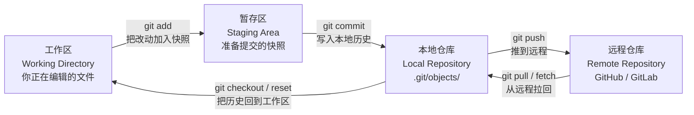
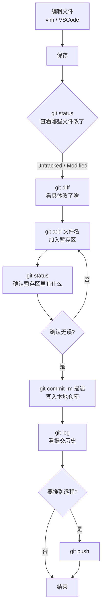
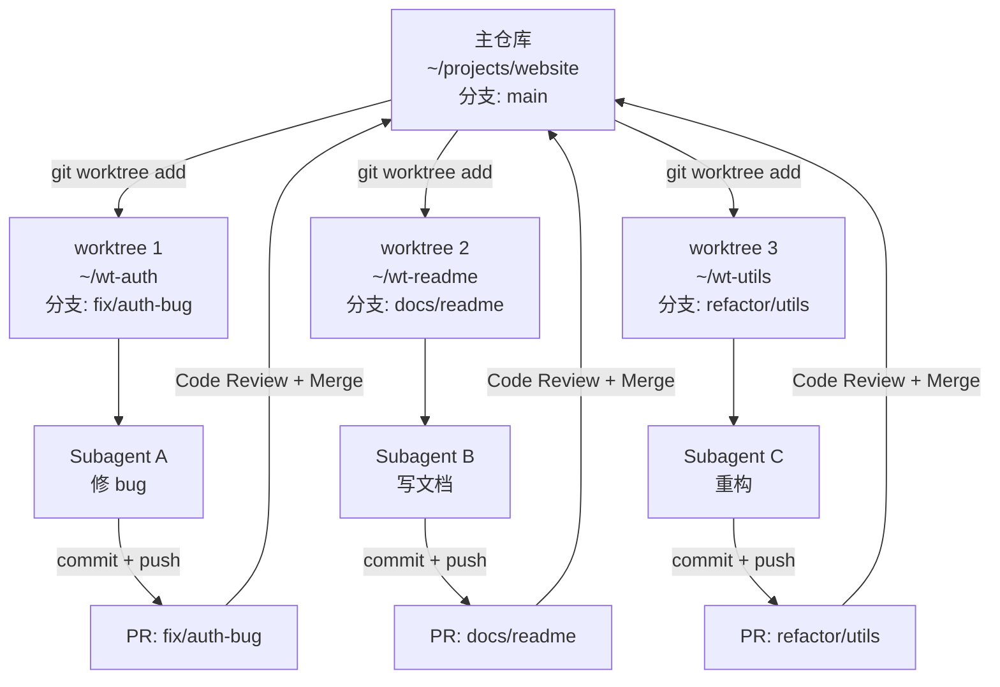

# Git 和版本管理：你的代码时光机，以及它和 Claude Code 的联动

> 这是 **zero-to-tech** 系列的第四篇。前三篇分别讲了「网络」「电脑 / 文件 / VSCode」「终端 / Linux」。这一篇我们聊一个你每天都在用、但可能没系统学过的东西——**Git**。

我刚开始工作那年的「血泪教训」：改了一周的代码，没备份，硬盘坏了，所有东西没了。

再后来学会了用「最终版.docx」「最终版_改.docx」「最终版_真的不改了.docx」——但这也只能救一时。

直到用了 Git，才发现：**版本管理这件事，专业工具 vs 土办法，差的是几个数量级**。

这一篇的目标：把 Git 的核心概念 + 日常命令 + 一个有意思的实战场景（Git Worktree + Claude Code Subagent）一次性讲清楚。

---

## 一句话总结

> **Git = 分布式版本控制系统**。每个开发者本地有一份完整的代码历史（`.git` 文件夹），通过 `commit` 记录改动，通过 `branch` 分叉实验，通过 `push` / `pull` 协作。**Worktree** 让你能从一个仓库同时开多个工作目录；**Claude Code Subagent** 可以被派发到不同 Worktree，让多个 AI Agent 在同一个仓库并行干活、互不干扰。

---

## 一、版本管理是什么，Git 又是怎么赢的

### 1.1 版本管理的核心问题

写代码 / 写文档 / 画设计稿，都会遇到三个绕不开的问题：

| 问题 | 没有版本管理时 | 有版本管理时 |
|------|---------------|-------------|
| **改坏了怎么办** | 改名备份 `final_v2_old.docx` | `git revert` 一行回到任何历史版本 |
| **谁改了什么** | 邮件问、口头问、查无据 | `git log` 看到每一次提交、每行改动 |
| **多人怎么协作** | U 盘拷贝、合并靠手动 | 每个分支独立工作，最后 merge |

版本管理 = **记录每一次改动 + 让你能随时回退 + 让多人能合并工作**。

### 1.2 版本管理的演化

```
本地式（CVS / SVN 早期）
   ↓
集中式（SVN 巅峰）：服务器是唯一的版本库，离线就干不了活
   ↓
分布式（Git / Mercurial）：每个人本地都有完整的历史，服务器只是「约定俗成的中央」
```

**Git 赢的关键原因**：

1. **速度极快**：本地操作，不依赖网络
2. **完整的本地历史**：离线也能 `log` / `diff` / `commit`
3. **分支极便宜**：创建 / 切换分支是毫秒级（SVN 是拷贝整个目录）
4. **生态统治力**：GitHub / GitLab / Bitbucket 全是 Git；CI/CD、IDE、工具链全围绕 Git 构建

到 2026 年，**Git 几乎 = 版本管理的事实标准**——新项目默认 Git，老项目能迁都迁。

---

## 二、Git 配置：装完 Git 第一件要做的事

Git 装好后（macOS 自带或 `brew install git`、Linux `apt install git`、Windows Git for Windows），**第一件事是配 user 信息**——每个提交都会记录「谁改的」。

### 2.1 三层配置作用域

Git 配置分三层，**后者覆盖前者**：

| 作用域 | 命令 | 配置文件 | 适用场景 |
|--------|------|---------|---------|
| **system** | `git config --system` | `/etc/gitconfig` | 整台机器（极少用） |
| **global** | `git config --global` | `~/.gitconfig` | 当前用户（最常用） |
| **local** | `git config --local` | `.git/config` | 当前仓库（项目级） |

### 2.2 必配的 3 个全局项

```bash
git config --global user.name  "你的名字"
git config --global user.email "你的邮箱"

# （可选）让 push 默认走当前分支，而不是同名旧分支
git config --global push.default current

# （可选）默认编辑器用 VSCode（commit / rebase 时会用）
git config --global core.editor "code --wait"
```

**`user.email` 的小坑**：GitHub / GitLab 会用 email 关联你的提交和账号。如果你想让贡献图显示头像和名字，**用注册 GitHub 时用的邮箱**。

### 2.3 配 SSH Key（推到 GitHub 必备）

`https://` 协议每次都要输 token，`ssh://` 协议配一次永久免密。

```bash
# 1. 生成 key（邮箱换成你自己的）
ssh-keygen -t ed25519 -C "you@example.com"
# 一路回车，会生成 ~/.ssh/id_ed25519 和 ~/.ssh/id_ed25519.pub

# 2. 启动 ssh-agent 并加 key
eval "$(ssh-agent -s)"
ssh-add ~/.ssh/id_ed25519

# 3. 公钥内容贴到 GitHub：Settings → SSH and GPG keys → New SSH key
cat ~/.ssh/id_ed25519.pub
# 把整段输出贴到 GitHub

# 4. 测试连通
ssh -T git@github.com
# 第一次会问 fingerprint，确认 yes；看到 "Hi <你的名字>!" 就 OK
```

---

## 三、本地仓库 + 第一次提交代码

### 3.1 两种开始方式

| 方式 | 场景 | 命令 |
|------|------|------|
| **新项目** | 本地有个新项目，想开始用 Git | `git init` |
| **克隆已有** | GitHub 上有个项目想拉到本地 | `git clone git@github.com:xxx/yyy.git` |

### 3.2 新项目流程

```bash
mkdir my-project && cd my-project
git init                         # 生成 .git 目录（版本库从这里开始存在）

echo "# My Project" > README.md
git add README.md                # 把 README 加入暂存区
git commit -m "feat: add initial README"   # 提交
```

### 3.3 Git 的三大区：工作区 / 暂存区 / 仓库

这是 Git 最核心、也最容易绕晕的概念。**用一张图讲清楚**：



**一句话区分三个区**：

- **工作区**：你眼睛看到的文件，正在编辑
- **暂存区**：你**准备**提交哪些改动（一个「待提交清单」）
- **本地仓库**：已经提交的历史快照，存在 `.git/` 里

**为什么要有暂存区**：让你能**精确控制**这次提交包含哪些改动。比如你改了 3 个文件，但只想提交其中 2 个——`git add` 那 2 个就行。

### 3.4 一次提交代码的完整流程（Mermaid 图）

这是新人最常问的——「我改了代码，到底发生了什么？」：



**对应命令清单**：

```bash
git status                  # 看当前状态：哪些改了 / 哪些暂存了
git diff                    # 看未暂存的具体改动
git diff --staged           # 看已暂存的具体改动
git add file.ts             # 把指定文件加入暂存区
git add .                   # 把当前目录所有改动加入暂存区（最常用）
git commit -m "fix: 修复登录 bug"   # 提交
git log --oneline -n 10     # 看最近 10 条提交（每条一行）
git push                    # 推到远程
```

### 3.5 commit message 怎么写

**Conventional Commits** 是目前最主流的格式：

```
<type>(<scope>): <subject>

<body>（可选）

<footer>（可选）
```

| type | 含义 |
|------|------|
| `feat` | 新功能 |
| `fix` | 修 bug |
| `docs` | 只改文档 |
| `refactor` | 重构（既不是 feat 也不是 fix） |
| `test` | 加 / 改测试 |
| `chore` | 杂事（依赖、构建、配置） |
| `style` | 格式（不影响代码运行） |

**举例**：

```bash
git commit -m "feat(login): 支持手机号验证码登录"
git commit -m "fix: 修复首页 500 错误"
git commit -m "docs: 更新 README 安装步骤"
```

**为什么这种格式有用**：
- 自动化工具能识别（CI/CD、release notes 自动生成）
- 一眼能看出这次提交干了啥
- 配合 `git log --oneline` 看历史非常清晰

---

## 四、.gitignore：什么文件不该进 Git

### 4.1 为什么需要

不是所有文件都该进 Git。典型**不该进**的：

| 类型 | 例子 |
|------|------|
| **依赖** | `node_modules/`、`venv/`、`target/` |
| **构建产物** | `dist/`、`.next/`、`build/` |
| **环境变量 / 密钥** | `.env`、`.env.local`、`*.pem` |
| **系统 / 编辑器** | `.DS_Store`、`Thumbs.db`、`.idea/`、`.vscode/`（部分） |
| **日志** | `*.log`、`logs/` |
| **临时文件** | `*.tmp`、`*.bak` |

### 4.2 怎么写 .gitignore

在项目根目录创建一个 `.gitignore` 文件，每行一条规则：

```gitignore
# 依赖
node_modules/
.pnpm-store/

# 构建产物
.next/
dist/
build/
out/

# 环境变量（绝对不能进 Git！）
.env
.env.local
.env.*.local

# 操作系统
.DS_Store
Thumbs.db

# 编辑器
.idea/
*.swp
*.swo

# 日志
*.log
logs/

# 测试覆盖率
coverage/
.nyc_output/

# TypeScript
*.tsbuildinfo
```

### 4.3 规则语法速查

| 语法 | 含义 |
|------|------|
| `#` | 注释 |
| `*` | 匹配任意字符（不含 `/`） |
| `**` | 匹配任意层级 |
| `?` | 匹配单个字符 |
| `[abc]` | 匹配 a/b/c |
| `!pattern` | 反向（**不**忽略） |
| `/pattern` | 只匹配根目录 |
| `pattern/` | 只匹配目录 |

**举例**：

```gitignore
# 忽略所有 .log 文件
*.log

# 但保留 debug.log（不忽略）
!debug.log

# 只忽略根目录的 .env，不包括子目录
/.env

# 忽略所有目录的 node_modules（递归）
**/node_modules/
```

### 4.4 已经误提交了怎么办

如果某个文件**已经进了 Git**，再加 `.gitignore` 是没用的（Git 已经在跟踪它）。要这样清理：

```bash
# 从 Git 索引里删除（但保留本地文件）
git rm --cached .env
git rm --cached -r node_modules/

git commit -m "chore: remove tracked files that should be ignored"
```

**重要**：`.env` 这类含密钥的文件，**一旦提交过，密钥就视为泄露**——必须在密钥管理系统里重新生成。

### 4.5 找现成的模板

不同语言 / 框架有现成的 .gitignore 模板：

- GitHub 官方仓库 [github/gitignore](https://github.com/github/gitignore) 收录了 Node / Python / Go / Java / Rails / Vue / React 等几十种
- VSCode 装 **Gitignore** 扩展，能搜索模板一键生成

---

## 五、在多个提交版本间切换

Git 的「时间机器」能力，本质是**任何历史版本都能随时取回**。

### 5.1 看历史

```bash
git log                          # 完整历史（每条占多行）
git log --oneline                # 每条一行（最常用看历史）
git log --oneline -n 20          # 最近 20 条
git log --graph --oneline        # 图形化（看分支）
git log --author="coya"          # 看某个人的提交
git log --since="2026-06-01"     # 某个时间之后
git log -p -n 5                  # 最近 5 条 + 每次的具体改动
```

### 5.2 切回某个历史版本（看清爽代码用）

```bash
# 临时看看老版本（HEAD 状态不变）
git checkout <commit-hash>

# 看完了回来
git checkout main
```

**适用场景**：「昨天那版代码能跑，今天的不行，让我对比下到底改了啥」——切到老版本先确认老版本是好的。

### 5.3 撤销最近的提交

三种武器，**危险性递增**：

| 命令 | 效果 | 危险度 |
|------|------|--------|
| `git revert <commit>` | 生成**新的提交**，撤销指定 commit 的改动（保留历史） | ⭐ 安全 |
| `git reset --soft <commit>` | 撤销 commit，**保留**改动在暂存区 | ⭐⭐ |
| `git reset --mixed <commit>` | 撤销 commit，**保留**改动在工作区（默认） | ⭐⭐ |
| `git reset --hard <commit>` | 撤销 commit，**丢弃**所有改动 | ⭐⭐⭐⭐ 慎用 |

**最安全的姿势**：

```bash
# 想撤销但保留证据：用 revert
git revert <commit-hash>
git push
```

### 5.4 暂时搁置改动（stash）

「我正在改 A，突然要切到别的分支修紧急 B」——`git stash` 把当前改动「打包存起来」：

```bash
git stash                       # 把未提交的改动存起来，工作区回到上次提交
git stash list                  # 看存了多少个 stash
git stash pop                   # 把最近一个 stash 取回（并删除 stash）
git stash apply stash@{0}       # 取回指定 stash（不删除）
git stash drop stash@{0}        # 删掉指定 stash
```

### 5.5 找回「丢失」的提交

如果 `reset --hard` 后反悔了，**别慌**——Git 保留了一个「悬挂提交」日志：

```bash
git reflog                      # 看 HEAD 走过的所有位置
git reset --hard <reflog-id>    # 回到 reflog 里的某个位置
```

**关键认知**：Git 里**几乎没有什么是真正删不掉的**——只要 reflog 还保留着，都能找回来。30 天后 reflog 才会清理。

---

## 六、Git 命令速查表

按场景分组，需要时扫一眼。

### 6.1 仓库初始化

| 命令 | 作用 |
|------|------|
| `git init` | 当前目录初始化为仓库 |
| `git clone <url>` | 克隆远程仓库到本地 |
| `git remote -v` | 看远程仓库地址 |

### 6.2 看状态 + 改动

| 命令 | 作用 |
|------|------|
| `git status` | 当前状态（改了什么、暂存了什么） |
| `git diff` | 未暂存的改动 |
| `git diff --staged` | 已暂存的改动 |
| `git log --oneline -n 20` | 最近 20 条提交 |
| `git show <commit>` | 看某个 commit 的详情 |

### 6.3 提交相关

| 命令 | 作用 |
|------|------|
| `git add <file>` | 把文件加入暂存区 |
| `git add .` | 当前目录所有改动加入暂存区 |
| `git commit -m "msg"` | 提交暂存区的内容 |
| `git commit --amend` | 修改**最后一次**提交（改信息 / 加漏的文件） |
| `git commit -a -m "msg"` | 自动 add 已跟踪的文件再提交（新文件不会被 add） |

### 6.4 分支相关

| 命令 | 作用 |
|------|------|
| `git branch` | 看所有本地分支 |
| `git branch -a` | 看所有分支（含远程） |
| `git branch <name>` | 创建分支 |
| `git checkout <branch>` | 切换分支 |
| `git checkout -b <name>` | 创建并切换分支 |
| `git switch <branch>` | （新）切换分支 |
| `git switch -c <name>` | （新）创建并切换分支 |
| `git merge <branch>` | 把分支合并进当前 |
| `git branch -d <name>` | 删分支（已合并） |
| `git branch -D <name>` | 强制删分支（未合并） |

### 6.5 远程协作

| 命令 | 作用 |
|------|------|
| `git fetch` | 从远程拉取更新（**不合并**） |
| `git pull` | 拉取 + 自动合并（= fetch + merge） |
| `git push` | 推到远程 |
| `git push -u origin <branch>` | 首次推送新分支 |

### 6.6 撤销 / 回滚

| 命令 | 作用 |
|------|------|
| `git restore <file>` | 丢弃工作区的改动 |
| `git restore --staged <file>` | 把文件从暂存区撤回工作区 |
| `git reset --soft <commit>` | 撤销 commit，改动留暂存区 |
| `git reset --hard <commit>` | 撤销 commit + 丢弃改动（慎） |
| `git revert <commit>` | 生成新 commit 撤销指定改动 |
| `git stash` / `git stash pop` | 暂存 / 恢复未提交的改动 |

---

## 七、Git Worktree + Claude Code Subagent：让多个 AI Agent 并行干活

这一节是这个系列独有的——讲 Git 一个被严重低估的能力，以及它和 AI Agent 时代最关键的联动。

### 7.1 Worktree 是什么

**默认情况**：一个 Git 仓库 = 一个工作目录。同一时间只能在一个分支上干活。

**Worktree 让你能从一个仓库同时开多个工作目录**：

```bash
# 假设当前在 main 分支
cd ~/projects/website

# 开一个 worktree，名为 fix-bug-123，目录在 ../website-fix-bug-123
git worktree add -b fix-bug-123 ../website-fix-bug-123

# 再开一个
git worktree add -b feat-login ~/projects/website-feat-login

# 看所有 worktree
git worktree list
```

输出大概长这样：

```
/Users/coya/projects/website              abc1234 [main]
/Users/coya/projects/website-fix-bug-123  def5678 [fix-bug-123]
/Users/coya/projects/website-feat-login  9ab0123 [feat-login]
```

**关键特性**：
- 每个 worktree 是**独立的工作目录**（独立的文件、独立的 IDE 窗口）
- 但**共享同一个 `.git` 数据库**（共享所有提交历史、分支、stash）
- 每个 worktree 必须在**不同的分支**上（不能两个 worktree 同时在 main）

### 7.2 Claude Code Subagent 是什么

`subagent_type` 是 Claude Code（以及 Claude Agent SDK）里派发**独立 Agent** 的机制：

```
派发 general-purpose subagent → 它在自己的 context 里干活 → 完成后回报结果
```

每个 subagent 都有自己的：
- 独立的 context window
- 独立的工具调用权限（可选）
- **独立的工作目录**（启动时指定 `cwd`）

### 7.3 联动：让多个 Subagent 在不同 Worktree 并行干活

**这就是 Worktree 真正闪光的地方**——和 AI Agent 时代完美配合。

**场景**：你让 Claude Code 干 3 件互不冲突的事：

1. 修一个紧急 bug（涉及 `lib/auth.ts`）
2. 给 README 加一段文档
3. 重构一个工具函数（涉及 `lib/utils.ts`）

**传统做法**：一件件顺序干，3 倍时间。

**Worktree + Subagent 联动**：

```bash
# 1. 先开 3 个 worktree，每个在不同分支
git worktree add -b fix/auth-bug  ~/wt-auth    main
git worktree add -b docs/readme   ~/wt-readme  main
git worktree add -b refactor/utils ~/wt-utils  main

# 2. 并行派发 3 个 subagent 到 3 个不同 worktree
#    （这里假设用 Claude Agent SDK / Claude Code 的 Agent 派发能力）
```

```typescript
// 伪代码：派发 3 个 subagent 到 3 个 worktree
await Promise.all([
  dispatchSubagent({
    subagent_type: "general-purpose",
    cwd: "~/wt-auth",             // ← 关键：指定工作目录
    prompt: "修复 lib/auth.ts 的登录 bug，要求……",
  }),
  dispatchSubagent({
    subagent_type: "general-purpose",
    cwd: "~/wt-readme",
    prompt: "给 README 加一段本地开发的步骤，参考……",
  }),
  dispatchSubagent({
    subagent_type: "general-purpose",
    cwd: "~/wt-utils",
    prompt: "重构 lib/utils.ts 的字符串工具函数，要求……",
  }),
]);
```

**为什么会跑得更好**：

| 优势 | 解释 |
|------|------|
| **互不干扰** | 3 个 subagent 在 3 个独立工作目录，文件操作完全隔离 |
| **失败隔离** | 一个 subagent 改坏了不会污染另外两个的工作目录 |
| **并行加速** | 3 倍并发，3 件互不依赖的事从「串行 30 分钟」变「并行 10 分钟」 |
| **共享 git 历史** | 都在同一个仓库，3 个分支最后由 owner 一个个 review + merge |
| **每个 subagent context 干净** | 不像「塞进同一个 context」，每个 subagent 只看自己 worktree 的内容，注意力集中 |

### 7.4 完整流程图（Mermaid）



### 7.5 Owner（你）最后做的事

3 个 subagent 完成后，会各自提一个 PR（或至少在各自分支有 commit）。你作为 owner：

```bash
# 1. 看每个 worktree 的状态
cd ~/wt-auth && git log --oneline -n 5
cd ~/wt-readme && git log --oneline -n 5
cd ~/wt-utils && git log --oneline -n 5

# 2. 一个个 review diff（这里体现 AI 时代最重要的人的工作：审查）
cd ~/wt-auth && git diff main
cd ~/wt-readme && git diff main
cd ~/wt-utils && git diff main

# 3. 合并回 main（这里推荐用 GitHub PR 流程）
git checkout main
git merge fix/auth-bug --no-ff
git merge docs/readme --no-ff
git merge refactor/utils --no-ff

# 4. 清理 worktree
git worktree remove ~/wt-auth
git worktree remove ~/wt-readme
git worktree remove ~/wt-utils
```

**这是 AI 时代最重要的人的工作转移**：从「自己写代码」变成「**派活 + 审查 + 合并**」。Worktree + Subagent 把这个工作流变得工程化、并行化、可审查。

### 7.6 注意事项

| 注意点 | 说明 |
|--------|------|
| **同一个分支不能开两个 worktree** | 会报错 |
| **worktree 数量不要太多** | 5-10 个是合理上限，多了管理成本反而高 |
| **subagent 间的冲突检测** | 如果两个 subagent 改了同一个文件的同一段，merge 时会有冲突——owner 解决 |
| **跑测试要在 worktree 里跑** | subagent 改完代码要在它自己的工作目录跑测试，别在主 worktree 跑 |

---

## 八、给新手的 3 个心智模型

1. **Git 是「快照流」不是「差异流」**：每次 commit 是项目此刻的**完整快照**，不是「相对上次改了什么」。所以 `git checkout <老 commit>` 能瞬间回到任何历史版本——因为快照都存着。这也是 `git reset --hard` 恢复起来相对容易的原因。

2. **三个区是 Git 的灵魂**：工作区 / 暂存区 / 仓库——很多人 `git` 用得不顺就是因为没真正理解这三个区。**暂存区让你能精确控制每次提交包含什么**，这是 Git 比 SVN 强的地方，也是 `git add` 看起来「多此一举」但其实极其强大的原因。

3. **Worktree 让 Git 从「单线程」变成「多线程」**：默认一个仓库只能在一个分支干活（单线程）；Worktree 让你能同时在多个分支干活（多线程）。**和 AI Subagent 联动后，多线程从「人肉切换」变成「自动派发」**——这是 2024 年之后版本控制最大的范式变化。

---

## 九、一句话总结

> **Git = 分布式版本控制 = 本地完整的代码历史 + 三个区（工作区 / 暂存区 / 仓库）+ 分支 + push/pull 协作**。`.gitignore` 控制什么不进 Git；`git log / checkout / reset / revert / stash` 让你穿梭任何历史版本；**Worktree + Claude Code Subagent** 让多个 AI Agent 在同一仓库并行干活、互不干扰——这是 2026 年 AI 编程时代最值得掌握的工作流。

---

## 这个系列下一篇会写什么

- **zero-to-tech / 进程、线程、内存：你的电脑同时在跑多少事**
- **zero-to-tech / VSCode 进阶：调试器、断点、launch.json**
- **zero-to-tech / Docker 是什么：为什么「在我电脑上能跑」会变成「在我容器里能跑」**

上一篇：[终端和 Linux 直觉：AI 工具最常用的 20 个指令](/blog/terminal-linux-basics)
第一篇：[网络是怎么工作的](/blog/how-network-work)