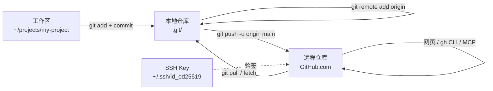
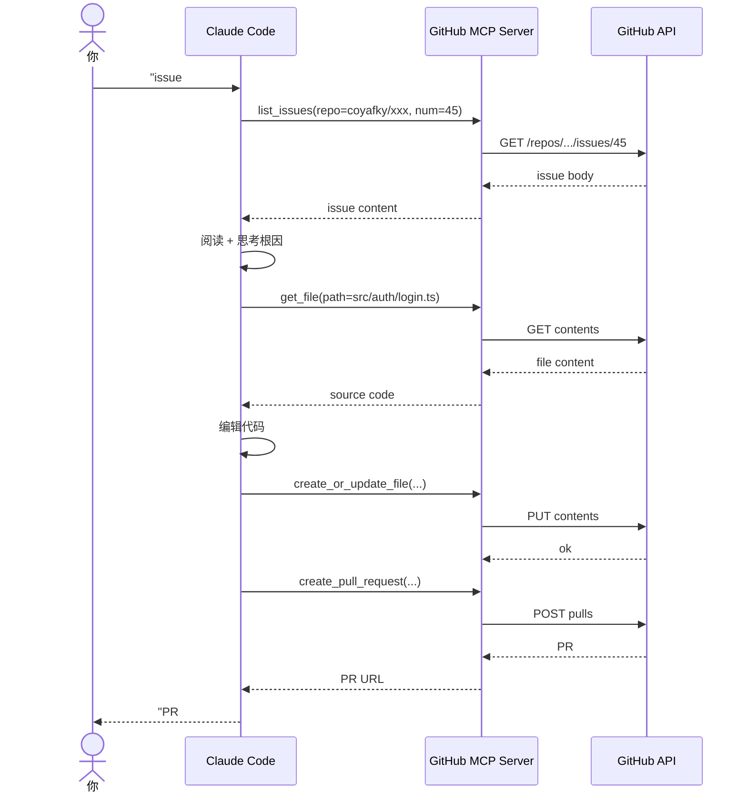

# GitHub 和远程同步：从本地仓库到开源世界，以及 AI Agent 怎么直接操作 GitHub

> 这是 **zero-to-tech** 系列的第五篇。上一篇讲了 Git 本地操作 + Worktree + Claude Code Subagent 联动。这一篇把视线从「你电脑里的版本库」移开，看「你和全世界的代码世界怎么连接」——也就是 **GitHub**。

我第一次把代码推到 GitHub 时，盯着那个绿色按钮按下去，看到 commit 出现在网页上的那一刻，有一种微妙的「我属于开源世界了」的感觉。

那是一种朴素的连接感：你写的代码不再只是你硬盘上的字节，它被**上传到一个全球可访问的服务器**，可以被任何人看到、被 fork、被改进、被 issue 讨论。

这一篇的目标：把 GitHub 这件事从「听说过的网站」变成「自己能在终端 + AI 工具里完整驾驭的工作流」。

---

## 一句话总结

> **GitHub = 全球最大的代码托管平台 + 开源协作社区**。本地仓库通过 `git remote add` + `git push` 推上去；**GitHub CLI（`gh`）** 让你在终端里干完所有网页能干的活；**GitHub MCP 服务**让 Claude Code / Cursor / 其他 AI Agent 直接读 issues、查 PR、改文件——2026 年的 GitHub 工作流正在从「人用网页」转向「AI Agent 直接调用 API」。

---

## 一、本地仓库回顾：承接上一篇

上一篇我们建立了一个核心心智模型：

```
本地仓库 = .git/ 文件夹 = 完整的代码历史（每次 commit 一个快照）
```

到上一篇结束时，你应该会：
- `git init` 初始化新仓库
- `git add` + `git commit` 提交代码
- `git log` / `git diff` / `git status` 看历史和状态
- `git branch` / `git checkout` / `git merge` 操作分支

**这一篇要回答的问题**：

- 我的代码怎么从「只有我能看见」变成「全世界能看见」？
- 怎么让 GitHub 当我的「远程备份 + 协作平台」？
- 怎么**不用打开网页**，在终端里完成 GitHub 的所有操作？
- 怎么让 **Claude Code 直接帮我读 issue、建 PR**？

---

## 二、什么是开源 + GitHub 在生态里的位置

### 2.1 开源 = 把源代码公开

**开源 (Open Source)** = 源代码公开，任何人都可以看、可以改、可以再发布。

| 类型 | 含义 |
|------|------|
| **源代码公开** | 任何人都能下载源码 |
| **许可证明确** | 通常用 MIT / Apache 2.0 / GPL 等许可证说明「你能怎么用」 |
| **协作开放** | 接受外部贡献（PR）、讨论（issue） |
| **透明治理** | 决策过程通常公开（RFC、讨论组） |

**和「免费」不一样**：开源≠免费（虽然常常一起）。比如 React 是开源 + 免费，GitHub Copilot 是闭源 + 付费，ElasticSearch 一度开源改协议引发争议。

### 2.2 GitHub 的 4 重身份

| 身份 | 含义 |
|------|------|
| **代码托管平台** | 把你的 Git 仓库存到云端 + 提供 Web 界面浏览 |
| **协作社交网络** | Follow / star / watch，关注人、关注项目 |
| **CI/CD 平台** | GitHub Actions 跑测试、构建、部署 |
| **开发者身份层** | 你的 GitHub profile = 你的开发简历（很多公司招聘直接看） |

到 2026 年，GitHub 上有 **5 亿+ 开发者、4 亿+ 仓库**——它不只是「程序员用的网站」，更像是**全球开源协作的操作系统**。

### 2.3 为什么你应该把项目放 GitHub

| 理由 | 解释 |
|------|------|
| **远程备份** | 硬盘坏了 / 电脑丢了，代码还在 |
| **多设备同步** | 公司电脑、家里电脑、手机都能访问 |
| **协作** | 多人改同一个项目，靠 PR + Code Review |
| **求职 / 个人品牌** | GitHub profile 是开发者最重要的名片 |
| **学别人代码** | 任何开源项目都能 clone 一份到本地读 |
| **触发 CI** | push 上去自动跑测试 / 部署 |

**没理由不上 GitHub**——除非你写的是高度机密的代码（那种情况用私有 GitLab / 自建 Gitea）。

---

## 三、GitHub 账号 + 创建第一个仓库

### 3.1 注册账号

1. 打开 [github.com](https://github.com)
2. Sign up：用户名（这个会出现在你所有 repo URL 里，要慎重）、邮箱、密码
3. 验证邮箱
4. 选择 plan：Free（足够个人 / 多数公司用）

**用户名建议**：和你的真实身份或长期品牌一致——比如我注册 `coyafky`（即使项目代号可以变，账号 ID 跟随终身）。

### 3.2 在网页上创建仓库

**流程**（网页端）：

```
1. 右上角 + → New repository
2. 填仓库名（URL 里就是这个）: my-awesome-project
3. Description（可选）：一句话介绍
4. 选 Public（公开）还是 Private（私有）
   - Public = 全世界可见（适合开源、博客、个人作品）
   - Private = 只有授权的人能看（适合公司、商业项目）
5. ☑ Add a README file（首次创建时勾上，README 是项目门面）
6. ☑ Add .gitignore（按语言选模板）
7. ☑ Choose a license（公开项目强烈建议选一个）
8. Create repository
```

**License 速选**：
- **MIT**：最宽松，几乎无限制
- **Apache 2.0**：宽松 + 明确专利授权
- **GPL**：传染性（用了我的代码，你也得 GPL 开源）

### 3.3 创建后看到的页面

点进你的 repo，看到的页面信息：

```
┌─────────────────────────────────────┐
│  coyafky / my-awesome-project       │  ← owner / repo name
│  Public                              │  ← 可见性
│  ...description...                   │
├─────────────────────────────────────┤
│  Code  Issues  Pull requests  ...   │  ← 顶部 tab
├─────────────────────────────────────┤
│  README.md  LICENSE  .gitignore     │  ← 文件列表
│  ...                                 │
└─────────────────────────────────────┘
```

右上角有个绿色按钮 **Code**，点开能看到：

- HTTPS：`https://github.com/coyafky/my-awesome-project.git`
- SSH：`git@github.com:coyafky/my-awesome-project.git`
- GitHub CLI：`gh repo clone coyafky/my-awesome-project`

**HTTPS vs SSH**：HTTPS 每次要输 token（PAT），SSH 配一次永久免密。**强烈推荐 SSH**（下面会详细讲）。

---

## 四、SSH Key 创建 + 配置（详解）

上一篇 Git 入门提到过 SSH Key，这里**完整讲一遍**——这是把代码推到 GitHub 的钥匙。

### 4.1 SSH Key 是什么

**非密码学解释**：

- SSH Key = 一对**配对的密钥**（私钥 + 公钥）
- **私钥** (`~/.ssh/id_ed25519`)：放在你电脑上，**绝对不能泄露**——相当于你的「印章」
- **公钥** (`~/.ssh/id_ed25519.pub`)：贴在 GitHub 上，相当于你的「印鉴登记」
- 你推到 GitHub 时，GitHub 用公钥验签 → 确认是你本人在推

**为什么 GitHub 推荐 SSH**：SSH Key 配一次后，**所有仓库、所有操作都不需要再输密码**——而 HTTPS 每次要输 token。

### 4.2 生成 SSH Key

```bash
# 现代推荐 ed25519 算法（更短、更安全）
ssh-keygen -t ed25519 -C "your_email@example.com"
```

交互过程：

```
Enter file in which to save the key (~/.ssh/id_ed25519):   # 直接回车用默认路径
Enter passphrase (empty for no passphrase):                 # 强烈建议设一个密码
Enter same passphrase again:                                # 再输一次
```

**Passphrase 是什么**：私钥本身的密码。即使别人偷了你的私钥文件，没有 passphrase 也用不了。设了之后每次用 key 第一次会问你一次。

### 4.3 启动 ssh-agent + 添加 key

macOS：

```bash
eval "$(ssh-agent -s)"
ssh-add --apple-use-keychain ~/.ssh/id_ed25519    # macOS 钥匙串记住 passphrase

# 还要配 ~/.ssh/config，让 ssh-agent 自动加载
cat >> ~/.ssh/config <<EOF
Host github.com
  AddKeysToAgent yes
  UseKeychain yes
  IdentityFile ~/.ssh/id_ed25519
EOF
```

Linux / Windows (Git Bash)：

```bash
eval "$(ssh-agent -s)"
ssh-add ~/.ssh/id_ed25519
```

### 4.4 把公钥贴到 GitHub

```bash
# 1. 复制公钥到剪贴板
# macOS
pbcopy < ~/.ssh/id_ed25519.pub

# Linux
xclip -selection clipboard < ~/.ssh/id_ed25519.pub

# Windows (Git Bash)
clip < ~/.ssh/id_ed25519.pub

# 或者直接 cat 出来手动复制
cat ~/.ssh/id_ed25519.pub
```

GitHub 端：

```
1. 右上角头像 → Settings
2. 左侧 SSH and GPG keys → New SSH key
3. Title: 写个能识别这台机器的名字（比如 "MacBook Pro 2026"）
4. Key: 粘贴公钥内容
5. Add SSH key
```

### 4.5 测试连通性

```bash
ssh -T git@github.com
```

第一次会问 fingerprint，确认 `yes`。看到：

```
Hi coyafky! You've successfully authenticated, but GitHub does not provide shell access.
```

就 OK 了。

---

## 五、本地仓库 → GitHub：远程关联 + 推送

### 5.1 两种场景

| 场景 | 操作 |
|------|------|
| **A. 本地有仓库，远程没建** | 在 GitHub 建空 repo（**不勾**任何初始化选项），本地 push 上去 |
| **B. 远程已有仓库** | `git clone` 下来直接用 |

### 5.2 场景 A：本地已有 → 推上去

**步骤**：

```bash
# 1. GitHub 网页上建空 repo（不要勾 README / .gitignore / License 初始化）
#    建完后会看到一个 "push an existing repository" 的提示

# 2. 本地加远程
cd ~/projects/my-project
git remote add origin git@github.com:coyafky/my-project.git

# 3. 验证远程配对了
git remote -v
# origin  git@github.com:coyafky/my-project.git (fetch)
# origin  git@github.com:coyafky/my-project.git (push)

# 4. 推送（-u 是 --set-upstream 的简写，让后续 push/pull 不用指定分支）
git push -u origin main
```

第一次 push 会要求确认 GitHub 的 SSH fingerprint。成功后刷新 GitHub 页面就能看到你的代码。

### 5.3 关键概念：`origin` 是什么

```bash
git remote add origin git@github.com:coyafky/my-project.git
```

- `origin`：**远程的「默认名字」**——纯约定，不强制
- 真实含义：给那个远程 URL 起了个别名叫 `origin`
- 你可以加多个远程（比如 `origin` + `upstream`），分别起不同名字

**生产环境常见的双远程**：

```bash
git remote add origin      git@github.com:yourname/my-project.git      # 你的 fork
git remote add upstream   git@github.com:original-org/my-project.git  # 上游开源项目
```

`origin` = 你能 push 的，`upstream` = 你只能 pull 不能 push 的。

### 5.4 后续日常 push

第一次 `push -u` 后，后续就简单了：

```bash
git add .
git commit -m "feat: 新功能"
git push          # 不用再指定 origin / main
```

### 5.5 Mermaid 图：本地仓库 → GitHub 的完整链路



---

## 六、GitHub CLI（`gh`）：终端里的 GitHub

`gh` 是 GitHub 官方出的命令行工具，**让你在终端里完成 GitHub 网页能干的几乎所有事**。

### 6.1 安装

| 系统 | 安装方式 |
|------|---------|
| macOS | `brew install gh` |
| Linux | 见 [cli.github.com/manual/installation](https://cli.github.com/manual/installation) |
| Windows | `winget install GitHub.CLI` |

安装后 `gh auth login` 一次（用浏览器或 token），就能用了。

### 6.2 核心命令速查

| 命令 | 作用 |
|------|------|
| `gh auth status` | 看当前登录状态 |
| `gh repo create <name>` | 在 GitHub 创建仓库（不用开网页！） |
| `gh repo clone <owner>/<name>` | 克隆仓库 |
| `gh repo view` | 看当前仓库信息 |
| `gh repo view --web` | 在浏览器打开当前 repo |
| `gh issue list` | 列当前 repo 的 issues |
| `gh issue create` | 创建 issue（会打开编辑器写标题 + 内容） |
| `gh issue view 123` | 看 issue #123 |
| `gh issue close 123` | 关闭 issue #123 |
| `gh pr list` | 列 PR |
| `gh pr create` | 创建 PR（会写标题 + 描述 + 选 base/head 分支） |
| `gh pr view 456` | 看 PR #456 |
| `gh pr checkout 456` | 把 PR #456 的分支 checkout 到本地 |
| `gh pr merge 456` | 合并 PR |
| `gh pr review 456` | 给 PR 提 review |
| `gh api <endpoint>` | 直接调 GitHub API（终极武器） |

### 6.3 实战：从本地推到 GitHub 全程用 `gh`

```bash
# 1. 在当前目录初始化仓库（如果有现成代码）
git init && git add . && git commit -m "feat: initial commit"

# 2. 在 GitHub 创建仓库（关键！）
gh repo create my-project --public --source=. --remote=origin --push
# 参数解读：
#   --public         公开仓库
#   --source=.       以当前目录作为源
#   --remote=origin  自动 git remote add origin
#   --push           自动 git push

# 一行命令搞定：建仓库 + 关联 + 推送
```

### 6.4 `gh` 的杀手锏：`gh api`

`gh api` 让你**直接调 GitHub REST API**，几乎能做一切：

```bash
# 看当前用户的所有 repo
gh api user/repos --jq '.[].full_name'

# 看 issue 列表（自定义格式）
gh api repos/coyafky/PersonWebsite/issues --jq '.[] | "\(.number): \(.title)"'

# 创建 issue（带 label）
gh api repos/coyafky/PersonWebsite/issues \
  -X POST \
  -f title="bug: 登录页 500" \
  -f body="复现步骤：..." \
  -f labels[]=bug

# GraphQL 查询
gh api graphql -f query='{ viewer { login repositories(first: 5) { nodes { name } } } }'
```

**`gh` 为什么是程序员的 GitHub 体验分水岭**：用过 `gh` 的人很少愿意回去点网页。

---

## 七、GitHub MCP 服务：让 Claude Code 直接操作 GitHub

**这是 2025 年之后 GitHub 生态最值得知道的新东西**——**Model Context Protocol (MCP)** 是 Anthropic 主导的一个标准协议，让 AI Agent 能**直接调用外部工具**。GitHub 官方出了一个 MCP server。

### 7.1 什么是 MCP（30 秒解释）

**MCP** = Model Context Protocol = AI Agent 调用外部工具的**标准协议**。

```
你（自然语言） → Claude Code → 想要「读 issue #123」
                                    ↓
                              MCP 协议
                                    ↓
                          GitHub MCP Server
                                    ↓
                          GitHub API
                                    ↓
                          返回 issue 内容
                                    ↓
Claude Code 看到内容 → 决定下一步（回复 / 改代码 / 建 PR）
```

**关键**：AI 不是在网页上模拟点击，而是**直接调用 API**——又快又准。

### 7.2 安装 GitHub MCP Server

GitHub 官方仓库 [github/github-mcp-server](https://github.com/github/github-mcp-server) 提供完整实现。

**配置 Claude Code**（在 `~/.claude.json` 或项目 `.mcp.json`）：

```json
{
  "mcpServers": {
    "github": {
      "command": "npx",
      "args": ["-y", "@modelcontextprotocol/server-github"],
      "env": {
        "GITHUB_PERSONAL_ACCESS_TOKEN": "<your_pat>"
      }
    }
  }
}
```

**Personal Access Token (PAT)** 在 GitHub `Settings → Developer settings → Personal access tokens` 生成。

需要的权限 scope（最小化原则）：
- `repo`（读 / 写仓库）
- `read:issues` / `write:issues`（读 / 写 issue）
- `read:pull_request` / `write:pull_request`（读 / 写 PR）

### 7.3 装好后 Claude Code 能做什么

配好 GitHub MCP 后，你可以直接对 Claude Code 说：

```
"看看 coyafky/PersonWebsite 仓库里所有 open 的 issues，按优先级排个序"

"issue #45 报的是登录页 500 错误，你去 issue 里看复现步骤，
然后定位代码，改掉，跑测试，建一个 PR，PR 描述里写清楚根因"

"给 PR #78 做 code review，重点看有没有破坏向后兼容"

"把这个本地分支推上去建个 PR，标题用 Conventional Commits 格式"
```

Claude Code 会**通过 MCP 直接调 GitHub API**，不用你打开网页、不用复制粘贴。

### 7.4 Mermaid 图：AI Agent + GitHub MCP 的工作流



### 7.5 GitHub MCP + Worktree + Subagent：完整工作流

把这一篇和上一篇联动起来——**GitHub MCP 让 AI Agent 直接干完「读 issue → 改代码 → 建 PR → 通知 owner」的全链路**：

```
1. 你（owner）派活：
   "看 issue #45 #46 #47，分别建 3 个分支，各修一个，建 PR"

2. Claude Code 用 GitHub MCP 读 3 个 issue 内容

3. 用 Worktree 开 3 个独立工作目录
   git worktree add -b fix/45 ~/wt-45 main
   git worktree add -b fix/46 ~/wt-46 main
   git worktree add -b fix/47 ~/wt-47 main

4. 派发 3 个 subagent 到 3 个 worktree，每个修一个 issue

5. 每个 subagent 改完代码 → 跑测试 → commit → 用 GitHub MCP push + 建 PR

6. Claude Code 回报：
   "PR #80 修 #45，PR #81 修 #46，PR #82 修 #47，请 review"
```

**Owner 的工作从「写代码」彻底变成「派活 + 审查 + 合并」**。

### 7.6 安全注意

GitHub MCP 拿到了你的 PAT，理论上能**做你 GitHub 账号能做的一切**。注意事项：

| 注意点 | 建议 |
|--------|------|
| **PAT scope 最小化** | 只勾必要的权限（不要全勾） |
| **Token 有效期** | 设短一点，定期轮换 |
| **不要把 token 贴到聊天 / 截图** | 泄露就立刻 revoke |
| **审计 MCP 做了什么** | 重要操作前先看 GitHub 的 audit log |
| **公司项目慎用** | 可能违反公司合规，先问清楚 |

---

## 八、给新手的 3 个心智模型

1. **GitHub = 你的代码的「云端 + 社交」**：它解决了三个独立的问题——**远程备份**（代码存到云端）、**多设备同步**（家里公司都能访问）、**协作 + 个人品牌**（让别人看到你的代码、和别人协作）。三个需求一个平台搞定。

2. **`gh` CLI 是「GitHub 网页的快捷方式」**：任何你能用鼠标点的事，`gh` 都能在终端里做。**写脚本、自动化、CI/CD、远程服务器**——这些场景下你用不了网页，必须用 `gh`。早用早爽。

3. **MCP 让 AI Agent 直接调 API，不在网页上模拟点击**：这是 2025 年之后最大的范式变化——AI 不是在「看屏幕 + 移动鼠标」，而是通过 MCP 协议**直接调用 GitHub API**。结合上一篇的 Worktree + Subagent，**多个 AI Agent 现在可以独立并行地读 issue、改代码、建 PR**，每个都在独立的 worktree / 分支——这是过去 5 年 GitHub 工作流最大的一次重构。

---

## 九、一句话总结

> **GitHub = 代码托管 + 开源社区 + 协作平台**。本地仓库通过 `git remote add` + SSH Key 推上去；**`gh` CLI** 让你在终端干完所有网页能干的活；**GitHub MCP 服务**让 Claude Code / Cursor / 其他 AI Agent 直接通过 API 读 issue、建 PR、改文件——结合上一篇文章的 **Worktree + Subagent**，AI 现在能并行处理多个 issue、自动建 PR，你的工作从「写代码」变成「派活 + 审查 + 合并」。

---

## 这个系列下一篇会写什么

- **zero-to-tech / 进程、线程、内存：你的电脑同时在跑多少事**
- **zero-to-tech / VSCode 进阶：调试器、断点、launch.json**
- **zero-to-tech / Docker 是什么：为什么「在我电脑上能跑」会变成「在我容器里能跑」**

上一篇：[Git 和版本管理：你的代码时光机，以及它和 Claude Code 的联动](/blog/git-version-control)
第一篇：[网络是怎么工作的](/blog/how-network-work)