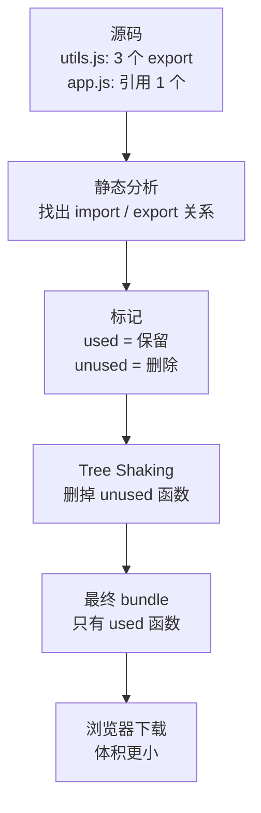
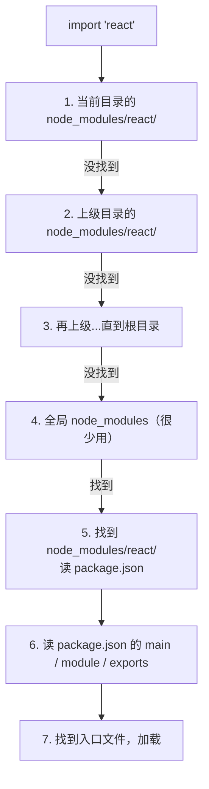

# 现代前端的第一步：模块化与 ES Modules（从 IIFE 到 import / export）

> 这是 **zero-to-tech** 系列的第七篇，也是**前端基础**的第一个主题。前六篇我们讲了「网络」「电脑」「终端」「Git」「GitHub」「部署」——这些几乎是所有开发者通用的底层。从这一篇开始，我们进入**前端**这个具体领域，第一个绕不开的概念就是**模块化**。

我第一次被「模块化」搞崩溃，是工作第一年维护一个老项目：jQuery 时代，所有 JS 文件都通过 `<script>` 标签顺序加载。我新加了一个文件，里面有个变量叫 `result`——结果跑起来整个页面报错。

排查了 3 小时才发现：**前面有个文件里也有个 `result` 变量**——所有 JS 都在同一个「全局作用域」里，互相覆盖。

那一晚我才真正理解：**模块化不是「写代码更优雅」的语法糖，而是「不模块化根本写不了大项目」的工程必需**。

这一篇带你从历史出发，把模块化这事的来龙去脉讲清楚。

---

## 一句话总结

> **JavaScript 一开始没有模块系统**——所有代码共享全局作用域。模块化的进化路径：**IIFE**（模拟作用域）→ **CommonJS**（Node.js 的 `require` / `module.exports`）→ **AMD / UMD**（浏览器侧的异步加载）→ **ES Modules**（ES2015 标准的 `import` / `export`，**全场景统一**）。ES Modules 的**静态分析能力**让 **Tree Shaking** 成为可能——这是现代前端打包工具（webpack / Vite / Rollup）的基石。

---

## 一、为什么需要模块化：从「一个文件搞定一切」说起

### 1.1 JavaScript 诞生时没考虑「模块」

1995 年 Brendan Eich 用 10 天设计出 JavaScript，最初定位是「给网页加一点交互」。当时一个 JS 文件可能就 50 行，全部塞一个 `<script>` 标签里——**没有「模块」这个需求**。

### 1.2 问题在哪：所有代码共享全局作用域

```html
<!-- index.html -->
<script src="a.js"></script>
<script src="b.js"></script>
<script src="c.js"></script>
```

```js
// a.js
var result = "A 的结果";

// b.js
var result = "B 的结果";   // ← 覆盖了 a.js 的 result！

// c.js
console.log(result);        // 输出 "B 的结果"，不是 "A 的结果"
```

**具体踩过的坑**：

| 坑 | 表现 |
|---|------|
| **变量名冲突** | 你的 `data` 覆盖了我文件的 `data` |
| **全局污染** | 一个文件不小心 `var x = 1`，所有文件都能改 `x` |
| **加载顺序敏感** | `b.js` 用了 `a.js` 里的函数，`<script>` 顺序不能错 |
| **无法管理依赖** | 想看 `b.js` 依赖了什么？只能人肉 grep |

**当项目几百个 JS 文件时，这种模式完全不可维护**。

### 1.3 模块化要解决的 4 个问题

| 问题 | 解释 |
|------|------|
| **作用域隔离** | 一个模块的变量不应该污染全局 |
| **明确依赖** | 我用了什么，**显式声明**（不是靠 `<script>` 顺序） |
| **可复用** | 一个模块能在多个项目用，不用复制粘贴 |
| **可组合** | 大模块由小模块组合，而不是一坨代码 |

---

## 二、模块化的 4 次进化


下面每一步**给出当时的核心代码**，看完你就懂了。

### 2.1 1995-2009：无模块

```html
<script src="jquery.js"></script>
<script src="my-app.js"></script>
<!-- 所有 var 都挂 window 上，命名靠自觉 -->
```

**特点**：简单到极致，**完全不可维护**。

### 2.2 2009 前后：IIFE（立即执行函数）模拟作用域

```js
// myModule.js
var MyModule = (function() {
    var privateVar = "别人看不到我";   // IIFE 内部 = 局部作用域

    return {
        publicMethod: function() {
            return privateVar;
        }
    };
})();
```

**IIFE 的核心**：函数执行完内部变量就消失，**只把想暴露的挂在返回对象上**。

**局限**：
- 依赖要手动管理（`MyModule` 必须先于其他文件加载）
- 没有标准化，每个库自己写一套
- 「暴露什么 / 不暴露什么」是手写的

### 2.3 2009：CommonJS（Node.js 的 `require` / `module.exports`）

**Node.js 诞生**，需要一个服务器端 JS 模块系统——**CommonJS** 规范应运而生。

```js
// math.js —— 导出
function add(a, b) { return a + b; }
function sub(a, b) { return a - b; }

module.exports = { add, sub };
// 或：exports.add = add; exports.sub = sub;
```

```js
// main.js —— 导入
const math = require('./math');

console.log(math.add(2, 3));   // 5
```

**CommonJS 的特点**：
- **同步加载**（服务器端文件在本地磁盘，同步没问题）
- **运行时才解析**（`require` 是函数调用，参数是字符串，可以动态拼）
- **拷贝值**（导入的是「值的一份拷贝」，不是引用）
- **Node.js 默认就是 CommonJS**

**局限**：**浏览器不支持 `require`**——浏览器没法同步读文件（要发 HTTP 请求）。

### 2.4 2010-2014：AMD（异步模块定义）+ UMD（通用模块定义）

**AMD**（Asynchronous Module Definition）解决浏览器侧的异步加载：

```js
// AMD 风格（RequireJS）
define(['jquery'], function($) {
    return {
        init: function() { $('#app').html('hi'); }
    };
});
```

```js
// 引入
require(['myModule'], function(myModule) {
    myModule.init();
});
```

**特点**：**异步加载 + 依赖前置声明**。

**UMD**（Universal Module Definition）= CommonJS + AMD 双兼容——同一段代码在 Node 和浏览器都能跑：

```js
(function(root, factory) {
    if (typeof define === 'function' && define.amd) {
        define(['exports'], factory);             // AMD
    } else if (typeof exports === 'object') {
        module.exports = factory();               // CommonJS
    } else {
        root.MyModule = factory();                // 全局
    }
}(typeof self !== 'undefined' ? self : this, function() {
    return { /* 真正实现 */ };
}));
```

**为什么 UMD 流行了一阵**：jQuery、underscore 这些库 2010 年代中期都用 UMD——一份代码在 Node、AMD、浏览器全局都能用。

### 2.5 2015：ES Modules（ESM）—— 标准终于来了

**ES2015 (ES6)** 把模块系统**写进了语言标准**——`import` / `export` 关键字。

```js
// math.js
export function add(a, b) { return a + b; }
export function sub(a, b) { return a - b; }
export const PI = 3.14;
```

```js
// main.js
import { add, sub, PI } from './math.js';

console.log(add(2, 3));   // 5
```

**ESM 的革命性**：
- **浏览器原生支持**：不需要打包器也能用
- **静态分析**：`import` / `export` 在**编译期**就能解析，工具能看到所有依赖
- **Tree Shaking 的基础**：因为能静态分析，未引用的代码可以**自动删除**
- **统一 Node 和浏览器**：Node 12+ 完全支持 ESM

### 2.6 2020+：ESM 统一

到 2026 年：
- **所有现代浏览器**原生支持 `<script type="module">`
- **Node.js 12+** 完全支持 ESM（`"type": "module"`）
- **打包工具**（Vite / webpack / Rollup）默认 ESM
- **新项目 100% ESM**——CommonJS 在 Node 服务端还有存量，但新代码首选 ESM

**这就是为什么「现代前端的第一步」是模块化**——你不理解 ESM，就理解不了 Vite、Tree Shaking、为什么打包会变快。

---

## 三、ES Modules 完整语法

ESM 的语法比 CommonJS 丰富得多。这一节把所有用法**一次讲完**。

### 3.1 export 三种姿势

```js
// 1. 命名导出（Named Export）—— 一个文件可以有很多
export const PI = 3.14;
export function add(a, b) { return a + b; }
export class Calculator { /* ... */ }

// 2. 集中导出（放在文件末尾）
const PI = 3.14;
function add(a, b) { return a + b; }

export { PI, add };

// 3. 默认导出（Default Export）—— 一个文件只能有一个
export default class UserService { /* ... */ }
```

**命名导出 vs 默认导出**：

| 特性 | 命名导出 | 默认导出 |
|------|---------|---------|
| **数量** | 任意多个 | 一个文件只能 1 个 |
| **导入时名字** | 必须和导出名一致（可重命名） | **随便起**（建议和类名一致） |
| **Tree Shaking** | ✅ 友好 | ⚠️ 不友好（导入方随意起名，分析器认不出） |
| **IDE 跳转** | ✅ 准确 | ⚠️ 经常跳错 |
| **典型场景** | 工具函数、常量 | 类、组件、单一功能模块 |

**实战建议**：
- **React / Vue 组件**：默认导出（一个文件一个组件）
- **工具库**（lodash 这种）：命名导出
- **一个文件里**：可以既有命名导出又有默认导出，但**不推荐**

### 3.2 import 三种姿势

```js
// 1. 具名导入
import { add, PI } from './math.js';

// 2. 重命名（避免名字冲突）
import { add as addNumbers, PI as MathPI } from './math.js';

// 3. 默认导入
import UserService from './user-service.js';

// 4. 混合导入（默认 + 具名）
import UserService, { getUserById, deleteUser } from './user-service.js';

// 5. 命名空间导入（把整个模块当一个对象）
import * as math from './math.js';
console.log(math.add(2, 3));
console.log(math.PI);

// 6. 仅副作用导入（只想跑模块的顶层代码）
import './polyfill.js';

// 7. 动态导入（ES2020，运行时按需加载）
const math = await import('./math.js');
```

### 3.3 路径规则

```js
import x from './math.js';          // 相对路径，必须带 .js 后缀
import x from '../utils/math.js';   // 相对路径的 ../
import x from '@/lib/math';         // 别名（webpack / Vite / TS 配置）
import React from 'react';          // bare specifier：从 node_modules 找
import lodash from 'lodash-es';     // bare specifier
```

**关键规则**：
- **ESM 必须写完整文件扩展名**（浏览器原生要求）
- **打包器下可省 `.js`**（webpack / Vite 会自动补）——但**建议保留**，更明确
- **`@/` 是别名**（在 `tsconfig.json` / `vite.config.ts` 里配）

### 3.4 重新导出（Re-export）—— 中转模块

```js
// components/index.js —— 把所有组件汇总到一处
export { Button } from './Button.js';
export { Input } from './Input.js';
export { Select } from './Select.js';

// 用法
import { Button, Input, Select } from '@/components';
```

**这是大型项目组织代码的关键模式**——把散落的模块集中到一个「barrel 文件」。

### 3.5 顶层 await（ES2022）

ES Modules 允许**在模块顶层直接用 `await`**（CommonJS 做不到）：

```js
// 加载配置后才能导出
const config = await fetch('/api/config').then(r => r.json());

export const API_URL = config.apiUrl;
export const TIMEOUT = config.timeout;
```

**使用场景**：配置文件加载、条件导出（实验性功能的环境判断）。

### 3.6 `<script type="module">` —— 浏览器原生 ESM

```html
<script type="module">
  import { add } from './math.js';
  console.log(add(2, 3));
</script>

<!-- 或者外部文件 -->
<script type="module" src="./app.js"></script>
```

**浏览器原生 ESM 的几个特性**：
- **默认 defer**：脚本在 HTML 解析完后才执行
- **自动严格模式**：`'use strict'` 自动开启
- **跨域限制**：`import` 路径必须带协议 / 域名（CORS）
- **缓存友好**：浏览器会缓存模块文件

**生产环境**：直接用 `<script type="module">` 不常见——**还是靠打包器**（Vite / webpack）把多个模块打成几个 bundle，HTTP 请求少、压缩率高、Tree Shaking 充分。

---

## 四、ES Modules vs CommonJS：本质差异

这一节讲**根本性的不同**——理解这个，你就理解了「为什么新代码必须用 ESM」。

### 4.1 一张表对比

| 维度 | CommonJS | ES Modules |
|------|----------|-----------|
| **语法** | `require` / `module.exports` | `import` / `export` |
| **加载方式** | 同步（`require` 立刻执行） | 异步（`import` 是声明，由引擎处理） |
| **解析时机** | **运行时**（`require` 是函数调用） | **编译时**（`import` 是语法，解析器看得到） |
| **值传递** | 拷贝（导入是「值的一份快照」） | 绑定（导入是「活引用」，原始值变导入也变） |
| **Tree Shaking** | ❌ 几乎不可能 | ✅ 天然支持 |
| **浏览器原生** | ❌ 不支持 | ✅ 原生支持 |
| **Node 默认** | ✅ 默认 | ⚠️ 需要 `"type": "module"` 或 `.mjs` |
| **顶层 await** | ❌ | ✅（ES2022） |
| **循环依赖** | 给「部分导出」 | 给「活绑定」（更安全） |

### 4.2 关键差异 #1：静态 vs 动态

```js
// CommonJS —— require 是函数调用，可以动态拼
const moduleName = condition ? 'a' : 'b';
const mod = require(`./${moduleName}`);   // 运行时才知道加载什么

// ESM —— import 是语法，路径必须静态可分析
import x from './a.js';                   // 必须是字符串字面量
// import(`${name}.js`);                  ← 这就是动态 import()，是单独的 API
```

**为什么 ESM 要强制静态**：
- 编译时就能知道所有依赖 → 打包器能精准分析
- IDE 能做自动补全、跳转
- 浏览器能预加载（`<link rel="modulepreload">`）
- Tree Shaking 能删未引用的代码

### 4.3 关键差异 #2：值拷贝 vs 活绑定

```js
// counter.js (CommonJS)
let count = 0;
function increment() { count++; }
module.exports = { count, increment };

// main.js
const { count, increment } = require('./counter');
console.log(count);      // 0
increment();
console.log(count);      // 还是 0！导出的 count 是「值拷贝」
```

```js
// counter.js (ESM)
export let count = 0;
export function increment() { count++; }

// main.js
import { count, increment } from './counter.js';
console.log(count);      // 0
increment();
console.log(count);      // 1！count 是「活绑定」，原始值变了导入处也看到
```

**ESM 的活绑定** = 导入和导出**始终指向同一个内存地址**。这就是为什么 ESM 不需要 `Object.assign` 那种技巧。

### 4.4 关键差异 #3：循环依赖

```js
// a.js (CommonJS)
const b = require('./b');
module.exports = { name: 'a', bName: b.name };   // b 是部分导出

// b.js (CommonJS)
const a = require('./a');
module.exports = { name: 'b', aName: a.name };   // a.name 是 undefined（a 还没导出完）
```

**ESM 的循环依赖**因为是「活绑定」，**互相 import 时拿到的是「已声明但未赋值」的绑定**，引擎自动处理时序。

**实战经验**：循环依赖**两种规范都不优雅**——能避免就避免。**CommonJS 的循环依赖 bug 更隐蔽、更难调**。

---

## 五、Tree Shaking：ESM 带来的最大胜利

**Tree Shaking** = 把代码里**没被使用的部分**自动删掉。这是 ESM 静态分析的直接产物。

### 5.1 一个例子

```js
// utils.js
export function used() { return '我被用了'; }
export function unused() { return '我没人用'; }
export function alsoUnused() { return '我也没人用'; }
```

```js
// app.js
import { used } from './utils.js';
console.log(used());
```

**没 Tree Shaking 之前**：打包结果包含 3 个函数（3 KB）。
**有 Tree Shaking 之后**：打包结果只包含 `used`（约 1 KB）——**`unused` 和 `alsoUnused` 被删掉**。

### 5.2 Tree Shaking 怎么做到的

```
1. ESM 的 import / export 是静态语法
   → 打包器能读懂「app.js 只引用了 used」

2. 标记所有 export 哪些被 import
   → used = "used"
   → unused = "unused"
   → alsoUnused = "unused"

3. 删掉 "unused" 的代码
   → 打包结果体积变小
```

### 5.3 Tree Shaking 生效的 3 个前提

| 前提 | 解释 |
|------|------|
| **必须用 ESM** | CommonJS 的 `require` 是运行时调用，分析器看不出来 |
| **必须无副作用** | 模块顶层不能有「自动跑的代码」（如 `window.x = 1`） |
| **打包器支持** | Rollup、Vite、esbuild、webpack 5+ 都支持 |

**「无副作用」是常被忽略的坑**：

```js
// math.js —— 有副作用！
export function add(a, b) { return a + b; }
console.log('math 模块被加载了');   // ← 顶层代码，打包器不知道这个 console 是不是「重要的副作用」
window.MATH_LOADED = true;        // ← 同样，打包器不敢删
```

解决方案：`package.json` 里加 `"sideEffects": false` 告诉打包器「**这个包的所有代码都可以安全删**」：

```json
{
  "name": "my-lib",
  "sideEffects": false
}
```

**这就是为什么 lodash-es 比 lodash 小很多**——前者支持 Tree Shaking，后者是 CommonJS。

### 5.4 Mermaid 图：Tree Shaking 流程



---

## 六、模块解析机制：import 的路径怎么找

`import x from 'react'` 这行代码背后，**打包器 / Node 是怎么找到 react 的？**

### 6.1 三类路径

```js
import x from './math.js';          // 1. 相对路径
import x from '../utils/math.js';   //    （相对当前文件）
import x from '@/lib/math';         //    （@/ 是配置的别名）

import x from 'react';              // 2. bare specifier
import x from 'lodash-es';          //    （从 node_modules 找）
import x from '@types/node';        //    （scope package）

import x from 'fs';                 // 3. Node 内置模块
import x from 'node:fs';            //    （加 node: 前缀是现代推荐写法）
```

### 6.2 bare specifier 怎么解析

`import x from 'react'` 的解析流程（以 Node / 打包器为例）：



**`package.json` 里的关键字段**：

```json
{
  "name": "react",
  "version": "18.0.0",
  "main": "index.js",                          // CommonJS 入口
  "module": "dist/index.mjs",                  // ESM 入口（打包器优先用）
  "exports": {                                  // 现代入口（推荐）
    ".": {
      "import": "./dist/index.mjs",            // ESM 用这个
      "require": "./dist/index.cjs",           // CommonJS 用这个
      "default": "./dist/index.mjs"
    }
  },
  "sideEffects": false                          // Tree Shaking 友好
}
```

### 6.3 路径解析的 3 个常见坑

| 坑 | 表现 | 解决 |
|---|------|------|
| **必须写扩展名** | 浏览器原生 ESM `import './math'` 报 404 | 写 `./math.js`，或配 Vite/webpack 自动补 |
| **循环引用** | 出现「undefined is not a function」 | 重构避免循环；或用动态 `import()` |
| **大小写敏感** | `import './Math.js'` 在 macOS 开发能跑、Linux 部署 404 | 保持大小写一致 |

---

## 七、实战：一个真实项目的模块结构

```text
my-app/
├── src/
│   ├── components/          # UI 组件（默认导出为主）
│   │   ├── Button/
│   │   │   ├── Button.tsx
│   │   │   └── index.ts     # 出口：export { Button } from './Button'
│   │   ├── Input/
│   │   └── index.ts         # barrel：汇总所有组件
│   ├── lib/                 # 工具库（命名导出为主）
│   │   ├── date.ts
│   │   ├── string.ts
│   │   └── index.ts
│   ├── api/                 # API 调用
│   │   ├── user.ts
│   │   └── post.ts
│   ├── types/               # 类型定义
│   │   └── index.ts
│   └── app.tsx              # 入口
├── package.json             # "type": "module"
└── tsconfig.json            # 配置 @/ 别名
```

**入口 `app.tsx`**：

```ts
// 默认导入组件
import { Button } from '@/components/Button';
import { Input } from '@/components/Input';

// 命名导入工具
import { formatDate, parseDate } from '@/lib/date';
import { truncate } from '@/lib/string';

// 命名空间导入
import * as UserAPI from '@/api/user';
```

**配套的 `tsconfig.json` 别名配置**：

```json
{
  "compilerOptions": {
    "baseUrl": ".",
    "paths": {
      "@/*": ["src/*"]
    }
  }
}
```

---

## 八、给新手的 3 个心智模型

1. **模块化 = 作用域隔离 + 显式依赖**：**所有代码共享全局**是 JS 早期最大的设计缺陷——一旦项目变大，命名冲突和隐式依赖会让你寸步难行。模块化做的事只有两件：把代码**包起来**别污染别人（隔离）、把代码**依赖**显式写出来（声明）。ES Modules 是这件事的标准答案。

2. **ESM 的「静态」是 Tree Shaking 的前提**：CommonJS 的 `require('a')` 是运行时函数调用，工具看不出来你「引了什么」。ESM 的 `import 'a'` 是语法，编译期就明确了——**这唯一的差异让 Tree Shaking、自动补全、循环依赖检测成为可能**。**新项目 100% 应该用 ESM**。

3. **打包器 = 把「很多 ESM 文件」合并成「几个 bundle」**：浏览器原生 ESM 也能用，但实际生产还是靠 Vite / webpack 打包——好处是 HTTP 请求少、Tree Shaking 充分、TypeScript / JSX 编译统一。**理解 ESM 是理解现代前端构建工具的钥匙**。

---

## 九、一句话总结

> **JavaScript 模块化从 IIFE → CommonJS → AMD/UMD → ES Modules 的进化，本质是「从全局污染到作用域隔离 + 显式依赖 + 静态分析」**。ES Modules（`import` / `export`）是 ES2015 写进语言标准的模块系统，**浏览器和 Node 都原生支持**。它的**静态语法**让 **Tree Shaking** 成为可能——这是现代前端打包工具（Vite / Rollup / webpack 5）能减小 bundle 体积的基石。**新项目 100% 用 ESM**——这是 2026 年写 JavaScript 的入场券。

---

## 这个系列下一篇会写什么

- **zero-to-tech / Vite / webpack 是什么：现代前端怎么把 ESM 打成 bundle**
- **zero-to-tech / 进程、线程、内存：你的电脑同时在跑多少事**
- **zero-to-tech / Docker 是什么：为什么「在我电脑上能跑」会变成「在我容器里能跑」**

上一篇：[服务器部署和 Nginx 配置：从本地代码到线上服务](/blog/server-deploy-and-nginx)
第一篇：[网络是怎么工作的](/blog/how-network-work)