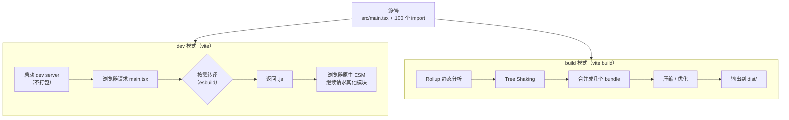

# 现代前端的工具链：npm + Vite + 构建产物（从 npm install 到 dist 目录）

> 这是 **zero-to-tech** 系列的第八篇，也是**前端基础**的第二个主题。上一篇讲了 ES Modules——源码能 `import` 了。但浏览器依然**不能直接跑** `.ts` / `.vue` / `.jsx` / Sass / PostCSS。这一篇讲把这些「源码」变成「浏览器能跑的代码」的工具链：**npm + Vite + 构建产物**。

我第一次看到现代前端项目时，被那个 `node_modules/` 文件夹吓到了——**几百兆、上万个文件夹**。我心想：就这么几行代码，为啥要装这么多东西？

后来才知道：**node_modules 是你整个项目的「依赖宇宙」**——你的代码 + 你的依赖的依赖的依赖的依赖，全在这一个文件夹里。

这一篇把这件事从「听说」变成「自己会操作」——从 `npm install` 到 `npm run dev` 到 `npm run build`，完整跑通一次。

---

## 一句话总结

> **现代前端项目 = 你的源码 + 一堆 npm 依赖 + 一个构建工具**。`npm install` 把依赖装到 `node_modules/`；`npm run dev` 启开发服务器；`npm run build` 把源码打包成 `dist/` 目录的静态文件。**Vite** 是当前最快、最主流的构建工具——基于原生 ES Modules + esbuild，启动是亚秒级。这一篇把这些事串成完整链路。

---

## 一、为什么需要构建工具

### 1.1 浏览器只能跑这些

现代浏览器能直接跑的代码**非常有限**：

| 浏览器直接支持 | 浏览器不支持（要构建工具转） |
|---------------|---------------------------|
| `.html` `.css` `.js`（ES2017+） | `.ts` / `.tsx` |
| 原生 ES Modules | `.jsx` / `.vue` / `.svelte` |
| JSON（`fetch` 拿） | Sass / Less / PostCSS |
| 图片 / 字体 | 压缩、Tree Shaking、Code Splitting |

**你要写的现代前端代码（React、Vue、TypeScript）= 浏览器跑不了的代码**。需要构建工具做翻译。

### 1.2 构建工具解决的 4 件事

| 任务 | 例子 |
|------|------|
| **转译** | `.ts` → `.js`、`.jsx` → `.js`、Sass → CSS |
| **打包** | 100 个模块文件 → 几个 bundle（减少 HTTP 请求） |
| **优化** | Tree Shaking、压缩（去掉空格 + 改短变量名）、代码分割 |
| **开发体验** | 热更新（HMR）、dev server、source map、错误提示 |

### 1.3 上一篇文章的 ES Modules 怎么落地的

上一篇讲的 ES Modules 解决了「代码怎么组织」的问题。但还有 3 个**构建工具层面**的问题没解决：

```
1. 浏览器要发 100 个 HTTP 请求才能加载 100 个 .ts 文件？太慢
   → 构建工具合并成几个 bundle

2. 浏览器不认识 .ts / .vue / Sass 语法
   → 构建工具编译成浏览器认识的 .js / .css

3. 生产环境要压缩、Tree Shaking、缓存优化
   → 构建工具一键搞定
```

**模块化解决「代码组织」，构建工具解决「代码运行」**。两者缺一不可。

---

## 二、npm 是什么：Node 生态的包管理器

### 2.1 三个核心概念

| 概念 | 解释 |
|------|------|
| **npm** | Node Package Manager = Node.js 官方的包管理工具 |
| **package** | 一个可复用的代码包（一个库、一个工具、一个框架） |
| **registry** | npm 的中央仓库（`registry.npmjs.org`），所有 package 都发布到这里 |

**截至 2026 年，npm registry 有 280 万+ 个包**——基本上你想要的轮子都已经有人造过了。

### 2.2 三个相关工具的关系

| 工具 | 特点 | 用法 |
|------|------|------|
| **npm** | Node.js 官方，最老牌 | `npm install` |
| **yarn** | Facebook 2016 年出，比 npm 早期快 | `yarn add` |
| **pnpm** | 2017 年出，磁盘空间最优，速度最快 | `pnpm add` |
| **bun** | 2022 年出，All-in-one（runtime + 包管理 + 构建） | `bun add` |

**2026 年的事实标准**：
- **新项目首选 pnpm**（速度快、磁盘省、monorepo 友好）
- **存量项目大多用 npm / yarn**（无迁移必要）
- **bun 是新趋势**（性能怪兽，但生态还在追赶）

**这一篇以 npm 为主**——它是默认装 Node.js 时带的，零配置。

### 2.3 安装 Node.js（npm 自带）

```bash
# macOS（推荐用 nvm 装，方便切版本）
brew install nvm
echo "source $(brew --prefix nvm)/nvm.sh" >> ~/.zshrc
nvm install --lts
nvm use --lts

# 或者直接装
brew install node

# 装完验证
node -v   # v22.x.x
npm -v    # 10.x.x
```

---

## 三、package.json + node_modules：项目的「身份证」和「依赖宇宙」

### 3.1 package.json：一个项目的所有元信息

```json
{
  "name": "my-app",                 // 项目名
  "version": "1.0.0",               // 版本
  "private": true,                  // 私有（不发布到 npm）
  "type": "module",                 // ESM 模式（vs CommonJS）
  "scripts": {                      // npm run 跑的脚本
    "dev": "vite",
    "build": "vite build",
    "preview": "vite preview"
  },
  "dependencies": {                 // 生产依赖（运行时需要）
    "react": "^18.3.1",
    "react-dom": "^18.3.1"
  },
  "devDependencies": {              // 开发依赖（构建 / 测试用）
    "vite": "^5.4.0",
    "typescript": "^5.5.0",
    "@types/react": "^18.3.0"
  }
}
```

**两类依赖的区别**：

| 类型 | 包含 | 装到哪 |
|------|------|--------|
| **dependencies** | 运行时需要（React、Vue、工具库） | 生产环境也装 |
| **devDependencies** | 只开发 / 构建时需要（Vite、TypeScript、ESLint、测试框架） | 生产环境**不装** |

### 3.2 node_modules：依赖宇宙

```
my-app/
├── node_modules/                   # 你项目 + 所有依赖的依赖都在这
│   ├── react/
│   ├── react-dom/
│   ├── vite/
│   │   └── node_modules/            # 嵌套依赖（npm 早期这样）
│   └── ...
├── src/
├── package.json
└── package-lock.json                # 锁定具体版本（后面讲）
```

**为什么 node_modules 那么大**：
- 你的项目依赖 A
- A 依赖 B 和 C
- B 依赖 D 和 E
- ...递归下去

一个简单的 React 项目可能要装 **1000+ 个包**。**但你不用关心**——`npm install` 一次搞定。

### 3.3 package-lock.json：锁住每个包的具体版本

```json
{
  "name": "my-app",
  "lockfileVersion": 3,
  "packages": {
    "node_modules/react": {
      "version": "18.3.1",
      "resolved": "https://registry.npmjs.org/react/-/react-18.3.1.tgz",
      "integrity": "sha512-..."
    }
  }
}
```

**为什么需要 lockfile**：

- `package.json` 写的是 `^18.3.1`（兼容 18.x.x 的最新版）
- 别人 `npm install` 时，可能装到 `18.5.0`（版本飘了）
- `package-lock.json` **锁死每个包的具体版本**——保证团队 / CI / 部署装的是**完全一样的依赖**

**规则**：
- `package.json` 进 Git
- `package-lock.json` **必须进 Git**（团队一致性）
- `node_modules/` **不能进 Git**（.gitignore 屏蔽）

### 3.4 版本号的 3 种写法

```json
"react": "18.3.1"           // 精确：只装 18.3.1
"react": "^18.3.1"          // 兼容：不改 major，可升 18.x.x
"react": "~18.3.1"          // 兼容：不改 minor，只升 18.3.x
"react": ">=18.0.0"         // 范围：>= 18.0.0
"react": "*"                // 最新（不要这样写）
"react": "latest"           // 最新（也不要）
```

**最佳实践**：
- **业务项目**：用 `^`（接受 minor 升级）
- **库 / 框架**：用精确版本，避免给下游带来意外
- **永远不要用 `*` / `latest`**（不可预测）

---

## 四、用 npm 安装项目依赖

### 4.1 4 个核心命令

```bash
# 1. 装一个生产依赖
npm install react

# 2. 装一个开发依赖
npm install --save-dev vite
# 或缩写
npm install -D vite

# 3. 装 package.json 里所有的依赖（克隆项目后第一件事）
npm install
# 或 npm i

# 4. 删一个依赖
npm uninstall react
```

### 4.2 安装时的 3 个动作

```bash
npm install vite
```

执行时 npm 会做：

```
1. 下载 vite 的 .tgz 压缩包到 ~/.npm/_cacache/
2. 解压到 node_modules/vite/
3. 更新 package.json 的 dependencies
4. 更新 package-lock.json
5. 检查 vite 的依赖（vite 又依赖 esbuild、rollup、postcss...），递归装
```

### 4.3 完整的「从 0 到能跑」流程

```bash
# 1. 创建项目目录
mkdir my-app && cd my-app

# 2. 初始化 package.json
npm init -y                            # -y 表示全用默认值

# 3. 装开发依赖
npm install -D vite                    # Vite
npm install -D typescript              # TypeScript（可选）

# 4. 装生产依赖
npm install react react-dom            # 假设用 React

# 5. 写代码
mkdir src
echo 'import React from "react"; console.log("hi")' > src/main.jsx

# 6. 写 index.html
echo '<!doctype html><html><body><script type="module" src="/src/main.jsx"></script></body></html>' > index.html

# 7. 跑起来
npx vite
# → Local: http://localhost:5173/

# 8. 打包
npx vite build
# → 输出到 dist/ 目录
```

### 4.4 全局安装 vs 本地安装

```bash
# 本地（推荐）：只在这个项目能用
npm install vite

# 全局：所有项目都能用，但版本难管理
npm install -g vite

# npx：临时下载运行最新版（不污染全局）
npx vite
```

**最佳实践**：
- **项目依赖都装本地**（package.json 记录，团队一致）
- **全局只装工具类**：yarn、pnpm、typescript（`tsc`）、http-server 这种
- **用 `npx` 跑一次性命令**（不污染全局）

---

## 五、npm run 命令的本质：package.json 的 scripts

### 5.1 为什么有 `npm run`

直接跑 `vite` 和 `npm run dev` 的区别：

```bash
# 直接跑（要求 vite 在 PATH 里）
vite

# 走 npm run
npm run dev
# 实际上 npm 帮你执行：npx vite
```

**`npm run` 的好处**：
1. **不需要全局装**：vite 在 `node_modules/.bin/` 里，`npm run` 自动加到 PATH
2. **跨平台**：Windows / macOS / Linux 都能跑（npm 帮你处理）
3. **可组合**：可以 `prebuild` / `postbuild` 钩子
4. **统一入口**：所有命令都在 `package.json` 里，新人 clone 项目 `npm install && npm run dev` 就能跑

### 5.2 一个标准 Vite 项目的 scripts

```json
{
  "scripts": {
    "dev": "vite",
    "build": "vite build",
    "preview": "vite preview",
    "lint": "eslint .",
    "test": "vitest",
    "typecheck": "tsc --noEmit",
    "format": "prettier --write ."
  }
}
```

```bash
npm run dev        # 启动 dev server（开发时用）
npm run build      # 打包成生产产物
npm run preview    # 本地预览 build 产物
npm run lint       # 跑 ESLint
npm run test       # 跑测试
npm run typecheck  # TypeScript 类型检查
npm run format     # 格式化代码
```

### 5.3 自定义 script

```json
{
  "scripts": {
    "dev": "vite",
    "build:prod": "NODE_ENV=production vite build",
    "deploy": "npm run build && rsync -avz dist/ user@server:/var/www/app/",
    "clean": "rm -rf dist node_modules/.vite"
  }
}
```

**几个有意思的技巧**：

```bash
# 串行执行（前一个成功才跑后一个）
"build:all": "npm run lint && npm run typecheck && npm run build"

# 并行执行（同时跑）
"build:watch": "npm run build -- --watch"

# 传参数
"test:single": "vitest run --reporter=verbose"
# 跑：npm run test:single -- Button.test
#    (-- 后面的传给 vitest)
```

---

## 六、构建工具的演化


### 6.1 关键节点

| 工具 | 年份 | 核心思想 | 现状 |
|------|------|---------|------|
| **Grunt** | 2012 | 配置文件 + 任务列表 | 已淘汰 |
| **Gulp** | 2013 | 流式管道（`src().pipe(plugin).pipe(dest())`） | 维护中，使用者少 |
| **webpack** | 2015 | 「一切皆模块」统一打包 | 仍然是企业级主流 |
| **Parcel** | 2018 | 零配置 | 小众 |
| **Vite** | 2020 | 原生 ESM + esbuild + Rollup | **2026 年新项目首选** |
| **Turbopack** | 2022 | Rust 实现，Next.js 主推 | Next.js 生态专用 |
| **Bun** | 2023 | All-in-one（runtime + bundler + package manager） | 快速增长 |

### 6.2 为什么 Vite 赢了

Vite 的三个核心创新：

| 创新 | 解释 |
|------|------|
| **原生 ESM** | dev server 不打包，浏览器直接用 `<script type="module">` 加载 .ts / .vue / .jsx |
| **esbuild** | Go 写的转译器，比 Babel 快 10-100 倍 |
| **按需编译** | 只编译浏览器请求的模块，不全量打包 |

**结果**：Vite dev server 启动时间从 webpack 的「几秒到几十秒」变成「**亚秒级**」。HMR（热更新）也是毫秒级。

---

## 七、Vite 上手：从 0 到 dev server

### 7.1 创建 Vite 项目（推荐方式）

```bash
npm create vite@latest my-app
# 会问你：
#   ? Select a framework: › React / Vue / Vanilla / ...
#   ? Select a variant: › TypeScript / JavaScript
```

会自动做：
- 创建 `my-app/` 目录
- 生成 `package.json` + `vite.config.ts` + `index.html` + `src/`
- **自动跑 `npm install`**

进项目后：

```bash
cd my-app
npm run dev
# 输出：
#   VITE v5.4.0  ready in 287 ms
#   ➜  Local:   http://localhost:5173/
#   ➜  Network: use --host to expose
```

打开 `http://localhost:5173` 就能看到页面。

### 7.2 Vite 的目录结构（标准模板）

```
my-app/
├── node_modules/                # 依赖（不入 Git）
├── public/                      # 静态资源（直接复制到 dist 根目录）
│   └── favicon.svg
├── src/                         # 源码
│   ├── assets/
│   ├── components/
│   ├── App.tsx
│   ├── main.tsx
│   └── index.css
├── index.html                   # 入口 HTML（Vite 的入口）
├── package.json
├── tsconfig.json
├── vite.config.ts               # Vite 配置
└── .gitignore
```

### 7.3 vite.config.ts：Vite 的配置中心

```ts
import { defineConfig } from 'vite';
import react from '@vitejs/plugin-react';

export default defineConfig({
  plugins: [react()],            // 启用 React 支持
  server: {
    port: 5173,                  // dev server 端口
    host: '0.0.0.0',             // 局域网可访问
    open: true,                  // 启动时自动打开浏览器
  },
  build: {
    outDir: 'dist',              // build 输出目录
    sourcemap: true,             // 生成 source map
    target: 'es2020',            // 编译目标
    rollupOptions: {
      output: {
        manualChunks: {           // 手动分包
          vendor: ['react', 'react-dom'],
        },
      },
    },
  },
});
```

---

## 八、Vite 的 dev + build 完整流程

### 8.1 dev：开发模式

```bash
npm run dev
# 实际跑：vite
```

Vite dev 做了什么：

```
1. 启动一个 Express-like 的 Node 服务器（不是打包！）
2. 浏览器请求 index.html → 返回
3. 浏览器看到 <script type="module" src="/src/main.tsx">
4. 浏览器请求 main.tsx → Vite 实时编译 .tsx → .js → 返回
5. 浏览器看到 import React from 'react'
6. 浏览器请求 /node_modules/.vite/deps/react.js（Vite 预打包的）
7. ... 如此往复
```

**关键**：dev 阶段**不打 bundle**，浏览器用原生 ES Modules 按需加载。改一个文件，只重新加载那一个文件——**HMR 极快**。

### 8.2 build：生产构建

```bash
npm run build
# 实际跑：vite build
```

Vite build 做了什么：

```
1. 从 index.html 出发，找到所有 import
2. Rollup 递归分析所有依赖
3. Tree Shaking（删未引用的代码）
4. 合并成几个 bundle
5. 转译 .ts / .jsx / .vue → .js
6. 压缩（去掉空格 / 改短变量名）
7. 输出到 dist/
8. （可选）生成 source map
```

### 8.3 Mermaid 图：dev vs build 的核心差异



---

## 九、源码 vs 构建产物：dist 文件夹里到底有什么

### 9.1 dist 目录长什么样

```bash
npm run build
# 输出：
#   vite v5.4.0 building for production...
#   ✓ 32 modules transformed.
#   dist/index.html                   0.45 kB │ gzip:  0.29 kB
#   dist/assets/index-abc123.js     142.30 kB │ gzip: 51.20 kB
#   dist/assets/index-def456.css     12.40 kB │ gzip:  3.50 kB
#   ✓ built in 1.20s
```

```
dist/
├── index.html                      # 入口 HTML（Vite 注入了 bundle 引用）
└── assets/
    ├── index-abc123.js             # 主 bundle（带 hash 用于缓存）
    ├── index-def456.css            # 主样式
    └── vendor-789xyz.js            # 第三方依赖分包
```

**关键现象**：
- 文件名带 **hash**（`abc123`）：内容变了 hash 就变，浏览器自动用新版本（避免缓存）
- 体积**变小很多**：比如源码 500 KB，build 后可能 142 KB（gzip 后 51 KB）

### 9.2 源码 vs 构建产物对比

| 维度 | 源码（src/） | 构建产物（dist/） |
|------|-------------|-----------------|
| **人能不能读** | ✅ 能（TSX、注释、空格） | ❌ 难（压缩、单行、变量名改 a/b/c） |
| **浏览器能跑吗** | ❌ 不能（TypeScript、JSX） | ✅ 能 |
| **文件大小** | 大 | 小（gzip 后可能 1/10） |
| **进 Git 吗** | ✅ 必进 | ❌ 必不进 |

### 9.3 为什么 dist 不能进 Git

| 原因 | 解释 |
|------|------|
| **能重新生成** | `npm run build` 一行命令生成，不丢任何信息 |
| **太大** | 几 MB 到几十 MB，污染仓库 |
| **平台差异** | Windows / macOS / Linux 生成的 dist 可能略有不同（行尾符、权限） |
| **混淆误解** | 别人 clone 下来直接改 dist，下一次 build 就被覆盖了 |

---

## 十、用 Git 管理现代前端项目

### 10.1 关键 .gitignore（现代前端必加）

```gitignore
# 依赖
node_modules/
.pnpm-store/

# 构建产物
dist/
build/
.next/
out/
*.tsbuildinfo

# 环境变量（绝不能进 Git！）
.env
.env.local
.env.*.local

# Vite 缓存
.vite/

# 系统 / 编辑器
.DS_Store
.idea/
.vscode/*
!.vscode/settings.json
!.vscode/extensions.json

# 日志 / 临时
*.log
npm-debug.log*
yarn-debug.log*
yarn-error.log*

# 测试覆盖
coverage/
```

### 10.2 入 Git vs 不入 Git 速查表

| 进 Git | 不进 Git |
|--------|---------|
| `src/` 源码 | `node_modules/` |
| `package.json` | `dist/` build 产物 |
| `package-lock.json`（**必进**） | `.env.local` 密钥 |
| `tsconfig.json` / `vite.config.ts` | `.vite/` Vite 缓存 |
| `index.html` | `*.log` |
| `public/`（部分静态资源） | `coverage/` |
| `.gitignore` 本身 | `.DS_Store` |

### 10.3 团队协作的「干净 clone」流程

```bash
# 同事新 clone 项目
git clone git@github.com:coyafky/my-app.git
cd my-app
npm install            # 装依赖
npm run dev            # 跑起来
# → 完整环境就绪
```

**这就是为什么 `package.json` + `package-lock.json` 进 Git 是关键**——任何人都能 `npm install` 重建完整环境。

### 10.4 升级依赖

```bash
# 查看过期依赖
npm outdated

# 升级一个
npm update react

# 升级所有（minor + patch）
npm update

# 升级 major 版本（破坏性更新）
npm install react@19
```

**实战建议**：
- 每周 / 每月 `npm outdated` 看一次
- **重大升级（如 React 18→19）单独一个 PR**，方便回滚
- 配合 Dependabot / Renovate 自动开 PR

---

## 十一、给新手的 3 个心智模型

1. **package.json = 项目的「身份证 + 依赖清单 + 脚本入口」**：新人 clone 项目，**只读两个文件就能上手**——`README.md`（项目说明）+ `package.json`（依赖 + 脚本）。所有命令都在 `scripts` 里——`npm run dev` / `npm run build` 跑的都是它。这是「项目即代码」的入口抽象。

2. **node_modules 永远不入 Git，但 lockfile 必须入**：因为 `package-lock.json` 锁定了 1000+ 个包的具体版本，**它就是项目运行的「事实真相」**。丢了 lockfile，团队 / CI / 部署可能装出不一样的版本，bug 难复现。这是 npm 工程化的基石。

3. **Vite dev 不打包，Vite build 才打包**：这是 Vite 最反直觉的创新——dev 阶段浏览器**按需请求模块**，不做全量打包。**改一个文件只重传那一个文件**——HMR 毫秒级。build 阶段才用 Rollup 全量打包 + Tree Shaking + 压缩。**理解「dev 不打包」就理解了 Vite 为什么快**。

---

## 十二、一句话总结

> **现代前端项目 = 你的源码 + package.json 列的依赖 + 一个构建工具**。`npm install` 把依赖装到 `node_modules/`（不入 Git），`package-lock.json` 锁住具体版本（必入 Git）；`npm run dev` 启开发服务器（Vite 不打包，按需转译），`npm run build` 打包到 `dist/`（不入 Git，部署时用）；`.gitignore` 屏蔽 `node_modules/` / `dist/` / `.env.local` 三件套。**Vite 是当前最快、最主流的构建工具**——基于原生 ESM + esbuild，dev server 亚秒级启动。

---

## 这个系列下一篇会写什么

- **zero-to-tech / React / Vue 是怎么把 UI 写成组件树的：组件化心智模型**
- **zero-to-tech / TypeScript 是什么：为什么新项目 100% 应该用 TypeScript**
- **zero-to-tech / Docker 是什么：为什么「在我电脑上能跑」会变成「在我容器里能跑」**

上一篇：[现代前端的第一步：模块化与 ES Modules](/blog/js-modules-history)
第一篇：[网络是怎么工作的](/blog/how-network-work)