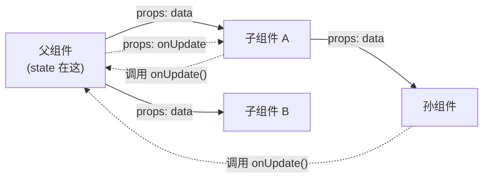
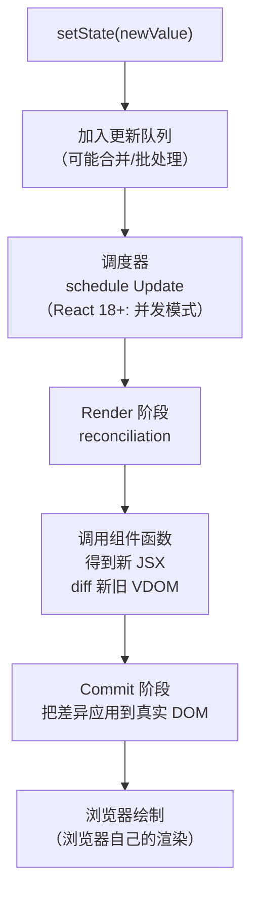
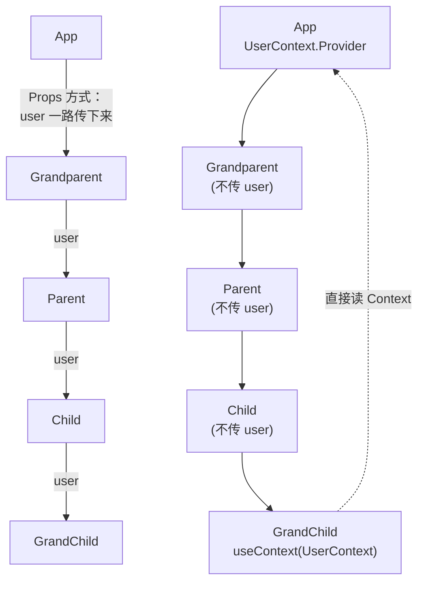

# React 数据驱动 UI：从 setState 到 DOM 更新的完整链路

> 这是 **zero-to-tech** 系列的第十篇，也是**前端基础**的第四个主题。上一篇讲了 React 是什么、UI = f(state)。这一篇深入这个公式的**每一个环节**——state 在哪里、怎么传、怎么改、改完 React 内部做了什么、数据怎么驱动页面更新。

我第一次用 React 写完一个组件时，功能正常，但不知道为什么「setState 之后 UI 就更新了」。这种「它就是工作了」的感觉让我很不踏实。

后来读了 React 源码、看了 React Conf 演讲、做了几次 setState 的边界 case（异步、批处理、对象引用），才真正理解：**数据驱动不是「一行 setState 触发更新」那么简单**——背后有一整套 reconciliation + commit 的精密流程。

这一篇把这条链路**从 setState 一路追到 DOM 更新**，把所有关键概念串起来。

---

## 一句话总结

> **React 数据驱动 UI =「数据变化 → React 自动算出新 UI → 精准更新 DOM」**。State 是「会变的数据」，setState 触发**reconciliation**（生成新虚拟 DOM + diff）→ **commit**（把差异应用到真实 DOM）。**数据流向是单向的**：父 → 子（props），子 → 父（回调）。跨组件共享用 **Context API**。理解这条链路，你才真正「会用」React。

---

## 一、什么是「数据驱动页面」

### 1.1 三种 UI 更新范式

| 范式 | 怎么做 | 维护性 |
|------|--------|--------|
| **命令式**（jQuery） | `el.text('新值')` | 差 |
| **数据绑定**（Angular 1） | 数据变了 UI 自动变 | 中（黑魔法多） |
| **数据驱动**（React/Vue） | `setState(新值)` → 框架重渲染 | 优 |

**数据驱动的核心**：

```
1. 你只管「数据是什么」（state）
2. UI 是数据的「函数」：UI = f(state)
3. 数据变了 → 函数重跑 → 新 UI
4. 你完全不用碰 DOM
```

### 1.2 一个最小对比

**命令式**（jQuery）：

```js
// 点击按钮后数字 +1
$('#btn').on('click', () => {
    const newCount = parseInt($('#count').text()) + 1;
    $('#count').text(newCount);                    // 手动改 DOM
    if (newCount >= 10) $('#count').addClass('big'); // 手动改样式
});
```

**数据驱动**（React）：

```jsx
function Counter() {
    const [count, setCount] = useState(0);
    return (
        <div>
            <p className={count >= 10 ? 'big' : ''}>{count}</p>
            <button onClick={() => setCount(count + 1)}>+1</button>
        </div>
    );
}
```

**差异**：
- jQuery 写**怎么改 DOM**——`text()`、`addClass()`、记下当前值 +1
- React 写**状态应该是什么**——`setCount(count + 1)`，UI 自动跟着变
- **数据是单一真相（Single Source of Truth）**，UI 是它的映射

---

## 二、State 的本质：什么数据算 state

### 2.1 State 的定义

**State** = **会变、变完 UI 要跟着变的数据**。

```jsx
const [count, setCount] = useState(0);       // count 是 state
const [name, setName] = useState('');        // name 是 state
const [user, setUser] = useState(null);      // user 是 state
const [todos, setTodos] = useState([]);      // todos 是 state
```

### 2.2 什么数据该放 state

| 该放 state | 不该放 state（用普通变量） |
|-----------|--------------------------|
| 用户输入（input value） | 临时计算结果（`const total = price * qty`） |
| API 返回值 | 只在当前函数用一次的变量 |
| 切换的 tab、模态框显隐 | 不影响 UI 的纯计算 |
| 表单错误信息 | |
| 列表数据 | |

**判断标准**：**这个数据变了，UI 要不要重渲染？要 → state；不要 → 普通变量**。

### 2.3 4 种「会变的数据」位置

| 位置 | 适合 | 工具 |
|------|------|------|
| **组件内部** | 当前组件用的 | `useState` / `useReducer` |
| **父组件** | 多子组件共享 | 提到父组件用 props 传 |
| **Context** | 跨多层级组件共享 | `createContext` + `useContext` |
| **全局 store** | 整个应用共享 | Zustand / Redux / Jotai |

### 2.4 3 个常见 state 陷阱

| 陷阱 | 错误 | 正确 |
|------|------|------|
| **直接修改** | `user.name = 'X'` | `setUser({ ...user, name: 'X' })` |
| **依赖旧值** | `setCount(count + 1)` 在异步里 | `setCount(c => c + 1)` 用函数式 |
| **对象引用** | 引用同一个对象 → React 不重渲染 | 每次创建**新对象**（`...` 展开） |

**直接修改为什么会失败**：

```jsx
const [user, setUser] = useState({ name: 'Coya' });

user.name = 'Bob';      // ❌ 直接改，React 不知道
setUser(user);          // ❌ 传同一个引用，React 跳过更新

setUser({ ...user, name: 'Bob' });  // ✅ 新对象，React 知道变了
```

**React 判定「变了」的依据**：`Object.is(prevState, newState)`。**引用没变 → 跳过更新**。

---

## 三、数据流向：单向数据流

### 3.1 React 的铁律

> **数据只能从父组件流向子组件（通过 props）**。子组件想改父组件的数据，必须通过**父组件传下来的回调函数**。

### 3.2 单向数据流图



**箭头方向**：
- **实线**（props）= 数据向下流（父 → 子）
- **虚线**（回调）= 事件向上传（子 → 父）

### 3.3 为什么要单向

| 原因 | 解释 |
|------|------|
| **可追踪** | 任何一个 state 变化，**只有一处**能改它 |
| **可调试** | 改 state 的地方就那么几个，bug 容易找 |
| **可预测** | 同样输入（state）永远得到同样输出（UI） |
| **可测试** | 组件是纯函数，给 props 看 return |

**双向绑定的反例**（Angular 1 / Vue v-model）：数据到处都能改，**调试时不知道是谁改的**。React 强制单向，**避免了这个问题**。

---

## 四、setState 后 React 内部发生了什么

这是这一篇最硬核的部分——理解「setState 之后到 DOM 更新之间经历了什么」。

### 4.1 整体流程



### 4.2 Render 阶段（Reconciliation）

**目标**：算出「为了反映新 state，最少要改哪些 DOM」。

```
1. React 收到 setState
2. 调度器决定什么时候跑（立即 / 下一个空闲 / 并发切片）
3. React 调用组件函数（重新执行）
4. 得到新 JSX → 转成新的 VDOM 树
5. 和旧的 VDOM 树对比（diff 算法）
6. 算出「最小变更集」（哪些节点要增/删/改）
```

**关键概念**：
- **VDOM**（Virtual DOM）= 用 JS 对象描述 DOM 树
- **Diff 算法**= 比较两棵 VDOM 树的差异（O(n) 复杂度，基于两个假设：同层比较 + key 识别）
- **Reconciliation** = 整套「从 VDOM diff 到算出要改什么」的过程

**为什么需要 VDOM**：
- 直接 diff 真实 DOM 太慢（DOM 操作贵）
- 先在 JS 对象上 diff 算出最少改动，再批量应用到 DOM
- 「**JS 算 + 最小 DOM 操作**」比「直接改 DOM」快几个数量级

### 4.3 Commit 阶段

**目标**：把 Render 阶段算出的「最小变更」应用到真实 DOM。

```
1. 拿到 Render 阶段算出的「要改的 DOM 节点列表」
2. 一次性应用所有变更（commit）
3. 同步执行 useLayoutEffect
4. 浏览器绘制（paint + composite）
5. 异步执行 useEffect
```

**Render 和 Commit 的关键差异**：

| 阶段 | 作用 | 可中断？ | 可重做？ |
|------|------|---------|---------|
| **Render** | 算 VDOM diff | ✅（React 18+ 并发模式） | ✅（可以重做） |
| **Commit** | 应用到真实 DOM | ❌（必须一次性） | ❌（做了就做了） |

**这就是为什么 React 18 叫「并发模式」**——它可以**暂停 Render 阶段**去做更紧急的事（用户输入），再回来继续。

### 4.4 一个完整的链路例子

```jsx
function App() {
    const [count, setCount] = useState(0);

    return (
        <div>
            <p>{count}</p>
            <button onClick={() => setCount(count + 1)}>+1</button>
        </div>
    );
}
```

点击按钮时的完整流程：

```
1. 用户点击按钮
2. onClick 触发 → setCount(count + 1) 被调用
3. React 把这次更新加入队列
4. 调度器决定下一个微任务执行更新
5. React 调用 App() 函数 → 得到新 VDOM
   { type: 'div', children: [
       { type: 'p', children: ['1'] },                ← 新的
       { type: 'button', children: ['+1'] }
   ]}
6. 和旧 VDOM diff
   → 发现 p 节点的 children 从 '0' 变成 '1'
   → 标记：「更新 p 节点的文本节点」
7. Commit 阶段：找到真实 DOM 的 <p> 节点，textContent = '1'
8. 浏览器绘制
9. 用户看到「1」
```

**整个过程没有一行 DOM 操作是你写的**——React 全包了。

### 4.5 React Fiber 是什么

**Fiber** = React 16+ 引入的**新的 reconciliation 引擎**。

**为什么需要 Fiber**：
- React 15 之前是「stack reconciler」——reconciliation 是**同步的、不可中断的**
- 复杂组件树更新时，**一卡就是几百 ms**（主线程被占）
- **Fiber 把 reconciliation 切成小任务**——可以暂停、可以恢复、可以优先级调度

**结果**：
- 慢一点的渲染**不会卡住用户输入**
- React 18 的 `useTransition` / `Suspense` 都基于 Fiber
- 「**Time Slicing**」= 把长任务切成 5ms 一片，让浏览器保持响应

---

## 五、父子组件通信

### 5.1 父 → 子：props

```jsx
// 父
function Parent() {
    const [user, setUser] = useState({ name: 'Coya' });
    return <Child user={user} />;          // 把 user 通过 props 传
}

// 子
function Child({ user }) {                  // 接收 props
    return <p>Hello, {user.name}!</p>;
}
```

### 5.2 子 → 父：回调函数

```jsx
// 父
function Parent() {
    const [name, setName] = useState('');
    return (
        <div>
            <p>当前：{name || '(空)'}</p>
            <Child onChange={setName} />    {/* 把 setName 作为回调传下去 */}
        </div>
    );
}

// 子
function Child({ onChange }) {
    return (
        <input onChange={e => onChange(e.target.value)} />  // 触发时调用
    );
}
```

**这就是 React 的「双向通信」**——本质是 **props down + events up**。

### 5.3 兄弟组件通信：提升 state 到共同父

```jsx
// A 和 B 是兄弟，想共享 count
function Parent() {
    const [count, setCount] = useState(0);
    return (
        <>
            <A count={count} />
            <B count={count} onIncrement={setCount} />
        </>
    );
}
```

**「提升 state」是 React 的核心模式**——**找到两个组件的最近共同父，把 state 放那里**。

---

## 六、跨组件通信：Context API

### 6.1 什么时候需要 Context

**Props Drilling 问题**：

```
<Grandparent>
  <Parent>
    <Child>
      <GrandChild user={user} />     ← user 要从 Grandparent 一路传下来
    </Child>
  </Parent>
</GrandParent>
```

中间每一层都要「知道」user 这个 prop，**即使它自己根本不用**——很烦。

**Context** = 让一个值**穿透所有中间层**，直接到需要它的组件。

### 6.2 Context 的 3 步用法

```jsx
import { createContext, useContext, useState } from 'react';

// 1. 创建 Context
const UserContext = createContext(null);

// 2. 在顶层提供
function App() {
    const [user, setUser] = useState({ name: 'Coya' });
    return (
        <UserContext.Provider value={{ user, setUser }}>
            <Grandparent />
        </UserContext.Provider>
    );
}

// 3. 任何子组件直接用
function GrandChild() {
    const { user } = useContext(UserContext);    // 直接拿到，不用 props 传
    return <p>{user.name}</p>;
}
```

### 6.3 Context 适合什么

| 适合 | 不适合 |
|------|--------|
| 主题（深色 / 浅色） | 高频变化的 state（每次 setValue 都触发整棵树重渲染） |
| 当前用户信息 | 复杂业务状态（用 Zustand / Redux） |
| 语言 / 时区 | |
| 路由信息 | |

### 6.4 Context 的坑：re-render 性能

```jsx
<UserContext.Provider value={{ user, setUser }}>   // ⚠️ 每次都是新对象
```

**每次 Provider re-render，value 都是新对象** → 所有 `useContext(UserContext)` 的子组件都会 re-render。

**解决**：用 `useMemo` 稳定 value：

```jsx
const value = useMemo(() => ({ user, setUser }), [user]);
<UserContext.Provider value={value}>
```

### 6.5 Mermaid 图：Context vs Props



---

## 七、实战：一个完整的 TodoList 数据驱动例子

```jsx
import { useState } from 'react';

// 顶层组件（应用根）
function TodoApp() {
    // 1. 所有 todos 数据放这里
    const [todos, setTodos] = useState([
        { id: 1, text: '学 React', done: false },
        { id: 2, text: '写项目', done: false },
    ]);
    const [input, setInput] = useState('');

    // 2. 业务逻辑（纯函数，不碰 UI）
    const addTodo = (text) => {
        setTodos([...todos, { id: Date.now(), text, done: false }]);
    };
    const toggleTodo = (id) => {
        setTodos(todos.map(t => t.id === id ? { ...t, done: !t.done } : t));
    };
    const deleteTodo = (id) => {
        setTodos(todos.filter(t => t.id !== id));
    };

    // 3. 渲染：纯函数（数据 → UI）
    return (
        <div>
            <h1>Todo List</h1>
            <input
                value={input}
                onChange={e => setInput(e.target.value)}
                placeholder="要做啥？"
            />
            <button onClick={() => { addTodo(input); setInput(''); }}>添加</button>

            <ul>
                {todos.map(todo => (
                    <li key={todo.id}>
                        <input
                            type="checkbox"
                            checked={todo.done}
                            onChange={() => toggleTodo(todo.id)}
                        />
                        <span style={{ textDecoration: todo.done ? 'line-through' : '' }}>
                            {todo.text}
                        </span>
                        <button onClick={() => deleteTodo(todo.id)}>删</button>
                    </li>
                ))}
            </ul>

            <p>共 {todos.length} 项，已完成 {todos.filter(t => t.done).length}</p>
        </div>
    );
}
```

**这个例子里有 4 个 state 操作**：

| 操作 | 触发的 UI 变化 |
|------|----------------|
| `addTodo` | 列表新增一项 |
| `toggleTodo` | 某项的 `done` 切换 + 样式变 + 计数变 |
| `deleteTodo` | 列表少一项 + 计数变 |
| `setInput` | input 的 value 跟着变（**受控组件**） |

**数据流全程**：

```
用户操作 → onClick / onChange → 业务函数（addTodo / toggleTodo）
    → setTodos(...) → React 收到 state 变化
    → 重新调用 TodoApp() → 新 VDOM → diff
    → Commit：精准更新 <ul> 里的对应 <li>
    → 浏览器重绘 → 用户看到结果
```

---

## 八、给新手的 3 个心智模型

1. **State = 唯一真相源（Single Source of Truth）**：所有「会变、变完 UI 要跟着变」的数据都该是 state。**不要直接改 state（用新对象替换）**——React 通过 `Object.is` 判定变化，引用不变就跳过更新。**这是 React 新手 90% bug 的根因**。

2. **数据是单向流的**：「父 → 子」是 props，「子 → 父」是回调。**跨组件**用 Context（穿透中间层）或外部 store（Zustand/Redux）。**找不到该把 state 放哪 → 提升到共同父**。单向流让大型应用可调试、可追踪、可测试。

3. **setState 不直接更新 DOM**——它触发**Render（diff）→ Commit（应用变更）→ 浏览器绘制**三步。React 18+ 的 Fiber 让 Render 可中断、可并发，**所以 setState 不会卡 UI**。理解「React 在背后帮你算了所有 DOM 操作」，你才能用好 React——不要试图用 ref 命令式改 DOM（会绕开 React 的优化）。

---

## 九、一句话总结

> **React 数据驱动 UI =「state 变化 → 触发 reconciliation（diff VDOM）→ commit（应用最小 DOM 变更）→ 浏览器绘制」**。**State** 是唯一真相源（不要直接改、用新引用）；**单向数据流**让大型应用可追踪（父 → 子 props，子 → 父回调）；**跨组件共享**用 Context API；**React Fiber** 让 reconciliation 可中断、不卡 UI。理解「setState 后 React 内部发生了什么」，你才从「会用 React」变成「理解 React」。

---

## 这个系列下一篇会写什么

- **zero-to-tech / React Hooks 深入：useState / useEffect / useMemo 到底在干什么**
- **zero-to-tech / TypeScript 是什么：为什么新项目 100% 应该用 TypeScript**
- **zero-to-tech / 进程、线程、内存：你的电脑同时在跑多少事**

上一篇：[React 入门：UI 框架的第一性原理](/blog/react-frontend-rules)
第一篇：[网络是怎么工作的](/blog/how-network-work)