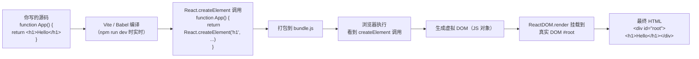
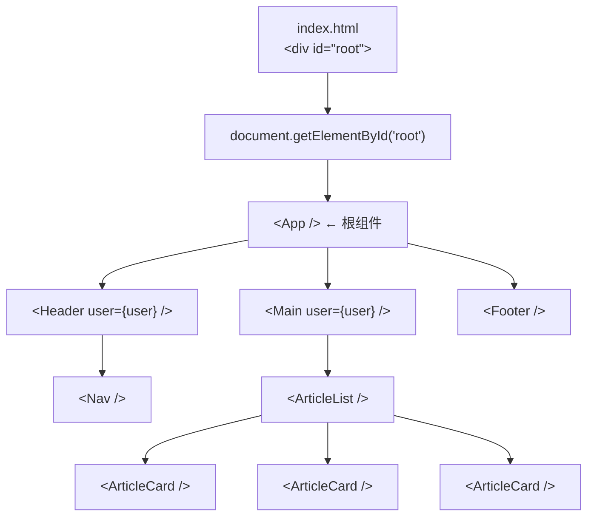

# React 入门：UI 框架的第一性原理（和 Vue 有什么关系）

> 这是 **zero-to-tech** 系列的第九篇，也是**前端基础**的第三个主题。上一篇讲了 npm + Vite + 构建产物——你已经知道怎么用包管理工具 + 构建工具跑一个项目了。这一篇回答那个最朴素的问题：**React 到底是什么？它和 Vue 有什么关系？**

我第一次看到 React 代码时，心想：「这不就是 HTML 里塞了 JavaScript？HTML 套了层皮？」

直到我开始写**真实的项目**——几百个组件、几十个页面、复杂的交互状态——才真正理解：**React / Vue 解决的是「人脑管不过来的复杂度」**。它不是 HTML 的替代品，而是**管 UI 的一种规则**。

这一篇不教你 React API（那是文档的活），而是讲 **React 的第一性原理**——你理解了「为什么是它」，具体 API 看官方文档 10 分钟就能上手。

---

## 一句话总结

> **React = 管 UI 的一种规则**。本质是两个 npm 包（`react` + `react-dom`），规则只有一条：**UI = f(state)**——你描述「状态 → 视图」的映射，框架帮你把视图渲染到浏览器。**Vue 解决的是同一个问题**，只是用了不同的语法和哲学。**浏览器只认 HTML / CSS / JS**——React 代码必须经 Vite/webpack 编译才能跑。**App 是最大的组件**——整个应用是一棵组件树。

---

## 一、为什么需要 UI 框架：原生 DOM 操作的痛苦

### 1.1 jQuery 时代：直接操作 DOM

```js
// 「点击按钮后把列表里第一项改成 Done」
$('#mark-btn').on('click', function() {
    const $firstItem = $('.todo-item').first();
    $firstItem.text('Done');
    $firstItem.addClass('completed');
});
```

**问题在哪**：

| 问题 | 表现 |
|------|------|
| **命令式** | 你告诉浏览器「怎么改」——`text()` / `addClass()` 一堆命令 |
| **状态散落** | 列表项的「是否完成」状态，存在 DOM 的 class 上——DOM 既是视图又是数据 |
| **难维护** | 改一处 UI，往往要改 5 个 jQuery 命令 |
| **没有封装** | 一段 HTML + 一段 jQuery 没法组合复用 |

**当 UI 复杂到一定规模，命令式操作 DOM 完全不可维护**。

### 1.2 UI 框架的核心规则：声明式

```jsx
// React 写法：「状态 → 视图」声明一次
function TodoList({ items }) {
    return (
        <ul>
            {items.map(item => (
                <li className={item.done ? 'completed' : ''}>
                    {item.done ? 'Done' : item.text}
                </li>
            ))}
        </ul>
    );
}
```

**核心差异**：
- 你**不告诉浏览器「怎么改」**——你只描述「**数据是什么样**」
- 数据（state）变了，框架自动重渲染
- **状态是数据，DOM 是视图**——两者分离

**这唯一的差异**，让 UI 开发从「命令 DOM」变成了「描述状态」。**所有现代 UI 框架（React / Vue / Svelte / Solid）的核心都是这一条规则**。

### 1.3 三种范式对比

| 范式 | 例子 | 思维方式 |
|------|------|---------|
| **命令式** | jQuery、原生 DOM | 告诉浏览器「怎么改」 |
| **声明式** | React、Vue、Svelte | 告诉框架「应该长什么样」 |
| **响应式** | Vue 3、Solid、SwiftUI | 数据变了，UI **自动**跟着变（更彻底） |

React 是「声明式 + 手动 re-render」，Vue 3 / Solid 是「声明式 + 真正响应式」。**两者都是「UI = f(state)」**——只是函数实现机制不同。

---

## 二、React 是什么：UI = f(state)

### 2.1 三个核心概念

| 概念 | 解释 |
|------|------|
| **组件 (Component)** | 一段返回 UI 的函数（**UI 的最小复用单元**） |
| **状态 (State)** | 组件内部会变的数据（点击、输入、API 返回值） |
| **属性 (Props)** | 父组件传给子组件的数据（**单向数据流**） |

**最小 React 组件**：

```jsx
// 一个组件 = 一个返回 JSX 的函数
function Welcome({ name }) {                       // props 进来
    return <h1>Hello, {name}!</h1>;                // 返回 UI
}

// 用
<Welcome name="Coya" />
// 浏览器渲染出：<h1>Hello, Coya!</h1>
```

### 2.2 完整的「有状态」组件

```jsx
import { useState } from 'react';

function Counter() {
    const [count, setCount] = useState(0);          // state：当前计数

    return (
        <div>
            <p>你点了 {count} 次</p>
            <button onClick={() => setCount(count + 1)}>
                点我 +1
            </button>
        </div>
    );
}
```

**执行流程**：

```
1. 初始渲染：count = 0，显示「你点了 0 次」
2. 用户点击按钮 → onClick 触发
3. setCount(1) 被调用 → React 知道状态变了
4. React 重新调用 Counter() 函数 → 得到新的 JSX
5. React 对比新旧 JSX → 只更新「数字」那部分 DOM（不重绘整页）
6. 浏览器显示「你点了 1 次」
```

**这就是 React 的全部秘密**：
- 组件是个**函数**（输入 state + props → 输出 JSX）
- 状态变了 → **函数重新执行** → 框架 diff 旧新 JSX → **精准更新 DOM**

### 2.3 关键心智模型：UI = f(state)

```
                 ┌──────────────────┐
   state         │  你的组件函数     │         UI (JSX)
   ───────────►  │  f(state, props) │  ──────►  浏览器渲染
   (数据)         └──────────────────┘          (DOM)

   state 变了 ──►  f 重新执行 ──►  新的 UI ──►  浏览器更新
```

**这就是为什么 React 比 jQuery 简单**——你只需要管理 state，UI 自动跟着变。

---

## 三、React vs Vue：本质相同，哲学不同

### 3.1 一句话关系

> **React 和 Vue 解决的是同一个问题**（UI = f(state)），只是用了**不同的语法糖**和**不同的实现哲学**。

### 3.2 同一个组件，React vs Vue 写法对比

**React（JSX）**：

```jsx
function Counter() {
    const [count, setCount] = useState(0);
    return (
        <div>
            <p>你点了 {count} 次</p>
            <button onClick={() => setCount(count + 1)}>点我</button>
        </div>
    );
}
```

**Vue 3（Single File Component）**：

```vue
<template>
    <div>
        <p>你点了 {{ count }} 次</p>
        <button @click="count++">点我</button>
    </div>
</template>

<script setup>
import { ref } from 'vue';
const count = ref(0);
</script>
```

### 3.3 关键差异

| 维度 | React | Vue |
|------|-------|-----|
| **语法** | JSX（HTML 写在 JS 里） | SFC（HTML / CSS / JS 分文件） |
| **状态更新** | 手动 `setState` | 自动响应式（数据变就触发） |
| **响应式粒度** | 组件级（state 变 → 整个组件 re-render） | 依赖级（只有用到这个 state 的部分重渲染） |
| **学习曲线** | 函数式 + JSX 思维 | 模板语法 + 选项/组合式 API |
| **生态** | 国际化，react-native 移动端 | 国内大厂主流，文档中文友好 |
| **核心哲学** | 「UI = 函数 + 不可变 state」 | 「数据变了 UI 自动更新」 |
| **灵活性** | 极高（库式，自由组合） | 高（框架式，开箱即用） |

### 3.4 选哪个

| 场景 | 推荐 |
|------|------|
| **国内 toB / 政企项目** | Vue（团队多、文档中文、生态成熟） |
| **国际化 / 创业 / 工具** | React（生态最广、react-native 一套代码多端） |
| **已有项目维护** | 看现有栈，别换 |
| **学习目的** | 都行——理解一个另一个 1 周能上手 |

**理解 React 还是 Vue 更重要？**——**理解「UI = f(state)」这个规则最重要**。两个都懂了只是语法差异。

---

## 四、React 的本质：两个 npm 包

### 4.1 拆开看

```bash
npm install react react-dom
```

- **`react`**：核心库，定义组件、state、JSX 语法、diff 算法。**纯 JS，无 DOM 概念**——理论上能跑在任何环境（甚至 Node.js SSR）
- **`react-dom`**：把 React 组件**渲染到浏览器 DOM** 的适配层

**这个分层很关键**：
- `react` 是「UI 描述引擎」
- `react-dom` 是「引擎 + 浏览器的连接器」
- 想在 iOS 上跑？用 `react-native`（换连接器）
- 想在服务器跑？用 `react-dom/server`（SSR）

### 4.2 它和 Vue 的对照

| 维度 | React | Vue |
|------|-------|-----|
| 核心包 | `react` | `vue` |
| 浏览器适配 | `react-dom` | （内置在 vue 里） |
| SSR 适配 | `react-dom/server` | `vue/server-renderer` |
| 移动端 | `react-native` | `uni-app` / `weex` |

### 4.3 装好之后有什么

```
node_modules/
├── react/
│   ├── index.js
│   └── ...
└── react-dom/
    ├── index.js
    └── ...
```

**没有任何浏览器插件、没有全局变量、没有黑魔法**——**就是两个 JS 文件**，提供 `createElement` / `useState` / `render` 之类的 API。

### 4.4 一个最小 React 项目（不用 Vite 也能跑）

```html
<!-- index.html -->
<!doctype html>
<html>
<head>
  <title>My First React</title>
</head>
<body>
  <div id="root"></div>
  <!-- 1. 引入 React 核心库（用 UMD 版本，浏览器直接用） -->
  <script crossorigin src="https://unpkg.com/react@18/umd/react.production.min.js"></script>
  <script crossorigin src="https://unpkg.com/react-dom@18/umd/react-dom.production.min.js"></script>
  <script src="https://unpkg.com/@babel/standalone/babel.min.js"></script>
  <script type="text/babel">
    // 2. 写一个组件
    function App() {
      return <h1>Hello, React!</h1>;
    }

    // 3. 渲染到 #root
    const root = ReactDOM.createRoot(document.getElementById('root'));
    root.render(<App />);
  </script>
</body>
</html>
```

**双击这个 HTML 就能在浏览器跑**——不用 npm，不用 Vite，不用 Node.js。

**这证明了 React 本质就是 JS 库**——所有「现代前端工程化」都是为了让 React 更好用（TypeScript 检查、JSX 编译、Tree Shaking），不是 React 本身需要。

---

## 五、浏览器只认 HTML / CSS / JS：React 编译后的真实产物

### 5.1 浏览器不认识 JSX

```jsx
// 你写的 React 代码
function App() {
  return <h1>Hello</h1>;
}
```

**JSX 是 JavaScript 语法扩展**——`<h1>Hello</h1>` 不是合法 JS。**浏览器直接打开含 JSX 的 .js 文件会报错**。

### 5.2 编译后长什么样

Vite / webpack / Babel 把 JSX **翻译成 `React.createElement` 调用**：

```js
// 编译后（浏览器实际跑的代码）
function App() {
  return React.createElement('h1', null, 'Hello');
}
```

**`React.createElement` 是什么**：返回一个**JS 对象**（叫「React Element」），描述「我想渲染什么」：

```js
// React.createElement('h1', null, 'Hello') 的返回值
{
  type: 'h1',
  props: {
    children: 'Hello'
  },
  key: null,
  ref: null
}
```

### 5.3 完整的「JSX → 浏览器」流程



### 5.4 关键认知

- **你写的 React 代码 ≠ 浏览器跑的代码**
- 浏览器跑的永远是 **HTML + CSS + JS**
- React 是「中间层」——把 JSX 描述翻译成 DOM 操作
- **JSX 是给人看的**，`createElement` 是给框架看的

---

## 六、组件树：App 是最大的组件

### 6.1 整个应用就是一棵组件树

```
<App>                       ← 根组件（最大）
├── <Header />
│   ├── <Logo />
│   └── <Nav />
│       ├── <NavItem to="/" />
│       └── <NavItem to="/about" />
├── <Main>
│   ├── <Sidebar />
│   └── <ArticleList>
│       ├── <ArticleCard />
│       ├── <ArticleCard />
│       └── <ArticleCard />
└── <Footer />
```

**App 是顶层组件**——所有其他组件都是它的子、孙、重孙。**整个应用就是一棵以 `<App>` 为根的树**。

### 6.2 一个真实的 App 组件

```jsx
import { Header } from './components/Header';
import { Main } from './components/Main';
import { Footer } from './components/Footer';
import { useState } from 'react';

export default function App() {
  const [user, setUser] = useState(null);

  return (
    <div className="app">
      <Header user={user} />
      <Main user={user} />
      <Footer />
    </div>
  );
}
```

### 6.3 入口的「挂载」

`App` 不会自己跑到屏幕上——需要「挂载」到 HTML 的某个 DOM 节点：

```jsx
// main.tsx（Vite 项目的入口文件）
import { StrictMode } from 'react';
import { createRoot } from 'react-dom/client';
import App from './App';

createRoot(document.getElementById('root')!).render(
  <StrictMode>
    <App />                              {/* App 是这棵树的根 */}
  </StrictMode>
);
```

**对应 HTML**：

```html
<!-- index.html -->
<body>
  <div id="root"></div>                 <!-- React 把整个 App 塞到这里 -->
  <script type="module" src="/src/main.tsx"></script>
</body>
```

**最终浏览器看到的**：

```html
<body>
  <div id="root">
    <!-- React 渲染出来的整棵树 -->
    <div class="app">
      <header>...</header>
      <main>...</main>
      <footer>...</footer>
    </div>
  </div>
</body>
```

### 6.4 Mermaid 图：组件树 + 挂载关系



### 6.5 单向数据流：父 → 子

```jsx
// 父组件
function App() {
  const [user, setUser] = useState({ name: 'Coya', age: 30 });
  return (
    <div>
      <Header user={user} />              {/* 把 user 通过 props 传给子 */}
      <Main user={user} />
    </div>
  );
}

// 子组件
function Header({ user }) {               {/* 通过 props 接收 */}
  return <header>Welcome, {user.name}!</header>;
}
```

**关键规则**：
- 数据**只能从父流向子**（props 单向）
- 子想改父的数据？**通过回调函数**（`onUpdate`）
- 这种「**单向数据流**」让大型应用数据可追踪

---

## 七、组件的本质：一个返回 JSX 的函数

### 7.1 函数式组件（现代主流）

```jsx
// 1. 最简组件
function Hello() {
  return <h1>Hello</h1>;
}

// 2. 接收 props
function Hello({ name }) {
  return <h1>Hello, {name}</h1>;
}

// 3. 有 state
import { useState } from 'react';
function Counter() {
  const [count, setCount] = useState(0);
  return (
    <button onClick={() => setCount(count + 1)}>
      点击 {count} 次
    </button>
  );
}

// 4. 有副作用
import { useEffect } from 'react';
function UserProfile({ userId }) {
  const [user, setUser] = useState(null);
  useEffect(() => {
    fetch(`/api/users/${userId}`).then(r => r.json()).then(setUser);
  }, [userId]);
  return <div>{user?.name}</div>;
}
```

**组件的 4 个要素**：

| 要素 | 作用 | Hook |
|------|------|------|
| **返回 JSX** | 描述 UI | （直接 return） |
| **接收 props** | 父传子的数据 | （函数参数） |
| **管理 state** | 组件内部会变的数据 | `useState` |
| **副作用** | 数据请求、订阅、DOM 操作 | `useEffect` |

### 7.2 JSX 是什么

**JSX** = JavaScript 语法扩展 = 在 JS 里写 HTML 一样的东西。

```jsx
const element = <h1 className="title">Hello</h1>;
// 编译后：
const element = React.createElement('h1', { className: 'title' }, 'Hello');
```

**JSX 的几个规则**：

| 规则 | 例子 |
|------|------|
| **必须有一个根元素** | 用 `<div>` 或 `<>...</>`（Fragment）包起来 |
| **class 写 className** | `<div className="x">` 而不是 `class` |
| **属性名驼峰** | `onClick`、`tabIndex`、`htmlFor` |
| **JS 表达式用 `{}`** | `<p>{count + 1}</p>` |
| **条件渲染** | `{isShow && <Modal />}` 或三元 |
| **列表用 map** | `items.map(i => <Item key={i.id} />)` |
| **key prop** | 列表项必须有 `key`，帮 React 识别 |

### 7.3 组件 vs 函数

**一个 React 组件 = 一个返回 JSX 的函数**。没有 class、没有继承、没有 controller——**就是函数**。

```jsx
// 这是组件
function Greeting({ name }) {
  return <h1>Hello, {name}</h1>;
}

// 这也是组件（用箭头函数）
const Greeting = ({ name }) => <h1>Hello, {name}</h1>;
```

**理解这一点**：
- 组件**没有 this**（不像 jQuery 时代）
- 组件**可以嵌套组合**
- 组件**可以传函数**（render props / HOC）
- 组件**应该是纯函数**（同样的输入 → 同样的输出）——这是 React 的设计哲学

---

## 八、给新手的 3 个心智模型

1. **React / Vue 解决的是同一个问题：UI = f(state)**：你不需要在「学 React 还是学 Vue」之间纠结。**理解「数据驱动 UI」这个规则比学哪个 API 重要 10 倍**。两个都学了你会发现——语法不同，思维框架完全一样。

2. **React 本身就是两个 npm 包**：`react`（核心）+ `react-dom`（浏览器适配）。**没有 Vite 也能跑**（一个 HTML + 几个 UMD 引用 + Babel Standalone）。**「现代前端工程化」（Vite / TypeScript / JSX 编译）都是为了让 React 更好用**——React 本身没那么重。

3. **App 是最大组件，整个应用就是一棵树**：所有页面、所有 UI 都从 `<App>` 开始向下分。**数据从根往叶子流（props），事件从叶子往根传（回调）**——理解这个「单向数据流」，你就理解了为什么 React 项目能扩展到几千个组件而不失控。

---

## 九、一句话总结

> **React 是一种管 UI 的规则，本质是两个 npm 包（`react` + `react-dom`）**。核心规则只有一条：**UI = f(state)**——你描述「状态 → 视图」的映射，框架帮你把 JSX 编译、`createElement` 调用、虚拟 DOM diff、真实 DOM 更新全做了。**浏览器只认 HTML / CSS / JS**——所有 JSX 都会被编译成 `React.createElement` 调用再跑。**App 是最大组件**——整个应用是一棵以 `<App>` 为根的树，数据单向从父流到子。**React / Vue 解决的是同一个问题，只是语法和哲学不同**——理解「数据驱动 UI」这一条，比学任何具体 API 都重要。

---

## 这个系列下一篇会写什么

- **zero-to-tech / React Hooks 深入：useState / useEffect / useMemo 到底在干什么**
- **zero-to-tech / TypeScript 是什么：为什么新项目 100% 应该用 TypeScript**
- **zero-to-tech / 进程、线程、内存：你的电脑同时在跑多少事**

上一篇：[现代前端的工具链：npm + Vite + 构建产物](/blog/npm-and-vite)
第一篇：[网络是怎么工作的](/blog/how-network-work)