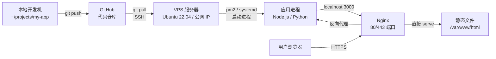
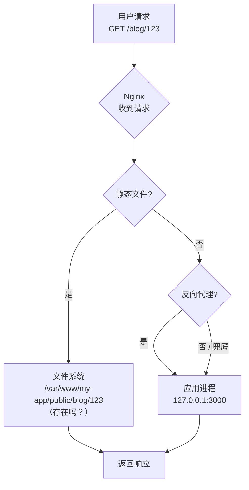
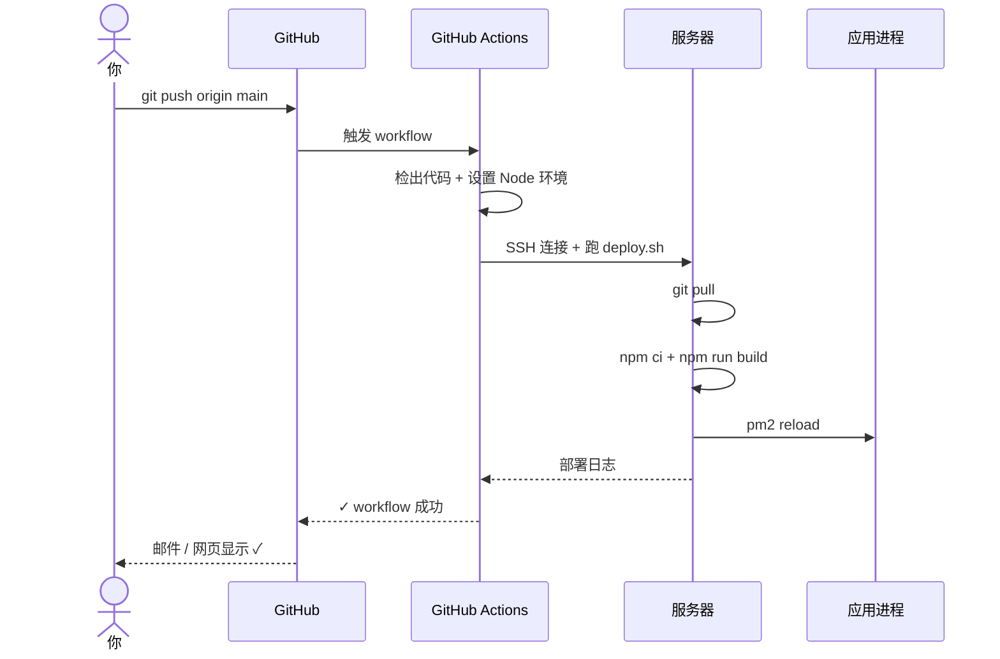

# 服务器部署和 Nginx 配置：从本地代码到线上服务

> 这是 **zero-to-tech** 系列的第六篇。前五篇我们讲了「网络」「电脑 / 文件 / VSCode」「终端 / Linux」「Git」「GitHub」。这一篇回答一个朴素但关键的问题：**代码写完了，怎么让全世界的浏览器都能访问它？**

我最早部署一个网站时，用的是「WinSCP 上传文件 + 手动重启服务」的土办法。文件多了经常漏传、改了权限访问不了、配了 HTTPS 证书过期……

后来学会了 Nginx + Git + CI/CD，才发现**部署这件事也有专业做法**——而且门槛没你想的那么高。

这一篇的目标：让你**自己能完成一个最小可用的部署链路**：本地代码 → 服务器 → 互联网可访问的 HTTPS 服务。

---

## 一句话总结

> **部署 = 把代码从本地搬到服务器，让它能对外服务**。最短链路：SSH 连上服务器 → `git clone` 拉代码 → 用 **chmod/chown** 配对权限 → 用 **Nginx** 当反向代理 + 静态文件服务器 → 用 **Let's Encrypt + certbot** 一键签 HTTPS 证书 → 用 **GitHub Actions** 实现 push 触发自动部署。

---

## 一、整体心智模型：服务器就是一台永远开机的 Linux

### 1.1 服务器是什么

**服务器 = 一台 7×24 小时开机的电脑**，装了 Linux，有公网 IP，能被全世界访问。

| 类型 | 特点 |
|------|------|
| **物理服务器** | 你公司机房里的真机，几台就够中大型企业 |
| **VPS（虚拟专用服务器）** | 云厂商（阿里云 / 腾讯云 / AWS / DigitalOcean）卖的虚拟机，¥30~500/月 |
| **Serverless** | AWS Lambda / Vercel / Cloudflare Workers——你只写代码，平台管服务器 |

**这篇聚焦 VPS**（最经典、最多公司用、学到的东西最通用）。

### 1.2 部署链路的 6 个组件



**每一段都是这一篇要讲的一节**。

### 1.3 第一次连上服务器

你需要知道的 3 件事：

| 概念 | 解释 |
|------|------|
| **公网 IP** | 服务器在互联网上的地址（如 `1.2.3.4`），用户通过这个 IP 访问 |
| **SSH** | 加密的远程登录协议（上一篇 Git 配 SSH Key 的同款技术） |
| **root 用户** | Linux 最高权限用户，能改任何文件、能装任何软件 |

**SSH 连上服务器**：

```bash
# 用密码（首次连上时）
ssh root@1.2.3.4

# 用 SSH Key（推荐，配过一次永久免密）
ssh root@1.2.3.4
```

连上后看到 `root@server:~#` 提示符——恭喜，你已经在远程 Linux 上了。

---

## 二、拉取代码到服务器

### 2.1 三种方式

| 方式 | 适用场景 | 操作 |
|------|---------|------|
| **手动 SSH + git clone** | 学习 / 一次性部署 | SSH 上去，跑 git 命令 |
| **CI/CD 自动部署** | 生产环境 | GitHub Actions / GitLab CI 触发 |
| **Docker 镜像** | 容器化部署 | 拉预构建镜像（下一篇会讲） |

这一节讲**手动方式**——理解了手动，CI/CD 那段就是「把手动的事情自动化」。

### 2.2 标准部署目录约定

```bash
# 推荐结构
/var/www/my-app/
├── releases/                # 每次部署一个独立目录（版本管理）
│   ├── 2026-07-09-10-30-00/ # 第 N 次部署
│   │   ├── .git/
│   │   ├── node_modules/
│   │   └── ...
│   └── 2026-07-08-15-20-00/
├── shared/                  # 所有版本共享的文件
│   ├── .env                 # 环境变量
│   └── uploads/             # 用户上传的文件
└── current → releases/2026-07-09-10-30-00/   # 软链接，指向当前活跃版本
```

**为什么要这样**：
- 每次部署一个独立目录 → 出问题瞬间回滚到上一版（`ln -sfn` 切软链接）
- `shared/` 存共享文件 → `.env`、上传文件不随部署丢失
- `current` 是软链接 → Nginx 和应用进程都指向它，回滚 = 改个链接的事

**最小可用版（学习时）**：

```bash
# 简单版本——一个目录搞定
sudo mkdir -p /var/www/my-app
sudo chown -R $USER:$USER /var/www/my-app
cd /var/www/my-app

git clone git@github.com:coyafky/my-app.git .
npm install
npm run build
```

### 2.3 关键步骤详解

**1. 服务器上也要配 SSH Key**（让服务器能 pull 你的 GitHub 仓库）

```bash
# 在服务器上生成 key（邮箱换成你自己的）
ssh-keygen -t ed25519 -C "server-deploy-key"

# 把公钥贴到 GitHub：Settings → Deploy keys → Add deploy key
cat ~/.ssh/id_ed25519.pub
# 勾 "Allow write access" 如果你要 push（一般只勾 read 即可）
```

**2. 用 deploy key 而不是个人 SSH key**：
- **deploy key** 是 GitHub 的「只读钥匙」概念，专门给服务器用
- 用 deploy key + 勾 `read only` → 服务器只能 pull，不能 push，最小权限原则

**3. 部署脚本（手动版）**：

```bash
#!/bin/bash
# deploy.sh — 最简单的部署脚本

set -e

APP_DIR=/var/www/my-app
cd $APP_DIR

echo "→ 拉取最新代码"
git pull origin main

echo "→ 安装依赖"
npm ci    # ci 比 install 更严格（按 lockfile 安装）

echo "→ 构建"
npm run build

echo "→ 重启应用"
pm2 reload my-app || pm2 start ecosystem.config.js

echo "✓ 部署完成"
```

---

## 三、文件目录权限配置

**90% 的「网站访问不了」问题，根因是权限不对**。这一节必须搞懂。

### 3.1 Linux 权限的三层模型

每个文件 / 目录都有 3 组权限：

```
-rwxr-xr--  1  user  group  1234  file.txt
└┬┘└┬┘└┬┘
 │  │  └── others（其他用户）
 │  └───── group（所属组）
 └──────── owner（所有者）
```

每组权限可以是 `r`（读）/ `w`（写）/ `x`（执行）的任意组合。

### 3.2 三种表达方式

| 表达 | 例 | 含义 |
|------|-----|------|
| **符号** | `rwxr-xr--` | rwx / r-x / r-- |
| **数字（八进制）** | `754` | 7(rwx) / 5(r-x) / 4(r--) |
| **文字** | `u+x` | 给 owner 加执行权限 |

**数字速算**：
- `r` = 4
- `w` = 2
- `x` = 1
- 三者相加：7(rwx) / 6(rw-) / 5(r-x) / 4(r--) / 3(-wx) / 2(-w-) / 1(--x) / 0(---)

### 3.3 部署场景的 5 个标配数字

| 数字 | 含义 | 适用 |
|------|------|------|
| **755** | 所有者全部权限，其他人可读 + 进入 | **目录的标准权限**（如 `/var/www/my-app`） |
| **644** | 所有者可读写，其他人只读 | **文件的标准权限**（如 `index.html`） |
| **600** | 只有所有者可读写 | **密钥 / `.env`**（绝对不能让别人看） |
| **700** | 只有所有者全部权限 | **私密目录**（如 `~/.ssh`） |
| **775** | 所有者 + 组成员全部权限 | **协作目录**（组内共享） |

### 3.4 实战命令

```bash
# 设置目录权限
chmod 755 /var/www/my-app             # 目录
chmod 644 /var/www/my-app/index.html  # 文件

# 设置所有者
chown -R www-data:www-data /var/www/my-app

# 设置 .env 私密
chmod 600 /var/www/my-app/.env
chown www-data:www-data /var/www/my-app/.env
```

### 3.5 关键概念：whoami 和 www-data

```bash
# 看当前用户
whoami
# 输出：root  或  deploy  或  ubuntu

# www-data 是什么
# www-data 是 Nginx / Apache 默认的「服务用户」
# 你的应用进程和 Nginx 都用这个用户访问文件 → 文件所有者必须 www-data
```

**经典踩坑**：

```
场景：上传文件到服务器，浏览器 403 Forbidden
原因：文件所有者是 root，但 Nginx 用 www-data 读 → 权限不够
解决：chown -R www-data:www-data /var/www/my-app/
```

### 3.6 umask：新建文件 / 目录的默认权限

```bash
# 看当前 umask
umask
# 输出：0022

# umask = 「默认要减去的权限」
# 目录默认 777 - 022 = 755
# 文件默认 666 - 022 = 644
```

**生产建议**：保持默认 `0022`，部署脚本里用 `chmod` 显式设置，不要靠 umask 兜底。

---

## 四、Nginx 是什么 + 安装

### 4.1 Nginx 是什么

**Nginx** = 高性能 Web 服务器 / 反向代理服务器。1995 年俄罗斯人 Igor Sysoev 写的，现在全球 top 100 万网站里超过 30% 用它。

**它干 3 件事**：

| 能力 | 解释 |
|------|------|
| **Web 服务器** | 直接把 `index.html` / 图片 / 视频发给浏览器 |
| **反向代理** | 把请求转发给背后的应用（Node / Python / Go） |
| **负载均衡** | 把请求分给多个应用实例 |

### 4.2 安装 Nginx

```bash
# Ubuntu / Debian
sudo apt update
sudo apt install nginx -y

# CentOS / RHEL
sudo yum install nginx -y

# 启动 + 开机自启
sudo systemctl start nginx
sudo systemctl enable nginx

# 检查状态
sudo systemctl status nginx

# 看版本
nginx -v
# nginx version: nginx/1.24.0
```

装完后访问 `http://<你的服务器IP>`，应该看到 Nginx 默认欢迎页。

### 4.3 Nginx 的目录结构

```
/etc/nginx/
├── nginx.conf                # 主配置（一般不直接改）
├── conf.d/
│   └── my-app.conf           # 你的应用配置（推荐每个应用一个文件）
├── sites-enabled/
│   └── my-app → /etc/nginx/sites-available/my-app   # 软链接（启用）
└── sites-available/
    └── my-app.conf           # 配置源文件（不启用就不生效）
```

**两种组织风格**：
- **Debian/Ubuntu 风格**：`sites-available/` + `sites-enabled/`（推荐）
- **CentOS/通用风格**：`conf.d/*.conf`（更简洁）

---

## 五、Nginx 配置详解（核心）

### 5.1 一个最小可用配置

```nginx
# /etc/nginx/sites-available/my-app.conf

server {
    listen 80;                                  # 监听 80 端口（HTTP）
    server_name example.com www.example.com;    # 你的域名

    # 静态资源：直接由 Nginx serve
    location /static/ {
        alias /var/www/my-app/public/static/;   # 文件实际路径
        expires 30d;                            # 缓存 30 天
    }

    # 其他请求：反向代理到应用
    location / {
        proxy_pass http://127.0.0.1:3000;       # 应用监听在 3000
        proxy_set_header Host $host;
        proxy_set_header X-Real-IP $remote_addr;
        proxy_set_header X-Forwarded-For $proxy_add_x_forwarded_for;
        proxy_set_header X-Forwarded-Proto $scheme;
    }
}
```

启用：

```bash
# 建软链接启用
sudo ln -s /etc/nginx/sites-available/my-app.conf /etc/nginx/sites-enabled/

# 测试配置语法
sudo nginx -t

# 重载 Nginx
sudo systemctl reload nginx
```

### 5.2 关键指令速查

| 指令 | 作用 |
|------|------|
| `listen 80;` | 监听 80 端口 |
| `server_name example.com;` | 绑定的域名 |
| `root /var/www/html;` | 静态文件根目录 |
| `location /path { ... }` | 路径匹配规则 |
| `proxy_pass http://127.0.0.1:3000;` | 反向代理到应用 |
| `try_files $uri $uri/ /index.html;` | SPA 路由兜底（关键！） |
| `expires 30d;` | 浏览器缓存时间 |
| `access_log /var/log/nginx/access.log;` | 访问日志 |
| `error_log /var/log/nginx/error.log;` | 错误日志 |

### 5.3 反向代理为什么重要

**没有 Nginx 时**：

```
浏览器 → http://1.2.3.4:3000
         （必须输端口，IP 直接暴露应用）
```

**有 Nginx 后**：

```
浏览器 → http://example.com
         （80 端口 → Nginx → 反代到 127.0.0.1:3000）
```

**Nginx 给你的 4 个关键能力**：
1. **端口隐藏**：用户只看到 80/443，看不到应用端口
2. **HTTPS 终结**：Nginx 处理 TLS，应用只关心业务
3. **静态资源优化**：Nginx 直接 serve（比 Node 快 10 倍）
4. **负载均衡**：可以 proxy_pass 到多个应用实例

### 5.4 SPA 路由兜底（必看）

如果你的应用是 SPA（Next.js / Vue / React），用户访问 `/blog/123` 这种路径——但服务器上没有这个文件。

**没配 `try_files` 时**：`/blog/123` 返回 404。
**配了 `try_files` 时**：Nginx 把所有「找不到文件」的请求都丢回 `/index.html`，让前端路由处理。

```nginx
location / {
    try_files $uri $uri/ /index.html;    # ← 这一行是关键
    # 解释：
    #   $uri  → 试这个路径对应的文件
    #   $uri/ → 试这个路径作为目录
    #   /index.html → 都找不到的话 → 用 index.html 兜底
}
```

### 5.5 Mermaid 图：Nginx 请求处理流程



### 5.6 常见 502 / 504 错误排查

| 错误 | 原因 | 解决 |
|------|------|------|
| **502 Bad Gateway** | Nginx 找到了配置，但 `proxy_pass` 的应用没启动 / 端口错了 | `systemctl status my-app`、检查应用端口 |
| **504 Gateway Timeout** | 应用启动了但响应超时 | 应用卡死 / 数据库慢 / 调 `proxy_read_timeout` |
| **403 Forbidden** | 文件权限不对 | `chown -R www-data:www-data /var/www/my-app/` |
| **404 Not Found** | `location` 路径不对 | 检查 `root` / `alias` / `try_files` |

---

## 六、HTTPS 配置（Let's Encrypt 一键搞定）

### 6.1 为什么必须有 HTTPS

| 没 HTTPS | 有 HTTPS |
|---------|---------|
| 浏览器标记「不安全」 | 地址栏小锁 ✓ |
| 数据明文传输（密码、cookie 可被窃听） | TLS 加密 |
| Google 搜索排名降权 | 搜索排名加权 |
| HTTP/2 / HTTP/3 跑不起来（绝大多数浏览器要求） | 享受现代协议 |
| 浏览器 API 限制（地理位置、Service Worker 等） | 全部 API 可用 |

### 6.2 Let's Encrypt + certbot：免费的自动化证书

**Let's Encrypt** 是一个免费、自动化的证书颁发机构。**certbot** 是它的官方客户端。

```bash
# 安装
sudo apt install certbot python3-certbot-nginx -y

# 一键签证书 + 自动改 Nginx 配置 + 自动续期
sudo certbot --nginx -d example.com -d www.example.com
```

执行过程会问：
1. 邮箱（证书过期通知）
2. 同意条款
3. **是否把所有 HTTP 请求重定向到 HTTPS**（强烈建议选是）

完成后 certbot 自动：
1. 验证域名所有权（通过 HTTP 80 端口）
2. 从 Let's Encrypt 签证书
3. 改 Nginx 配置加 `listen 443 ssl;` 和证书路径
4. 加 HTTP→HTTPS 重定向
5. 设置 systemd timer 自动续期（90 天一续）

### 6.3 配完后 Nginx 配置长这样

```nginx
# certbot 自动加的 server 块
server {
    listen 443 ssl;                                          # HTTPS 端口
    server_name example.com www.example.com;

    ssl_certificate     /etc/letsencrypt/live/example.com/fullchain.pem;
    ssl_certificate_key /etc/letsencrypt/live/example.com/privkey.pem;

    # SSL 优化（certbot 默认会加）
    include /etc/letsencrypt/options-ssl-nginx.conf;
    ssl_dhparam /etc/letsencrypt/ssl-dhparams.pem;

    # ... 你的 location 配置 ...
}

# certbot 自动加的 HTTP→HTTPS 重定向
server {
    listen 80;
    server_name example.com www.example.com;
    return 301 https://$host$request_uri;
}
```

### 6.4 自动续期验证

```bash
# 模拟续期（不会真续，只跑流程）
sudo certbot renew --dry-run

# 看续期 timer
systemctl list-timers | grep certbot

# 通常输出：
# Tue 2026-08-07 03:42:00 UTC  27 days Tue 2026-07-07 03:42:09 UTC  certbot.timer
```

证书过期前 30 天自动续期，**全自动化**——你完全不用管。

---

## 七、持续部署（CD）：push 即自动部署

**手动部署的最大问题**：每次发版都要 SSH 上去跑命令，**容易出错、不可追溯**。

**持续部署 (CD)** = 改完代码 `git push`，**自动触发**构建 + 部署，**你什么都不用做**。

### 7.1 工具选型

| 工具 | 适合 |
|------|------|
| **GitHub Actions** | 代码在 GitHub 的话首选 |
| **GitLab CI** | 代码在 GitLab |
| **Jenkins** | 自建 / 私有化部署 |
| **Drone** | 容器化的轻量 CI/CD |
| **Shell 脚本 + webhook** | 小项目 / 自建 |

### 7.2 GitHub Actions：最简自动部署

**思路**：GitHub 上 `push → 触发 workflow → SSH 到服务器 → 跑部署脚本`。

#### Step 1：在服务器上配 deploy key

让 GitHub Actions 能 SSH 到你的服务器：

```bash
# 在 GitHub repo: Settings → Secrets and variables → Actions
# 加一个 Secret: SSH_PRIVATE_KEY（值是 ~/.ssh/id_ed25519 私钥内容）
```

#### Step 2：写 `.github/workflows/deploy.yml`

```yaml
name: Deploy to Production

on:
  push:
    branches: [main]            # main 分支 push 触发

jobs:
  deploy:
    runs-on: ubuntu-latest

    steps:
      # 1. 检出代码
      - name: Checkout
        uses: actions/checkout@v4

      # 2. SSH 到服务器跑部署脚本
      - name: Deploy via SSH
        uses: appleboy/ssh-action@v1
        with:
          host: ${{ secrets.SERVER_HOST }}      # 服务器 IP
          username: ${{ secrets.SERVER_USER }}  # 部署用户名
          key: ${{ secrets.SSH_PRIVATE_KEY }}
          script: |
            cd /var/www/my-app
            ./deploy.sh
```

#### Step 3：服务器上 `deploy.sh`（前面写过）

```bash
#!/bin/bash
set -e

cd /var/www/my-app

echo "→ 拉取最新代码"
git pull origin main

echo "→ 安装依赖"
npm ci

echo "→ 构建"
npm run build

echo "→ 重启应用"
pm2 reload my-app

echo "✓ 部署完成 $(date)"
```

#### Step 4：配置 Secrets

GitHub repo → Settings → Secrets and variables → Actions → New repository secret：

| Secret 名 | 值 |
|-----------|-----|
| `SERVER_HOST` | 服务器公网 IP |
| `SERVER_USER` | 部署用户（如 `deploy`） |
| `SSH_PRIVATE_KEY` | 服务器 deploy 用户的私钥内容 |

### 7.3 Mermaid 图：GitHub Actions 部署流程



### 7.4 零停机部署（进阶）

**简单 `pm2 reload` 会有几秒中断**。生产级零停机：

| 策略 | 适用 |
|------|------|
| **蓝绿部署** | 切 Nginx upstream，秒级切换 |
| **滚动部署** | K8s / 多实例场景 |
| **灰度发布** | 1% → 10% → 100% 渐进 |

**最简版蓝绿**（双端口 + 切 Nginx）：

```nginx
upstream my_app {
    server 127.0.0.1:3000;   # 当前活跃
    # server 127.0.0.1:3001; # 下一版（部署完切到这个）
}
```

部署时：启 3001 → 改 upstream → `nginx -s reload` → 关 3000。

---

## 八、给新手的 3 个心智模型

1. **服务器 = 一台永远开机的 Linux，你 SSH 上去就是「远程操作你自己的电脑」**：没有神秘感，只是没有显示器、没人会按 Ctrl+C。所有熟悉的命令（`ls` / `cd` / `vim` / `chmod`）都能用——理解这一点，部署就不再「神秘」。

2. **Nginx = 流量收发室 + 翻译官**：所有外部请求先到 Nginx，Nginx 决定「静态文件直接给浏览器」、「动态请求转给应用」、「HTTP 重定向到 HTTPS」。**应用只关心业务，Nginx 关心所有「互联网协议层」的杂事**——这是为什么现代架构几乎都「Nginx 在前 + 应用在后」。

3. **持续部署 = 把手动的事变自动**：手动部署 = SSH 上去跑 `git pull + build + restart`，**步骤完全可预测**——这就是 CD 能干的事。**先学会手动，再写脚本自动化，再让 GitHub Actions 自动触发**——这是部署的进化路径。

---

## 九、小结

这一篇覆盖了一条**最小可用的部署链路**：

| 步骤 | 核心命令 / 概念 |
|------|----------------|
| **1. 拉取代码** | `git clone` + 配 deploy key + `/var/www/my-app/` 目录约定 |
| **2. 文件权限** | 目录 755、文件 644、`.env` 600、`chown -R www-data:www-data` |
| **3. Nginx 安装** | `apt install nginx` + `sites-available` / `sites-enabled` 配置目录 |
| **4. Nginx 配置** | `listen` + `server_name` + `location` + `proxy_pass` + `try_files` |
| **5. HTTPS** | `certbot --nginx -d example.com`（一键签证书 + 自动续期） |
| **6. 持续部署** | GitHub Actions + SSH + `deploy.sh`（push 即自动部署） |

**最小可用的部署链路**：

```
你 git push
    ↓
GitHub Actions 自动 SSH 到服务器
    ↓
服务器跑 deploy.sh（git pull + build + restart）
    ↓
Nginx 反代到新版本
    ↓
用户访问 https://example.com → 看到新版本
```

**部署这件事没有魔法**——每一步都是「SSH 上去 + 跑命令」。理解了手动，自动化就是把命令写进脚本。

---

## 这个系列下一篇会写什么

- **zero-to-tech / Docker 是什么：为什么「在我电脑上能跑」会变成「在我容器里能跑」**
- **zero-to-tech / 进程、线程、内存：你的电脑同时在跑多少事**
- **zero-to-tech / VSCode 进阶：调试器、断点、launch.json**

上一篇：[GitHub 和远程同步：从本地仓库到开源世界](/blog/github-remote-and-mcp)
第一篇：[网络是怎么工作的](/blog/how-network-work)