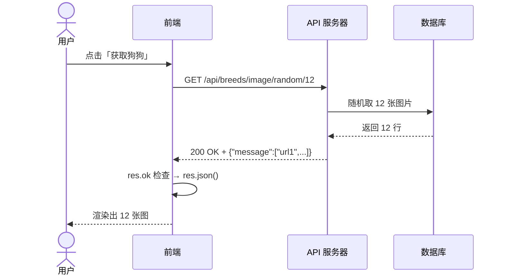

## 卡在第一步，fetch 返回给我的不是一个对象

那阵子我在给个人站加一个 GitHub 用户卡片。代码只有两行：

```js
const data = await fetch('https://api.github.com/users/coyafky')
console.log(data.name)
```

控制台打出 `undefined`。同一串 URL 粘进浏览器地址栏，页面上一大坨 JSON，`name` 字段清清楚楚摆在那里。

我以为是 GitHub 返回的数据有问题，翻了两个小时它的文档。原因在我自己这边：`fetch` 返回的是一个 `Response` 包装，真实数据躺在它的 body 里，要再异步读一次。

```js
const res = await fetch('https://api.github.com/users/coyafky')
const data = await res.json()
console.log(data.name)
```

为什么要分两步，我后来才想通。HTTP 响应带三样东西，状态码、响应头、响应体。假如 `fetch` 一步直接把 body 塞给你，状态码和响应头就被扔掉了。而状态码是你判断这次调用成败的标准信号，扔不得。

换成两步之后，`res` 身上有 `status` 和 `headers`，`res.json()` 才给你 body。

## 404 不会进 catch

踩完上一个坑没多久，我又撞了一个。这次是请求一个不存在的用户：

```js
try {
    const res = await fetch('https://api.github.com/users/不存在的用户')
    const data = await res.json()
    console.log(data)
} catch (err) {
    console.log('出错了')
}
```

我满以为会走进 `catch`。结果控制台安安静静打印出 `{"message":"Not Found"}`。

查了一圈才知道，`fetch` 只在网络层面的问题上报 reject，比如断网、DNS 解析失败、请求被中断。服务器老老实实回了 404，在 `fetch` 看来这就是一次成功的请求，响应确实拿到了。

判断成败得自己写代码：

```js
const res = await fetch(url)
if (!res.ok) throw new Error(`HTTP ${res.status}`)
const data = await res.json()
```

`res.ok` 等价于 `res.status >= 200 && res.status < 300`。我从那以后每次 `fetch` 后面都跟这一行。

## 我换 curl 上场，先分清到底是谁错了

比这更耗时间的是另一类问题：我写了三十行 `fetch` 代码，跑起来报错，然后我不知道该改自己的代码还是该去问后端。

后来我养成一个习惯，先用 curl 打一枪。

```bash
curl -s https://api.github.com/users/coyafky
```

curl 能通，说明 API 本身没问题，锅在我的代码。curl 都不通，那问题在服务那边，我去找人或者查状态页。这一步省掉了我大量盲目调试的时间。

我把这个顺序固定下来，一直用到现在：先 curl 探路，看清楚返回结构，再动手写 `fetch`。

curl 值得单独说几句。我在终端里用它，也在看 Claude Code 和 Codex 干活时看它们用。绿色提示里出现的 `● curl -s https://...` 几乎每几步就有一次。原因很直接，curl 是纯文本进、纯文本出，没有 GUI，也不跑 JavaScript。发出去的每个字节和收回来的每个字节都摆在你眼前。Postman 的面板和浏览器渲染好的页面，机器读不进去。

## 我常用的那几个标志

curl 的标志有上百个。下面这些覆盖了我 90% 的场景，按我用到的频率排。

| 标志 | 作用 | 例子 |
|---|---|---|
| `-s` | 静默，不要进度条 | `curl -s <url>` |
| `-i` | 响应里带上 HTTP 头 | `curl -i <url>` |
| `-I` | 只发 HEAD，只看响应头 | `curl -I <url>` |
| `-X` | 指定方法 | `-X POST` |
| `-H` | 加请求头，可以写多次 | `-H "Content-Type: application/json"` |
| `-d` | 请求体，会自动转成 POST | `-d '{"name":"Coya"}'` |
| `-v` | 看完整报文，调试神器 | `curl -v <url>` |
| `-o` | 把响应存成文件 | `-o dog.jpg` |
| `-L` | 跟随重定向 | `curl -sL <url>` |
| `-k` | 跳过证书验证 | `-k` |
| `-w` | 自定义输出状态码和耗时 | `-w "%{http_code}"` |
| `-x` | 走代理 | `-x http://127.0.0.1:8080` |
| `--data-binary` | 发原始 body，不处理换行 | `--data-binary @file.bin` |

`--data-raw` 也值得一提，它和 `-d` 一样发数据，但不会对 `@` 做文件展开，body 里真的要写 `@` 时用得上。

### 带 token 的请求

```bash
curl -s https://api.github.com/user \
  -H "Authorization: Bearer ghp_xxxxxxxxxxxx" \
  -H "Accept: application/vnd.github+json"
```

我拿到一个新的 API key，习惯先这样打一枪确认 key 有效，再去写代码。OpenAI 这一类用 `Authorization: Bearer sk-xxx` 的接口同理。

### POST 一个 JSON

```bash
curl -s -X POST https://httpbin.org/post \
  -H "Content-Type: application/json" \
  -d '{"name":"Coya","role":"engineer"}'
```

三个要素我都漏过。`-X POST` 告诉服务器这是创建操作，`-d` 是实际数据，中间的 `Content-Type: application/json` 最容易被忘。漏了它，很多框架会按 `application/x-www-form-urlencoded` 去解析，后端拿到的东西完全不对。

## 用 -v 看完整报文

CORS 那次我是靠 `-v` 才看懂的。先看输出：

```
*   Trying 140.82.121.5:443...          ← TCP 连接
*   SSL connection using TLSv1.3         ← TLS 握手
>   GET /users/coyafky HTTP/1.1          ← 发出的请求行
>   Host: api.github.com                 ← 发出的请求头
>   User-Agent: curl/8.4.0
>   Accept: */*
>
<   HTTP/1.1 200 OK                      ← 收到的响应行
<   Content-Type: application/json       ← 收到的响应头
<
  {"login":"coyafky",...}                ← 响应 body
```

`>` 开头的是你发出去的，`<` 开头的是服务器回来的，`*` 开头的是连接过程。一个字节都不差地摆在那里。

调试带鉴权的接口时，我最常看三处：请求行对不对、`Authorization` 头有没有真的发出去、响应里的 `X-RateLimit-Remaining` 还剩多少次。

## -w 是我最晚学会、现在最常用的标志

`-w` 能把状态码和耗时单独抠出来。配合 `-o /dev/null` 丢掉 body，输出就只剩你要的那一行：

```bash
# 只输出状态码
curl -s -o /dev/null -w "%{http_code}" https://api.github.com/users/coyafky
# 200

# 总耗时
curl -s -o /dev/null -w "time_total: %{time_total}s\n" https://api.github.com
# time_total: 0.387s

# 分段耗时：DNS、TCP、TLS 各花了多少
curl -s -o /dev/null -w "\
dns: %{time_namelookup}s
tcp: %{time_connect}s
tls: %{time_appconnect}s
total: %{time_total}s
" https://api.github.com/users/coyafky
```

最后那条我用得最多。接口变慢时，它能直接告诉我慢在 DNS、在建连、还是在服务端处理。

判断服务是否存活的脚本也就这么几行：

```bash
HTTP_CODE=$(curl -s -o /dev/null -w "%{http_code}" https://example.com)
if [ "$HTTP_CODE" = "200" ]; then
    echo "服务正常"
else
    echo "服务异常: $HTTP_CODE"
fi
```

重定向那次我也栽过。`curl -I http://github.com` 返回 301，加 `-L` 才跟到最终地址：

```bash
curl -s -L http://github.com -o /dev/null -w "%{url_effective}\n"
# https://github.com/
```

## 管道接上，curl 就成了瑞士军刀

API 返回的 JSON 挤成一行没法读，管道交给 `jq` 或者 python：

```bash
curl -s https://api.github.com/users/coyafky | python3 -m json.tool
curl -s https://api.github.com/users/coyafky | jq .

# 只取一个字段
curl -s https://api.github.com/users/coyafky | python3 -c "import sys,json; print(json.load(sys.stdin)['name'])"
```

我在写一个新接口的前端之前，一般连打四枪：

```bash
# 1 看结构
curl -s https://dog.ceo/api/breeds/image/random/1 | python3 -m json.tool

# 2 看响应头，确认 Content-Type 和 CORS
curl -s -I https://dog.ceo/api/breeds/image/random/1

# 3 打异常路径，看 404 长什么样
curl -s https://dog.ceo/api/breed/不存在的狗/images/random/1 | python3 -m json.tool

# 4 量延迟
curl -s -o /dev/null -w "总耗时: %{time_total}s" https://dog.ceo/api/breeds/image/random/50
```

四枪打完，返回结构、错误格式、延迟量级都在手里，再去写代码，错误处理那一块基本不用返工。

## 报错码我看过一遍就记住了

| 报错 | 原因 | 怎么办 |
|---|---|---|
| `curl: (6) Could not resolve host` | DNS 解析失败 | URL 写错了，或者没联网 |
| `curl: (7) Failed to connect` | TCP 连不上 | 端口没开、服务没起、防火墙拦了 |
| `curl: (28) Operation timed out` | 超时 | 加 `--connect-timeout 5` 设短一点 |
| `curl: (35) SSL connection error` | TLS 握手失败 | 加 `-k`，只在开发环境 |
| `curl: (52) Empty reply from server` | 服务端进程崩了 | 去看服务端日志 |
| `curl: (60) SSL certificate problem` | 自签或过期证书 | `-k` 跳过，或者换证书 |

`-k` 我只在本地调试用。线上的证书问题靠 `-k` 绕过去，等于把风险藏起来。

## CORS 那次，请求发出去了，浏览器把结果扣下了

我自己写的第一个接口，用 curl 调得好好的，前端一 `fetch` 就红：

```
Access to fetch at 'http://localhost:3001/api/articles' from origin
'http://localhost:3000' has been blocked by CORS policy
```

我盯着这行报错看了半天，以为接口挂了。用 curl 打一枪，200，数据完整。

真相是浏览器有一套同源策略，一个域名下的页面只能调同域名的接口。`localhost:3000` 的页面去调 `localhost:3001`，端口不一样就算跨域。请求确实发出去了，服务器也确实回了数据，浏览器收到之后拒绝把数据交给你的 JS 代码。

放行要在服务端加一个头：

```js
res.setHeader('Access-Control-Allow-Origin', '*')
```

生产环境把 `*` 换成具体域名，原理一样。curl 不受这套策略限制，所以它能看到浏览器看不到的东西。这也是我为什么每次跨域报错都先 curl 一枪，它能立刻区分「服务端没回」和「浏览器扣下了」。

## 自己写接口，路由要同时比 method 和 url

我用 Node 原生模块写过一次接口，不到 30 行：

```js
import http from 'node:http'

const articles = [
    { id: 1, title: 'Hello World' },
    { id: 2, title: '第二篇' },
]

const server = http.createServer((req, res) => {
    res.setHeader('Access-Control-Allow-Origin', '*')
    res.setHeader('Content-Type', 'application/json')

    if (req.method === 'GET' && req.url === '/api/articles') {
        res.writeHead(200)
        res.end(JSON.stringify(articles))
    } else if (req.method === 'GET' && req.url?.startsWith('/api/articles/')) {
        const id = Number(req.url.split('/').pop())
        const article = articles.find(a => a.id === id)
        if (article) {
            res.writeHead(200)
            res.end(JSON.stringify(article))
        } else {
            res.writeHead(404)
            res.end(JSON.stringify({ error: '文章不存在' }))
        }
    } else {
        res.writeHead(404)
        res.end(JSON.stringify({ error: '接口不存在' }))
    }
})

server.listen(3001, () => console.log('跑在 http://localhost:3001'))
```

那次我第一版只比了 URL，没比方法。结果 `DELETE /api/articles` 也走进了读列表的分支。我把 `req.method` 加进判断条件之后，才真正理解 URL 表达资源、方法表达动作这句话在代码上是什么意思。

同一个 `/api/articles`，GET 是拿列表，POST 是创建，DELETE 是删掉。方法不进路由判断，这些操作会挤在同一个 handler 里。

写完手写一遍 `http.createServer`，再去看 Express 的 `app.get('/api/articles', handler)`，我一眼就知道它在底层干了什么。Express、Fastify、Hono 都是在这个回调外面包了一层路由匹配器。

起服务之后，用 curl 三个端点逐个验证：

```bash
curl http://localhost:3001/api/articles      # 列表
curl http://localhost:3001/api/articles/1    # 单篇
curl http://localhost:3001/api/articles/999  # {"error":"文章不存在"}
```

## 状态码和 body 是两个独立通道

这里我犯过一个更隐蔽的错。有段时间我图省事，出错的时候也返回 200，把错误信息塞进 body：

```js
res.writeHead(200)
res.end(JSON.stringify({ error: '文章不存在' }))
```

前端那边 `res.ok` 永远是 true，我的错误处理分支一次都没进去过。所有失败都当作成功往下走，页面显示一堆空值。

状态码负责结果的类别，成功、客户端错、服务端错。body 负责具体内容，数据或者错误详情。两个通道各干各的事。服务端把错误塞进 200，客户端就得把 JSON 解析完再判断有没有出错，又慢又容易漏。

REST 风格我按这套写法记：

| 操作 | 方法 | 路径 |
|---|---|---|
| 看列表 | GET | `/articles` |
| 看某一篇 | GET | `/articles/123` |
| 新建 | POST | `/articles` |
| 整体替换 | PUT | `/articles/123` |
| 删除 | DELETE | `/articles/123` |
| 看某篇的评论 | GET | `/articles/123/comments` |

判断一个 URL 好不好，我的标准是它读起来像资源的路径还是像函数调用。`/api/getArticles?id=123` 和 `/api/doCreateArticle` 都在暴露内部实现，`/articles/123` 才是资源的路径。

状态码不用背，记区间就够：2xx 成了，3xx 让你跳走，4xx 你的问题，5xx 服务器的问题。单独记住 401 没带 token、404 路径写错、500 后端挂了，日常就够用。

## 用户连点五次，我发了五个请求

做 Dog API 瀑布流画廊时，我加了一个「获取狗狗」按钮，配三个状态：

```js
// loading → 骨架屏
// data    → 图片卡片
// error   → 错误提示 + 重试按钮
```

三个状态里我一开始漏了 loading。数据没回来时页面一片空白，我自己测试都分不清是在加载还是坏了。骨架屏八个 div，错误提示三行 HTML，成本很低。

真正让我改代码的是另一个问题。测试时我手快连点了五次按钮，Network 面板里出现五个请求。更麻烦的是回来的顺序不保证，旧请求后到会把新数据覆盖掉。

加一行状态锁就解决了：

```js
async function loadImages(append = false) {
    if (state.loading) return   // 上一次还在飞，不发新的
    state.loading = true
    // ... fetch and render ...
    state.loading = false
}
```

这是我用过的最简单的并发控制方案，它保证同一时间只有一个请求在飞。

## 这条链路从头到尾没变过

把写接口和调接口放在一起看，是一次完整的往返：



服务端那半程做的事是解析请求、匹配路由、返回 JSON。客户端这半程做的是构造请求、发送、解析响应。两端操作的是同一个 HTTP 协议的两种角色，一个生产响应，一个消费响应。

JSON 在传输的时候是字符串，飞到了客户端才被 `JSON.parse` 回对象。这也解释了 `res.json()` 为什么是异步的，它要等整个 body 流读完才能解析。

回过头看，我卡住的每一个地方都在这条链路上：Response 分两步读，卡在客户端解析；404 不进 catch，卡在状态码判断；CORS，卡在浏览器放行；路由少比了 method，卡在服务端分派；错误塞进 200，卡在双通道的约定；连点五次，卡在客户端状态。

链路本身这些年没变过。变的是外面加的抽象，Express、axios、React Query 都是在某一个环节上替你多写几行。知道每一层加在哪，出问题的时候你就知道该往哪一层挖。
