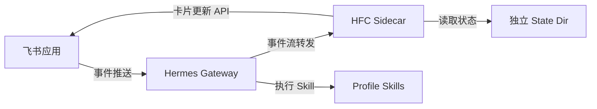
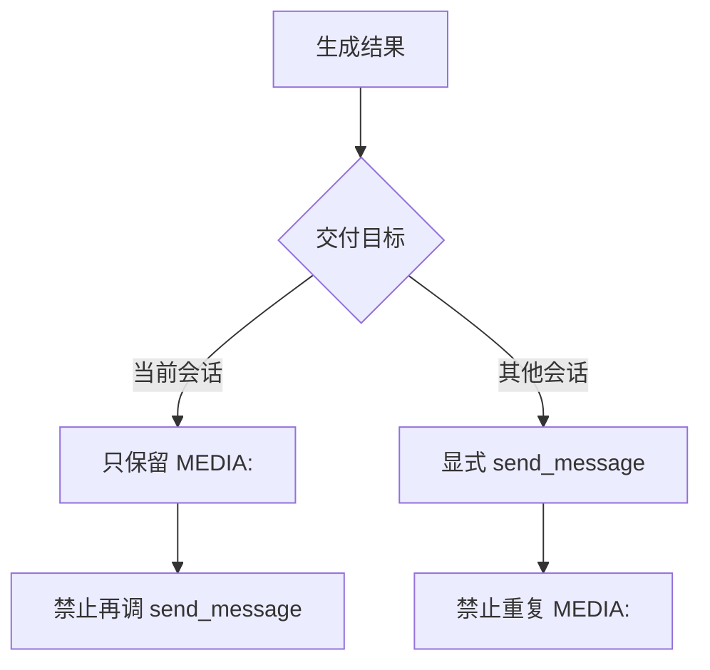

## 问题：一台机器，多个 Agent，如何不打架？

当企业从"一个飞书机器人给全员用"进化到"每个业务线有自己的独立助手"时，会面临一个典型的部署问题：怎么在一台 macOS 机器上跑多个 Hermes Profile，每个都有独立的飞书机器人、独立的流式卡片、独立的进程托管，且彼此完全隔离？

这不是传参改个名字就能解决的问题。端口会冲突、事件会串线、健康检查会误判、卡片会串到错误的群聊里。本文记录了我们从反复踩坑中沉淀出的一套结构化复刻方法。

## 核心设计：一对一映射

整个体系建立在一个简单的映射关系上：

```
一个业务 Profile
    = 一个唯一 Profile ID
    + 一个独立飞书应用/机器人
    + 一个独立 Hermes Gateway
    + 一个独立 HFC 事件端口
    + 一个独立 HFC 状态目录
    + 一个独立进程托管单元
```

**每新增一个业务，就复制上面整条链路。不共享端口，不共享状态目录，不共享凭证。** 这是整个方法的根基——所有后续步骤都是这个原则的展开。

## 架构全景

复刻过程涉及四个独立运行的角色，它们之间通过明确的接口协作：



每个角色都必须有一个独立的身份。具体来说：

| 角色 | 隔离方式 | 出错后果 |
|------|----------|----------|
| Gateway | 独立 `--profile` 参数 | 错误回复、串会话 |
| HFC Sidecar | 独立端口 + 独立状态目录 | 卡片串线、状态覆盖 |
| 飞书应用 | 每个 Profile 一个独立应用 | 消息投递到错误机器人 |
| LaunchAgent | 独立 plist label | 重启时启停错误进程 |

## 端口分配：最容易被忽视的隔离点

端口冲突是新手最容易踩的坑。不是"看起来没人用"就行，必须用 `lsof` 确认：

```bash
lsof -nP -iTCP:8767 -sTCP:LISTEN
```

没有输出才说明端口可用。**不要通过 kill 未知进程来抢占端口**——你不知道那个进程在服务什么业务。

更隐蔽的问题是健康检查误判。如果只检查端口返回 200，可能这个端口属于另一个 Profile。正确的健康检查必须同时验证 `profiles` 中包含目标 Profile ID：

```python
return (
    payload.get("status") in {"healthy", "degraded"}
    and isinstance(payload.get("process_pid"), int)
    and PROFILE_ID in payload["profiles"]
)
```

## 飞书侧：被低估的前置条件

很多"为什么机器人不响应"的问题，根本不是 Hermes 的问题，而是飞书侧配置不对。在接入任何代码之前，先确认三件事：

1. 机器人在飞书中可见，已加入测试群
2. 测试账号 A 和 B 都在应用可用范围内
3. 群管理员没有限制机器人读取 @ 消息

**如果飞书侧可用范围不正确，改 Hermes 配置解决不了问题。** 这个排查顺序值得反复强调——从外到内逐层排查，不要直接跳到"是不是代码有问题"。

## HFC 模板的无密钥设计

多 Profile 场景下，绝不能把 App Secret 写死在模板里。正确的做法是模板保持凭证为空，由管理脚本在运行时从 `.env` 注入：

```yaml
profiles:
  demo-business-agent:
    feishu:
      app_id: ""      # 运行时注入
      app_secret: ""  # 运行时注入
```

`manage.py` 的职责是固定的五件事：读 `.env` → 注入凭证 → 创建运行目录 → 使用管理锁启动 → 健康检查前置判断。每一步都不能省略。

## 流式展示：业务群不该看的东西

业务群里的飞书卡片应该展示什么？答案是：**业务进度，而非技术细节。**

```yaml
display:
  show_reasoning: false      # 不展示推理过程
  tool_preview_length: 0     # 不展示工具输出
```

技术命令、原始 JSON、工具输出、内部路径——这些东西出现在销售群或业务群，只会造成困惑和信任损耗。卡片的使命是让用户知道"系统正在做我要求的事"，而不是"让我看看你的脑子怎么转的"。

## 启动顺序：一步错步步错

这不是"先启动谁都行"的场景。正确顺序是强依赖的：

```text
.env 和 config.yaml    →  准备
  ↓
生成 HFC 运行配置      →  只有一次
  ↓
启动 HFC Sidecar       →  必须先于 Gateway
  ↓
/health 确认           →  验证 Sidecar 就绪
  ↓
启动 Gateway           →  Gateway 建立后 HFC 才能收到事件
  ↓
HFC doctor             →  全链路诊断
  ↓
飞书测试               →  业务验收
```

最常见的错误是：HFC 先启动，Gateway 后重启，然后看到 `gateway_restart_required` 就去反复重启 HFC。实际上这是 Gateway 需要重启以加载 HFC 生命周期环境——不要动 HFC。

## 测试矩阵：两个账号、十个场景

配置完成后，验收不是"发一条消息看看"。最少需要执行这组测试：

| 场景 | 为什么重要 |
|------|-----------|
| 账号 A 单聊 | 验证基础链路 |
| 账号 A 群聊 @ 机器人 | 验证群策略和事件订阅 |
| 账号 B 同群 @ 机器人 | 验证多用户不串线——这是最容易出问题的场景 |
| 长耗时任务 | 验证流式卡片持续更新 |
| 新旧 Profile 并发 | 验证隔离——卡片标题和结果不串到对方机器人 |
| 重启恢复 | 验证 LaunchAgent 和自动恢复 |

**账号 A 能用、账号 B 不能用**是最经典的多 Profiles 故障模式。排查链路是：飞书投递 → Gateway 记录 → 群策略 → allow all users → 应用可用范围 → @ 目标确认 → HFC 事件。从外到内，逐层排查。

## 固定出口规则

Agent 交付结果时有两种路径，混用会导致重复附件：



原则很简单：**一个结果，一条出口路径。** 当前会话的文本和附件走 Gateway 回复，转发其他会话才用显式发送。两者不混用。

## 一句话总结

整套方法论的精华只有一句：

> **一个 Profile，一套身份；一个端口，一个状态目录；过程走 HFC，结果走唯一交付出口。**

当你需要复刻第三个、第四个 Profile 时，这句话比二十个步骤的 checklist 更有用——因为它告诉你为什么每一步存在，而不是让你机械地执行步骤。

## 相关链接

- [Hermes Agent 飞书接入文档](#)
- [HFC v4.1 流式卡片协议](#)
