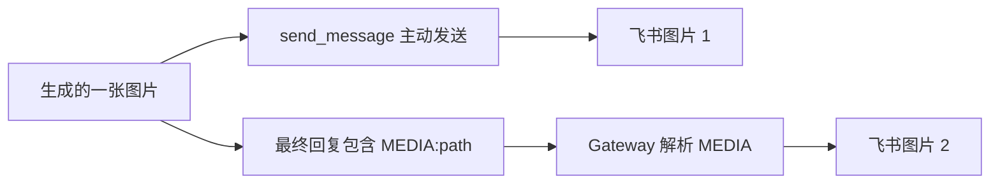
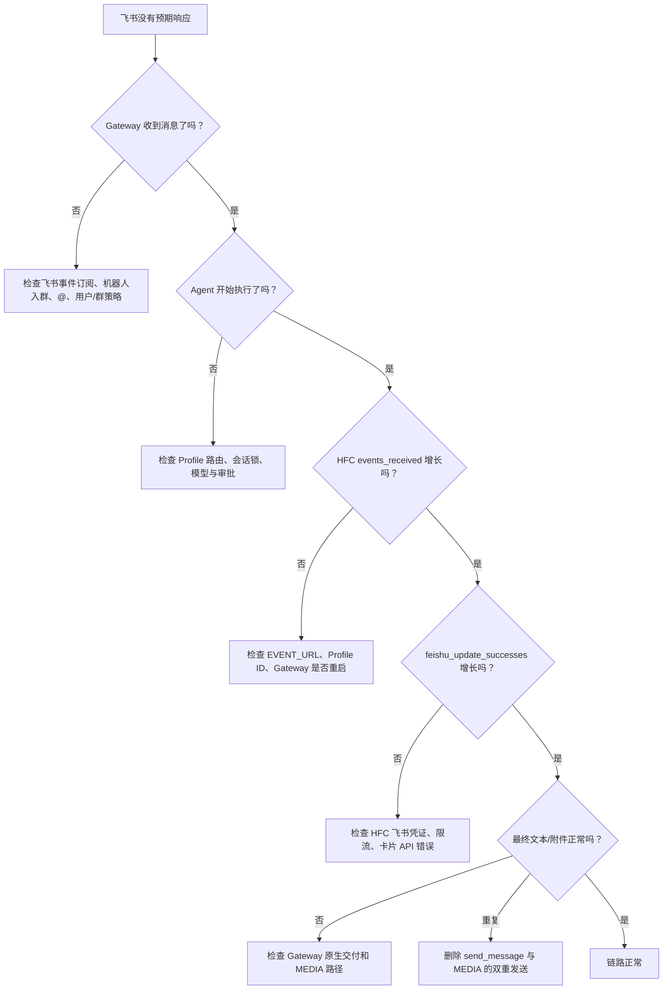

## 先说结论：多 Profile 的核心不是"多开两个进程"

单 Profile 场景里，飞书流式卡片看起来很简单：打开 `streaming.enabled`，启动一个 HFC Sidecar，Gateway 把生命周期事件推过去就行了。但当第二个 Profile 接入后，一系列隐藏问题会同时爆发：

- 第一个机器人的流式输出突然消失
- 两个机器人共用错误的卡片标题
- 状态文件相互覆盖
- 某个账号能在群里触发而其他账号不能
- 最终图片被发送两次
- Sidecar 明明在运行却收不到任何事件

这次实践让我形成了一个明确的判断：

> Hermes 多 Profile 流式接入的稳定性，不取决于配置里写了多少个 `streaming: true`，而取决于 Profile ID、事件端口、状态目录和飞书身份这四个命名空间是否完全隔离。

只要其中一个维度仍然共享，系统就可能"偶尔正常"，却很难稳定。

## 架构中的三个角色

这套方案中有三个容易混淆的角色，理清它们的边界是排障的前提：

| 角色 | 职责 | 不该做的事 |
|------|------|-----------|
| **Hermes Gateway** | 接收飞书消息、选择 Profile、加载 Skill、调用模型和工具，产生生命周期事件 | 不直接操作飞书卡片 API |
| **HFC Sidecar** | 接收生命周期事件，按 Profile 和会话聚合状态，调用飞书卡片 API 创建/更新卡片 | 不执行业务推理，不跑 CRM 或生图 |
| **飞书原生通道** | 发送最终文本和文件附件，上传 `MEDIA:` 指向的图片 | 不负责流式展示 |

HFC 展示"正在识别、正在写入、正在生成"等过程状态；Gateway 负责最终业务结果。两条通道可以并行，但**不能重复承担同一份最终附件的发送职责**——这是后续图片重复问题的根因。

## 四层隔离：多 Profile 能否稳定的分水岭

### 1. Profile ID

每个 Gateway 发出的生命周期事件都必须带上正确的 Profile 身份。两个 Profile 不能都叫 `default`，也不能都复制自同一个模板值。HFC `/health` 中的 `profile_mismatches` 应持续为 `0`——如果这个数字增长，优先检查 Gateway 启动参数和环境变量，而非飞书客户端。

### 2. 事件端口

两个 Profile 不能把事件都推送到同一个无路由能力的 Sidecar 端口。实践中我们固定分配了 `8765`（销售助手）和 `8766`（内容助手），Sidecar 仅监听 `127.0.0.1`，不把内部生命周期接口暴露到局域网或公网。

### 3. 状态目录

**这是最容易被忽略、也最容易导致"第一个机器人原本有流式，配置第二个后突然消失"的地方。** HFC 会持久化运行完整性、会话状态和操作传输信息。如果两个 Sidecar 共用全局目录，后启动的实例可能覆盖前一个实例的 PID、完整性围栏或会话记录。

正确做法是每个 Profile 显式指定独立的状态目录，旧全局状态归档为只读备份后不再复用：

```text
~/.hermes_feishu_card/
├── ymyy-sales-agent/state/    # 销售助手独立状态
├── lanhui-content/state/      # 内容助手独立状态
└── legacy-global-state-202607/ # 归档，不删除
```

### 4. 飞书身份

每个 HFC 配置中的 App ID、App Secret 和卡片标题，都必须来自对应 Profile 的私有 `.env`。凭证不进入模板、不进入 Skill、不进入文档。管理脚本在启动时从 `.env` 读凭证 → 注入运行配置 → 原子替换写入 `config.yaml`，避免半文件状态。

## 三层流式开关：都要为 true，但都弥补不了隔离缺失

```yaml
streaming:
  enabled: true          # Gateway 是否产生增量输出
  transport: edit        # 同一条消息是否通过编辑持续更新

display:
  streaming: true        # 展示层是否允许流式
  platforms:
    feishu:
      streaming: true    # 飞书平台是否单独启用
```

三层全部为 `true` 仍然不能弥补 Profile、端口或状态目录冲突。**开关决定"要不要流式"，隔离决定"流到哪里、由谁维护"。**

## 生命周期如何变成业务卡片

销售人员不关心模型调用了什么工具，但他们需要知道系统有没有收到指令、现在做到哪一步、最终是否成功。HFC 的价值是把底层生命周期翻译成业务可理解的状态：

```text
销售助手：正在识别 → 正在查重 → 正在写入 → 正在验证 → 完成
内容助手：正在处理 → 正在搜索 → 正在生成 → 正在验证 → 正在整理 → 完成
```

当前配置刻意关闭详细 reasoning 并压缩工具结果——这不是功能缺失，而是面向业务场景的产品选择。用户需要的是可理解的进度，不是终端命令、模型思考或 19 行 Python 代码。

## 群聊权限和流式卡片是两个控制平面

"账号 A 在群里 @ 机器人能响应，账号 B 单聊能响应但群里不响应"——这是本次实践中最常见的故障模式。

Gateway 决定一条群消息是否进入 Agent；HFC 决定已经进入生命周期的会话如何展示。排查顺序必须从外到内：

1. 飞书事件订阅是否收到了账号 B 的群消息
2. Gateway 日志中是否出现该消息和发送者
3. `FEISHU_GROUP_POLICY` 和 `FEISHU_ALLOW_ALL_USERS` 是否被覆盖
4. 群消息是否真的 @ 到正确机器人（不是输入了同名文本）
5. 飞书应用可用范围是否对该成员生效
6. **最后**才检查 HFC 是否收到生命周期事件

如果 Gateway 根本没收到消息，修改 HFC 卡片配置不会解决问题。

## 图片为什么重复两次

内容 Profile 接入生图后，出现了一个典型问题：API 只生成了一张图片，飞书里却出现两张。原因不是 API 返回了两张，而是 Agent 同时走了两个发送出口：



固定规则：

- **返回当前会话**：只在最终回复保留 `MEDIA:/path/image.png`，禁止再调 `send_message`
- **转发其他会话**：只使用显式外发工具，最终回复不再包含 `MEDIA:`
- **HFC 卡片**：只显示生成进度，不上传图片二进制

这条规则应写进 Skill，而不是依赖每次模型临场判断。

## 为什么第二个 Profile 配好后第一个流式消失了

日志中出现过 `gateway_restart_required`。这说明 Sidecar 进程还在，但它判断 Gateway 的运行代际或生命周期链路已变化。常见触发原因：

- 修改 `.env` 后只重启 Sidecar，没重启对应 Gateway
- 第二个 Profile 启动时复用了全局 HFC 状态目录
- 两个 Sidecar 同时操作共享 PID、锁或完整性文件
- 旧进程仍占用端口，新启动命令实际没生效

**不要一次性停止所有 Profile 再盲目重启。** 推荐的变更顺序是逐个 Profile 操作：

```text
写入私有 .env → 生成独立 HFC 配置 → 启动 Sidecar → 确认 /health
→ 重启对应 Gateway → 执行 doctor → 飞书最小业务测试
```

## 故障定位决策树

当飞书出现异常时，按链路逐层排查，一次改变一个层次：



## 七个踩过的坑

1. **复制一份配置，只改卡片标题。** 标题不同不代表实例隔离。必须同时修改 Profile ID、端口、状态目录和飞书身份。

2. **两个 Sidecar 共用状态根目录。** PID、完整性状态和会话接管记录互相影响。全局目录只能放共享管理锁，不能作为实例的活动状态目录。

3. **只重启 Sidecar，不重启 Gateway。** HFC 环境变量和生命周期 hook 在 Gateway 启动时建立。改接入配置后 Gateway 需要重新建立运行完整性。

4. **把群聊不响应当作流式卡片故障。** 消息没进 Gateway 时，HFC 没有任何东西可展示。先查入口事件，再查卡片。

5. **把工具审批写进业务提示词。** 提示词不能可靠改变底层安全策略。高频业务动作应封装为固定 Skill 入口。

6. **同一张图片同时走 `send_message` 和 `MEDIA:`。** 稳定产生两张相同图片。当前会话只允许 `MEDIA:`。

7. **为了"测试 API"临时写脚本并连续重试。** 把一次 90-150 秒的生图放大成十几分钟，并产生不可观测的临时逻辑。

## 实测数据

截至本文整理时，两个 Profile 的运行状态：

| 指标 | 销售助手 (8765) | 内容助手 (8766) |
|------|:-:|:-:|
| events_applied | 17 | 557 |
| feishu_update_successes | 35 | 972 |
| profile_mismatches | 0 | 0 |
| 卡片更新延迟 | ~0.6s | ~0.6s |

内容助手累计出现 6 次 terminal drain timeout，说明长耗时生图的结束事件仍需治理，但没有造成 Profile 串流。这些数据说明隔离架构已经成立。

## 结语

Hermes 接入飞书最容易做成一个"演示时很好看"的系统：一条消息进来，卡片不断更新，最后给出答案。但多 Profile 真正上线后，难点不在 UI，而在**生命周期、身份、状态和交付所有权**。

把每个 Profile 当作一个完整、独立的业务服务——HFC Sidecar 是它的流式视图，Gateway 是它的业务运行时，Skill 是它的能力边界，飞书原生通道是它的最终交付层。四者边界清楚以后，新增 Profile 才会从一次冒险变成一个可以复制的标准动作。
