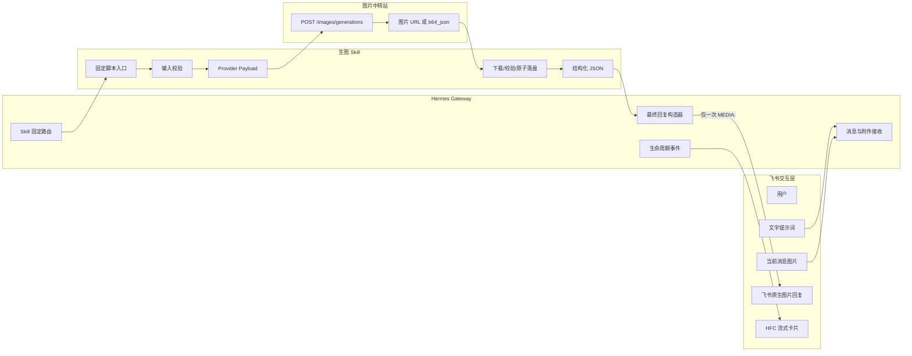
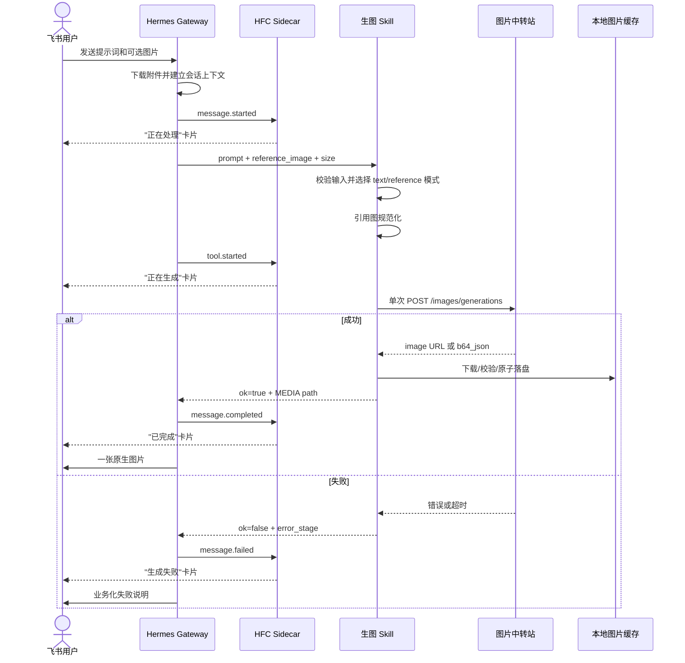
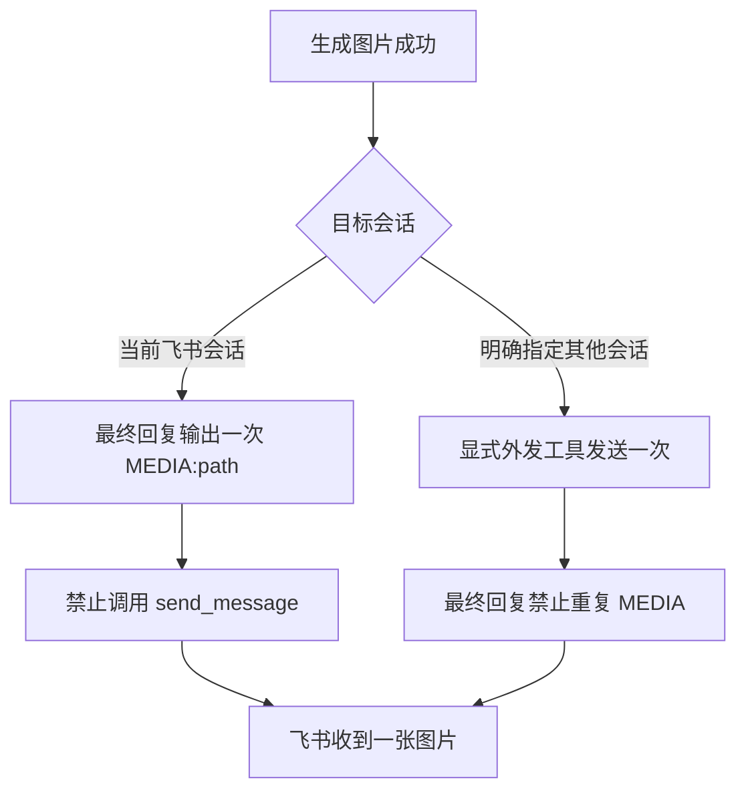
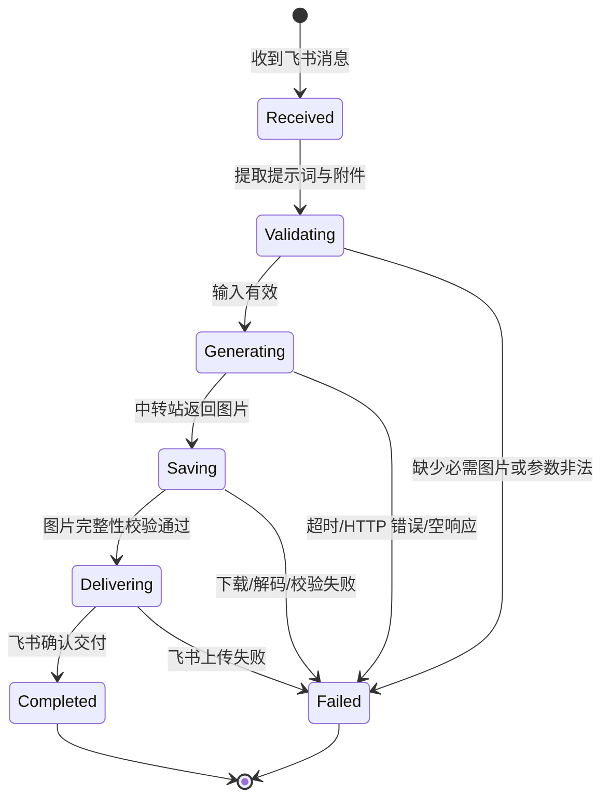

## 背景：生图不是"调一次 API"那么简单

在 Hermes 接入图片中转站之前，飞书生图面临几个典型的不可靠问题：

- 模型临场拼接 HTTP 请求，参数随每次对话波动
- 同一张图片被重复发送（`send_message` 和 `MEDIA:` 两条出口同时触发）
- 失败时给出虚假的成功回复，或者根本不告诉用户哪里错了
- 引用图来自飞书消息时，路径处理、格式转换和校验逻辑散落在各处
- 车膜改色、海报生成等业务场景，色卡资产和专用 Prompt 需要反复口头描述

这些问题不是模型能力不够，而是**生图链路缺少一个低自由度、可观测、不会重复发送的固定工作流**。

接入图片中转站后，我们把整个生图流程固化成了一个标准架构。

## 整体架构：四个域，一条主干



架构的关键设计是把系统切成了四个明确的域：

| 域 | 职责 | 不该做的 |
|----|------|----------|
| **飞书交互层** | 接收用户消息和图片，展示最终结果和进度卡片 | 不处理图片逻辑 |
| **Hermes Gateway** | 消息接收、会话上下文、Skill 路由、生命周期事件、最终回复 | 不拼 HTTP、不写图片 |
| **生图 Skill** | 校验输入、规范化引用图、构造 Provider Payload、调中转站、落盘和校验 | 不直接操作飞书卡片 API |
| **图片中转站** | 接收标准化请求、调度模型、返回图片 URL 或 base64 | 不过问业务逻辑 |

**HFC Sidecar 不发送最终图片，只负责进度卡片。** 这是避免重复发送最核心的边界——展示和交付各有一条明确的 owner。

## 固定执行时序

去掉模型的临场自由度后，每次生图都走完全相同的执行路径：



无论成功或失败，用户都能得到明确的反馈。**不声称"已生成"而实际上没有、不伪造图片、不让失败静默。**

## 固定输入契约

通用生图入口接收的是结构化参数，不是自由文本：

```json
{
  "task": "image_generation",
  "prompt": "用户的完整提示词",
  "reference_images": ["/absolute/path/to/image.jpg"],
  "generation": {
    "mode": "reference",
    "size": "768x1024",
    "quality": "high",
    "response_format": "b64_json",
    "n": 1
  },
  "delivery": {
    "target": "current_session",
    "method": "media_only"
  }
}
```

关键规则：

- 没有图片时 `mode=text`，有图片时 `mode=reference`
- 用户说"参考这张图"但当前消息没图时，**追问补图**，不自己编一个
- 默认 `n=1`，避免中转站返回多张候选图导致出口混乱
- **用户提示词保持高自由度**，Skill 只补充必要的接口参数，不私自套固定视觉模板

## 模块划分：每个模块只有一个理由可以修改

参考 `ark-seedream-car-preview` 的模块化结构，我们将生图 Skill 拆成七个不可再分的职责单元：

| 模块 | 唯一职责 |
|------|----------|
| **Entry** | 接收参数并启动一次工作流 |
| **Validation** | 校验提示词、图片、尺寸和模式 |
| **Prompting** | 默认透传用户提示词，按需加载业务约束 |
| **Refs** | 验证本地图片并转换为中转站接受的引用格式 |
| **Provider** | 构造模型、prompt、image、size、quality 等请求字段 |
| **HTTP Client** | 鉴权、超时、HTTP 状态、安全日志（不记录凭证和 base64） |
| **Output** | 下载/解码、校验图片完整性、原子落盘 |

业务适配器（车膜色卡、海报品牌资产、商品参考图）作为可选插件接入 Prompting 和 Refs 模块，不侵入主干流程。无论业务如何扩展，主干始终不变：

> 飞书输入 → 当前消息附件落地 → 固定 Skill → 提示词与图片传给中转站 → 结果校验落盘 → 单一 MEDIA 出口返回飞书。

## 唯一交付出口：为什么这张图不会出现两次

这是整个架构中解决"重复图片"问题的核心规则：



原则：**生成文件只有一份，交付 owner 也只能有一个。** 这条规则写进了 Skill 而非依赖模型临场判断，因为"判断该用哪个出口"本身就是出错的根源。

## 状态机与失败边界



失败处理的固定原则：

- **任何失败只返回结构化错误和业务化提示**，不声称"已生成"
- **不自动创建临时 Python 脚本绕过固定入口**——这是之前最混乱的故障源
- 不在同一请求中无限重试
- 不把 API Key、Authorization 或完整 base64 写入日志或飞书
- **超时后不立即并发重发**——上游可能仍在生成，并发重发会导致重复计费和重复图片

## 四个业务场景落地

### 通用文本生图

```text
飞书提示词 → Skill → 中转站 → 本地图片 → MEDIA → 飞书
```

最简链路，用户只提供文字描述。

### 通用文本加图生图

```text
飞书提示词 + 当前消息图片 → 引用图规范化 → 中转站 → 本地图片 → MEDIA
```

用户当前消息中的图片自动被提取为 `reference_images[0]`。

### 车膜改色预览

```text
客户实车图 + 色号
    → 查询 preview 色卡资产
    → 实车图排第一、色卡排第二
    → 组装只修改车身漆面的专用 prompt
    → 中转站
    → 上车效果图
    → MEDIA
```

这是垂直业务适配的典型例子——主干流程不变，仅在 Prompting 和 Refs 模块前置插入业务资产查询。

### 海报生成

```text
用户自由提示词 + 可选参考图
    → 保持创意内容不被模板覆盖
    → 中转站生成
    → MEDIA
```

海报场景的关键约束是**不套固定视觉模板**——用户提示词中的创意方向保留完整自由度，Skill 只做参数规范化。

## 总结

接入图片中转站后，飞书生图从"每次靠模型临场发挥"变成了一个**行为可预测、失败可诊断、出口可控制**的标准工作流。核心设计只有三个固定点：

1. **固定主干**：消息入口 → Skill 固定脚本 → 中转站 → 校验落盘 → 单一 MEDIA 出口
2. **固定模块**：七个职责单元，每个只有一个修改理由
3. **固定出口**：当前会话一个 `MEDIA:`，跨会话一次显式发送，两者不共存

在这三个固定点之外，用户的提示词保持高自由度，业务适配器作为可选插件接入——固定的是流程，不固定的是创意。
