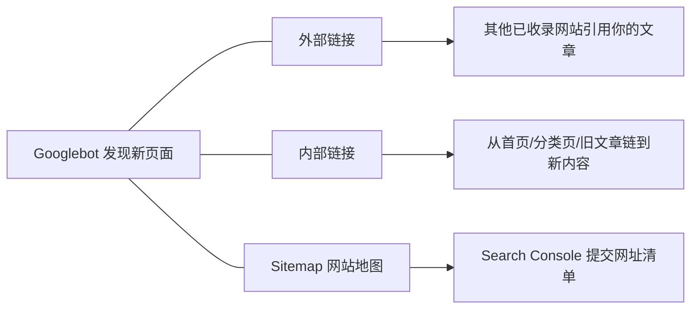
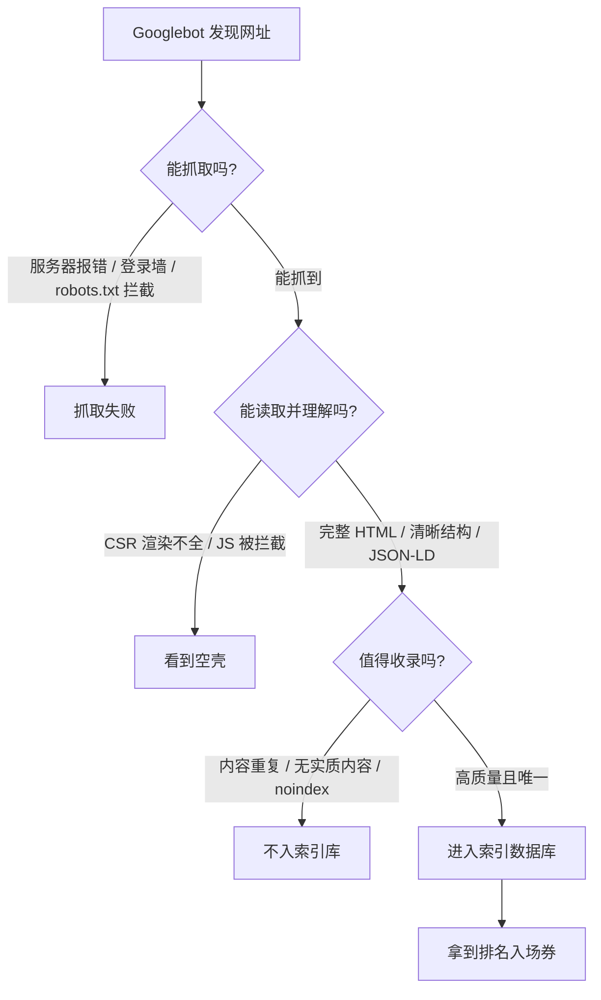
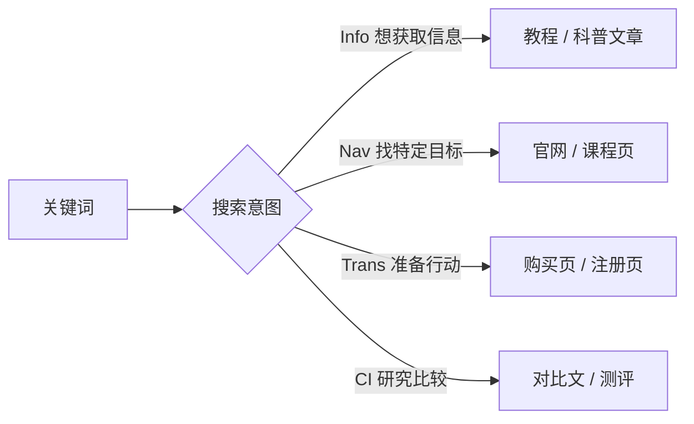
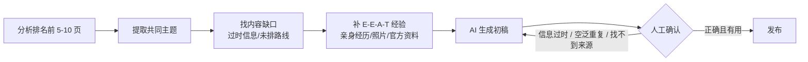
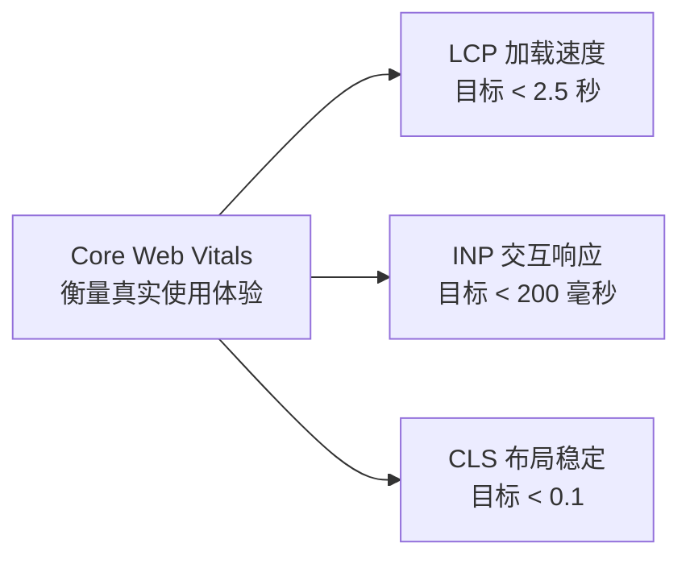

现在大家都能用 AI 把网站做出来，但做完之后有没有发现：Google 根本搜不到？

我自己的官网（Lanhui 官网）上线前也踩过这个坑。网站不是坏了，大概率是 Google 压根不知道这个网址存在，或者你的技术 SEO 没处理好。这篇文章把整个链路讲清楚：从 Googlebot 发现你的页面，到最终用户点进来的体验，一共五步。每一步我都会告诉你——哪些可以放心交给 AI，哪些必须你自己拿主意。

结论先说：**AI 时代 SEO 没死，只是分工变了。把重复的检查交给工具，把判断留给自己。**

## 第一步：让 Googlebot 发现你的页面

你点了发布，不等于文章立刻出现在搜索结果里。Google 必须靠爬虫（Googlebot）在网络里巡逻，才能发现新网址。它主要通过三种途径：

1. **外部链接**：其他已被 Google 收录的网站引用你的文章，Googlebot 顺着链接爬过来。
2. **内部链接**：Google 原本就知道你的网站，会定期回访，沿着菜单、分类页、文章链接发现新内容。所以发布新文章后，记得从首页或相关文章链到它。
3. **Sitemap（网站地图）**：一份网址清单，告诉 Google"我的网站里有这些页面"。通过 Google Search Console 提交，能加速发现。

做完这三步只是提交成功。**发现 ≠ 收录 ≠ 出现在搜索结果**，后面还有三道关。

## 第二步：抓取、理解、收录是三个不同关卡

Google 发现一个网址后，要依次回答三个问题：

**能不能抓取？** Googlebot 会尝试下载页面 HTML。但如果服务器报错、页面需要登录、或者被 robots.txt 拦截，它就抓不到。robots.txt 就像网站门口的告示牌——注意，它控制的是**能不能抓**，不是**能不能收录**。不想让页面出现在搜索结果里，要用 `noindex`（测试环境就常用这招）。这俩是两回事，很多人搞混。

**能不能读取并理解内容？** 这里有个关键概念：CSR 和 SSR。CSR（客户端渲染）下，服务器只返回一个内容很少的 HTML 壳，靠浏览器执行 JavaScript 才拼出完整内容——如果脚本加载慢或被拦截，Google 看到的就是空壳。SSR（服务器端渲染）则是服务器先把包含主要内容的 HTML 做好再返回，Google 读到的就是完整页面。

我自己的官网用的就是 Next.js 静态导出，天生是 SSR/SSG 路线，Googlebot 一抓就是完整 HTML，这是当时选型时的一个隐性红利。做 Vibe Coding 的朋友注意了：你让 AI 生成的默认脚手架很多是 CSR，发布前一定检查这一点。

HTML 结构（H1/H2/P）提供语义线索，但别指望堆关键词进 H1 就能加分——内容是否完整、能否解决用户问题才是重点。想更明确地告诉 Google"这个页面是文章、作者是谁"，可以加 JSON-LD 结构化数据，但字段要按 schema.org 规范来，不能自创。

**是否建立索引？** Google 像图书馆管理员，会判断这本书值不值得收进馆藏。内容重复、没有实质内容、noindex、或 Google 选了另一个 URL 作为主版本，都可能不入库。

一句话总结：**发现不代表抓取，抓取不代表理解，理解不代表收录。** 只有进了索引库，你才拿到排名的入场券。

技术 SEO 检查很适合交给 AI 协作——robots.txt、noindex、渲染问题散落在代码各处，人工一页页查太慢。免费开源的 Claude Code 插件 **Claude SEO**，一条 `/seo technical [你的网站]` 就能从九大类别扫描技术问题，按严重程度输出改进清单，代码在本地的还能直接让它照着修。但记住：它的报告不等于 Google 实际的索引结果，改完仍要回 Search Console 用网址检查确认。

## 第三步：关键词不是选搜索量最大的，而是选用户真在搜的

很多 Vibe Coder 直接叫 AI"帮我写 10 篇文章"——AI 写得快，但它不知道这个主题有多少人搜，也判断不了竞争程度。

开源工具 **OpenSEO**（自称 Ahrefs 和 Semrush 的开源替代）可以帮你做关键词研究：输入"AI 教程"这样的种子词，它会延伸出相关词并列出搜索量、CPC、竞争程度和搜索意图。注意它的搜索量是第三方估算值，适合比相对需求，别当精确数字。数据来自 DataForSEO，要申请 API Key，会有少量费用。

举个例子：输入"AI 教程"，OpenSEO 显示每月约 880 次搜索，但用户实际搜的往往是更具体的词——"如何学习 AI""免费 AI 课程""AI 在线课程""政府补贴 AI 课程"。种子词只是入口，真正值得做的词，通常藏在它派生出来的长尾里。

搜索量之外，更要看**搜索意图**：

- **Info**：想获取信息 → 适合写教程
- **Nav**：在找特定网站/课程 → 官网、课程页
- **Trans**：准备好购买或行动
- **CI**：还在研究比较、做决定前的最后确认

工具对意图的分类只是初步参考，最后一步永远是**把关键词丢回 Google，看排名靠前的是什么形态**——是教程、对比文、官网还是课程页。Google 现排的结果才最反映用户想看什么。真正值得做的不是搜索量最大的词，而是**用户真的在搜、你又答得比别人好**的词。

## 第四步：先分析搜索结果，再让 AI 写稿

别急着生成。先搞清对 Google 而言什么算高质量内容——看它的 Search Quality Rater Guidelines，核心是 **E-E-A-T**：实际经验（Experience）、专业知识（Expertise）、权威性（Authoritativeness）、信任度（Trust，最核心）。

它不是一个可以单独计算的排名分数，加个作者介绍也不会直接加分，它更像一组检查内容质量的概念：内容有没有真实经验、有没有专业能力、有没有外部认可、信息是否可靠。长文、堆关键词都不算数。医疗、金融、法律这些影响生活的主题，要求会更高。

实操方法（以"日本自由行"为例）：去 Google 看排名前 5-10 个页面，整理它们①写给谁、②普遍包含哪些章节（行前准备、机票住宿、交通、行程、预算、上网支付）、③哪些信息过时、④"其他人还问了"里有哪些问题。然后找**内容缺口**——比如交通票券规定过时、只列景点没排合理路线。再用 E-E-A-T 思考我们能补什么：亲身经验、实际照片、真实花费、官方资料。

全部整理完再交给 AI 写初稿。**AI 完成初稿后不能直接发布**，人工要逐条确认：

1. 信息是否正确、仍然有效
2. 是否真的符合搜索意图
3. 有没有空泛、重复或无关的内容
4. 引用的资料能不能找到可靠来源
5. 有没有加入自己的经验、照片和案例
6. 是否比现有的搜索结果更实用

AI 可以加速资料整理和初稿，但不能代替你的查证和实际经验。

## 第五步：发布前检查 Core Web Vitals

内容再好，加载太慢、按钮没反应、页面乱跳，用户照样走人。用 Google **PageSpeed Insights** 输入网址，会从性能、无障碍、最佳实践、SEO 四方面检查。

先破个误区：PageSpeed Insights 里的 SEO 分数只查基础技术项（能否索引、有没有 meta description、链接能否识别），拿 100 分也不代表排名第一——它判断不了内容符不符合搜索意图、作者值不值得信任。那部分靠前四步。

真正值得看的是 **Core Web Vitals**，三项核心指标：

- **LCP**（最大内容绘制）：主要内容多久显示出来，建议 **2.5 秒内**。常见坑：首图太大、服务器响应慢、字体/CSS 阻塞、没预加载重要图片、JS 太多。
- **INP**（交互延迟）：点按钮后多久有反应，建议 **200 毫秒内**。常见坑：JS 执行太久、第三方脚本过多、组件重渲染范围太大。
- **CLS**（布局偏移）：页面加载时内容会不会突然移动，建议 **0.1 以下**。常见坑：图片没设宽高、广告位没预留、网络字体加载后改文字尺寸。

它基于过去 28 天真实用户数据、取第 75 百分位判定。把这些检测结果丢给 AI 就能拿到修改方向，但别为了冲 100 分删掉真正重要的图片和分析工具——**目标是优先解决影响用户的问题**。

## 把重复的检查交给工具，把判断留给自己

回到开头那句话：现在有 AI 协助 SEO，但不是把"帮我做 SEO"丢给 AI 就完事。AI 擅长它该擅长的——查询、整理、初稿撰写；人类负责内容选择的品味、判断信息是否正确、提供真实经验。

最后预告个趋势：现在越来越多人查资料不打开 Google，直接问 ChatGPT；Google 只要出现 AI Overview，第一名的点击率就掉 58%。下一个战场是**让 AI 回答问题时愿意引用你的网站**——这门学问叫 AEO（AI Engine Optimization）。但 SEO 是 AEO 的地基，先把这五步走通，再谈被 AI 引用的事。
