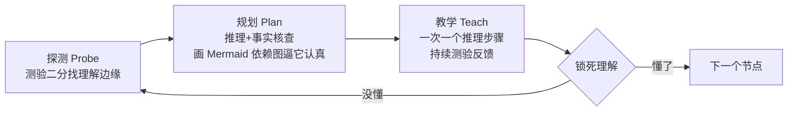

最近刷到一个外国博主讲「How I Use AI to Learn Things」。说实话，「用 AI 学习」这种标题我本能地不想点，因为十个里有九个是「让 ChatGPT 给我当私教」的废话。但这个不一样——他不是在讲 AI 能一对一教你，而是在讲**一套一对一教学系统的设计逻辑**，并现场演示他用这套系统从头学微分形式（differential forms）。

我全程看下来，最值钱的不是那个 demo，而是背后三条设计原则。再说一遍，这三条才是能不能抄作业的核心。

**一句话结论：让 AI 当老师不难，难的是把它当成一个有设计缺陷的系统来修。这三条原则就是让人工智能从「话痨百科」变成「真老师」的分水岭。**

## 先说清：为什么传统的多对多学习天生低效

作者开篇给了一个很清醒的框架。我们习惯的学习方式是**多对多**：一个老师/一本书/一门课教很多学生，同时一个学生也从很多渠道学。这两个方向各自都制造低效。

一个渠道教很多人 → 而「最优教学」完全取决于**这个学习者当下的理解状态**，包括从现状到目标的整条学习弧线，以及沿途每一句解释。面向大众设计的课，不可能对任何一个人最优。最优路径应该是：少讲你已经会的，也别讲你现在还听不懂的，正好贴着你的理解边缘走。所以，**理想的老师应该只有一个学生**。

一个学生学很多渠道 → 你要适应很多教学风格、很多记号、很多可靠度、很多界面，来回切换本身就在消耗本来该花在内容上的心力。但作者说更深的那层成本是**信任**：面对不熟悉的渠道，大脑会下意识「对冲」，不敢完全接受一个新事实，直到这个渠道证明自己、变得熟悉。他举的例子很妙——毛球定理（hairy ball theorem），两段一字不差的解释，一段是 3Blue1Brown 视频里的，一段是 X 上某个路人发的，你绝对从前者学得更好。内容一样，但大脑更愿意内化它信任的渠道。

于是理想状态浮出水面：**两个方向都该是一对一**。

你可能立刻反驳：只有一个老师 = 只得到一个视角？作者怼得干净：**你把「来源」和「界面」混为一谈了。** 一个老师并没有减少来源和视角，它是把所有的来源聚合起来，通过同一个界面交付给你。视角没丢，只是入口统一了。而 AI 当老师，信任不是靠时间积累的，是**通过工程写进系统里的**——所以必须内置可靠的事实核查。理由有三：一是不希望它胡编，二是当你确信系统可靠时，学习本身就更容易。

## 三条设计原则，这才是能抄的部分

### 原则一：在理解边缘教学，不重复不冒进

要「最优教学」，系统首先必须精确知道你现在懂什么。它靠一个测验工具来做「探测」（probe）：先宽泛地问，然后像二分查找一样，沿着课程依赖的每一条支线逼近你的理解边缘，最后得到一张相当精细的理解地图。这正好呼应了作者说的「贴着边缘走」——不教你已经掌握的，也不跳到你接不住的地方。

这一条我特别有共鸣。我自己那个「从零看懂 AI 代码」的学习体系（62 张知识卡）踩的坑就是：我以为我懂了一个概念，其实卡在概念之间的依赖关系上。探测阶段的价值就在这——**先量清楚水位，再决定教什么，而不是默认从头灌。**

### 原则二：挣扎留给内容，后勤全部外包

这是全场我觉得最锋利的一条。作者说「优化心智资源分配」**不是为了省力，不是去掉困难**。恰恰相反，要学难的东西，挣扎很重要。关键是把所有的认知工作量**集中到材料本身**，而不是花在后勤上——规划、找资料、核对事实、决定先学什么后学什么——这些全交给系统吸收。

翻译成人话：**别把力气浪费在「怎么学」的琐事上，把力气全部留给「学」这件事本身上。** 困难要继续有，但困难的来源应该是内容本身的难，而不是流程的乱。

### 原则三：逼 AI 画依赖图，防它凭空乱编

教学阶段完全取决于你希望怎么学、你装进系统的学习哲学是什么。但有一个跨所有方式的通用细节是**反馈**：AI 会定期测验你有没有真懂。三个原因：一是学习时太容易自我欺骗（gaslighting），测一下才不会骗自己；二是系统需要持续反馈来保持校准；三是实际应用、做练习，本来就是让新知识「锁死」的方式。

但最妙的是计划阶段那个小心机：系统会把教学计划画成一张 **Mermaid 依赖关系图**展示给你。表面理由是让你对「接下来要学什么」有概念，但作者说**真正原因**是——逼 AI 把整条推理链老老实实推演出来，它就没法「作弊、蒙混过关」。等于是用「必须画图」这个硬约束，把 AI 的思维摊开在桌面上，让你盯着它别偷懒。

这一条我很吃。跟 AI 对话最烦的就是它太兴奋、一口气跳过一堆中间步骤直接塞结论。作者特意强调系统「一次只走一个推理步骤」，慢慢往下啃依赖树，而不是像普通 ChatGPT 那样冲到底。**慢才是对的。**

## 三个阶段：探测 → 规划 → 教学

系统流程相当清晰，三步：

1. **探测（Probe）**：有分级的单选题，先宽后窄，二分逼近每条依赖支线的理解边缘 → 得到详细的理解地图。
2. **规划（Plan）**：系统推理「怎么教这颗大脑想学的这个东西」，同时启动第一批事实核查子代理，最后把计划渲染成 Mermaid 图。
3. **教学（Teach）**：完全取决于你想怎么学，但不管怎样都带反馈循环，把视觉（用子代理生成并验证的 SVG）嵌进 Obsidian 里，一步步走依赖树，每步确认理解后再前进。

他用 Obsidian 当 UI，用 Markdown 日志扩展把每次学习会话的产物落盘成可回溯的工件，连「给 AI 更多上下文」都能通过往笔记里写思路来实现。模型他也特意挑了当时智力最强的（他说教学这块模型的智能度真的很关键）。

## 我的判断：这套东西能抄，但别照搬

三条原则里，我最认同的是**原则二**（挣扎留给内容）和那个**画图逼推理**的小心机。前者重新定义了「难」——难应该是内容的难，不应该是流程的难；后者给了我们一个反 AI 偷懒的通用抓手：**当你发现 AI 在糊弄你，就让它把推理画出来。** 这两条能直接移植到任何人的学习流。

但我也得泼点冷水。「一对一辅导」这个外壳，并不适合所有人起步——它最值钱的前提是**你已经知道自己要学什么、并愿意系统性地被测验**。如果你连目标都不清楚，探测阶段会问到你怀疑人生。另外作者自己也承认，它能不能起作用，底层还是取决于你装进去的那套「教学哲学」，AI 系统只是个放大镜。

至于我这边，这套思路倒是印证了一件事：我那个学习体系里最不该省掉的，就是「每一块学完先自测、不对再回溯」这个环节——你越急着往下冲，越容易被「我好像懂了」骗过去。**AI 教学系统不是帮你省掉思考，是帮你把思考花在刀刃上。**

这篇文章算是我近期看过的少有的、把「AI 学习」讲成了系统工程而不是玄学的素材。如果你也在折腾怎么让 AI 真正教懂你，值得去原视频看看那个微分形式的完整 demo——它比任何描述都有说服力。
