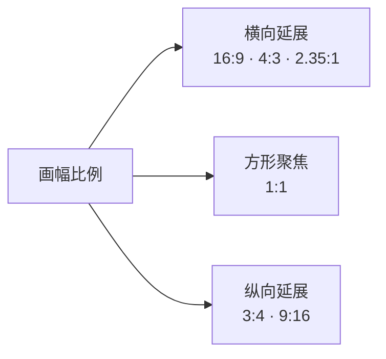
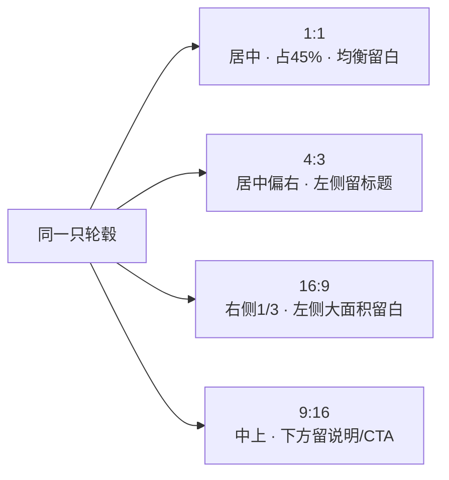

写 Prompt 的人，大多会先写「商品是什么、光是什么、风格是什么、情绪是什么」——但很少先想一个问题：

> **这张图是给哪里用的？它应该是什么画幅？**

画幅比例（Aspect Ratio）就是构图变量里的第一个模块，也是**最常被忽略、却又最早决定一切**的一个。

## 一、画幅比例是什么

它就是图片**宽度 : 高度**的关系。常见的有：

- **1:1** 正方形，**4:3** / **3:4** 经典横竖，**16:9** / **9:16** 强延展，**2.35:1** 超宽电影横幅。

一句话理解：

> **画幅比例决定了这个画面天生更适合「横着讲故事」，还是「竖着讲故事」。**



## 二、一个关键校准：画幅比例不是「尺寸」，是「空间逻辑」

1080×1920 和 720×1280，尺寸完全不同，但比例都是 9:16——**构图逻辑一模一样**。反过来，1440×1080 和 1200×900 都是 4:3。

所以真正影响构图的不是像素多少，而是**比例带来的空间关系**。写 Prompt 时你控制的是「比例」，不是「像素」。

## 三、六种比例，各有构图倾向

| 比例 | 常见用途 | 构图特点 |
|---|---|---|
| **1:1** | 电商方图、社媒卡片 | 稳定、居中、聚焦 |
| **4:3** | PPT 封面、公众号配图、产品宣传图 | 平衡、稳重、实用 |
| **3:4** | 海报、小红书图文、竖版商品封面 | 端正、竖向阅读 |
| **16:9** | 视频封面、官网 Banner、大屏视觉 | 开阔、横向叙事 |
| **9:16** | 抖音封面、短视频、竖版海报 | 上下阅读、移动端友好 |
| **2.35:1** | 公众号头图、品牌 KV、超宽横幅 | 高级、电影感、大留白 |

## 四、画幅比例一次决定四件事

比例一旦变，这四件事会**同时**跟着变：

1. **空间方向**——横向展开（适合场景、文案并排）还是纵向展开（适合海报、上下阅读）。
2. **主体大小**——同一主体，在 1:1 里能占 50%，在 16:9 里可能只占 30%–40%，因为「空白压力」不同。
3. **留白方式**——横版常见左右留白，竖版常见上下留白，超宽横版是单侧大留白。
4. **信息布局**——16:9 是「左标题 + 右主体」，9:16 是「上标题 + 中主体 + 下信息」。

## 五、同一商品，换比例，摆法必须换

这是画幅比例最容易被忽视的地方：**同一个商品，不同比例下不能机械照搬同一个构图。**

拿轮毂举例：



- **1:1**：轮毂居中，占 45%，四周均衡留白。
- **4:3**：轮毂居中偏右，左侧留标题或卖点空间。
- **16:9**：轮毂在右侧 1/3，左侧大面积留白放文案。
- **9:16**：轮毂在中上，下方留功能说明或 CTA。

## 六、写画幅比例的正确姿势：别只写数字

写 `4:3` 是不够的。更重要的是**把这个比例「应该如何构图」一起说出来**：

```text
横版 16:9 Banner 构图。
画面具有明显横向延展感，
主体放在右侧 1/3 区域，
左侧保留大面积负空间用于标题与文案。
```

因为模型能理解「16:9」是宽高比，但未必知道你要的是「左文右图」还是「居中」。**比例 + 构图描述，才是一个完整的构图变量。**

## 七、核心结论：画幅比例是「最早决定」的，不是「最后补」的

这一章最重要的一句话：

> **画幅比例不是最后补的参数，而是最早决定的构图框架。**

所以在写 Prompt 之前，先回答五个问题：

```text
这张图给谁看？
用在哪里？
横着看还是竖着看？
需要放字吗？
需要安全区吗？
```

答完再定比例，比例定了，主体位置、大小、留白、信息布局才有着落。

## 八、回到系列：构图变量这才开了个头

第六章的六类变量框架里，「构图变量」是最后一类。而画幅比例只是它的第一个模块——后面还有：

- **主体位置**：居中、偏左、偏右、三分之一线。
- **留白策略**：大留白、均衡留白、单侧留白。
- **视觉路径**：对角线、S 形、Z 形、向心式。

这些会在后续章节展开。但无论如何，**构图的一切前提，是先定画幅**——因为画幅决定了空间往哪个方向长。

## 参考来源

- 本文方法整理自商品图画幅比例笔记；其中比例与构图特征的对应，为平面设计与商业摄影的通用概念。
