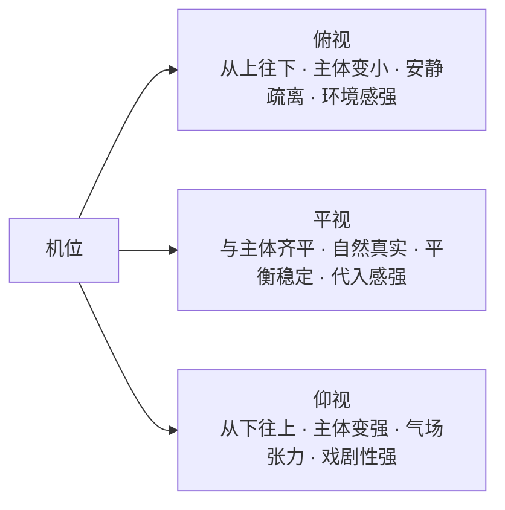
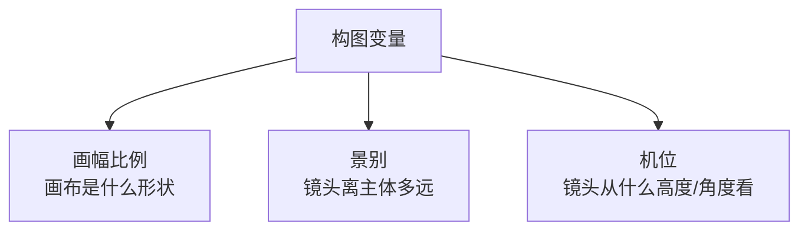

构图变量已经讲了两个模块：**画幅比例**（画布是什么形状）、**景别**（镜头离主体多远）。这一章是第三个——**机位**。

机位回答：

> **镜头从什么高度、什么角度去看主体？**

最基础也最常用的是三种：**俯视、平视、仰视**。它们不只是三个角度，各自会带出完全不同的心理感觉。

## 一、三种机位，各带来什么感觉



| 机位 | 镜头方向 | 主体感觉 | 画面重点 | 适合表达 |
|---|---|---|---|---|
| **俯视** | 从上往下 | 更小、更安静、被环境包围 | 地面、空间、环境关系 | 孤独、安静、疏离、设计感 |
| **平视** | 与主体齐平 | 自然、平衡、真实 | 主体本身与环境关系 | 真实、日常、平稳叙事 |
| **仰视** | 从下往上 | 更高大、更强势、有气场 | 轮廓、上方空间、张力 | 力量感、主角感、戏剧性 |

## 二、同一个主体，换机位，气质完全不同

用笔记里的例子——「雨夜城市街头，一位撑透明雨伞的年轻女性」——同一个主体，三种机位写出来是三种画面：

### 2.1 俯视：环境压过人物

镜头从高处向下看，画面收入了大面积湿润路面、街角和霓虹倒影，人物在城市空间里显得更小。重点不再只是「她是谁」，而是「她正被怎样的环境包围」——带出**安静、疏离、孤独、环境感**。


> 图 1：高机位俯视。地面反光和街道空间占据主要画面，人物成为环境中的一个视觉锚点。

**复现提示词（基于成图反推）：**

```text
写实电影摄影，雨夜霓虹城市街头，一位年轻东亚女性穿米色风衣，
手持透明雨伞，独自站在湿润的十字路口，路面反射青蓝、洋红与橙色霓虹，
细密雨丝，真实皮肤和衣料质感，克制的电影调色，高动态范围。

采用高机位俯视，镜头从街道上方向下拍摄，人物全身位于画面中下部，
展示大面积湿润路面、弧形街角和霓虹倒影，让人物显得较小并被城市包围，
强调环境关系、空间感与孤独感，竖构图，深景深。
```

### 2.2 平视：观众与人物处在同一现场

镜头与人物视线大致齐平，最像「我们就站在她面前」。人物和街道各自保留足够信息，没有谁压过谁，因此画面最自然，也最容易产生**真实、平衡、代入感**。


> 图 2：平视机位。人物的目光、表情和环境处在平衡关系中，画面更接近日常观看经验。

**复现提示词（基于成图反推）：**

```text
写实电影摄影，雨夜霓虹城市街头，一位年轻东亚女性穿米色风衣，
手持透明雨伞，站在湿润的人行道旁，路面反射青蓝、洋红与橙色霓虹，
细密雨丝，真实皮肤和衣料质感，克制的电影调色，高动态范围。

采用平视机位，镜头与人物眼睛处于大致相同高度，以自然客观的视角拍摄，
人物以中近景回望镜头，主体与街道环境保持平衡，背景车灯形成柔和散景，
强调真实感、直接连接与现场感，横构图，浅景深。
```

### 2.3 仰视：人物获得主角气场

镜头从低位向上看，人物的轮廓变得更挺拔，伞面和两侧建筑向上展开。观众不再与人物平等对视，而是在「仰望」她——画面因此获得**力量感、戏剧性、主角感**。


> 图 3：低机位仰视。建筑和霓虹招牌沿画面两侧向上延伸，人物被塑造成城市夜景中的主角。

**复现提示词（基于成图反推）：**

```text
写实电影摄影，雨夜霓虹城市街头，一位年轻东亚女性穿米色风衣，
手持透明雨伞，站在高楼与霓虹招牌之间，青蓝、洋红与红色灯光穿过雨幕，
细密雨丝，真实皮肤和衣料质感，克制的电影调色，高动态范围。

采用低机位仰视，镜头从人物腰部以下的位置向上拍摄，使用轻微广角透视，
让人物显得更挺拔、更有存在感，透明伞、高楼和霓虹招牌向画面上方延展，
强调力量、气场和戏剧张力，横构图，中等景深。
```

> 对照说明：PNG 文件没有保留原始生成 Prompt，所以上面三段是根据成图反推的复现版本，不是原始生成记录。这组三张图的画幅和景别也有差异，适合直观理解机位效果，但不属于严格的单变量实验。若要做严谨 A/B 对照，还需要同时锁定画幅比例、景别、Seed、模型和参考图。

### 2.4 真正需要替换的机位变量

如果其他条件已经锁定，三段 Prompt 真正需要替换的只有这一段：

```text
俯视：镜头从主体上方轻微向下拍摄，能看到更多地面反光和环境空间关系。
平视：镜头与人物视线大致同一高度，以自然、真实、平衡的方式观察主体。
仰视：镜头从较低位置向上拍摄，让主体更挺拔、更有气场和存在感。
```

## 三、可复用的「机位变量」模板

把机位写成独立模块，替换三档即可：

```text
俯视：采用俯视机位，镜头从主体上方向下拍摄，
      让观众看到更多环境、地面或空间布局，
      主体显得相对更小，强调环境关系与空间感。

平视：采用平视机位，镜头与主体视线高度基本一致，
      以自然、客观、真实的方式呈现主体，
      画面更平衡稳定，强调与主体的直接连接。

仰视：采用仰视机位，镜头从较低位置向上拍摄，
      让主体显得更高大、更有存在感和气场，
      强调向上的空间延展与戏剧化效果。
```

## 四、最简记忆法

```text
俯视 → 我站高了往下看 → 主体变小，环境变强
平视 → 我和主体同一高度 → 最自然，最真实
仰视 → 我站低了往上看 → 主体变强，气场变大
```

## 五、机位对商品图同样关键

这一章的例子是人物场景，但机位对商品图一样决定气质：

- **俯视**：适合展示商品的**排列关系、空间布局**——比如桌面陈列、门店地面、多件商品摆拍。
- **平视**：最接近人看商品的自然视角，是**电商主图、官网产品图**最稳妥的选择。
- **仰视**：让商品显得**更高大、更有力量**——适合轮毂、整车这类想强调「气场」的汽配广告。

一句话：**机位决定了观众「仰望」还是「俯瞰」你的商品，这本身就是一种态度。**

## 六、收束：构图变量已经凑齐三个模块



- **画幅比例** → 决定空间往横还是往竖展开
- **景别** → 决定看整体还是看细节、主体占多大
- **机位** → 决定观众从什么视角看、带出什么情绪

这三个模块是构图的基础骨架。后面还可以继续加**主体位置**（居中/偏左/偏右/三分之一线）、**留白/负空间**、**视觉动线**（Z 形/S 形/对角线），但先把这三个搭稳，构图的「形状 + 远近 + 视角」就全有了。

## 参考来源

- 本文方法整理自商品图机位笔记；其中机位术语（overhead / eye-level / low-angle shot）为摄影与电影镜头的通用概念。
