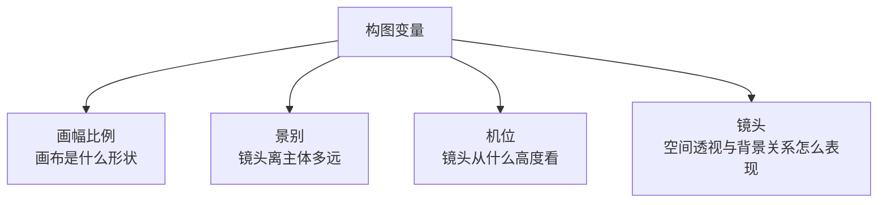

前面三章讲了画幅比例、景别、机位，这一章是构图变量的第四个模块——**镜头（Lens / Lens Feel）**。

先说清楚一个最容易混的点：**机位、景别、镜头，不是一回事**，它们控制的是不同层面。

## 一、先区分：景别、机位、镜头

| 模块 | 回答的问题 | 举例 |
|---|---|---|
| **景别** | 镜头离主体有多远？ | 全景 / 中景 / 近景 / 特写 |
| **机位** | 镜头从什么高度看主体？ | 俯视 / 平视 / 仰视 |
| **镜头** | 空间关系怎么表现？会不会变形？ | 正常 / 广角 / 长焦 / 微距 |

一句话记：

```text
景别 = 远近
机位 = 高低
镜头 = 空间表现方式
```

镜头最核心的作用，是决定：**空间透视感、主体和背景的关系、画面的张力、观众的观看体验、细节与空间谁更重要。**

## 二、四种镜头分别是什么意思

### 1）正常拍摄（Normal Lens）

接近人眼日常观看的感觉——不会明显夸张透视，也不会明显压缩空间，自然、稳定、客观、不夸张。主体比例自然，前后关系正常，观众容易代入。适合日常感、真实感、客观展示、通用商品展示、人像日常拍摄。

**提示词写法：**

```text
采用正常镜头拍摄，
画面透视自然，
空间关系真实，
主体比例正常，
整体呈现接近人眼观察的自然视觉效果。
```

英文短句：

```text
normal lens, natural perspective, realistic spatial relationship
```

---

### 2）广角（Wide Angle）

看得更宽，空间被拉开，透视更明显——前景更突出，背景更远，近大远小更明显，容易带来动势和张力。

**提示词写法：**

```text
采用广角镜头拍摄，
视野开阔，
空间透视明显，
前景更加突出，
背景向远处延展，
整体画面具有更强的空间感与临场感。
```

英文短句：

```text
wide-angle lens, expansive perspective, strong spatial depth, dramatic foreground emphasis
```

**广角的风险**：用得太狠容易主体边缘拉伸、人物比例变怪、商品变形、画面不够稳重——所以广角不一定适合所有商品图，尤其需要严格结构准确时。

---

### 3）长焦压缩（Telephoto Compression）

长焦的关键不只是「拉远拍近」，而是**把前后空间压缩，让背景看起来更靠近主体**——透视减弱，画面更平、更稳、更集中，背景更容易虚化，更有「高级摄影感」。

**提示词写法：**

```text
采用长焦镜头拍摄，
压缩前后景空间关系，
让背景更贴近主体，
整体透视更克制，
主体更加突出，
画面更具有凝练感和高级感。
```

英文短句：

```text
telephoto lens, compressed perspective, soft background separation, refined cinematic look
```

**长焦的核心理解**，一句话：

```text
广角是在「拉开空间」，长焦是在「压缩空间」。
```

---

### 4）微距特写（Macro）

极近距离看很小的细节——不是简单的「近景」，而是专门强调微小细节、纹理、材质、表面结构、肉眼不易注意的部分。景深很浅，背景大幅虚化，视觉焦点极度集中。

**提示词写法：**

```text
采用微距镜头拍摄，
极近距离聚焦主体局部细节，
突出材质纹理、表面结构和细腻工艺，
背景大幅虚化，
整体视觉焦点高度集中。
```

英文短句：

```text
macro lens, extreme close-up, fine texture detail, shallow depth of field, highly focused subject detail
```

---

## 三、同一个主体，只换镜头

继续沿用前面的例子——「雨夜城市街头，一位撑透明雨伞的年轻成年女性」。同一个主体、同一个场景，只换镜头，写出四组完整 Prompt。

### 1）正常拍摄 Prompt

```text
创建一张电影感人物场景图。

画面主体是一位年轻成年女性，站在雨夜城市街头，手持透明雨伞，穿浅米色风衣。背景可见模糊霓虹灯、潮湿街道与夜间车灯光斑。

采用正常镜头拍摄，
画面透视自然，
空间关系真实，
人物比例正常，
整体视觉效果接近人眼观察到的真实场景。

整体画面应自然、平衡、客观，
既保留人物主体，也保留适量城市夜景氛围。

normal lens, natural perspective, realistic spatial relationship, cinematic rainy city portrait, balanced composition.
```

---

### 2）广角 Prompt

```text
创建一张电影感人物场景图。

画面主体是一位年轻成年女性，站在雨夜城市街头，手持透明雨伞，穿浅米色风衣。周围可见更大范围的湿润街道、霓虹倒影、建筑立面和远处夜景灯光。

采用广角镜头拍摄，
画面视野开阔，
空间透视明显，
前景地面反光更突出，
背景街道向远处延展，
整体强化城市空间感与临场感。

人物位于环境之中，
同时成为场景的视觉核心，
整体氛围更开阔、更有动势和电影张力。

wide-angle lens, expansive perspective, strong spatial depth, neon reflections, rainy urban night, environmental cinematic shot.
```

---

### 3）长焦压缩 Prompt

```text
创建一张电影感人物场景图。

画面主体是一位年轻成年女性，站在雨夜城市街头，手持透明雨伞，穿浅米色风衣。背景可见被压缩并柔化的霓虹灯牌与城市灯光光斑。

采用长焦镜头拍摄，
压缩前后景空间关系，
让背景灯光看起来更贴近人物，
透视关系更加克制，
同时通过浅景深让主体与背景自然分离。

整体画面更凝练、更聚焦，
人物更突出，
背景形成柔和密集的夜景氛围，
整体更有高级感与电影人像气质。

telephoto lens, compressed perspective, soft neon background, cinematic portrait, shallow depth of field, refined urban night atmosphere.
```

---

### 4）微距特写 Prompt

```text
创建一张电影感人物细节图。

画面聚焦一位年轻成年女性在雨夜城市街头的局部细节。透明雨伞边缘带有细密雨滴，人物脸侧被霓虹光映亮，湿润发丝贴近脸颊。

采用微距镜头拍摄，
极近距离聚焦人物局部细节，
重点表现雨滴、皮肤质感、发丝细节、透明伞面的水珠与彩色霓虹反射。
背景高度虚化，
整体视觉焦点极度集中，
突出细腻质感与电影氛围。

macro lens, extreme close-up, raindrops on umbrella, wet hair detail, neon reflections, shallow depth of field, cinematic detail shot.
```

---

## 四、四种镜头，一张表对照

| 镜头类型 | 空间感觉 | 主体感觉 | 背景感觉 | 适合表达 |
|---|---|---|---|---|
| 正常拍摄 | 自然真实 | 比例正常 | 真实不过分夸张 | 日常、客观、稳定 |
| 广角 | 空间拉开 | 前景更突出 | 背景更远、环境更多 | 开阔、动感、环境叙事 |
| 长焦压缩 | 空间压缩 | 主体更集中 | 背景更贴近、更容易虚化 | 高级、凝练、电影感 |
| 微距特写 | 空间被忽略 | 局部被放大 | 背景极弱 | 细节、材质、工艺 |

## 五、可直接复用的「镜头模块模板」

写 Prompt 时，把镜头作为独立模块加进去，四种各一段。

### 1）正常拍摄模板

```text
采用正常镜头拍摄，
画面透视自然，
空间关系真实，
主体比例正常，
整体呈现接近人眼观察的自然视觉效果。
```

### 2）广角模板

```text
采用广角镜头拍摄，
视野更加开阔，
空间透视更明显，
前景更突出，
背景向远处延展，
整体强化空间感、临场感与环境叙事感。
```

### 3）长焦压缩模板

```text
采用长焦镜头拍摄，
压缩前后景空间关系，
使背景更贴近主体，
透视更克制，
主体更加突出，
整体更具凝练感、高级感和电影氛围。
```

### 4）微距特写模板

```text
采用微距镜头拍摄，
极近距离聚焦主体局部，
突出材质纹理、表面结构和细腻细节，
背景大幅虚化，
整体视觉焦点高度集中。
```

## 六、最简记忆法

```text
正常镜头 → 像人平常在看
广角     → 看得更宽，空间被拉开
长焦     → 把空间压扁，背景更贴近主体
微距     → 把很小的细节放大来看
```

## 七、收束：构图模块已经凑齐四个基础层



- **画幅比例** → 空间往横还是往竖
- **景别** → 看整体还是看细节
- **机位** → 从什么视角、带出什么情绪
- **镜头** → 空间被拉开、压缩，还是细节被放大

这四个模块管住了构图的「形状 + 远近 + 视角 + 空间变形」。下一步通常是**主体位置**（居中 / 偏左 / 偏右 / 三分法）——它会把前面四个模块真正落到画面布局上。

## 参考来源

- 本文方法整理自商品图镜头笔记；其中镜头术语（wide-angle / telephoto / macro lens）为摄影与电影镜头的通用概念。
