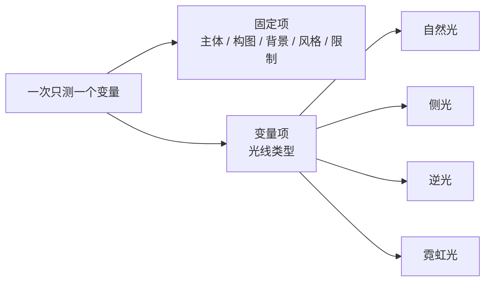
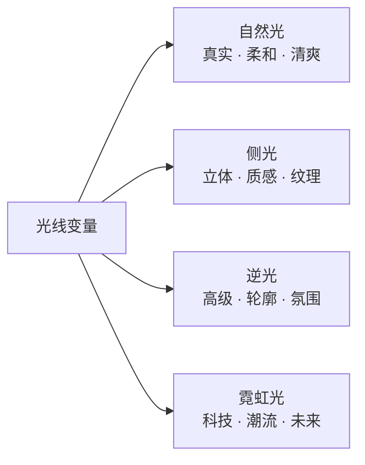

第二章把 Prompt 拆成了五维公式，其中有一维特别容易被当成「随便写写」——**Lighting（光线）**。

很多人写商品图时，光线是顺手带一句 `good lighting` 就完了。但光线恰恰是「同一张商品图能长成完全不同的东西」的关键变量：它决定这张图是电商白底的清爽、还是广告海报的高级感。

这一章回答一个问题：

> **我想知道哪种光最适合这个商品，该怎么测？**

结论先说：**唯一正确的做法是控制变量——主体、构图、背景、风格全部锁定，只换光线。** 否则你看到的「效果差异」根本不知道是光带来的，还是别的变量在捣乱。

## 一、先校准：你测的其实是「光线变量」

很多人一开始会把「测逆光」和「测主体方向」混在一起——换个角度、换个背景、再换个光，最后看不出到底哪个变量起了作用。

正确的模板公式应该是：

```text
Prompt = 主体锁定 + 场景基础 + 构图固定 + 光线变量 + 风格固定 + 限制条件
```

也就是：**商品主体不变 + 背景基础不变 + 构图不变 + 只改光线 + 整体风格不变 + 限制不变**。这样你才能得出一个干净的结论——到底哪一种光最适合这个商品。



## 二、四种光分别控制什么

在写 Prompt 之前，先搞清每种光的「语义」，否则你会乱用。

### 1. 自然光：真实、柔和、清爽

关键词是**真实、柔和、清爽、日常高级**。最适合白底商品图、官网产品图、清爽品牌感、生活方式轻商业图。

```text
柔和自然光 / 窗边漫射自然光 / 明亮均匀的日间光线 / 柔和 daylight
```

### 2. 侧光：立体感、轮廓感、质感

关键词是**立体感、轮廓感、质感强化、纹理更明显**。特别适合金属、皮革、轮廓复杂的商品——想突出表面凹凸、纹理、结构层次就选它。

```text
单侧打光 / 柔和侧光 / 从左侧照射的棚拍光线 / 强调表面纹理与阴影层次
```

### 3. 逆光：轮廓发光、氛围感、高级感

关键词是**轮廓发光、氛围感、高级感、戏剧性、边缘高光**。适合轮廓清晰的商品、品牌广告感、突出边缘线条——不是最标准的电商白底，但适合高级展示。

```text
逆光照明 / 背后主光源 / 边缘轮廓光 / rim light / backlit product photography
```

### 4. 霓虹光：科技感、潮流感、未来感

关键词是**科技感、夜景感、潮流感、未来感、蓝紫粉彩色氛围**。适合潮流产品、汽车改装、科技产品、视觉广告、情绪型主视觉。

```text
蓝紫色霓虹光 / 冷暖对比霓虹灯 / neon lighting / futuristic glow / urban night atmosphere
```



## 三、一套可复用的「母版模板」

把固定项写死，只留光线一处做变量，这套模板可以复用给任何商品：

```text
创建一张高质量专业商品图。

【主体锁定】
画面中的唯一主体是【商品名称】。
完整保留商品原有的造型、结构、比例、颜色、材质、表面纹理与细节特征，
不得变形、改色、重新设计或增加多余部件。
商品作为唯一视觉焦点，边缘清晰，细节完整，具有真实商业摄影质感。

【构图】
商品位于【构图位置】，约占画面【画面占比】，
整体构图稳定平衡，四周保留适当留白。

【背景】
背景采用【背景设定】，整体简洁干净，不喧宾夺主，用于衬托主体。

【光线】
采用【光线变量】，突出商品的【材质】、【轮廓】、【表面反光】和【立体感】。

【风格】
整体呈现【风格变量】，适合作为【用途】。

【限制】
禁止出现：第二个同类商品、人物、文字、Logo、水印、价格标签、杂乱道具、复杂场景。
```

## 四、四种光的「变量写法」，直接替换

母版里只有 `【光线】` 一段会变。下面四段就是可以直接塞进去的变量库。

**自然光**

```text
采用柔和自然光照明，模拟干净明亮的日间环境光，
整体光线通透、均匀、真实，阴影柔和自然，
突出商品本身的颜色、材质和细节，呈现清爽高级的商业摄影效果。
```

**侧光**

```text
采用柔和侧光照明，主光从画面一侧照射到商品表面，
形成自然的明暗过渡和轻微阴影，
增强商品的轮廓感、立体感和纹理层次，突出材质细节和结构变化。
```

**逆光**

```text
采用逆光照明，主光源位于商品后方，在商品边缘形成干净的轮廓高光，
增强轮廓线条和空间层次，前方保留适度补光避免主体过暗，
整体呈现高级、氛围感强的产品摄影效果。
```

**霓虹光**

```text
采用霓虹光照明，使用蓝紫色与冷色调灯光氛围，
在商品表面形成富有科技感的彩色反光，
增强未来感、潮流感和视觉冲击力，整体呈现夜景式、高级感的商业广告氛围。
```

## 五、一个完整示范：轮毂的自然光商品图

把母版填满，就是一组可直接用的 Prompt。其余三组只替换上面的「光线段」即可。

```text
创建一张高质量专业商品图。

画面中的唯一主体是一只枪灰色铝合金汽车轮毂。
完整保留轮毂原有的多辐造型、轮圈结构、中心盖、孔位、比例、
金属颜色、表面质感与反光效果，不得变形、改色或重新设计。

轮毂位于画面中央，占画面约45%，构图稳定平衡，四周保留适当留白。
背景为简洁干净的浅灰白摄影棚背景，不喧宾夺主。

采用柔和自然光照明，模拟明亮通透的日间环境光，光线均匀、真实、清爽，
阴影柔和自然，突出轮毂本身的金属色泽、真实材质和结构细节。

整体呈现真实、高级、干净的商业产品摄影风格，
适合作为电商商品图或官网产品展示图。

禁止出现第二个轮毂、人物、文字、Logo、水印、价格标签和杂乱背景。
```

## 六、实战结论：四种光，服务四个用途

测试完你会得到一个清晰映射——这四种光不是「谁更好」，而是「各管一段」：

| 光线 | 最适合的场景 | 一句话 |
|---|---|---|
| **自然光** | 电商主图、官网产品图 | 干净、真实、友好、清爽 |
| **侧光** | 材质细节图、高端产品图 | 突出材质、结构、纹理 |
| **逆光** | 品牌展示图、广告感海报 | 高级感、轮廓感、品牌视觉 |
| **霓虹光** | 宣传主视觉、社媒封面 | 潮流感、科技感、改装感 |

## 七、回到方法论：光线是「变量」，不是「描述」

这一章其实是第二章的一个直接推论：

> 五维公式里的每一维，都可以单独拿出来做「控制变量」。**把其他维锁死，只动一维，才能看清这一维到底贡献了什么。**

光线的测试如此，构图、风格、背景也一样。所以做商品图时，别把「换个光线试试」变成「重写一整段 Prompt」——那测不出任何东西。

真正该做的是：**建一套固定模板，维护一个光线变量库，然后只换一个槽位，快速出四张对照图。** 这才是 AI 生图里「工程化」和「碰运气」的分界线。

## 参考来源

- 本文方法整理自商品图光线方案笔记，其中光线语义与摄影术语（rim light、backlit、diffused light 等）为商业产品摄影通用概念。
