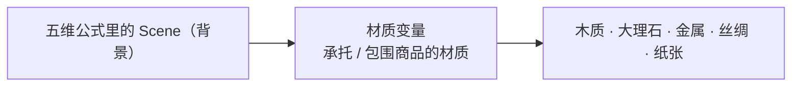
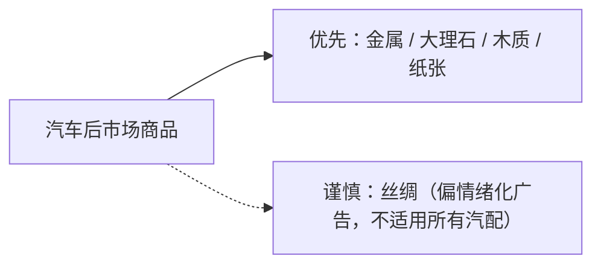

第三章讲「光线作为唯一变量」，这一章是它的对称——**材质作为唯一变量**。

做法一样，测的维度不同：

> 同一个商品主体、同一个角度、同一个构图、同一个光线逻辑不变，**只改变承载或包围商品的材质环境**。

同一个商品，垫在木头上、大理石上、丝绸上，气质完全不同。测这一维，回答的问题是「这个商品该配什么底」。

## 一、先校准：这里测的是「环境材质」，不是「商品材质」

一个容易搞混的点：这一章里，「商品本身的材质」是**锁死的**——模板里每次都写「完整保留商品原有的材质、表面纹理和细节，不得改色或重新设计」。

真正在变的是**承载/包围商品的材质环境**：桌面、背景、衬布。所以这是「背景 / Scene」那一维的深入，不是「Subject」那一维。



## 二、五种材质的视觉倾向

| 材质 | 主要感觉 | 更适合 |
|---|---|---|
| **木质** | 温暖、自然、可靠 | 生活方式、家居、手作、舒适型商品 |
| **大理石** | 高级、轻奢、干净 | 美妆、饰品、精品、高端产品 |
| **金属** | 科技、硬朗、性能 | 汽车配件、数码、机械、工业产品 |
| **丝绸** | 精致、奢华、柔美 | 珠宝、香水、美妆、礼品 |
| **纸张** | 极简、设计、编辑感 | 文创、包装、设计品牌、现代商品 |

材质不是「好看不好看」的中性背景，它自带情绪和调性——**选错承托材质，等于给商品套错了气质。**

## 三、可复用的「材质变量」母版

材质作为唯一变量，母版里只有「承托材质」一段会变：

```text
创建一张高质量专业商品摄影图。

【主体锁定】
画面中的唯一主体是【商品名称】，
完整保留商品原有的造型、结构、比例、颜色、材质、表面纹理和关键细节，
不得改变商品本身设计。

【构图】
商品位于画面中央（或中央偏右），主体约占画面 40%–50%，
保持稳定、简洁的商业产品构图。

【承托材质】
商品放置于【材质】表面上，背景与承托区域采用【材质质感描述】，
纹理【清晰但不过度抢眼 / 克制低调】，表面【哑光 / 微反光 / 柔光反射】。

【光线】
采用柔和商业摄影光线，让材质与商品形成自然对比，保留轻微接触阴影。

【风格】
整体呈现【视觉倾向】的高级商品摄影效果。

【限制】
禁止出现文字、Logo、水印、人物、第二个商品、杂乱纹理和复杂背景。
```

## 四、一个完整示范：金属（汽车后市场首选）

拿你常做的轮毂举例，金属承托是最自然的起点：

```text
创建一张高质量专业商品广告摄影图。

画面中的唯一主体是一只枪灰色铝合金汽车轮毂，
完整保留轮毂原有的多辐造型、轮圈结构、比例、金属颜色、材质和细节，
不得重新设计或改变商品本体。

轮毂位于画面中央偏右，占画面约 45%，形成具有力量感的稳定构图。

轮毂放置于高级金属材质平台上，
背景采用拉丝铝、钛灰金属或深灰哑光金属质感，
保留细腻、规则、克制的金属纹理，
表面具有适度反光和清晰的明暗变化，但避免过度镜面效果。

采用方向明确的商业侧光或轮廓光，
突出轮毂轮廓与金属背景之间的层次关系。

整体呈现冷静、硬朗、精密、科技、高性能的高级商业广告效果。

禁止出现文字、Logo、水印、人物、第二个轮毂、锈迹、脏污和过度镜面反射。
```

其余四种材质只需替换「承托材质」和「视觉倾向」两段。

## 五、汽车后市场商品的选型建议

不是所有材质都适合汽配。按笔记里的结论：



- **金属**：汽配的「本命材质」——科技、硬朗、性能，几乎不会错。
- **大理石**：想走「高端精品」路线时用，拉高调性。
- **木质**：想走「生活方式 / 温暖可靠」时用，软化工业感。
- **纸张**：想走「设计感 / 编辑感」品牌时用。
- **丝绸**：偏情绪化、奢华广告，汽配里只适合特定品牌主视觉，慎用。

## 六、回到方法论：单一变量的对称

这一章和第三章是一对对称结构——**同一个控制变量法，套在不同的维度上**：

| | 第三章 | 第五章 |
|---|---|---|
| 唯一变量 | 光线 | 承托材质 |
| 锁死的项 | 主体/构图/背景/风格 | 主体/角度/构图/光线 |
| 回答的问题 | 哪种光适合这个商品 | 哪种底适合这个商品 |
| 所属维度 | Lighting | Scene（背景） |

第二章把 Prompt 拆成五维；三、四、五章做的事，就是**逐维控制变量**——光线、情绪、材质，一个维度一个维度地测，把「哪种配置最适合哪个用途」积累成一张可复用的映射表。

这就是整个系列想传递的那句话：

> **AI 生图的工程化，不是「多试几套 Prompt」，而是「锁死其他变量，一次只测一个维度」。**

## 参考来源

- 本文方法整理自商品图材质变量笔记；其中材质与视觉倾向的对应，为商业产品摄影与材质设计的通用概念。
