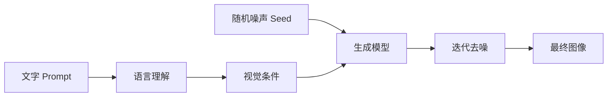
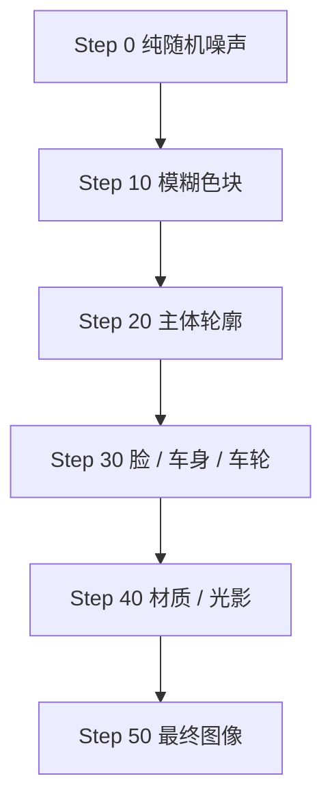
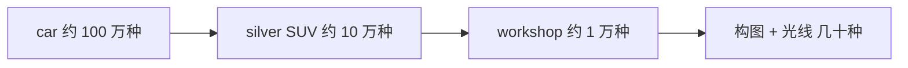

# AI 生图心法从 0 到 1：画面是「采样」出来的，不是「画」出来的

很多人第一次用 Midjourney 时，脑子里有一个默认模型：我输入一句话，它去一个巨大的图库里「找到」一张最像的图。

不是。

Midjourney 创始人 David Holz 把这套技术叫作 **imagination engine（想象力引擎）**。促成 AI 生图的两个关键突破，一个是机器对语言的理解，另一个是机器生成图像的能力；把两者拼起来，就变成了「通过理解语言来创建图像」。

更准确地说，AI 生图的过程是：

> **把语言转成一个「视觉可能性空间」，然后从一团随机噪声出发，在这个空间里一步一步找出一张符合你描述的图像。**

理解这句话，是理解后面所有「心法」的前提。

---

## 一、AI 不是在「画图」，是在「采样」

传统画画是「先有画面，再一笔一笔画出来」。AI 生图刚好反过来：你给条件，模型不断预测「什么样的像素 / 视觉结构更符合这些条件」。

整体可以拆成六个阶段：



这里有两个最容易误解的地方：

1. **模型学的不是「背图库」**，而是「概念 ↔ 视觉特征」的统计关系。它脑子里存的是「猫 ≈ 耳朵 + 眼睛 + 鼻子 + 毛发 + 脸部比例 + …」，而不是某一张具体的猫照片。
2. **真正的「画画」是去噪**。整个过程是从混沌逐渐变得有意义：



这也顺便解释了 AI 为什么会出六根手指、轮毂辐条不对、Logo 乱码——它做的是**视觉概率预测**，不是 CAD 那种「先建严格 3D 模型再渲染」。

---

## 二、Prompt 的本质：收缩概率空间，不是下命令

Midjourney 官方对 Prompt 的定义很直接：Prompt 是告诉你「希望看到什么」的文字，建议描述主体、媒介、环境、光线、颜色、情绪、构图。

所以：

```text
Prompt ≠ 操作指令
Prompt = 生成条件（Generation Conditions）
```

由此推出我认为最重要的一条心法：

> **提示词的本质不是描述得越多越好，而是不断减少「不希望出现的可能性」。**

写 `car`，可能有 100 万种画面；加 `silver SUV`，缩到 10 万；加 `modern workshop`，1 万；加 `front three-quarter view`，2000；加 `softbox commercial lighting`，几百；再加构图约束，可能只剩几十种高度接近你想法的解。



每加一个条件，都是在把「视觉概率空间」往你想要的区域收窄一格。

---

## 三、为什么 Midjourney 有「自己的审美」

你只写 `a car`，它也不会生成监控录像里那种丑车。因为 **Prompt 没规定的部分，会由模型自己的视觉先验补齐**——构图、光线、景深、色彩、质感，模型自己决定。

这就是两个参数的本质：

| 参数 | 作用 |
|---|---|
| `--stylize` | 控制模型有多少 "artistic creativity"（高 stylize = Prompt 严格度↓、自由发挥↑） |
| `--raw` | 减少这种「自动驾驶式风格化」，让用户拿到更直接的控制 |

所以最终图片其实是三者之和：

```text
最终图片 = 你的意图 + 模型审美 + 随机性
```

---

## 四、从原理到心法：四个可落地的招式

原理讲清楚之后，「心法」就都是它的推论。

**心法一：从「写句子」切换到「声明视觉变量」。**

不要写「请帮我生成一张图片，然后把一个男人放在左边，旁边放一辆银色的车……」这种自然语言说明书。改成声明式：

```text
35-year-old Asian male automotive technician,
navy workwear,
standing left of a silver luxury SUV,
modern workshop, medium shot, eye-level,
cinematic commercial lighting, clean composition
```

模型要的是**清晰的视觉条件**，不是操作手册。

**心法二：构图是给模型「空间约束」。**

九宫格、三角形、S 形、Z 形、框架式……这些构图法之所以有效，是因为你不是在「移动像素」，而是在给模型一个 **Spatial Constraints（空间约束）**，把无限种构图收敛到某条视觉路径附近。

**心法三：Seed 是「随机起点」，不是「角色锁定」。**

官方把 Seed 称为 initial spark，类比电视雪花的 random noise。同一个 Prompt 换 Seed，就是从另一团噪声出发，得到不同结果。但官方也提醒：Seed 只能控制初始噪声、方便实验，**不能真正保存某个角色或风格**。

**心法四：用负面约束直接剪掉不想要的空间。**

既然 Prompt 的本质是「减少不想要的可能性」，那最直接的做法就是显式排除——不想要什么，就明确写出来，把那一整片空间从采样范围里划掉。

---

## 五、一句心法

所有东西最终可以浓缩成一个公式：

```text
Image = f(Prompt, Reference, Model Prior, Seed, Parameters)
```

翻译成人话：

> **AI 生图 = 你的视觉意图 + 参考信息 + 模型已学到的世界 + 随机起点 + 控制参数。**

而 Prompt Engineering 真正做的事，就一句话：

> **控制「视觉概率空间」——不是教 AI 怎么画，而是不断定义约束，让生成模型从巨大的可能性空间里，收敛到你想要的区域。**

---

## 技术边界

Midjourney 并未公开当前模型的完整网络架构、训练数据配方与内部流程。「编码 → 噪声 → 条件生成 → 逐步成像」能很好地解释官方公开行为，但不应把 Stable Diffusion 某个具体版本的网络结构逐项说成 Midjourney 的内部实现。

## 参考来源

- [An Interview with David Holz — "It's an Engine for the Imagination"](https://blakeir.com/an-interview-with-david-holz-ceo-of-ai-image-generator-midjourney-its-an-engine-for-the-imagination)
- [Midjourney Docs — Prompt Basics](https://docs.midjourney.com/hc/en-us/articles/32023408776205-Prompt-Basics)
- [Midjourney Docs — Seeds](https://docs.midjourney.com/hc/en-us/articles/32604356340877-Seeds)
- [Midjourney Docs — Stylize](https://docs.midjourney.com/hc/en-us/articles/32196176868109-Stylize)
- [Midjourney Docs — Raw](https://docs.midjourney.com/hc/en-us/articles/32634113811853-Raw)
- [Midjourney Docs — Image Prompts](https://docs.midjourney.com/hc/en-us/articles/32040250122381-Image-Prompts)
