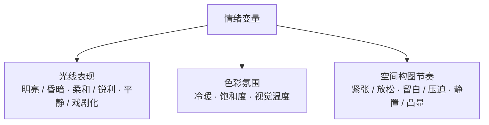

第三章讲的是「光线」这个**单一变量**——锁死其他所有维度，只换光。

但有一种情况你没法用单变量测：你想让同一张商品图，从「温柔」变成「神秘」。这时候你换的往往不止是光，还有颜色、还有构图。这就是这一章要讲的——**情绪变量**。

结论先说：**情绪不是 Prompt 里能直接写的一个参数，它是一个「组合变量」，由光线、色彩、空间节奏三者联动构成。** 想控制情绪，就得同时控制这三个底层变量。

## 一、校准：情绪不是孤立参数

很多人写情绪，会直接丢一个词上去：`happy`、`premium`、`moody`。但模型无法从一个抽象词反推出你要的画面。

商品图里的「情绪」，实际上由三个底层变量共同决定：



- **光线表现**：决定明暗、柔和度、平静还是戏剧化。
- **色彩氛围**：决定冷暖感、饱和度、视觉温度。
- **空间构图节奏**：决定画面紧张还是放松、留白多少、商品是「静置展示」还是「强势凸显」。

所以情绪变量的完整公式是：

```text
Prompt = 主体锁定 + 构图基础 + 背景基础 + 情绪变量

情绪变量 = 光线 + 色彩 + 空间节奏
```

## 二、五种情绪，各由三变量组成

把五种情绪拆开，每个都是一组「光线 + 色彩 + 空间」的特定配置：

| 情绪 | 光线表现 | 色彩氛围 | 空间构图节奏 | 商品图效果 |
|---|---|---|---|---|
| **柔和** | 漫射柔光、低反差 | 奶油白、浅灰、低饱和 | 平稳、温和、适中留白 | 温柔、细腻、亲和 |
| **安静** | 均匀柔光、低刺激 | 中性灰、雾蓝灰、低彩 | 极简、大留白、慢节奏 | 冷静、高级、克制 |
| **强烈** | 高反差、聚焦光 | 深色基底、高对比强调 | 视觉集中、焦点强 | 冲击力、力量感、广告感 |
| **神秘** | 局部光、轮廓光、暗部多 | 深蓝、深灰、黑、蓝紫 | 包裹感、深空间、克制 | 深邃、高级、故事感 |
| **轻松** | 明亮自然光、通透 | 清新浅色、浅暖、浅蓝绿 | 舒展、开放、轻盈 | 友好、轻快、生活化 |

这张表就是「情绪变量库」——同一个商品主体，只要替换这三行，情绪就切换。

## 三、可复用的「情绪变量生成器」

把三变量串成一段可直接替换的模块，就是通用的生成器模板：

```text
【情绪变量】
整体情绪为【情绪类型】。

通过【光线特征】塑造基础明暗关系，
通过【色彩氛围】建立视觉温度与情绪感受，
通过【空间与构图节奏】控制画面的松弛度、紧张度与高级感。

整体应让商品呈现出【目标视觉效果】，
同时保持商品主体清晰完整、真实可辨识、适合商业摄影展示。
```

以「神秘」为例，填入后：

```text
整体情绪为神秘。

采用克制的局部照明或轮廓光，商品主体被选择性照亮，
暗部保留更多层次，营造深邃而含蓄的视觉氛围。

色彩氛围以深灰、黑色、深蓝或蓝紫冷调为主，
整体饱和度控制在较低水平，形成安静但富有未知感的气质。

构图节奏克制而集中，空间具有一定深度与包裹感，
商品仿佛从暗处被缓缓呈现。
```

## 四、情绪变量 ≠ 光线变量的堆叠

这一章和第三章的关键区别，值得单独点出来：

| | 第三章·光线变量 | 第四章·情绪变量 |
|---|---|---|
| 变量类型 | **单一变量** | **组合变量** |
| 测试方式 | 只换光，其余全锁 | 光线+色彩+空间三者联动 |
| 回答的问题 | 哪种光适合这个商品 | 哪种情绪适合这个品牌/用途 |
| 适用 | 电商白底、官网产品图 | 品牌调性、广告主视觉、社媒封面 |

情绪是比光线更高一层的抽象：**同一种光线，配上不同色彩和构图，会得到完全不同的情绪。** 反之，同一种情绪（比如「安静」），也可以由多组光线+色彩组合逼近。所以别把情绪理解成「光线的另一种叫法」——它是三个维度的组合。

## 五、回到方法论：变量有两个层级

到这里，四章串成了一条完整的递进链：


第二章的五维公式，是把 Prompt 拆成**维度**；第三、四章则是在这些维度上做**控制变量测试**——区别只在于，有的变量是一维（光线），有的变量是一组维度的组合（情绪 = 光线 + 色彩 + 空间节奏）。

所以真正工程化的做法不是「这个商品多试几套 Prompt」，而是：

1. 把五维公式当成**规格模板**；
2. 把每一维（或每一组维度）维护成一个**变量库**；
3. 测试时只动目标变量，其余锁死；
4. 最后得到「哪个变量值最适合哪个用途」的**映射表**。

这样，「AI 生图」就从「碰运气」变成了「有方法」。

## 参考来源

- 本文方法整理自商品图情绪变量笔记；其中光线、色彩、构图与情绪的对应关系，为商业产品摄影与视觉设计的通用概念。
