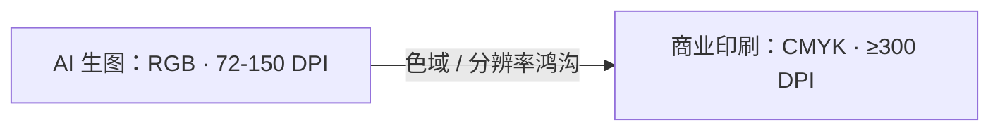
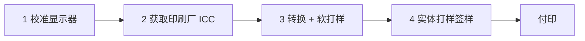

# AI 生图再惊艳，为什么一印刷就翻车：从像素到印刷的色彩鸿沟

上一篇文章讲了 AI 生图的原理——它是在「视觉概率空间」里采样。但这里有一个很少被提起的后续：**生成出来的图，最后要落在哪里？**

如果只是发朋友圈、做 PPT，RGB 屏幕图完全够用。可一旦进入真实生产——包装、海报、画册要上印刷机——很多用 Midjourney、Stable Diffusion 做的「屏幕惊艳」的图，印出来却满是噪点和色偏。

这篇观察基于包装行业的一篇文章，把我从「生图 → 印刷」这条链路里读到的几个关键点整理出来。原文有推广成分，这里先剥离掉，只留技术干货。

## 观察一：噪点不是 AI 的 bug，是色域转换的必然

核心矛盾一句话：

> AI 生图工具默认输出的是「屏幕标准」（RGB + 72~150 DPI），而商业印刷的基础是「印刷标准」（CMYK + 至少 300 DPI）。两者在色域和网点形成机制上根本不同。

- **RGB 是加色模式**：红绿蓝三色光叠加发光，色域广，能表现高饱和的荧光色、亮蓝、亮绿。AI 工具在这种模式下创作，天生就能生成很「炸」的颜色。
- **CMYK 是减色模式**：青、品红、黄、黑四色油墨叠加吸光，色域窄。纯蓝、亮绿、荧光色正是 CMYK 的「死区」。

所以问题不在 AI，而在于：**当一张 RGB 图被强制转成 CMYK 时，超出 CMYK 色域的颜色无法被还原，只能被「压缩」到最近的可印刷色，于是层次丢失、形成色块或噪点。**

这是「翻车」的第一层原因，也是最根本的一层。

## 观察二：清晰度由「网线数」决定，不是「像素数」

印刷品的清晰度，取决于**印刷网线数（LPI，Lines Per Inch）**，而不是我们熟悉的像素分辨率（DPI）。

行业通用的换算：**图像分辨率（DPI）≈ 网线数（LPI）× 1.5 ~ 2**。

| 印刷场景 | 网线数 LPI | 最低 DPI |
|---|---|---|
| 普通包装盒 / 海报 | 150 | 225–300 |
| 高端画册 / 精品包装 | 175–200 | 263–400 |
| 超精细防伪印刷 | 250+ | 375+ |

AI 工具输出的图通常只有 72~150 DPI。在 150 LPI 的印刷条件下放大，像素点会暴露出来，和印刷网点叠加，产生**莫尔条纹**和视觉噪点。

所以「屏幕上看挺清楚」和「印出来清楚」是两回事——前者只看像素，后者要看像素和网点的匹配。

## 观察三：缺的不是像素，是「翻译字典」

还有一个更隐蔽的问题：AI 工具输出的 JPG/PNG，往往**不携带（或携带不准）ICC 色彩配置文件**。

ICC 是「色彩身份证」，它定义了一个设备能复现的色彩范围（色域）。没有它，印刷机就相当于在缺一本「翻译字典」的情况下解读你的文件——每个设备都按自己的理解来，颜色必然跑偏。

色彩管理的本质，就是在输入设备（显示器）、处理设备（电脑）、输出设备（印刷机）之间，建立一个基于统一 ICC 的、**可预测的转换与补偿流程**。

## 一个可复制的四步闭环

1. **校准显示器**：用硬件校色仪（如 X-Rite i1 Display Pro），目标 D65 光源、120 cd/m²。没校准的屏幕不可信。
2. **拿到印刷厂的 ICC**：这是色彩转换的「目标靶心」。同一条产线、同一种纸、同一种墨，才对应一份专属 ICC。
3. **转换 + 软打样**：把图从 sRGB 转到目标 CMYK 配置文件（如 Fogra39 铜版纸、Fogra47 哑粉纸），并开「校样设置」做软打样，在屏幕上模拟印刷效果，提前发现噪点和色偏。
4. **实体打样签样**：付印前输出数码打样（Digital Proof），以样张为标准签样——这是法律和商业上认可的色彩交付依据。

几个容易被忽略的细节：

- 转换时用「不重采样」的方式把分辨率调到 300 DPI，而不是硬放大。
- 大面积深色要控制**总墨量**（CMYK 四色之和），250g/m² 以下的纸一般不超过 280%；黑色用「富黑」（C60 M40 Y40 K100），而不是四色黑（C100 M100 Y100 K100）。

## 一个有意思的辩证：AI 既制造问题，也在解决问题

这篇文章最值得记的一点，是它把「AI」放在了问题链的两端：

- **制造问题**：AI 生图工具默认输出屏幕标准，把不满足印刷要求的图直接交到了设计师手里。
- **解决问题**：AI 也在反过来补这条链路——智能校色（识别超色域区域并基于上下文修复，而不是粗暴裁剪）、虚拟打样预测（输入纸张油墨参数预测网点扩大率）、以及把 CMYK + 300 DPI 预设直接内置进设计工具。

换句话说，**「生成」和「交付」是两个标准**。AI 现在擅长前者，正在补后者。

## 落到自己：生图的最后一公里是「交付标准」

这个观察对我的生图工作有一个直接提醒：做 AI 生图产品，不能只盯「画面好不好看」。

生成一张屏幕图，和生成一张「能上印刷机、能落地到实体」的图，中间隔着一整套色彩管理。如果下游是印刷、包装这类真实生产，那**输出标准（CMYK + 300 DPI + 正确 ICC）应该从生成的那一刻就被内置**，而不是事后补救。

## 来源

本文观察来自盒艺家（heyijiapack.com）的行业文章《AI 绘画工具生成的包装图，为何印刷出来全是噪点？》。原文含推广成分，这里只保留了技术干货；文中涉及的行业参数（DPI/LPI 换算、ICC 配置文件、总墨量控制等）为印刷行业通用标准。
