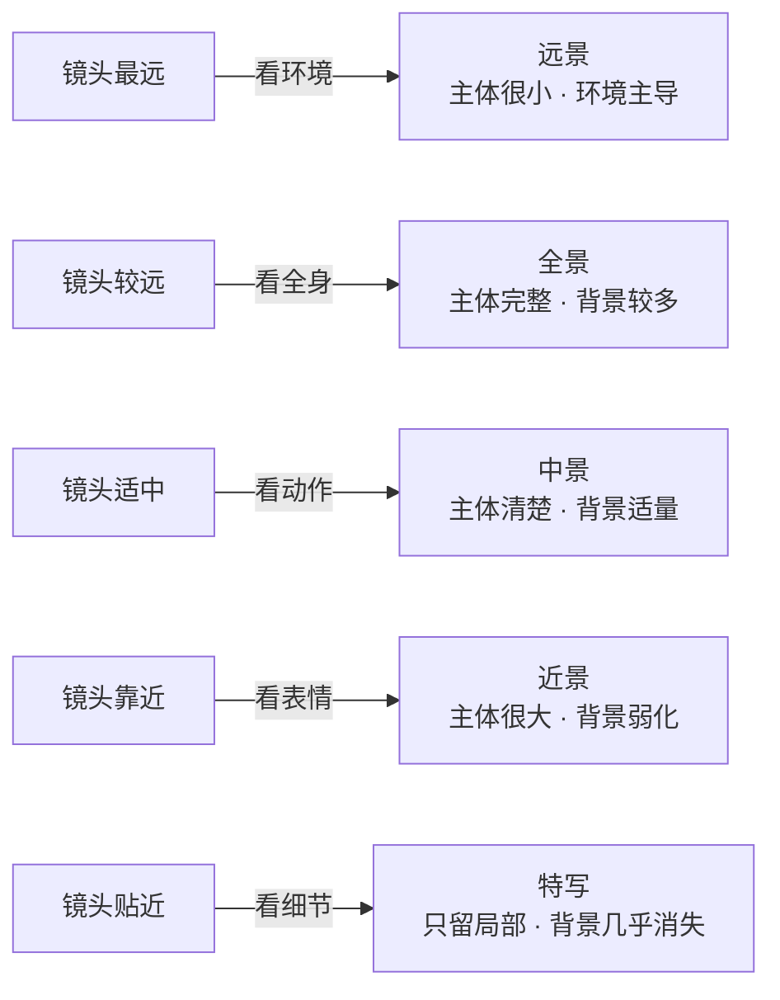

第七章的画幅比例回答「画布是什么形状」，这一章的景别回答另一个问题：

> **镜头离主体有多远？主体在画面里占多大？观众先看「整体」还是先看「细节」？**

同样是构图变量，**画幅管空间框架，景别管主体尺度。** 两个模块搭起来，构图才真正立得住。

## 一、景别是什么

景别的本质，是**主体在画面中的远近程度**：



它一次控制四件事：**主体占比、背景多少、信息重心、观众先看整体还是细节。**

## 二、核心公式：景别 = 主体占比 + 背景信息量 + 细节强调程度

记住这条最简单的换算：

```text
主体越小 → 景别越远 → 背景越多 → 讲「环境」
主体越大 → 景别越近 → 细节越强 → 讲「重点」
```

## 三、五种景别，一张表看懂

| 景别 | 主体占比 | 背景信息 | 强调重点 | 常见用途 |
|---|---|---|---|---|
| **远景** | 20% 以下 | 很多 | 环境、空间、氛围 | 城市氛围图、开场画面、宽屏 Banner |
| **全景** | 20%–40% | 较多 | 完整主体与环境关系 | 人物全身、产品场景图、空间展示 |
| **中景** | 40%–60% | 中等 | 主体动作与整体造型 | 商品主图、人物叙事、介绍图 |
| **近景** | 60%–80% | 少 | 表情、结构与局部重点 | 卖点图、详情图、人物肖像 |
| **特写** | 80% 以上 | 极少 | 材质、纹理、工艺细节 | 细节广告图、质感图 |

原文把「远景」和「全景」合并成一档，但两者解决的问题不同：**远景先交代世界，全景先交代完整主体。** 对人物来说，全景通常至少完整保留从头到脚；远景则允许人物缩得更小，让空间成为真正主角。

## 四、同一雨夜主题，五种景别怎么变化

下面统一使用「雨夜霓虹街头，一位穿米色风衣、撑透明雨伞的年轻女性」作为主题。PNG 文件没有保存原始生成 Prompt，因此这里给出的是**基于成图反推的复现提示词**，不是原始生成记录。

### 4.1 远景：先看到城市，再看到人物


> 图 1：人物只占画面很小一部分，霓虹街道、湿地倒影和建筑空间共同承担叙事。远景讲的是「人在哪里」。

**复现提示词（基于成图反推）：**

```text
写实电影摄影，雨夜霓虹城市大道，一位年轻女性穿米色风衣，手持透明雨伞，
独自站在湿润街道上，青蓝与洋红灯光在路面形成大面积倒影，细密雨幕，
克制的电影调色，高动态范围。

采用远景构图，镜头距离人物很远，人物完整但只占画面约 10%–15%，
保留大面积街道、建筑和夜空，让环境成为主体，强调城市尺度、孤独感与空间氛围，
16:9 横构图，深景深。
```

### 4.2 全景：完整看清人物和她所处的空间


> 图 2：人物从头到脚完整出现，环境仍然清楚，但观看重点已经从「城市」转向「城市中的人」。

**复现提示词（基于成图反推）：**

```text
写实电影摄影，雨夜霓虹城市街头，一位年轻女性穿米色风衣，手持透明雨伞，
站在湿润街道中央，青蓝、红色与橙色灯光倒映在路面，真实雨水与衣料质感，
克制的电影调色，高动态范围。

采用全景 / full shot 构图，完整呈现人物从头到脚，人物占画面约 30%–40%，
同时保留两侧建筑、街道纵深和地面倒影，强调完整动作、人物轮廓与环境关系，
16:9 横构图，中等景深。
```

### 4.3 中景：主体动作成为重点


> 图 3：画面收紧到人物主要身体区域，撑伞、回望等动作看得更清楚，同时还保留足够背景交代雨夜场景。

**复现提示词（基于成图反推）：**

```text
写实电影摄影，雨夜霓虹城市街头，一位年轻女性穿米色风衣，手持透明雨伞，
转身回望镜头，湿润街道反射暖色车灯与霓虹，真实皮肤、雨水和衣料质感，
自然电影调色。

采用中景构图，镜头距离适中，画面保留人物约膝部或腰部以上，
人物占画面约 50%–60%，动作和整体造型清楚，背景街灯柔和虚化但仍可辨认，
4:3 横构图，浅景深。
```

### 4.4 近景：表情压过环境


> 图 4：人物上半身和面部成为绝对重点，城市只剩下色彩与光斑。近景讲的是「她此刻是什么状态」。

**复现提示词（基于成图反推）：**

```text
写实电影人像摄影，雨夜霓虹街头，一位年轻女性穿米色风衣，手持透明雨伞，
侧脸望向远处，雨滴附着在伞面和衣服上，暖橙、红色与蓝色霓虹形成背景光斑，
真实皮肤和湿发细节，克制的电影调色。

采用近景构图，画面集中在人物腰部或胸部以上，人物占画面约 70%–80%，
突出面部表情、眼神和透明伞，背景大幅虚化，只保留雨夜城市的色彩提示，
2:3 竖构图，浅景深，人眼清晰对焦。
```

### 4.5 特写：只保留最关键的视觉细节


> 图 5：画面裁到半张脸、一只眼睛和伞沿雨滴，人物身份与城市空间退到次要位置，注意力集中到眼神、皮肤和水珠。

**复现提示词（基于成图反推）：**

```text
写实电影人像特写，雨夜霓虹灯下，透明雨伞遮住部分面部，
湿发贴在皮肤上，雨水和细小水珠清晰可见，青蓝与洋红霓虹映在眼睛和皮肤上，
高细节、真实质感、克制的电影调色。

采用大特写 / extreme close-up 构图，镜头非常靠近，只保留半张脸、单只眼睛与伞沿，
主体细节占画面 85% 以上，背景完全化成霓虹散景，强调眼神、睫毛、皮肤和雨滴纹理，
3:4 竖构图，极浅景深，眼睛精准对焦。
```

> 对照说明：这五张成图的画幅、人物外观和光线并没有完全锁死，因此适合建立景别直觉，但不是严格的单变量实验。若要验证景别本身的影响，还需要固定模型、Seed、参考图、画幅比例、机位、焦段和光线，只替换景别段。

## 五、商品图里怎么选景别

这是最实战的一条：

- **商品主图** → 用**中景**：完整看清商品、识别明确、不过度环境、不过度细节。
- **详情页卖点图** → 用**近景 + 特写**：详情页要的是结构、材质、工艺、功能细节。
- **品牌氛围图 / Banner** → 用**远景 + 全景**：先交代场景，再建立主体与环境的关系。
- **高级广告图** → 组合一套：一张中景主图 + 一张近景细节图 + 一张特写材质图，构成完整视觉层级。

## 六、景别和画幅比例是联动的

两个模块不是独立选，而是配对使用：

| 组合 | 适合 |
|---|---|
| 16:9 + 远景/全景 | 场景展示、品牌氛围、宽屏 Banner（横向空间大，装得下环境） |
| 4:3 + 中景 | 商品宣传图、官网模块、公众号配图（稳定 + 清楚） |
| 3:4 + 近景 | 竖版海报、小红书封面、商品重点图 |
| 9:16 + 近景/中景 | 抖音封面、视频分镜、竖屏商品视觉 |
| 1:1 + 中景/特写 | 电商方图、社媒卡片、细节展示方图 |

## 七、可复用的「景别变量」模板

把景别写成独立模块，替换五档即可：

```text
【景别】
采用【远景 / 全景 / 中景 / 近景 / 特写】构图。

镜头与主体的距离为【很远 / 较远 / 适中 / 较近 / 非常近】，
让主体在画面中占比约【比例】。

背景信息【很多 / 较多 / 适量 / 较少 / 几乎没有】，
整体重点放在【环境氛围 / 完整主体 / 主体动作 / 表情结构 / 细节材质】上。
```

五档的可替换写法：

```text
远景：镜头距离主体很远，主体占比低于 20%，让环境主导画面，强调空间与氛围。
全景：镜头距离主体较远，完整展示主体全貌，主体占比 20%–40%，强调完整轮廓与环境关系。
中景：镜头距离适中，主体主要部分清晰，主体占比 40%–60%，强调动作、造型与平衡。
近景：镜头靠近主体，主体占比 60%–80%，背景大幅简化，强调结构与局部亮点。
特写：镜头非常靠近，只聚焦关键局部，背景几乎虚化，强调材质、纹理与工艺。
```

## 八、用轮毂举例：商品主图为什么常用中景

- **远景**：轮毂只作为整车与空间中的小元素，先看到场景氛围。
- **全景**：轮毂与整车或展示空间同时出现，强调完整环境关系。
- **中景**：完整展示单个轮毂本体，结构和造型清楚，背景适量弱化。
- **近景**：轮毂更大，重点看辐条结构、边缘反光和层次。
- **特写**：只拍中心盖、孔位、切削纹理或某组辐条，看细节工艺。


> 图 6：轮毂完整出现在画面中，主体占比适中，外轮廓、辐条、孔位和表面反光都能看清，同时还保留背景与地面空间。这就是典型的商品中景主图。

**复现提示词（基于成图反推）：**

```text
商业产品摄影，一只枪灰色多辐合金轮毂竖直摆放，正面朝向镜头，居中构图，
完整保留轮毂外轮廓、辐条、中心盖和五个孔位，深色摄影棚背景，
左侧蓝色轮廓光、右侧洋红轮廓光，金属表面呈现细腻高光与切削层次，
光洁地面带轻微倒影，高级汽车广告质感。

采用商品中景，轮毂占画面约 55%–65%，四周保留适量负空间，
完整造型清楚但不过度贴边，正面平视，1:1 方形构图，主体全清晰。
```

## 九、最简记忆法

两个构图模块，各回答一个问题：

```text
画幅比例 → 画布长什么样？（决定空间框架）
景别     → 镜头离主体多远？（决定主体尺度）
```

所以：

- **比例** 决定「横着还是竖着、空间往哪展开」
- **景别** 决定「看整体还是看细节、主体占多大」

构图变量先搭起这两个基础层，你的 Prompt 就已经比「随手写」系统得多了。下一章继续讲**机位**：镜头是从上往下、平视，还是从下往上看主体。画幅、景别、机位组合起来，才形成完整的「空间框架 + 主体尺度 + 观看角度」。

## 参考来源

- 本文方法整理自商品图景别笔记；其中景别术语（wide/medium/close-up/macro shot）为摄影与电影镜头的通用概念。
