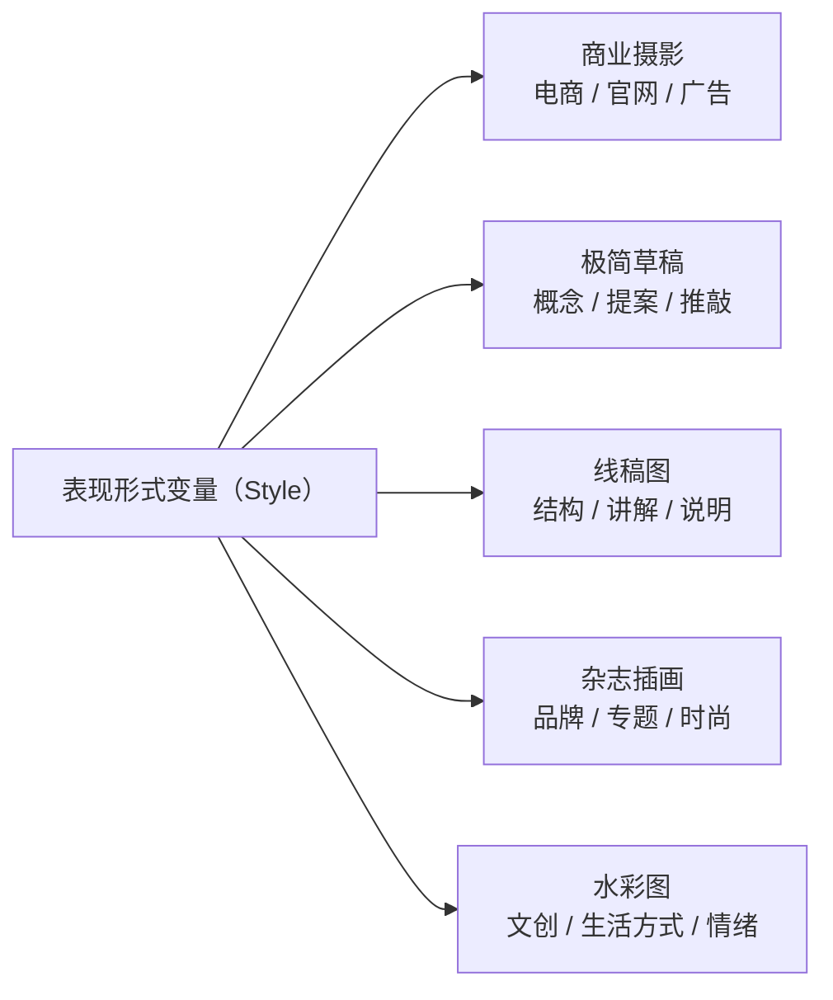
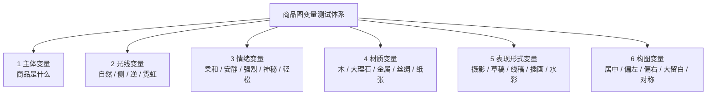

前面几章测了光线、情绪、材质，都是「商品长什么样」的不同侧面。这一章测的是另一个维度——**表现形式**：同一个商品，用「摄影」还是「线稿」还是「水彩」来呈现。

这是第二章五维公式里 **Style（怎么表现）** 那一维的深入：

> 同一个商品主体不变、构图不变、角度不变、背景复杂度尽量不变，**只改变最终的视觉表达方式 / 呈现媒介风格。**

## 一、五种表现形式，各自干什么

| 表现形式 | 主要特点 | 适合的用途 |
|---|---|---|
| **商业摄影** | 真实、清晰、专业、材质准确 | 电商主图、官网产品页、品牌广告 |
| **极简草稿** | 克制、概念感、设计推敲感 | 概念展示、方案草图、创意提案 |
| **线稿图** | 结构清晰、信息明确、理性 | 结构说明、设计表达、产品讲解 |
| **杂志插画** | 高级、编辑感、时尚化 | 品牌内容、专题海报、杂志视觉 |
| **水彩图** | 柔和、艺术、轻盈、温度感 | 文创视觉、生活方式内容、情绪海报 |

同一个商品，这五种表现形式的差别，比「换背景」大得多——它们几乎是五种不同的「媒介」，对应五种完全不同的使用场景。



## 二、一个关键区别：Style 控制「媒介」，不是「内容」

和第四章的情绪变量一样，表现形式也不是「换几个词」那么简单，它改变的是**整个视觉语言**：

- **商业摄影**：要真实光影、准确材质、棚拍质感。
- **极简草稿**：要克制线条、结构概括，**不追求真实材质、不强调光影**。
- **线稿图**：只要轮廓和结构，**不做大面积上色、不要写实**。
- **杂志插画**：要色块、版面感、编辑感，**但保留商品识别性**。
- **水彩图**：要晕染、透明色、纸张纹理，**拒绝厚重油画感和写实**。

注意每种形式的「否定项」——草稿/线稿/水彩都明确写「不追求真实材质」「不要写实」，因为它们和「商业摄影」是相反方向。**选错表现形式，等于用错误的媒介去表达商品。**

## 三、可复用的「表现形式变量」母版

母版里只有「表现形式」一段会变：

```text
创建一张【表现形式】的商品图。

【主体锁定】
画面中的唯一主体是【商品名称】，
完整保留商品原有的核心造型、比例、识别性设计特征，
在【表现形式】中仍然清晰可辨。

【构图】
商品位于画面中央（或中央偏右），主体约占画面 40%–50%，
构图稳定清晰，四周保留适当留白。

【表现形式】
整体采用【表现形式】，
【表现手法描述】，
【取舍：追求什么 / 不追求什么】。

【限制】
禁止出现文字、Logo、水印、人物、第二个商品、杂乱场景和【与表现形式冲突的元素】。
```

## 四、一个完整示范：线稿图

拿轮毂做结构说明，线稿是比摄影更合适的形式：

```text
创建一张清晰专业的商品线稿图。

画面中的唯一主体是一只枪灰色铝合金汽车轮毂，
完整保留轮毂原有的轮廓、结构、比例、边界关系和关键设计特征，
不得改变主体外形。

整体采用线稿图表现形式，
使用清晰、准确、干净的线条描绘轮毂，
重点表现外轮廓、内部结构分区、重要连接关系与造型节奏。
可使用主轮廓线与少量辅助结构线，线条有轻微粗细变化，但整体整洁统一。

背景保持纯白或浅色空白，不加入复杂场景，
不强调真实色彩和复杂材质，
画面重点在于「结构可读性」和「形态清晰度」。

禁止出现大面积上色、复杂阴影、写实照片效果、人物、文字水印和第二个轮毂。
```

其余四种只需替换「表现形式」和「取舍」两段。

## 五、收束：商品图变量的六类框架

写到这一章，整个「商品图变量测试」体系就齐了。笔记里其实已经给出了完整框架——商品图变量分成六类：



它们分别对应六类问题：

| 类别 | 回答的问题 | 对应章节 |
|---|---|---|
| 主体变量 | 商品是什么 | （基础，不测） |
| 光线变量 | 用哪种光 | 第三章 |
| 情绪变量 | 什么氛围 | 第四章 |
| 材质变量 | 什么底 | 第五章 |
| 表现形式变量 | 什么媒介 | 本章 |
| 构图变量 | 怎么摆 | （待写） |

整套体系的操作方式始终是同一句话：**锁死其他变量，一次只测一个维度。**

## 六、结语

从第一章的「概率空间」到这里，整个方法论的骨架已经完整：

- **原理层**：生图是在视觉概率空间里采样，Prompt 是收缩空间。
- **框架层**：Prompt 拆成五维/十层的视觉变量。
- **操作层**：把每一维做成「变量库」，用控制变量法逐维测试。

表现形式是这套体系的最后一块「可测维度」。剩下的「构图变量」（居中/偏左/对称/Z 形…），就是第二章心法二「空间约束」的展开——如果你想继续，下一篇可以补上它，让六类变量全部闭环。

## 参考来源

- 本文方法整理自商品图表现形式变量笔记；其中五种表现形式的术语（line art、watercolor、editorial illustration 等）为视觉设计与插画领域的通用概念。
