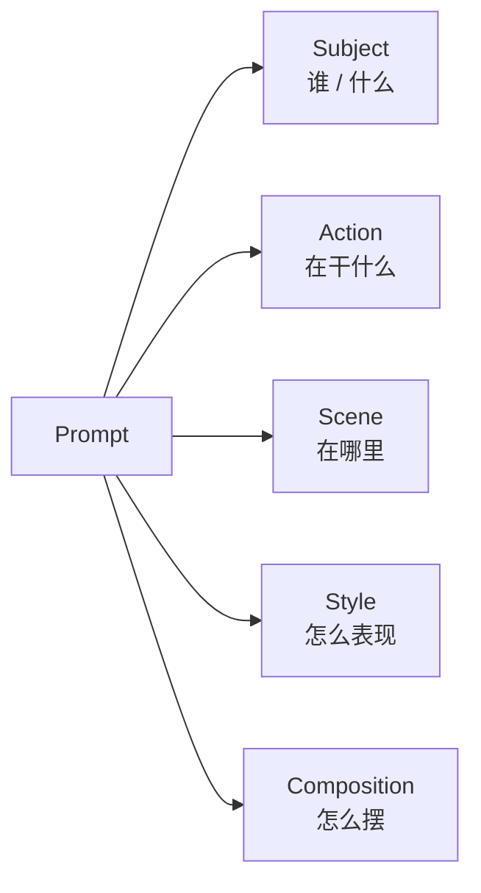
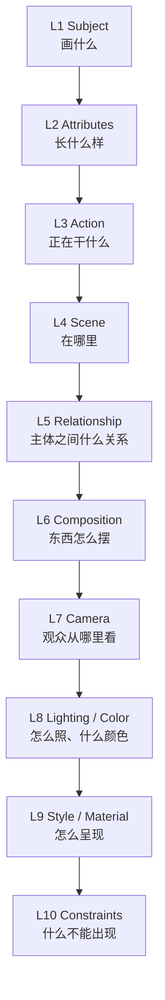

第一章讲了一个底层原理：**AI 生图不是「画」出来的，是在「视觉概率空间」里采样出来的**，而 Prompt 的本质，是不断收缩这个空间。

但那只是「为什么」。真正上手时你会卡在一个更具体的问题上：

> **我到底该往 Prompt 里填什么，才能让这张图更接近我脑子里那张？**

Midjourney 官方只告诉你「描述主体、媒介、环境、光线、颜色、情绪、构图」，但没说这些变量怎么组织、谁先谁后、各自管什么。这一章补上另一半——Google 的「视觉变量公式」，把 Prompt 拆成一套有层级、可复用的规格。

结论先说：**好的 Prompt 不是写一句漂亮话，而是建立一幅图像的「视觉规格」。**

## 一、Google 的五维公式

Google 官方并没有把所有图像生成统一写成唯一的数学公式，但它的 Imagen、Gemini Image、Veo 三套提示指南，反复围绕同一组变量组织 Prompt。其中 Imagen 最基础的框架只有三个词：

> **Subject（主体） + Background/Environment（背景/环境） + Style（风格）**

Gemini 图像生成进一步加了 **Action、Shot Type、Lighting、Mood、Camera/Lens、Aspect Ratio**。把它们合并、提炼，就得到一个非常实用的五维公式：

```text
Image = Subject + Action + Scene + Style + Composition
```

这五个模块，分别回答五个问题：

| 模块 | 回答的问题 | 控制的内容 |
|---|---|---|
| **Subject** | 谁 / 什么？ | 人物、产品、车辆 |
| **Action** | 在干什么？ | 动作、姿态、表情、互动 |
| **Scene** | 在哪里？ | 环境、时间、天气、背景 |
| **Style** | 怎么表现？ | 摄影、动漫、3D、插画 |
| **Composition** | 怎么摆？ | 位置、大小、镜头、留白、视觉路径 |



## 二、逐维拆开：每一维都在剪掉一片「不想要的可能性」

### 1. Subject：画谁

所有 Prompt 的第一层。Google Imagen 官方说，先想清楚主体是 object、person、animal 还是 scene。

```text
a man                          → 太宽泛
a 35-year-old Asian male automotive technician
                               → 确定了人、年龄、职业
+ short black hair, navy blue workwear, wireless microphone on his chest
                               → 进一步锁死外貌、服装、配件
```

Subject 回答的是：**画面里最重要的对象究竟是谁？** 对汽车行业同理——`SUV` 不如 `a silver premium electric SUV, large body, clean body panels, black panoramic roof, multi-spoke alloy wheels`。

### 2. Action：在干什么

Subject 只决定「谁出现」，Action 决定「发生了什么」。Google Gemini 的模板直接是：

```text
[subject], [action or expression], set in [environment]
```

`a mechanic` 只是一个人；`a mechanic inspecting an alloy wheel` 马上有了叙事；`a mechanic crouching beside the front wheel, carefully inspecting the wheel surface` 连姿势、身体方向、手部动作、视线都定住了。

Subject + Action 合起来，才形成真正的「主体关系」——第一章里说的「声明视觉变量」，到这一步才开始有画面感。

### 3. Scene：在哪里

`a man repairing a wheel` 的场景是未知的，模型可能自己选「车库 / 路边 / 赛车场 / 工厂 / 维修店」。加一句：

```text
inside a modern premium automotive modification workshop,
clean epoxy floor, vehicle lift in the background, organized tools
```

可能空间立刻收窄。注意 Scene 不只是「背景」，它包含地点、时间、天气、空间类型、前景、中景、背景、环境物体。

### 4. Style：怎么画

这是最容易和 Subject 混淆的一维。**Content ≠ Style**——Subject 回答「画什么」，Style 回答「用什么视觉语言表现它」。

同样的 `a mechanic standing beside a silver SUV`，加 `photorealistic automotive commercial photography` 趋向真实摄影；换成 `cute 2.5D stylized animation, cel-shading, clean outlines` 就成了 IP 插画风；再换 `minimalist flat vector illustration` 又是另一个东西。

### 5. Composition：怎么摆

最值得单独下功夫的一维。Google Gemini 官方明确建议用摄影和电影语言控制构图：

```text
wide-angle shot / macro shot / low-angle perspective / close-up
subject positioned bottom-right / significant negative space
```

Google 的极简模板甚至直接写「一个主体放在 bottom-right 或 top-left，留大量 negative space」。这就是第一章说的 **Spatial Constraints**——把无限种构图，收敛到某条视觉路径附近。

## 三、进阶：从五维到十层模型

五维公式加上摄影变量，就能升级成完整版：

```text
Prompt = Subject + Action + Scene + Composition
       + Camera + Lighting + Style + Color + Detail + Format
```

我把它整理成一个「AI 生图十层模型」，比单纯背五维更有价值：



这十层按「**WHAT → DOING WHAT → WHERE → WHERE IN FRAME → HOW WE SEE IT → HOW IT IS LIT → HOW IT LOOKS → CONSTRAINTS**」的链条逐层收窄。第一章里那些九宫格、三角形、S 形、Z 形、框架式构图，全部应该归入 **L6 Composition**，而不是孤立地学。

## 四、回到第一章：这套公式为什么成立

如果你只把五维/十层当成「背下来的清单」，就又退回了关键词堆砌。真正让它和第一章连起来的是这一层：

> **Google 的每一个变量，就是你在 Midjourney「视觉概率空间」里收缩时，要走的那一条轴。**

| Google 变量 | 剪掉的是哪片「不想要的可能性」 | 对应第一章的心法 |
|---|---|---|
| Subject | 排除其他所有主体 | 心法一：声明视觉变量 |
| Action | 排除静止/别的姿态 | 心法一 |
| Scene | 排除车库/路边/工厂的歧义 | 心法一 |
| Style | 排除写实/动漫/插画的歧义 | 心法四：剪掉不想要的空间 |
| Composition | 排除无限种构图 | 心法二：空间约束 |

Midjourney 给了「为什么」（收缩概率空间），Google 给了「在哪些轴上收缩」（变量清单）。两者是同一个动作的两面。

## 五、一个关键分歧：关键词流 vs 场景描述流

这是本章最值得记的一个差异点。Midjourney 和 Google Gemini 在**输入语法上方向相反**：

- **Midjourney** 偏「声明式变量」——用逗号堆视觉标签：`car, silver SUV, workshop, front three-quarter view, softbox lighting`。
- **Google Gemini 2026** 官方明确强调：**"Describe the scene, don't just list keywords."** ——不要只堆关键词，要描述一个完整场景：

```text
A middle-aged automotive technician stands beside a silver electric SUV
inside a clean modern workshop. He leans slightly toward the front wheel
while carefully inspecting the alloy rim. The scene is photographed from
eye level using a medium-wide composition, with the technician positioned
on the left third and the vehicle extending into the right side of the frame.
```

两种写法覆盖的是同一组变量（Subject / Action / Scene / Style / Composition），只是从「关键词列表」进化成了「视觉场景描述」。**换工具时，先确认它吃哪一种语法。**

## 六、一个完整案例：从「alloy wheel」到五维规格

```text
alloy wheel
                                    → 只有 Subject
a gunmetal alloy wheel standing upright
                                    → Subject + State
... inside a premium automotive studio
                                    → Subject + Action + Scene
premium automotive commercial photography, photorealistic
                                    → + Style
wheel positioned slightly right of center, occupying 40% of the frame,
front three-quarter view, large negative space on the left
                                    → + Composition
```

每一步都在把「概率空间」往目标区域收窄一格。最终完整的 Prompt 已经是一份「视觉规格」，而不是一句话。

## 七、一句话收尾

第一章的公式是 `Image = f(Prompt, Reference, Model Prior, Seed, Parameters)`；这一章把 `Prompt` 拆开之后，两章合起来就得到了一个统一结论：

```text
好的 Prompt = 清晰的视觉变量 + 明确的空间关系 + 足够但不过载的约束
```

**AI 生图 Prompt 不是在「写一句漂亮的话」，而是在「建立一幅图像的视觉规格」。** Midjourney 强调「描述你想看到的视觉世界」，Google Gemini 进一步强化「完整场景、关系、镜头和自然语言理解」——二者最后都指向同一个方向。

## 参考来源

- [Google AI for Developers — Imagen 提示指南](https://ai.google.dev/gemini-api/docs/imagen)
- [Google Developers Blog — How to prompt Gemini 2.5 Flash Image Generation](https://developers.googleblog.com/en/how-to-prompt-gemini-2-5-flash-image-generation-for-the-best-results/)
- [Google Developers Blog — Veo 2 Video Generation](https://developers.googleblog.com/zh-hans/veo-2-video-generation-now-generally-available/)
