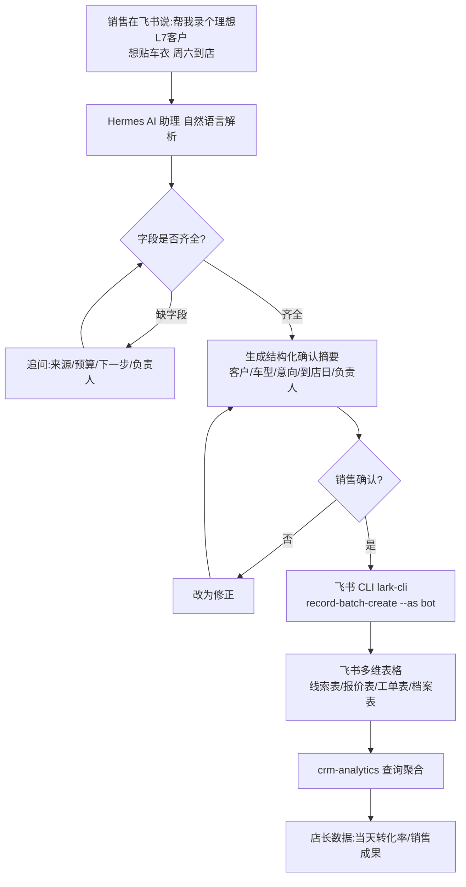

# 用飞书多维表格 + AI 做销售助理：销售说句话就能录单，转化率自动算

前面写了几篇 AI 内容管线的博客，这篇换个场景——**AI 怎么改变一线销售每天的工作方式**。

大多数门店做 CRM，要么上 SAP/纷享销客这种重系统，要么让销售每天手工填 Excel。前者太重、销售不想用；后者录了也没人看。我这次用的是一套轻得多的思路：**飞书多维表格当后台 + 飞书 CLI 当数据接口 + AI 助理当前端**，让销售像聊天一样把工作干完。

先给结论：**CRM 能不能被用起来，不取决于功能多不多，取决于一线 10 秒内知不知道往哪填。** 而用「自然语言」当入口、用「多维表格」当后台，正好把这条路走通了。

## 为什么选飞书多维表格，而不是传统 CRM

我第一反应也想过要不要上现成的 CRM SaaS。但摆完利弊就放弃了：

- **销售已经在用飞书**，老板、店长、施工队都在同一个生态里，学习成本几乎为零
- **多维表格够灵活**：线索表、报价表、客户车辆档案、工单表、售后表……要加字段加视图，改表结构销售无感
- **有 AI 助理能直接读写它**，这才是关键——让"聊天式录单"成为可能

传统 ERP 的问题在于"重到没人填"：每个客户要开一堆页面、关联一堆字段，销售一天 20 个客户，填满是不可能的。多维表格 + AI 把这块彻底解掉。

## 执行 Workflow：从一句话到一张表

## 技术原理：AI 写表必须先过"解析 → 确认 → 写入"三层闸

让 AI 直接写多维表格之所以危险，是因为它爱"自由发挥"——缺了手机号会编一个、金额拿不准会乱填。所以这套架构把写入拆成三个受控动作：

1. **解析层**：只把自然语言转成结构化字段（客户/车型/产品意向/来源/预算/下一步/负责人），缺字段就追问，**不猜**。
2. **确认层**：把解析结果生成一段人能读的摘要，**销售点头了才继续**。这一步把"AI 写表"变成"人审 AI 起草"，是你对数据最后的一道掌控。
3. **写入层**：只有确认通过，才用 lark-cli 的 `record-batch-create`（`--as bot` 身份、`--format json`）真正落库。写入有明确的身份和格式约定，不裸用脚本乱写。

转化率则是**查出来的**，不是录的：`crm-analytics` 直接聚合线索/报价/工单三张表，按来源/日期/负责人统计。数据只在一处真实存在，口径才不会打架。

**关键设计：不是让 AI 直接写表，而是"先解析、再确认、后写入"。** 销售说完需求，助理先生成一份结构化摘要（客户是谁、什么意向、几号到店、谁是负责人），销售点头确认了才落库。这样既防 AI 自由发挥乱写，又让销售对"录了什么"有掌控。

## 几个真实业务逼出来的设计

**1. 线索的"微信优先"口径。** 销售跟我们反映：很多客户是先加微信、后面才知道电话。如果 CRM 设计成"电话必填"，录入就永远拦在半路。所以线索表调整成**微信优先**——有电话填电话，没有先用微信身份占位，后面补。**跟真实工作动线对齐，比跟理想模型对齐重要。**

**2. 转化率是"查"出来的，不是"录"出来的。** 老板要的当天转化率、每个销售的成果，不是让销售额外填一张统计表，而是助理直接**查线索/报价/工单三张表做聚合**：这个销售这月录了多少线索、报了多少价、成了多少单。数据不重复录，口径才不打架。

**3. 表格要完整显示在聊天里。** 这是踩过的最深的一个坑——AI 查完数据想在卡片里展示，结果表格"生成完立刻消失"。排到最后发现根因是：**AI 输出结果后又调工具清理临时脚本，触发了流式卡片的归档机制，把表格挪进了"思考区"。** 最终用硬机制解决：CRM 查询走 `execute_code` 沙箱（不产生临时文件就不会触发归档）+ `approvals.deny` 拦掉 `rm`，让 AI 想走错路都走不了。这也是我反复验证的一个认知——**与其劝 AI，不如用机制让它只能走对的路**。

## 这套东西值在哪

回到根本：**CRM 的价值不在"有系统"，而在于销售愿不愿意把信息记下来。** 让它愿意记，就得让"记"这件事无限接近零成本。

用自然语言录单，销售一条消息就完成录入，还能顺便被追问补全；用多维表格当后台，店长随手就能看数据和看板；用 AI 查数据，转化率不靠人肉统计。三件事合起来，才让"当天客资录入 + 当天转化率"这件事从"没人做的 Excel 报表"变成了"每天自然发生的过程"。

如果你也在给团队上 CRM，我的建议是别急着选系统，先想清三件事：**谁在用（一线会不会填）、数据从哪来（能不能自动采集）、结果往哪去（老板怎么看得到）**。想清楚了，用多维表格 + 一个能读写它的 AI 助理，往往就够——而且比重系统轻一个量级。

> 参考：这套体系的 Skill 沉淀在 Hermes 服务器的 `crm/` 族（线索录入/跟进/成交建档/工单/数据分析等），配合销售自然语言触发手册给员工使用；完整字段与查询约定见内部 `crm-query-conventions`。本篇为对外成果记录，隐藏内部 token 与敏感口径。