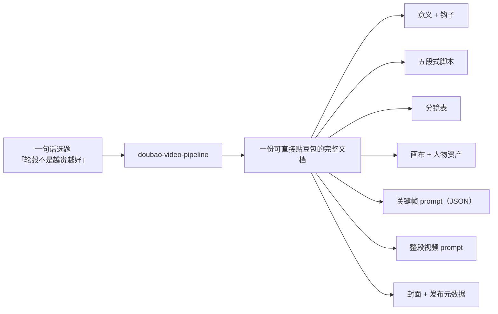
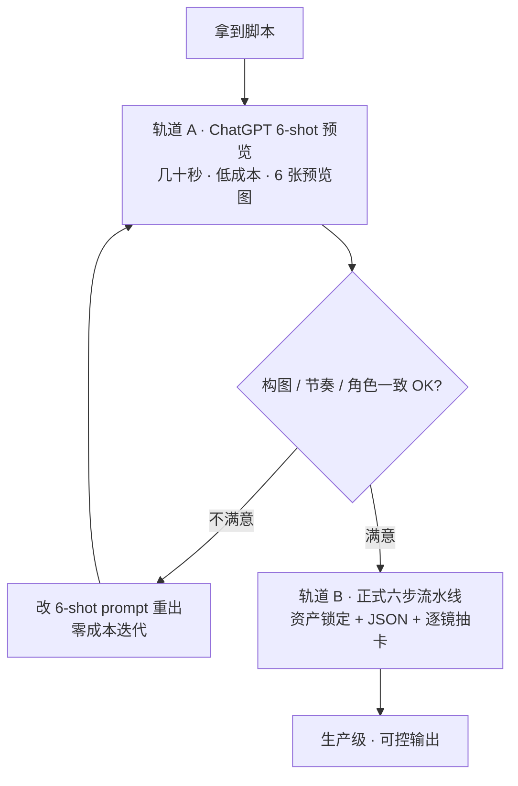
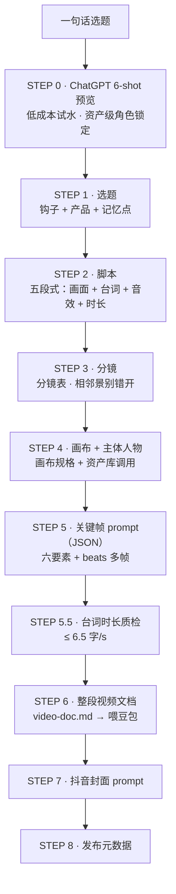

# 豆包 Video Pipeline：一句话选题 → 可直接喂豆包的视频文档，这条流水线怎么工作

做 AI 视频最磨人的，不是"生成"那一下，而是**生成之前那一大堆反复改的功夫**——脚本怎么切分镜、镜头里主角长什么样、构图机位怎么定、提示词怎么才不生出一堆手变形和闪烁……这些每次都靠脑子现想，改一轮就是十几分钟，产出的东西还不可复用。

所以我把我实际跑通的那套方法，从对话里捞出来，固化成了一个 skill，叫 **`doubao-video-pipeline`**。它把整个流程定义成一份说明书：**从一句话选题，走到一大段能直接喂给豆包（Seedance）的完整视频文档。六步流水线，每步产物都落盘成文件。**

先给结论：**这个 skill 的价值不在"能生成视频"，而在把"一个选题怎么变成一支能用的视频"这件事，从靠感觉的手工，变成了可重复、可追踪、可省钱的标准化流程。**

## 它解决什么问题

你给一句话选题（比如"轮毂不是越贵越好"），它给你一份能直接贴进豆包的完整文档，里面包含：

- 视频的意义和钩子方向
- 五段式脚本（HOOK / 转折 / 记忆点 / 流程 / CTA）
- 一张分镜表（镜号 / 景别 / 画面 / 台词 / 运镜 / 时长）
- 画面画布规格 + 主体人物资产定义
- 每个镜头的关键帧 prompt（JSON，结构化）
- 每个镜头的整段视频 prompt
- 可选的抖音封面 prompt 和发布元数据

关键在于**每步都落盘成文件**，不是只在对话里输出一遍就完。这样每一步都能回头改、能追溯、能被上游复用。做十支视频，画布和主角资产都是同一套锁定定义，风格一致性就稳了。

## 双轨设计：先 6 张图试水，再上生产线

这个 skill 有两套走法，我强烈建议先走便宜的：

**轨道 A · ChatGPT 6-shot 快速预览。** 拿到脚本后，先用一段 prompt 让 ChatGPT 把脚本切成 6 个分镜事件，一次性出 6 张预览图——几十秒、低成本，先把构图、叙事节奏、角色一致性试出来。满意了再进正式流水线转成正式 JSON；不满意就直接改 6-shot 的 prompt 重出，零成本迭代。

**轨道 B · 正式六步流水线。** 资产锁定 + 每镜一个六要素 JSON + 逐镜抽卡，生产级、可控的输出。轨道 A 试水通过后，才走这条正式线。

一句话：**先花几毛钱把方向验证了，再花钱上生产线。** 这比一上来就对着最终结果猛改，省的不是一点半点。

## 六步流水线（外加前后两步）

- **前置 STEP 0 · ChatGPT 6-shot 预览**：6 分镜一段式 prompt（中英双语，首行带"一次性出 6 张"触发器）。核心机制是**资产级角色锁定**——主角的年龄/头身/脸型/发型/五官/服装配色/识别符号写全，每段 Scene 结尾再重申一遍，防止 AI 中途改人。
- **STEP 1 · 选题**：从业务目标提炼一句话选题，写明钩子 + 产品/业务 + 记忆点，以及平台节奏。
- **STEP 2 · 脚本**：五段式主体故事，每段带画面 + 台词 + 音效 + 时长。
- **STEP 3 · 分镜**：一张分镜表，每镜头一个事件，相邻景别错开，先加总时长。
- **STEP 4 · 画面画布 + 主体人物**（关键）：先定画布规格（9:16 / 16:9）、构图法则、机位景别规划；再列主体人物清单，优先从资产库调用（蓝小辉 / 阿波 / 轮毂萌物 / 门店 / 车辆），没有现成角色才新建 JSON 资产。
- **STEP 5 · 关键帧画面 prompt（JSON）**：每个镜头一个 JSON，六要素结构（scene / character / vehicle / product / prop / camera / composition…），内含 **beats 多帧**。
- **STEP 5.5 · 台词时长质检**：跑一个脚本扫描每镜台词字数，防止生成时语速过快、口型对不上。上限 6.5 字/s，超了就得压缩台词、拆镜或后期降速。
- **STEP 6 · 整段视频文档**：汇总成一份 `video-doc.md`——意义 + 主体故事 + 分镜表 + 关键帧 prompt + 视频 prompt + 节奏提示，这就是给豆包的成品。

后面还有两块锦上添花：**STEP 7 抖音封面 prompt**（竖 3:4 + 横 4:3 双封面，主角为主题 + 标题 ≤8 字 + 视频元素三要素）和 **STEP 8 发布元数据**（标题 &lt;30 字 + 简介含 Tag，直接复制粘贴发布）。

## 几个真正拉开差距的机制

这些不是炫技，全是踩坑踩出来的硬规则：

**1. 关键帧 prompt 必须是 JSON，且含 beats。** 一个镜头有多个 beat，就一次生成同镜头多帧画面，而不是"一段提示词抽一次卡"。省豆包卡，这是免费模式能跑通的前提。

**2. Asset Lock 优先。** 角色/场景/道具先从资产库调，无现成才新建。品牌角色（蓝小辉、阿波）跨视频长得一样，就是从这来的。

**3. 画布先于 prompt。** 先定画面画布和主体（STEP 4），关键帧 JSON（STEP 5）才有依据。顺序反了，JSON 里字段没着落。

**4. 双人 IP 锁比例。** 多角色同框必须显式锁相对比例（比如"蓝小辉恒为阿波 2/3 高"），否则同框身高比必翻车。这是双主角视频最容易踩的坑。

**5. 豆包免费模式。** 遇到"免费卡 / 零成本生成"，就把全片切成 N 镜 × 10s——Seedance 免费卡单次生成上限就是 10s，每镜用一次免费卡，零成本跑完整支视频。每镜台词控制在 ~55-65 字对齐 6.5 字/s 基准。

**6. 铁律清单。** 整个 skill 带 16 条工作流红线：先建文件夹、keyframe 必须 JSON、一镜一件事、台词 ≤8 字、风格尾巴统一、记忆点单列、封面三要素……这些是"不踩坑"的浓缩，抽卡前跑一遍质检、锁一遍比例就能避开八成的翻车。

## 这份文档本身就是说明书

为什么说这篇博客是它的说明书？因为 skill 里所有规则和模板都是公开可读的——流水线详解、豆包免费模式适配、台词时长质检基准、6-shot / 封面 / 发布元数据模板、镜头 JSON 模板。任何人顺着这份文档，都能自己搭一套同款流水线，或者直接把我的 skill 拎去用。

它的下游还接了 `doubao-card-draw`（抽卡执行层），所以是"文档 → 抽卡 → 成片"完整链路里承上启下的那一环。

## 我的判断

这个 skill 和我上一篇写的 GEOFlow 管线是同一套心法的两个落点：**问题不在没有工具，而在你愿不愿意把判断力下沉到流程里、固化成文档。** 视频生产也一样——能写成六步、能锁资产、能踩前质检的，就别让它在每次对话里重新发明一遍。

如果你也在抓 AI 视频，我建议别急着学一堆提示词技巧。先把一条最简单的线定下来：**一句话选题 → 5 张分镜图 → 1 段视频 prompt**，跑通一支再往 JSON、往多镜、往免费模式上加。流水线是一层层长出来的，不是一天搭成的。

> 参考：这篇的完整规则与模板，收录在我的 skill `doubao-video-pipeline`（含 `references/pipeline.md`、`templates/shot-json.md`、`templates/video-doc.md` 等，可直接查阅复用）。