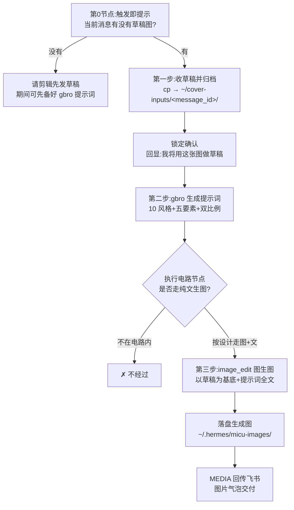

# 给剪辑做一个『抖音封面』Skill：图生图、防混图，还有『执行电路』而不是禁令

拍摄剪辑的同事每天要做一堆抖音封面。如果他们能直接在飞书群里丢一张参考图、说一句"做个封面，标题XXX"，让 AI 把封面做出来送回来，就能省掉一大半来回。

我给他们写了个这样的 Skill。但真正值得记下来的，不是"生图"本身，而是我为了让它**稳**而做的两个设计决策。

先给结论：**一个给员工用的 Skill，价值不在功能多，而在『并发不串、流程走对』。** 这两点，一个靠数据绑定，一个靠流程设计。

## 执行 Workflow：封面 Skill 的执行电路（状态机）



## 技术原理：为什么"图片和消息绑定"是天然的防混图武器

防混图不是靠 AI 自觉，而是靠消息链路的**一个既有事实**：

> 飞书每条带图消息到达 gateway 时，`_download_feishu_image()` 已经把该消息的图片下载成**本地绝对路径**，并注入到当前消息的上下文里，标记为 `[User sent an image: <绝对路径>]`。

也就是说，**图片天生就属于它所在的那条消息**。所以防混图的正确设计是"只认当前消息上下文里的路径、禁止查历史消息"——因为没有"多选"这个环节，并发多图请求天然隔离（每条消息一个专属 `message_id` 子目录）。把并发问题变成数据绑定问题，就根本不存在"拿错"的可能。

## 设计：执行电路 vs 一纸禁令

我把整个流程设计成上面那张"电路"——第 0 节点卡死"必须有草稿"，生图节点固定走"图 + 文"（image_edit / multi_reference），**纯文生图不在电路内、电路按设计不经过它**。

## Skill 的形态：草稿图 + 提示词 → 图生图

这个 Skill 的核心理念是**执行电路**：

```text
草稿图（必填）→ gbro 提示词（10 风格 + 五要素 brief + 双比例）→ 图生图 → 回传飞书
```

注意是**图生图**，不是文生图。同事给一张"大概想做成什么样"的草稿，AI 以它为基底 + 提示词去生成封面。为什么必须图生图？因为封面是你和品牌的方向决策，草稿是人的意图锚点；让 AI 凭空文生图，跑偏了返工成本太高。

## 设计一：防混图——并发需求怎么不搞混各自的草稿

第一个真正棘手的问题（也是同事的"灵魂拷问"）：**一小时内有 3 个人丢 3 张不同的草稿做封面，怎么保证不搞混？**

我查了消息链路源码，发现一个天然的绑定：**图片跟消息是绑定的**。飞书收到每条带图消息时，gateway 会把那张图自动下载成本地路径，注入到当前消息上下文里，标记为 `[User sent an image: <绝对路径>]`。

所以防混图的正确姿势不是"记一堆历史图片再猜"，而是：

> **只认当前消息上下文里那张图，绝不查历史消息取图。** 一消息一请求，逐一处理。并发自然隔离——因为每张图都只属于它那条消息。

这样设计，连"会不会拿错"的念头都没有，因为根本没有"多选"这个环节。

## 设计二：执行电路，而不是一纸禁令

一开始我写了不少"禁止"：禁止文生图、禁止查历史、禁止自己选图。但同事纠正了我一个更好的思路：**与其禁止 X，不如让流程根本不经过 X。**

所以我把流程设计成一条自然的"执行电路"：

- 第 0 节点：**必须先有草稿图**。当前消息没带图 → 先请同事发草稿，期间可以先备好提示词
- 收到草稿 → **归档**到当前任务专属目录 `~/cover-inputs/<message_id>/` → 锁定确认（回显"我将用这张图做草稿"），不对可换
- 后续所有步骤一律引用**归档后的稳定路径**（不依赖 gateway 临时缓存，缓存会被清）
- 生图节点固定走 **图 + 文**（image_edit / multi_reference），纯文生图"不在电路内、电路按设计不经过它"

用"设计让链路自然走对"，比用一长串"禁止"稳得多、也好讲给同事听。

## 交付：双比例封面 + 发布信息

Skill 还会顺带产出完整交付：

- **双封面**：竖 3:4（1080×1440，信息流）+ **横 4:3**（1440×1080，搜索/话题卡）
- **封面三要素**：主角为主题 + 标题大字（≤8 字，安全区内）+ 视频关键元素，一个不能少
- **发布元数据**：标题（&lt;30 字）+ 简介（含 Tag，3-5 个，#蓝辉轻改 必带）

这样同事拿到的不是一张图，而是一整套能直接发布的东西。

## 我的判断

做这类"给员工用"的 Skill，我最大的体会是：

> **写死规则不如把路修对。** 防混图靠"图片与消息天然绑定"这个事实设计，比靠 AI 自觉强一万倍；走对流程靠"执行电路"让链路自然绕过坑，比靠一纸禁令强得多。

如果你也在给团队做类似的工具，多想想"怎么让不走错路成为唯一选项"，而不是"怎么警告它别走错"。前者是一次设计，后者是每单都要人盯着。

> 参考：这套 Skill 拆成了 `douyin-cover-entry`（编排）与 `gbro-cover-design`（设计提示词）两个，部署给拍剪 A/B 使用。本篇为对外经验记录，隐藏内部资产与 token。