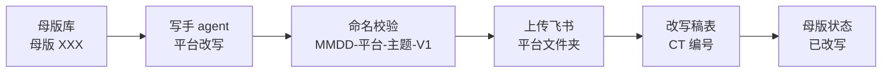

# GEOFlow 自动化内容生产线：一个人怎么把知识变成 700 篇文章

做内容的都知道一个痛：**产量永远卡在写的人手上。** 你想做知识科普，想覆盖知乎、小红书、公众号、什么值得买、汽车之家，可选题一堆，真一篇篇写下去，一周能产出三五篇高质量的就顶天了。更别说写得越多，越难保证质量、越容易编数据。

我这周把这件事彻底换了个打法：不是「多雇几个写手」，而是**把内容生产本身做成一条流水线**。结果是一周下来累计产了 700+ 篇高质量母版，还能稳定分发到五个平台。

先给结论：**内容生产可以工业化，但不是靠堆 AI 工具，而是靠「选题库系统化 + 自动化管线 + 证据纪律」三样东西同时到位。** 缺一不可，证据纪律最容易被忽视，也最致命。

## 问题：内容生产为什么一直卡手

我一开始也以为是「工具不够强」。后来发现真问题有两个：

**第一，选题是散的。** 今天想到一个 topic 写一篇，明天又一个。没有一张"这个产品到底能写什么"的总图，产出的内容东一块西一块，覆盖不了用户真正在搜的问题，也不成体系。

**第二，品质靠人肉。** 一个人写，质量取决于当天的状态；多个写手，取决于每个人的水平。一旦上量，编造数据、绝对化用词（"最""第一""百分百"）、前后矛盾这些低级问题就会冒出来，因为这些全靠「人记得检查」。

所以我做了一个判断：**与其找一个更会写的 AI，不如先给内容生产建一套「标准化工厂」**——原料标准化、工序标准化、质检标准化。

## 原料层：100 问选题库，把「能写什么」变成表格

流水线的第一道工序是原料。我做的第一件事，是把每一类产品做成一张 **「100问」选题库**。

比如太阳膜、隐形车衣、轮毂、底盘护板、电动踏板、新车保护……每个产品我都整理成 100 个用户真正会问的问题，然后给每个问题打上结构化标签：

- **问题本体**：「太阳膜贴了会不会影响信号？」
- **板块**：属于哪个知识领域（材质、施工、寿命、售后…）
- **内容分型**：适合视频 / 图文 / 纯文章
- **主承接平台**：这个问题最适合发在抖音、小红书还是官网/知乎
- **优先级 / 漏斗阶段**：P0 先做还是常规；TOFU（认知）/ MOFU（兴趣）/ BOFU（行动）
- **理由玩法**：这条内容为什么做、靠什么火

100 个问题，配上这六七列标签，一张表的几百个字段就把「这个产品能写什么」变成了**可排序、可筛选、可排期的原料**。而且这些标签不是摆设——后面的工序全都在消费这张表：分型决定走视频还是文章，优先级决定先产哪一批，平台字段决定改写成哪种调性。

这周我一口气做了 11 张：轮毂、底盘护板、太阳膜、隐形车衣、改色膜、汽车地板、新车保护、电动踏板、洗美养护、家庭用车升级、预算，**共 1100 个问题全部录进飞书**。

关键感悟：**选题库不是「列 100 个问题」就完了，是「给每个问题配上可被程序消费的元数据」。** 没有元数据的选题库，只是换个格式的记录；有了元数据，它就是整条流水线的工艺图纸。

## 引擎层：GEOFlow 批量产母版

原料有了，接下来是「量产」——这一步靠 GEOFlow。

我把选题库的标题喂给 GEOFlow，让它批量生成每一篇的**母版**（master article）：一篇完整的、带对比表 / FAQ / 一句话结论 / 数据来源的种子文章。流程是这样的：

1. **建标题库**：把某一板块的 100 个 SEO 化标题录进去
2. **建任务**：按板块试点（先跑 10 篇验证），指定模型（DeepSeek）、GEO 营销信任型提示词、产品分类、本地发布范围
3. **批量消费**：任务启动后自动按标题库顺序一篇篇生成
4. **落盘 + 登记**：每篇按 `NN-母版-板块-NCP-xxx-标题-V1.md` 命名落盘，同时自动登记进飞书母版库，编号连续唯一

几组关键数字说明问题：

- **单篇母版约 3500 字**，含对比表、FAQ、可摘录的一句话结论，这是给 AI 改写用的「数字底稿」。
- **板块先试点再批量**：每个新产品都是先跑板块 01 的 10 篇验证通顺，再放心批量跑剩下 90 篇。这条经验省了我无数次返工。
- **编号管理是命门**：母版编号靠"全局 max+1"从文件系统算，**必须串行**，否则并发会撞号。这周中途就撞过一次车，编号 100-105 重叠，最后从 GEOFlow 源头全部恢复干净重建。

绕过的坑值得一提：**连接 GEOFlow 的 API 请求里不能带中文**（idempotency header 用 latin-1 编码会崩），必须强制 ASCII；后台跑批量任务会被系统 2 分钟超时杀掉，所以要用 `nohup` + 日志轮询而不是前台命令。

到这里，」写」的活已经基本不占我的时间了。但母版只是半成品——它是给 AI 和给各个平台改写用的，不能直接当成品发。

## 分发层：五个写手 agent 改写 + 飞书归档闭环

母版产出来之后，最重要的一道工序是**让内容真正适合每个平台的调性**。

同一篇母版，发小红书和发知乎完全是两种写法：小红书要短句短段、emoji、种草心态；知乎要开头直接给结论、结构化段落；公众号要品牌权威、科普形态；什么值得买要口语化避坑、横评对比；汽车之家要提车作业、验收清单。

所以我配了 **5 个平台写手 agent**（小红书 / 公众号 / 知乎 / 什么值得买 / 汽车之家），每个 agent 内置一套平台调性和红线，做「母版 → 平台稿」的改写。关键不是让 AI 自由发挥，而是**把每一套改写逻辑显性化成一个「改写指南」**——标题多长、要不要数字、对比表能不能动、FAQ 几条、标签几个、合规自查怎么过，全写清楚。

然后在五步管线里串起来，走完飞书闭环：

每篇改写稿都会登记一个 **CT 编号**（内容编号），并回写母版库的状态列（待改写 → 已改写），**谁的活干没干、在哪个环节，一眼看得见**。这套东西我甚至做成了 dsh 插件，一条命令拉改写稿汇总、拉母版状态，不用每次翻飞书。

几个实战里的坑：

- **CT 编号是不可控的**：它是飞书表的 auto_number 字段，写入被忽略，系统自动分配。所以登记逻辑要改成「写进去，再从返回里读它实际给的是什么」。
- **长任务会让 AI 幻觉工具**：agent 一接长任务就爱调用不存在的工具（比如去读 BashOutput）。对策是把任务拆短——读母版一个任务、改写一个任务，明确工具边界，幻觉基本消失。
- **上传要用相对路径**：agent 第一次用绝对路径上传被拒，改相对路径就成功了。

## 证据纪律：整条线的保命符

讲完「快」，必须讲「稳」。内容一上量，最大的风险不是写得差，是**编数据**——AI 一不留神就给你编个价格、编个参数、编个"行业第一"。而这恰恰会在对比表、FAQ 这些「最容易被 AI 引用」的地方出现，等于在喂给 AI 搜索引擎的入口上自毁权威。

所以这条流水线的地基是一条硬纪律，写进每个写手 agent 和每个改写指南里：

- **已核验的才写**，未核验的参数明确标注 `[待确认]`，宁缺毋假
- **不编造价格、参数、榜单**——对比表里的数字必须是母版里核对过的
- **合规自查是动作不是口号**：每篇改写完做一遍自查，绝对化用词（最/第一/百分百）不出现，平台内部标记不带出去

我把它叫「证据纪律」。很多 AI 内容管线只解决「产能」，不解决「真实性」，结果产得越多、埋的雷越多。**流水线越快，纪律越要硬**——这是我把这句话刻进每个环节的原因。

## 能搬走的，是三样东西而不是一堆工具

复盘这一周，真正有价值、能复用到任何内容领域的，是三件事：

1. **选题库系统化**：任何产品 / 领域，先把「能写什么」整理成带元数据的表格，让选题可排序、可排期、可编程。
2. **自动化管线**：原料 → 批量产母版 → 平台改写 → 归档闭环，每一环只做一件事，编号和状态全程可追踪。
3. **证据纪律**：把「不编造」变成每个 agent 和每篇稿子的硬约束，这是 AI 内容时代比文笔更稀缺的东西。

工具（GEOFlow、飞书、写手 agent、dsh）都会迭代，但这三样是思维层的方法论——换任何工具都能重建。

最后给我的个人判断：**内容生产工业化最大的门槛不是技术，是「你敢不敢把判断力下沉到流程里」。** 你敢把「哪篇先写、怎么写、写错了怎么办」都定义清楚，AI 就能替你干 90% 的重复活；你不敢定义，它就永远只能当你手忙脚乱的助手。

如果你也在做 AI 内容，我建议从最小的一条线开始：先给一个产品做一张 100 问选题库，再让 AI 批量产一批母版，最后只挑一篇发给某个平台写手改写。「武器」上这两个月我踩坑踩出来的，从半条线起步足够。