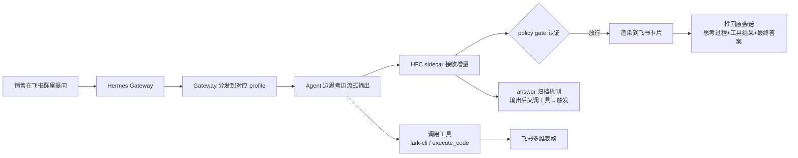

# 飞书里的流式卡片怎么调：从『表格生成完就消失』到完整交付

给飞书机器人加上"边想边显示"的流式卡片，体验提升是巨大的——销售问一句"7 月录了多少线索"，用户就能实时看到思考过程、工具调用和最终结果打在卡片上。但这段路我排了整整一天的雷，最后发现最玄学的问题压根不是玄学，是一个我自己差点忽略的机制误解。

先给结论：**流式卡片卡住的九成问题，都出在"AI 输出完结果之后又去干了别的事"——而不是卡片组件本身。** 找到这个出发点，很多坑能少踩一遍。

## 执行 Workflow：一张流式卡片是怎么从无到有推到你面前的

先看清楚完整链路，后面的坑才有坐标系：

## 技术原理：流式卡片不是"整段想完再发"，而是"有状态地增量渲染"

表面看 HFC 就是个发卡片的插件，但它有两个关键机制决定了你会不会翻车：

1. **跨平台流式（platform streaming）**：Agent 是边思考边吐 token 的。HFC 需要飞书平台的流式配置（`display.platforms.feishu.streaming: true`）才能收到这些增量——缺了它，agent 吐的全部内容 HFC 接不住，最终回答就拼不完整。
2. **答案归档（answer archive）**：默认每条消息只有一个"最终回答区"。一旦 agent 已经输出了一段"像是最终答案"的内容，**却又调用了任何工具**，HFC 就认为"刚才那段不是最终的"，把它归档进"思考区"，清空 answer_text 重新攒。这个机制本来是为了把"工具中间过程"和"最终答案"分开，但它有一个副作用：**如果 agent 在输出统计表格之后又去 `rm` 清理了什么，整张表就被当作"中间过程"挪走了。**

## 流式卡片是什么，为什么值得做

简单的对话机器人是"想完再整段吐答案"，用户要干等。流式卡片是**把思考过程、工具调用的中间结果、最终答案实时流式地渲染在飞书卡片上**。对高频操作用户（比如销售查数据）特别关键：提示词一进，马上能看到 AI 在查表、在算，而不是面对一个沉默的转圈。

技术上它是 Hermes 的 HFC（流式卡片）组件 + 飞书 WebSocket 长连接。环节不少：gateway 收到消息 → 交给 agent 边流式输出 → sidecar 把增量渲染成卡片 → 推回原会话。

## 三个"配置级"的坑（先解决这些）

**坑 1：版本。** 我用的是本地验证过的 HFC **v4.1.0**。升级到 v4.2.8 后卡片全被拒——因为新版加了 policy gate 且默认拒绝。结论很直接：**能跑通的版本就锁死，别为了"新"去冒险。**

**坑 2：policy gate 的认证。** 卡片出不来，查日志发现 policy 认证失败。根因是 sidecar 进程没拿到和 gateway 共享的同一个 key（缺 `HERMES_FEISHU_CARD_STATE_DIR` 环境变量）。两边必须共享同一个状态目录下的 key，请求才被放行。

**坑 3：平台流式配置。** 判断"为什么卡片不全"时，对比本地才找到：本机配置里有 `display.platforms.feishu.streaming: true`，服务器复制主配置时漏了这句。没有它，HFC 收不到飞书平台的流式增量，回答拼不完整。

## 最玄学的那个坑：表格生成完立刻消失

这是消耗我最久的一个。现象：卡片出来了、中间过程也对，但最终回答区的**表格在生成完的一瞬间消失**，只剩一句"已清理临时脚本"。

一开始以为是 `show_reasoning` 开关、以为是渲染 bug。后来顺着日志里 `answer_chars=16`（"已清理临时脚本"正好 16 个字符）挖到了真正机制：

> 流式卡片有个"**答案归档**"机制：AI 一旦输出一段最终答案、**然后又调用工具**，HFC 就把之前的内容归档进"思考区"，answer_text 清空重来。而我的 CRM 查询流程里，AI 生成了表格后还会执行 `rm` 清理临时脚本——这个"输出后又调工具"的动作，正好触发归档 → 表格被挪走。

所以根因根本不是渲染，而是 **agent 的工作方式**：本地能跑通，是因为本地查询直接走 `lark-cli` 一行命令；服务器那次 agent 却自己写临时 Python 脚本、查完再删。

## 治本：与其劝 AI，不如用机制让它只能走对的路

我试过在 SOUL 里写纪律让 agent"输出前别调工具"，但 DeepSeek 对尾部/中部的指令遵循度差，根本不听话。最后放弃"劝"，改用**硬机制**：

1. **`execute_code` 沙箱**：CRM 查询走沙箱执行，不产生临时文件 → 没有"输出后清理"的动作 → 归档永不触发
2. **`approvals.deny` 硬拦截** `rm*` / `rmdir*` / `unlink*`，让 AI 想删都删不了
3. **临时文件归置** `~/hermes-scripts/` + cron 每天清理，需要时还能复用

三管齐下之后，"7 月线索 134 条"完整显示在最终回答区，卡片链路彻底通。

## 我的一个总结性认知

这套排雷给我最大的收获不是那几个配置项，而是一条方法论：

> **想约束一个不守规矩的模型，与其反复嘱咐，不如把它可能走错的每条路都封死。** 劝是概率性的，机制是确定性的。能靠"让 agent 无法生成临时文件"解决，就绝不要靠"请求你输完后别清理"。

如果你也在折腾飞书机器人，给你一个排查顺序：先锁版本、再对 key、再补 streaming 配置、最后检查 agent 是不是"输出后又动了手"。前三个是配置问题，最后一个才是真正的敌人。

> 参考：完整手册沉淀在服务器 `crm-query-playbook.md`，新 profile 照搬 7 步即可跑通。本篇为对外经验记录，隐藏内部 token 与会话密钥。