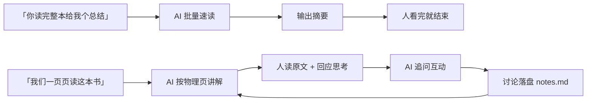
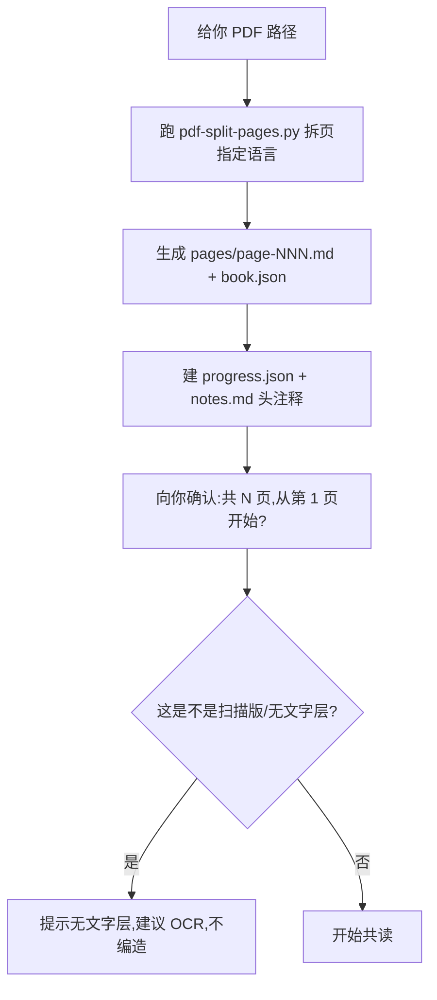
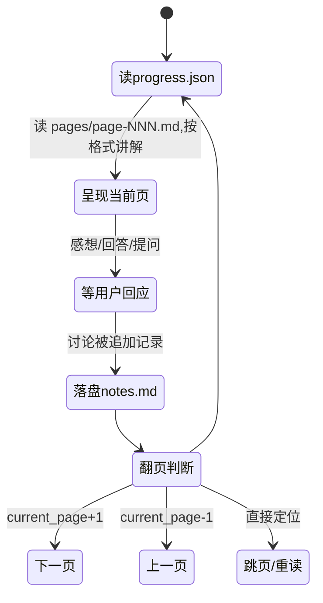

# 把『和 AI 一起读书』做成一个系统：逐页共读 Skill 的设计与工作流

大多数人让 AI"读书"，是给它 PDF、让它一次性读完，然后吐一份几千字的摘要。我一开始也以为这是最高效的。直到真正想"读进去"一本《沉思录》、《如何独立思考》时才发现：**摘要能给你"这本书讲了什么"，但给不了"我读到了什么"。**

所以我没走"AI 速读 — 人看摘要"那条路，而是反着设计了一套**逐页共读**机制——Alma 把书拆成物理页，像读书搭子一样一页页和我读：它讲解精华、我读原文思考、它提问互动、我们共同记笔记、进度精确到页。

先给结论：**共读的价值不在"快"，在"稳"。** 快有摘要，稳靠的是"人真在读 + 讨论被记下来 + 进度不丢"三件事同时成立。

## 定位：互动共读，不是批量总结



左边是"一次性消费"，右边是"有来有回的重复会话"。核心差异在 **G 和 H 两环**：人的思考被接住了、被追问了、被记下来了，而不是读完一个摘要就散场。

## 书架结构：一本书 = 一个文件夹

所有书放在 `bookshelf/`，每本书一个目录，互不干扰：

```text
bookshelf/
├── tools/pdf-split-pages.py     # PDF → 逐页 markdown
└── <书名slug>/
    ├── book.json                # 元数据（总页数/语言）
    ├── pages/page-001.md…       # 一物理页一个 markdown
    ├── progress.json            # ★阅读进度（唯一权威来源）
    ├── notes.md                 # 追加式笔记（讨论/金句/疑问）
    └── summary.md               # 章节小结（可选）
```

## 执行 Workflow 一：新书怎么进架



## 执行 Workflow 二：共读会话的核心循环



每一页呈现（克制、不 dump 全文）：

```text
📖《书名》第 N 页 / 共 M 页
> 原文（blockquote 完整给，让用户能对照原书读）
【这页在讲什么】2~3 句概括
【精华点】3~5 条（引用原文关键句 + 解读）
【概念/生词】1~3 个
【想想看】1~2 个互动问题
```

## 技术原理与关键决策

这套机制表面简单，但作为"系统"能稳定支撑我读完整本，靠的是几个不那么显然的决策。

**1. `progress.json` 是唯一进度来源 + "先读后写"。** 每次翻页必须先读 progress.json、读完立刻写回（current_page / pages_read / last_read_at），而不是靠对话上下文记进度。这样即使会话断了、切换终端、过几天再回来，一句"继续读"仍能从当前页续起，绝不从头。**进度是持久化的状态，不是记忆里的印象。**

**2. 原文框是刚需，不是选项。** 我一开始试着做"精简原文"省 token，被否了——因为共读的信任基础就是"我们读的是同一页原文"。完整 blockquote 让用户能同时对照原书读，AI 讲解有实据，讨论不漂移。这个决策把成本翻了倍，但把"共读"的地基打稳了。

**3. 批量只是讲解粒度，不是记录粒度。** 用户偏好"3~5 页一批"，但 progress.json 仍逐页记 pages_read/current_page。"一次讲一批"和"一次记一页"是两件事——讲解粒度可以合并省 token，记录粒度必须零散，才不会因为"批量"丢了精确位置。

**4. 页面质量铁律：不编造。** 扫描版/纯图页没有文字层，就如实说"这页没文字、建议 OCR"，绝不给这页硬编内容；目录页/版权页明确提示后跳过。这跟我在别处反复遵循的"证据纪律"是一个东西——**宁可承认空缺，绝不假装读过。**

**5. 多书管理天然隔离。** 一本书一个文件夹，各自有独立的 pages / progress / notes，中途换书直接读另一本，进度互不打架。定位书靠文件夹名 → book.json.title → 都不匹配就列书架让你指认，不猜。

## 四种共读模式

- **精读**（默认）：每页精华 + 概念 + 必带互动问题，节奏慢、聊得深
- **速读**：每页 1~2 句概括 + 关键金句，说"这页过"就翻
- **测验**（"考考我"）：基于已读页出题、批改、记回 notes
- **回顾**（"总结前面"）：读 notes + 已读页精华，生成阶段小结

## 我的判断

做这个 Skill 最大的认知是：**拿 AI 读书，"读完一本"的价值远低于"真正读进去一本"。** 摘要是一次性的、容易忘；逐页共读留下的 progress + notes 是攒起来的资产——你什么时候回看，都知道"我当时在第几页、纠结过什么问题"。

如果你也想建立阅读习惯，我不建议一上来就追求"让 AI 帮你多读书"。先把**一本**书用这套机制读透，让"每页原文 + 讨论笔记 + 精确进度"这三样跑通，你就不会再愿意回到"吃摘要"的日子了。慢，但扎实。

> 参考：机制沉淀在 `page-by-page-reading` Skill（书架 `CoyaPersonal/bookshelf/`，已用于《沉思录》《如何独立思考》）。本篇为对外方法记录，不含任何特定书籍内容。