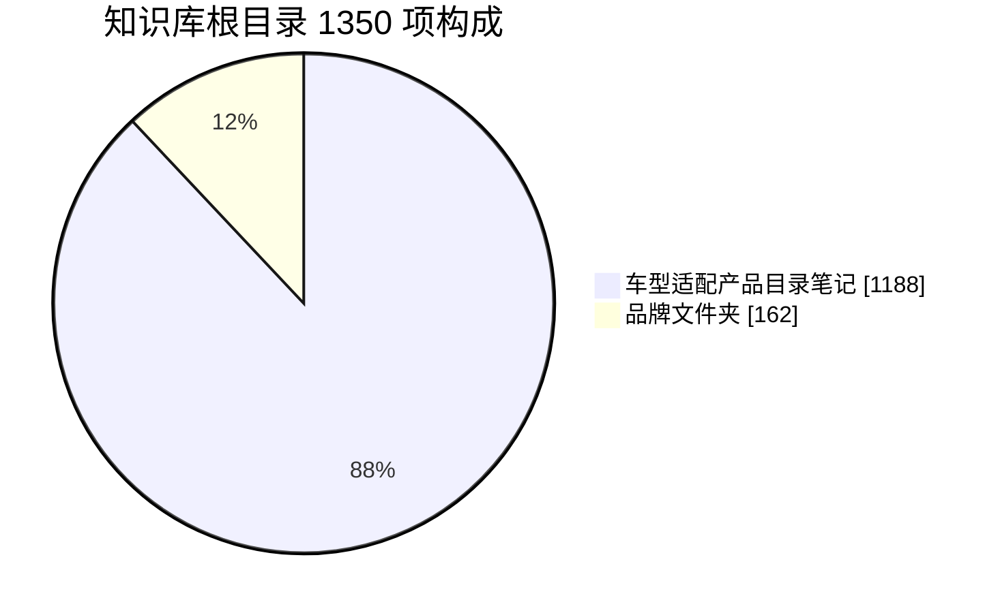
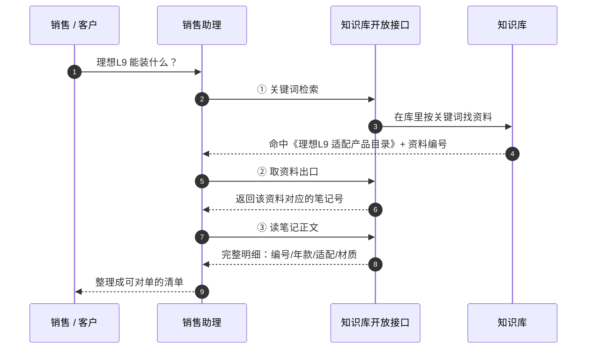
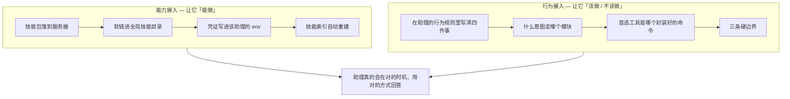
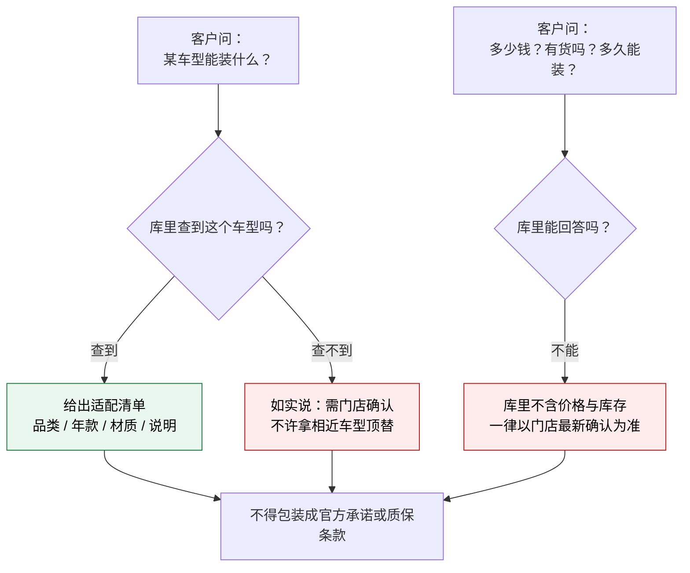

# 把 1188 篇产品目录装进销售助理：AI 接知识库的「匹配」思路

上一篇写了 CRM 销售助理（[用飞书多维表格 + AI 做销售助理](/blog/2026-08-23-crm-sales-assistant-feishu/)），那篇解决的是"销售愿不愿意把信息记下来"。这篇解决它旁边那个问题：**销售被客户问住了怎么办。**

门店里最常出现的场景是这个：客户在群里问"我这台理想 L9 能装什么脚垫"，销售要么翻群文件、要么去问师傅、要么凭印象答。前两个慢，第三个危险。我们手上其实有一个整理得很干净的产品资料库，里面按车型存着 1188 篇《适配产品目录》。问题是它躺在那边，销售不会去翻。

所以我做的事是：**把知识库接进销售助理，让销售直接问，助理去库里捞。**

动手之前我先给自己定了个判断标准：**接口通不通是半小时的事，那不叫接上了。** 接上的标准应该是——销售问一个车型，助理能给出一份可对单的明细；客户问价格，助理知道必须闭嘴。

先给结论，这篇文章讲四个「匹配」：

1. **资料形态要匹配调用链**——你的知识库是"笔记型"还是"文件型"，直接决定 AI 要调几次接口
2. **能力接入要匹配行为接入**——技能让助理"能做"，行为规则让助理"该做什么、不该做什么"，只装技能等于只装了一半
3. **模型能力要匹配封装程度**——多步调用链对弱模型是灾难，把三步压成一条命令比写十页文档有用
4. **内容边界要匹配说话边界**——库里没有的东西，恰恰是接进 AI 之后最需要防的东西

下面是完整过程。

## 一、接入的第一步不是写代码，是搞清楚「库里到底有什么」

我一开始的想法很朴素：下载官方技能包、装上去、填凭证、跑通一个测试调用，收工。

结果第一次搜索就给我泼了盆冷水——搜"隐形车衣 价格"、"改色膜 施工流程"，返回全是空的。当时第一反应是"接口有问题"。好在没急着去改代码，而是先做了件更笨的事：**把这个知识库从头到尾枚举一遍。**

枚举完就清楚了，两件事：

**第一，我的关键词根本就不在库里。** 这个库存的是**车型适配产品目录**——按车品牌、车型编号组织的产品明细，字段是产品编号 / 年款 / 适配车型 / 材质颜色 / 说明。它压根没有"价格"这类内容。搜不到不是我接错了，是库里真没有。

**第二，是资料的组织形态和我预想的完全不同。** 根目录 1350 项，拆开是：



我本来以为结构是"品牌文件夹 → 车型文件夹 → 资料"，所以设计思路是**逐层浏览**。枚举之后发现行不通：我抽查了几个品牌文件夹，**里面是空的**——真正有内容的是那 1188 篇平铺在根目录的笔记。

**如果我没先枚举、直接按"浏览式"写调用逻辑，这个接入会死在半路上，而且报错会非常含糊**（"文件夹是空的"看起来像权限问题、像同步延迟，唯独不像设计问题）。

> 一个到写这篇为止都没完全解释清楚的疑点：知识库列表接口自报这个库有 5253 条内容，但我逐页列举只能拿到 1350 项。这两个数对不上，我没找到官方口径说明，先记为 **[待确认]**，不影响当前使用。

**这一步的教训**：接知识库的第一个动作不是打开 IDE，是**先把这个库的地形摸清楚**——有多少东西、是什么形态、哪些是能用的、哪些是看起来能用实际是空的。摸完地形，调用链的设计基本就自己浮出来了。

## 二、资料形态决定调用链：为什么必须是三段式

摸完地形，第二个匹配点来了。这个库的资料是**笔记形态**（media_type = 11），而它的开放接口没有提供"一步拿到正文"的能力。想从"一个关键词"走到"一段可读的明细"，中间必须走三步：



每一步的职责其实很清楚：

- **① 检索**解决的问题是"哪一篇"。它只返回标题、摘要和资料编号，不返回正文。全库关键词命中上限一次 100 条。
- **② 取出口**解决的问题是"这篇的正文在哪"。返回的是这份资料对应的笔记号——注意，这里返回的**不是**可直接读的文本，只是个指针。
- **③ 读正文**才拿到真正能给人看的明细。

**为什么我觉得这三步是合理的，而不是设计得啰嗦？** 因为检索和读取本来就是两种不同的负载：检索要的是"扫一遍找出候选"，可能返回 100 条；读取要的是"把某一条完整吐出来"，一次只吐一条。把两者合并成一个接口，等于要求服务方在一次请求里同时做"扫描"和"全量返回"，那才是灾难。

**但对调用方来说，三步就是三个失败点。** 中间任何一步的字段名错了、指针没解析出来，整条链就断在那儿——而且断在第二步和断在第三步的报错长得不一样，排查成本翻倍。

这就是第三个匹配点的由来。

## 三、「匹配」要接两处：能力接入 + 行为接入

先说清楚"技能"和"助理"是什么关系，我用了两个不同层次的手段：



**能力接入**这部分是机械的，装完就是装完了：技能包放到服务器上、软链进全局技能目录、凭证写进该助理的环境变量、重启服务让它生效。有一个细节值得记一笔——技能索引是带 mtime 快照的，**技能目录一变，快照自动失效重建**，不需要手动清缓存。所以"新增技能要不要清缓存"这个问题根本不存在。

**行为接入**这部分才是决定成败的地方。技能装好了，助理只是"有能力查"；它会不会在客户问车型的时候想起来去查、查完怎么答，是另一回事。我在行为规则里写了四件事：

1. **意图路由**：什么话术该走"查知识库"、什么该走"读笔记"，这两件事容易混
2. **首选工具**：明确指定先用那个封装好的命令（下节讲为什么）
3. **回答纪律**：客户问车型适配，**先查再答，不许凭记忆**
4. **边界**：价格/库存/施工排期一律推给门店确认；库里查不到该车型，如实说需要门店确认，**不许拿相近车型的结果顶替**

第 4 条是我最在意的。一个能查到 1188 篇产品目录的助理，如果客户问了一台库里没有的车，它最"像样"的回答是找一台最接近的车型糊过去——**这种错误比答不出来危险得多**，因为客户会当真。

## 四、给弱模型的补偿：把三步压成一条命令

三段式调用链对上强模型不算事，但我们要用的是本地跑的小模型，多步指令遵循本来就一般，让它连续正确地调三次接口、还得自己解析中间那次返回的指针——**这是注定要翻车的设计**。

我的处理很直接：**写一个脚本，把三步压成一条命令。**

```bash
node ima-kb-query.cjs "<车型关键词>" [读取篇数]
```

这一条命令内部完成：检索 → 取资料出口 → 解析笔记号 → 读正文 → 打印可读明细。助理要做的事从"理解三步调用"降级成"知道有这么一条命令、把车型填进去"。

**这里有个我觉得可以推广的判断：文档教不会模型的事，脚本可以。**

- 写文档告诉模型"先调 A 再调 B 再调 C、注意 B 的返回里那个字段是指针"——模型有概率记错、有概率跳过、有概率自作聪明
- 封装成一条命令——模型没有犯错的空间

对能力稳定的强模型，前者更灵活；对我们这种"要省钱、用自部署小模型、还要它稳定输出"的场景，**降低自由度比提供能力更重要**。

实测下来确实如此，同一个车型关键词，脚本输出的明细直接可以拿去对单。

## 五、最有价值的匹配是边界匹配，不是能力匹配

这是整件事里我最想写下来的一段。

接入做完我才意识到，**这个库之所以敢接进 AI，恰恰因为它的内容被清洗过**：不含供应商信息、不含价格。

听起来像缺点——销售不是最想知道价格吗？但从"能不能安全接进 AI"的角度看，这是极大的优势：



**可以放心让它答"适配什么"，因为它手上真的只有适配信息，编不出价格来。** 那些最容易出事的内容（报价、折扣、库存、活动政策）压根不在数据源里，AI 也就不存在"看错了说漏嘴"的可能。

这反过来给了我一个选型思路：**如果你在挑哪个知识库接进 AI，优先挑那个"内容已经清洗过、边界清晰"的库，而不是内容最全的库。** 内容越全、越混合，你要在行为规则里设的防线就越多、越难穷举；而一个边界清晰的库，天然就把 AI 的错误空间压小了。

顺便说，这也解释了为什么销售助理的行为规则里要专门写一句"不得包装成官方承诺"——**库里的产品明细是内部资料，不是对外承诺。** 数据本身安全，不代表用法安全。

## 六、怎么证明"真的接上了"

我不太信任"我装好了"这种自信。所以留了两层验证：

**第一层，端到端实测。** 挑几个不同品牌的车型直接跑，看返回的明细是不是可对单的真数据。我实测了理想 L9、特斯拉 Model Y（含焕新版和 YL）、北京 BJ60 等，都能返回完整的适配清单——脚垫按"原车 6 座做 4 座 / 做 6 座"和绒布工艺分款、尾箱分连体分体、电动踏板标了"原厂对插"、底盘护板标到"7+2 件套 材质锰钢 1.2mm / 铝镁合金 2.0mm"这个颗粒度。这类信息能直接拿去跟客户对话，说明链路是通的，不是返回了个空壳。

**第二层，确认技能真的进了助理的索引。** 这一层比第一层更关键——**接口通不代表助理会用**。我的做法是直接调用助理框架自己的技能索引构建函数，检查它渲染出来的技能清单里有没有这个技能，再确认助理进程的环境变量里确实带上了凭证（从进程环境里读，不是读配置文件）。

两层都过了，才敢说"接上了"。

## 收尾：五个可以复用的判断

如果把这套东西抽象成可复用的判断，我留下这几条：

1. **先摸地形，再写代码。** 有多少内容、什么形态、哪些是空的——这事花一小时，能省掉后面一天的含糊报错。
2. **资料形态决定调用链，不要反过来。** 笔记型库注定要多段式读，文件型库可能一步到位。先看清形态，再设计流程，别拿一套流程去套所有库。
3. **技能只装一半。** 能力接入让助理"能做"，行为接入才决定它"该做"。只装技能不写规则，等于雇了个人不给他岗位职责。
4. **对弱模型，降低自由度比提供能力更重要。** 能封装成一条命令的，就别让它自己拼三步。
5. **接库之前先看这个库的边界，而不是它的体量。** 内容清洗干净、边界清晰的库，比内容最全的库更值得接——**因为 AI 的错误空间，等于你能说出口的话减去数据源里真实存在的东西。**

最后回到业务价值上：这件事让销售不必再"被客户问住"。客户报一个车型，销售直接问助理拿清单，产品编号、年款、适配、材质全在手上，可以直接对单；问到价格，助理明确说以门店确认为准。**销售快了一点，但更重要的是——他终于不用凭印象答了。**

> 参考：技能侧用的是腾讯 ima 的官方开放技能包（notes + knowledge-base 双模块），接入侧是我自己 Hermes 服务器上的销售助理 profile。篇中隐藏了知识库标识、凭证与内部字段口径。
