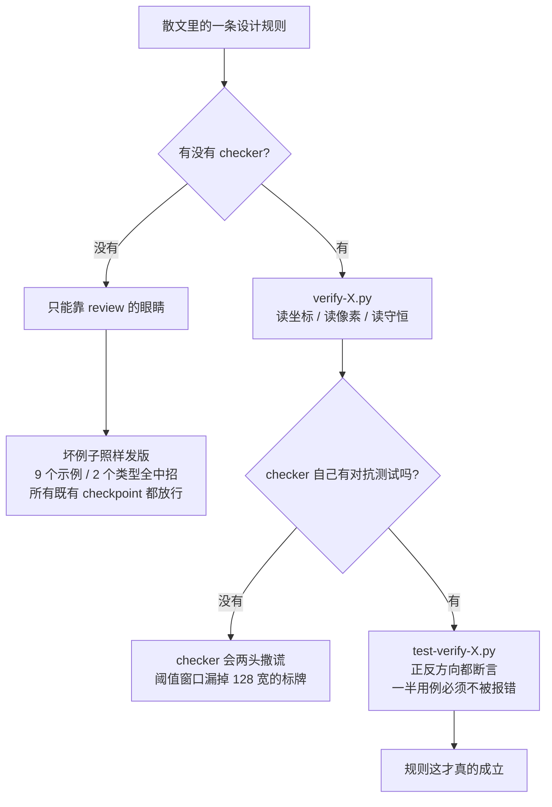

# 拆 4 万 star 的 diagram-design：护城河不是 40 种图，是 58 条 CI 关卡

上一篇我拆了[夏林果真人 IP 封面 Skill](/blog/2026-09-15-xialingguo-ip-cover-skill/)——300 行提示词、9 张样图、9 KB，值得抄的是 4 条设计决策。

这篇拆的是另一个极端。同一个"Skill"这个词，[cathrynlavery/diagram-design](https://github.com/cathrynlavery/diagram-design) 有 554 个文件。

先把数据摆出来，因为它本身就说明了问题：

| 项 | 数字 |
| --- | --- |
| Star / Fork | 40,045 / 2,544（2026-09-15） |
| 建仓 | 2026-04-16（五个月） |
| 文件数 | 554 |
| 图表类型 | 40 种 |
| 语义模式 | 8 种 |
| ADR 决策记录 | 11 份 |
| 本地关卡命令 | 58 条（背后是 23 个 verify-\* 脚本 + 29 个 test-\* 脚本） |
| CI | ubuntu / windows / macos × Python 3.11 / 3.12 |
| License | MIT |

我一开始以为它是个"40 种图表的 prompt 合集"。打开之后发现，它是一个**把 SKILL.md 当生产代码来维护**的工程项目：有 ADR、有 CI、有对抗测试、有 README 截图新鲜度校验（`verify-screenshot-freshness.py`），甚至有"文档和路由面同步"的关卡。

**核心判断：Skill 的工程质量，不取决于提示词写得多好，取决于它有多少条规则被写成了 checker。**

下面 6 层，从最表层拆到最里层。

## 第一层：它的风格是靠"删"立住的，不是靠"加"

README 开场第一句是 slogan：

> **No Figma. No generic rounded boxes. No 30-minute color-picking sessions.**
> Editorial diagrams your designer won't hate.

描述栏里还有一句更狠的：**No shadows. No Mermaid slop.**

注意这些句子的方向——**它在定义自己"不要什么"。** 一个 40 种图表的系统，卖点居然全是减法。

SKILL.md §1 直接把这条写成哲学：

> **The highest-quality move is usually deletion.**
> 每个节点代表一个独立的想法；两个总是同时出现的节点，就是一个节点。
> 每条连线都要携带信息；如果关系从布局上就能看出来，删掉那条线。
> 珊瑚色是**编辑性的，不是信号灯**——每张图 1–2 个焦点节点。用在 5 个节点上，信号就没了。
> 图不是"什么都加完了"才完成，是"什么都删不掉了"才算完成。
>
> **目标密度：4/10。**

然后它把这套审美翻译成了硬预算（§7 复杂度预算）：

- 最多 **9 个节点**、**12 条箭头**
- 焦点色最多 **2 个元素**
- 泳道 ≤5、ER 实体 ≤8、象限条目 ≤12、散点 ≤30
- 超过就拆成"总览 + 细节"两张

还有 4px 网格——节点原点、宽高、间距、内边距必须能被 4 整除，允许值直接列成白名单（宽高 80/96/112/…/320，间距 20/24/32/40/48，圆角 4/6/8）。理由说得非常直白：

> 每个坐标、宽度、间距都能被 4 整除——**这是不可谈判的，它就是让图不显得"AI 生成的"原因。**

这句话我看了两遍。我一直以为"不显得 AI"靠的是配色品味，它说靠的是坐标能不能被 4 整除。因为网格一旦对齐，人眼读到的是秩序；网格乱了，就变成"看起来还行但说不上哪里怪"。

## 第二层：它还写了一张"AI slop 反模式表"

这可能是整个仓库里最实用的一页。§4 把"AI 味图表"的典型症状逐条列出来，附上"为什么失败"：

| 反模式 | 为什么失败 |
| --- | --- |
| 深色模式 + 青紫发光 | 看起来"技术"，但没有设计决策 |
| 把 JetBrains Mono 当万能 dev 字体 | 等宽是给**技术内容**的（端口、命令、URL）；名字该用 Geist sans |
| 每个节点都是同一个方框 | 抹掉层级 |
| 图例浮在图中间 | 和节点打架 |
| 箭头标签没有遮罩矩形 | 文字和线叠在一起 |
| 箭头上的竖排 `writing-mode` 文字 | 没法读 |
| 默认三个等宽摘要卡 | 通用网格——宽度要变化 |
| 任何元素加阴影 | **阴影出局，边框进场** |
| 方框用 `rounded-2xl` | 圆角上限 6–10px，或者不加 |
| 每个"重要"节点都用珊瑚色 | 珊瑚是 1–2 个编辑性重音，不是信号系统 |
| 复刻 Mermaid 的渲染器布局 | 那是把自动间距和自动路由搬过来，而不是做编辑性排版 |

再加一条我觉得最诚实的：

> **Before drawing, ask: would the reader learn more from this than from a well-written paragraph? If no, don't draw.**
> （画之前问：读者从这张图里学到的，会比从一段写得很好的话里更多吗？不会就别画。）

而且它专门有一节叫 **"When *not* to use this skill"**——什么时候**不要**用这个 Skill：列表用表格或项目符号、前后对比用表格、单个方框的"图"就直接写那 sentence。一个 4 万 star 的工具，主动告诉你有四种情况别用它。这种自信比任何 API 文档都有说服力。

## 第三层：审美被翻译成了 40 行可执行判据

这是它和普通"风格指南"的分界线。§9 是一张 **Pre-Output Checklist（Taste Gate）**，出图前必须过一遍，分五组：

**类型适配**：选了语义模式再选视觉类型吗？表格/段落能不能干同样的活（能就别画）？加载了对应类型参考吗？

**减法测试**（我数了一下，这是它的灵魂）：
- 能删掉任何一个节点吗？（读者还能看懂吗）
- 能合并任意两个节点吗？（它们是不是总一起出现）
- 能删掉任何一条箭头吗？（关系从布局看得出来吗）
- 能删掉任何一个标签吗？（颜色或形状已经传达了吗）

**信号**：珊瑚色是否 ≤2 个元素？图例覆盖了所有用到的类型、且没有多余的？

**技术**（这一组长得像 code review）：
- SVG 有没有 `role="img"` 和能解析的 `aria-labelledby`？
- `<title>` 是不是 `<svg>` 的第一个子节点、且 `<title>`/`<desc>` 都填了？
- ID 有没有按图表和变体加前缀（绝不用裸 `title`/`desc`）？
- 箭头是否画在方框之前？
- **每个跨轴连线是否都用圆角直角折线（r=8）？有没有斜线？**
- **每个箭头标签上方是否有 6–10px 可见间隙？**
- **有没有两条连线重叠、共用路径、或者叠在一起？** 交叉是否用了桥接原语？
- **同一侧有多个连线进出时，每个是否都有自己的附着点（间距 ≥12px）？**
- **有没有标签遮罩压在"后画的"节点上？（节点填充会把文字切掉）**

**排版**：品牌匹配是否用了 `getComputedStyle` 验证的**真实**字体族和字重、并披露了回退？人名标签是不是 sans 不是 mono？有没有任何地方用了 JetBrains Mono？

看到最后那条"有没有任何地方用了 JetBrains Mono"我笑了——它把上一张反模式表里的偏好，变成了一条有明确答案的自检题。

**这就是从"品味"到"判据"的翻译。** 品味的毛病是没法执行：你跟一个 agent 说"做得专业一点"，它给你的就是青紫发光。而"标签遮罩不能压在后画的节点上"是可判定的——所以它可以被写进 checklist，进而可以被写成脚本。

## 第四层 ⭐：一条只活在散文里的规则，真的会发出一堆坏例子

这是全仓库最值得读的一页，ADR 0005（*Label placement is verified geometrically, not by review*）。我把它的事件经过完整复述一遍，因为这是个教科书级的 bug 故事：

**背景**：SKILL.md 规定标签要离连线 6–10px、连线不能从非端点方框背后穿过——但**没有任何一条规则约束标签和"节点"的关系**。

**后果**：因为绘制顺序被固定为 背景 → 区域 → 箭头 → 标签 → 节点，一个落进节点内的标签遮罩会被节点填充盖住，文字就在节点边框上碎成一段。

**它的实际影响**：**已经发版的 9 个示例、跨 2 个类型（architecture、swimlane）都长了这个毛病。**而当时所有的关卡都放行了——因为 `lint-skin.py` 只查颜色、字体、无障碍契约；`self_check.py` 只查 DOM 结构和动效契约；**没有一个读坐标**。这个缺陷只有渲染出来才看得见，所以它在三个变体里同时活了下来，穿过了 review。

**它的决定**，三条：
1. 给标签位置补一条显式规则（SKILL.md §6 rule 6），而不是留给作者的眼睛；
2. 写 `verify-geometry.py` 强制执行：解析 `<rect>` 坐标，报告"遮罩压在了**文档中更晚声明**的节点上"。判据是**文档顺序**而不是单纯的重叠——压在前画的区域容器上算合法（它在上层），完全落在节点内的遮罩是徽标条；
3. **给 checker 配对抗测试**（`test-verify-geometry.py`），正反两个方向都断言：被裁切的遮罩必须被报出来，合法的情况必须不被误报。

然后它写下了一句我认为整篇文章最该被抄走的话：

> **A rule that only lives in prose is a rule that ships broken examples.**
> （一条只活在散文里的规则，就是一条会发版坏例子的规则。）

还有个后续细节特别真实：那个 checker 的宽度阈值原本是 120，结果 `example-sequence-oauth.html` 里的长等宽标牌宽 128，**落在窗口之外——于是所有超过 120 的遮罩（包括 CJK 标签产生的更宽标牌）全都没被验证过**。后来放宽到 200，高度上限保持 14（因为提到 18 会把约 80 个已发版的矩形——区域小标题、容器头栏、行条纹——误判成遮罩）。

修一个验证器的漏洞，还要权衡误报率、还得数清楚会误判多少个已发版对象。这不是 prompt 工程，这是编译器后端。

## 第五层：每个 checker 都要有"checker 的 checker"

上面已经出现过 `test-verify-geometry.py`。我数了一下，`scripts/` 下有 **23 个 verify-\* 脚本，配了 29 个 test-\* 脚本**——**测试脚本比被测试的脚本还多**，因为差不多每条验证规则都配了一份对抗测试。

而且那些对抗测试的写法很讲究，README 里反复出现同一句话：

> **keeps that checker honest in both directions**
> （让 checker 在两个方向上都保持诚实）

`lint-render.py --self-test` 更极端：**23 个用例，超过一半是"必须不被报错"的用例**。也就是说，它花了一大半测试预算来防止自己的 linter 误报。

几个让我停下来看两遍的技术决策：

**① 裁切必须用像素量，不能用几何量。**
判断内容有没有被 SVG 视口切掉，最直觉的做法是 `getBoundingClientRect()`。它明确否掉了：这个方法**忽略描边宽度、箭头标记和滤镜外溢，也完全不知道 `clip-path` 和 `overflow: visible`**——所以它既会漏掉真实裁切，又会凭空造出并不存在的裁切。

它的替代方案是**按像素比对两次截图**：一张按作者写的样子渲染，一张把 `overflow` 放开再渲染，两张 diff——**出现在外面的墨迹就是原本被切掉的**。而且放开是分级的（先放开 SVG 本身，再逐个放开它的裁切祖先），这样"放开外层"不会掩盖"在 SVG 自己边缘的外溢"。并且断言测量前后 DOM 字节完全一致。

**② 故意不要 golden image。** 没有基准图，就没有东西需要重新录制，仓库里也不放 PNG。

**③ 相对误差而不是绝对误差。** 树图的面积是它的全部主张，所以 `verify-treemap.py` 会验证每个格子占的面积和它标注的数值是否匹配。关键细节：**面积误差按"相对值"衡量——用绝对值的话，恰好会让最可能出错的小格子通过。**

**④ 每个新类型都要带一道守恒校验。** 瀑布图的全部主张是"累计量守恒"，所以 `verify-waterfall.py` 会检查：声明的起点、增量、终点能不能对上；桥接柱有没有画在两个累计水位之间；增量有没有带正负号；两个方向的填充有没有糊成一种。

我把这套结构画出来了：



## 第六层：当空间不够时，砍什么——以及 52 字节

ADR 0004 是我见过对"Skill 该长什么样"最清醒的一条记录，值得完整讲。

**背景**：SKILL.md 每次调用都会进 agent 的上下文，所以必须保持精简，它就设了一个字节上限。但 v2.3 最初把上限设在 35,000 字节，为了塞进去，**它砍掉了 frontmatter 里 description 的全部 27 个类型名**。

然后它意识到自己砍错了地方：

> description 是 agent 在**决定要不要加载这个 Skill 之前**唯一能看到的文本。把 "flowchart"、"Gantt"、"org chart" 从里面删掉，就是删掉了让"帮我画个流程图"这句话能唤起这个 Skill 的**词汇钩子**。

**决定**，两条，且有优先级：

1. frontmatter 的 description **必须**列出选择表里的每一个视觉类型（`verify-docs-sync.py` 强制），外加导入格式和主要功能词汇。**路由面永远不拿去换正文。**
2. `MAX_SKILL_BYTES` = 40,000 字节。当文件接近上限时，**砍正文，或者把细节挪进 `references/`——绝不砍 description。**

后果里有一条：**新增一个视觉类型就必须动 description，否则 CI 失败——这是设计如此。**

我去核了一下现在的实际尺寸：**SKILL.md 是 39,948 字节。距 CI 上限还剩 52 字节。**

我第一次看到这个数字时愣了一下。一个 4 万 star 的项目，它的核心提示词正贴着天花板运行——**并且它是故意让天花板存在的**。因为提示词是唯一一种"加内容看起来毫无代价"的东西：多写一段不会被编译器拦住，不会被测试挂掉，只会让 agent 每次调用都多扛一点上下文，直到某天它开始漏读后半部分。字节上限就是把这种隐形成本显性化。

**配套的是渐进披露（progressive disclosure）。** 启动时 agent 只看到 Skill 的名字和描述；命中请求才加载 SKILL.md；类型参考、语义模式、动效契约各自在需要时单独加载。README 里有一张"What loads when"对照表：

| 你要什么 | Agent 加载什么 |
| --- | --- |
| 画个流程图 | `SKILL.md` + `type-flowchart.md` |
| 对比这两条策略为何不同 | `SKILL.md` + `semantic-patterns.md` + `type-flowchart.md` |
| 把那张策略追踪做成动效 | 前述选择 + `animation.md` |
| 用我保存的 Acme 客户档案 | `SKILL.md` + `profiles.md` + `~/.diagram-design/profiles/acme.md` |
| 常规静态出图（40 种类型任意一种） | **只有** `SKILL.md` + 那一个类型参考 |

最后一行是重点，后面还有一句总结：

> **No matter how many types exist, the agent only reads the one you need. Add a new type tomorrow and nothing else changes.**
> （不管有多少种类型，agent 只读你需要的那一个。明天加一个新类型，其他什么都不用改。）

40 种类型没有把上下文撑爆，是因为类型是横着铺开的目录，不是竖着叠上去的正文。这也解释了为什么它能一边加类型一边把 SKILL.md 压在 52 字节余量里——**加类型动的是 `references/` 和 description 的一个词，不是正文。**

## 唯一的缝隙：README 里那个"39"

最后说一个我自己发现的不一致，因为它恰好把本文的论点反过来证明了。

我核对类型数量时发现：**SKILL.md 写的是 "Forty visual types"、选择表标题是 "(40)"，ADR 0002 的 2026-09-06 修订也明确写着"the count is 40"（瀑布图加入，39 → 40）。但 README 有 8 处写着 39**，而它自己列的表格里其实是 40 个类型——**README 的散文比事实少了一个。**

为什么会漏？因为这个仓库虽然有 `verify-docs-sync.py`，但它 gate 的是：描述里有没有丢掉某个类型的词汇钩子、gallery 能不能到达每个已发版示例、README 目录树里点名的文件存不存在、相对链接有没有断、以及各个命令/提示面有没有漂移——**它不 gate README 散文里的计数**。所以那个数字就自由地漂了一个。

我没有在挑刺。ADR 0002 的修订里，作者自己把同一个机制写得更清楚：

> 这两个计数器就是本 ADR 的强制执行点，所以一个动了它们却没同步修改本文件的 PR，已经悄悄把自己变成了权威。**要么在同一个 PR 里改这里，否则测试里的那个数字就只是"上一个贡献者随手敲的"。**

**一个把验证做到这个程度的仓库，依然在"没写 checker 的地方"漂了一个数。** 这就是本文论点最干净的一次自证：漂移不取决于你多认真，只取决于那里有没有 checker。

## 我抄走的四条

1. **一条规则只要只活在散文里，就会发版坏例子。** 写完一条设计规则，紧接着问：它能不能被写成一个读坐标/读像素/读守恒的脚本？能，就写；不能（比如"6–10px 的连线间隙"需要描边几何而不是矩形），就诚实标注"这条留作 checklist 项"，别假装它被验证了。
2. **每条 checker 都要配反向对抗测试。** 不只是"坏输入必须被报出来"，更要有"合法输入必须不被误报"——而且要**占掉一半以上的用例**。一个过严的 checker 比没有 checker 更糟，它会训练所有人学会绕过它。
3. **把上限显性化。** 提示词的成本是隐形的，所以要给它一个字节天花板，并且提前定好"顶到上限时砍哪一边"的优先级。ADR 0004 的答案是：**永远别砍路由面（那个决定 Skill 会不会被唤起的 description），砍正文。**
4. **主动写下"什么时候别用我"。** 它的判断标准一句话就能记住：读者从这张图里学到的，会比从一段写得很好的话里更多吗？

还有一条不算"抄"，算提醒：**这个仓库最有价值的部分不是那 40 种图，是它承认自己会错的那部分。** 11 份 ADR 里，好几份记录的是"我们原以为 A，结果发现了 B"——砍错的地方（description）、没验证的地方（标签几何）、阈值窗口漏掉的地方（128 宽的标牌）。这些记录的存在，才是它五个月做到 4 万 star 的真正原因。

## 怎么装

**Claude Code：**

```text
/plugin marketplace add cathrynlavery/diagram-design
/plugin install diagram-design@diagram-design
```

**Codex：**

```bash
codex plugin marketplace add cathrynlavery/diagram-design
codex plugin add diagram-design@diagram-design
```

另外还支持 GitHub Copilot、Factory Droid、Pi、Kiro、OpenCode。不想被包管理器覆盖配置的话，clone 下来软链 `skills/diagram-design` 到你的 skills 目录即可。

装完第一件事它会先卡你一下——这是我最喜欢的细节之一：**首次在新项目里出图时，如果 `style-guide.md` 还是默认色板，它会停下来问你要不要先按你的网站配色**，而不是直接把一张默认皮肤的图悄悄塞进一个有品牌的项目里。它管这叫 **first-run gate**，原话是 `Don't silently ship default-skinned diagrams into a branded project.`

调一次品牌同步，它会把抓到的 URL、颜色角色、字体族和字重、字体来源 URL、以及任何回退都列成一张 **fidelity receipt**；再调一次 `verify-geometry.py`——**它连"我从你网站读到了什么"都不让你猜。**

---

顺带说一句，它的导入功能可能比生成更实用：`/diagram-design:import-mermaid README.md --diagram=all` 能把 Markdown 里的 Mermaid 块按你选的比例、尺寸和细节层级**重画**成编辑级排版，并且最后给你一份 **fidelity ledger**——合并了什么、折叠了什么、丢掉了什么。同一份源文件配四个旋钮（格式 / 尺寸 / 细节 / 受众），可以分别出给工程师、混合读者和高管的三个版本：`Auth Service / JWT · RS256 · :8443` → `Auth Service / token check` → `Sign-in`。**改的是措辞，不是数量。**

它丢掉的也很明确：源文件的坐标、源色板、源字体、draw.io 的斜线意面、Mermaid 的自动布局、Excalidraw 的手绘几何。永远保留的是：组件、关系、分组、方向。

装完记得给自己也留一条纪律——**先问"这段字能讲清楚吗"，再决定画不画。**
