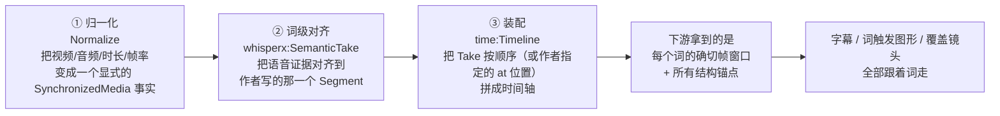

# Hypit：把视频变成源码的编译器，和它那句「锚定到词，而不是秒」

这是我这轮拆的第三个仓库，也是三个里野心最大的一个。

前两篇：[夏林果封面 Skill](/blog/2026-09-15-xialingguo-ip-cover-skill/)（300 行提示词、9 张样图），[diagram-design](/blog/2026-09-15-diagram-design-skill-engineering/)（554 个文件、58 条 CI 关卡）。这两个都是**在"怎么写好一个 Skill"这个维度上做到极致**。

[Hypit](https://github.com/hypit-ai/hypit) 不在这个维度上。它给 AI agent 配了**一门语言、一个编译器和一套运行时**，然后用这些东西做视频。

先给结论，因为它那句 slogan 有点误导：

> **Clone any viral video with AI agents. 1 command, 100 variants, 100M views.**
> 克隆任何爆款视频。一条命令、100 个变体、1 亿播放。

听起来像个视频生成器。**但它不是生成器，是编译器。**

## 一句话说清它的主要作用

**Hypit 让 AI agent 用一种类似 XML 的源码（SVML）描述一条视频，然后把这套源码编译成成片。**

它解决的不是"生成画面"，是**"把视频从一次性渲染变成可编辑、可重跑、可批量的源码工程"**。

官方文档里那句话最准确：

> 你拿到的都是**可编辑、可重跑的工作流，而不是一次性的成片**。

这个区别是全部价值所在。一次性的成片，改一个字要重做一遍；源码工程，改一个字重新编译——而且只重编译改变的部分。

编译这件事它有真实的工程链路，不是比喻。一次典型的运行长这样：

```bash
hypit check reference.svml        # 校验作者源码
hypit plan reference.svrun        # 生成执行计划（会跑哪些操作）
hypit pricing reference.svrun     # 先给你报价单
hypit build reference.svrun --follow   # 带实时进度地跑
hypit get <build-id> --output final.video --to output/final.mp4
```

注意第三行——**它在动手之前先算钱。** `hypit pricing` 会在你花掉一分钱之前列出这次运行的成本，因为"生成画面"是要调付费模型的，而它把这一步做成了编译期的可见项，而不是运行后的账单。

## 核心判断：它真正的设计赌注是「锚定到词，而不是秒」

README 里有一句话，写在最不起眼的位置，但它是整个系统的地基：

> 丢一条视频进来，Agent 把整套 workflow 克隆下来：画面、字幕、B-roll、特效，**全部锚定在词上，而不是秒上**。

我一开始把它当成文案。直到我读了 `@hypit/script` 的文档，才发现这是**字面意义上的技术事实**，而且它是全项目最狠的一个约束：

**作者写的脚本里，不存在秒，也不存在帧。**

`@hypit/script` 产生的 `CaptionDocument`，文档里对它有一句非常明确的描述：

> **It contains no seconds or frames.**
> （它不包含秒，也不包含帧。）

那作者写的是什么？是语义结构：

```svml
<script id="story">
  @answer

  <opening>
    <ALICE> I will make the first point.
    <BOB> Then I will answer.
  </opening>

  <pause/>
  @/answer
</script>
```

- `<opening>` 是一个 **Segment**（命名段落）
- `<ALICE>` 是一个 **Role Cue**（说话轮次，裸标签即可）
- `@answer ... @/answer` 是一个 **Selection**（命名的语义区间）
- `@name!` 是一个 **Moment**（命名的语义点）
- `really{emphasis}` 是**词级属性**（标记在这个词上，不携带时间）

**全都是语义，一个数字都没有。** 那时间从哪来？后置推导，三步：



官方对第 ① 步的描述我特别喜欢，它专门强调这一步"**不含任何脚本含义，也不做转写**"：

> 归一化只建立后续语义对齐可以信任的媒体事实。

**顺序是刻意的：先立事实（媒体/时钟），再做语义（对齐），最后才装配（时间轴）。** 而且它明确写着"作者不需要理解时间"——`language` 参数是唯一跟语言有关的东西，还得作者手填（目前只支持 `en` 和 `zh`），因为"Hypit 不从脚本文本或音频里检测、也不路由语言"。

**这个设计换来了什么？换来了一句我一开始不信的话：**

> 多语言版本——同一条视频十种语言。**改一句台词，时间轴自己重排。**

在传统剪辑里，这句话是在吹牛。改一句台词意味着：字幕要重新断句、B-roll 的入场要重新对拍、词触发的贴纸要重新卡点、连音乐的情绪曲线可能都要挪。因为那些东西的锚点都是**秒**——而秒不会跟着台词动。

一旦锚点是**词**，这些全部自动重排。你改的是台词，机制重新算的就是时间。

**这就是本文我最想抄走的一条设计原则**，而且它和上一篇里 diagram-design 的做法是同一类东西：

| | 从作者手里拿走的 | 留给作者的 |
| --- | --- | --- |
| diagram-design | 人物位置、构图主次 | 风格 + 这次的视觉重点 |
| **hypit** | **秒、帧、卡点位置** | **语义结构（段落/轮次/区间/词）** |

**把不稳定的东西从作者手里拿走，只让作者描述稳定的东西。** 图里稳定的是"谁是主角"，时间轴里稳定的是"这句话是什么意思"——位置和秒数都是这两者的**推导结果**，不该由人手工维护。

## 因为可编译，所以能批量——而且第二条几乎不花钱

这是"编译器"这个定位兑现出来的第二个能力。

`hypit` 有一类 Run Source 指令叫 **build-record**，它的作用是：**声明一个"零输入的候选"，直接引用上一次 Build 里某个具名 Output。**

文档的原话是：新的 JSON 结构不会导致已经生成的画面被重新拷贝一遍——"它的嵌套媒体仍引用原始文件"。

翻译一下：**第一次运行生成的那几条 A-roll、B-roll、配音，第二次运行时不必重新调模型。** 变了的部分重编译，没变的部分直接复用。

所以 README 那句"**第二条视频几乎不花钱；第一百条是个循环**"不是修辞，是编译器的基本性质。而且还有个配套命令 `hypit history hook-take.video` ——**按输出名反查历史结果，找到可以复用的那一个。**

它给的三个示例成本，正好是这套机制的广告：

| 示例 | 内容 | 成本 |
| --- | --- | --- |
| UGC（足球排名） | 2 条音频 + 1 张 2K 人像 + 10 张 1K B-roll + WhisperX 对齐 + 字幕 + 音乐，64 进程并发渲染 | **$1.15** |
| Podcast | 3 条对话 + 2 张人像 + 3 张拼贴 + 分屏布局 + 分说话人卡拉OK字幕 | **$1.07** |
| 街头采访 | 3 条 A-roll + 1 张人像 + 人脸框跟踪的字幕 + emoji 揭示板 + 音效 | **$1.09** |

**注意每个都只要一块多，而每个都附赠三个克隆变体。** 因为变体复用主体。

## 第三条兑现的能力：一条精确为 0 元的路径

这条我觉得是架构上最漂亮的。README 里专门澄清了一句，语气很像在防止误解：

> 生成模型也是可选的：一个 workflow 可以把**字幕、动态图形和代码渲染的画面**编译成一条成片，**而不调用任何模型**——所以一条视频的成本可以精确为 $0。

这不是"免费试用"那种 0 元，是**架构上真的不需要调模型**。

为什么做得到：它的渲染层 `@hypit/hyperframes` 把通用的 `Composition` 契约降维成一份**可移植的逐帧文档**，然后交给浏览器渲染。文档里明确写着：合法的帧地址就是 `[0, frameCount)`，**"本地 worker 池或托管渲染器都可以独立求解任意合法帧或半开区间——分区大小和 worker 数量是 Runtime 策略，不是作者意图，也不是 Core 图的节点。"**

翻译：**渲染被定义成了"求解每一帧"这种可并行的纯函数问题。** 所以示例里那句"64 个 headless Chromium 进程并发渲染"不是优化技巧，是架构的自然结果——因为帧与帧之间互相独立，谁都可以算哪一帧。

纯 MG（动态图形）的视频，画面完全由前端代码驱动，**零 API 调用，一条 0 元**。它在 README 的"能构建什么"里就列着这一条。

## 工程规模：112 个包，一个月 864 次提交

这部分数据本身有点吓人：

| 项 | 数字 |
| --- | --- |
| Star / Fork | 2,315 / 221 |
| 建仓 | 2026-07-29（一个半月） |
| 文件数 | 2,026 |
| **monorepo 包数** | **112** |
| Skill 大小 | SKILL.md 23.8 KB + **72 个参考文件、约 563 KB** |
| 示例 | 7 个（含 25 个 `.svml` 源文件） |
| 近一月提交 | **864 次**（2026-08-15 起） |
| 贡献者 | 7 人（主力两人：755 / 436 次提交） |
| 版本 | v0.1.8（2026-09-14） |
| 技术栈 | TypeScript / Node 22.15+ / pnpm / Playwright+Chromium |
| License | Apache-2.0 **+ 附加条件** |

112 个包按职责分层，看名字就能理解这套系统怎么切：

- **语言/编译层**：`markup`（SVML 前端）`script` `narrative` `temporal-markup` `elaborator` `composition` `driver-node` `package-loader-node`
- **时空模型**：`program-space` `temporal` `timeline` `spatial` `timeline-author` `visual-ir`
- **轨道**：`media-track` `audio-track` `caption` `caption-fine` `typography-track` `deck-track` `screen-overlay`
- **渲染**：`hyperframes` `render-hyperframes` `raster` `browser-capture` `runtime-local` `runtime-host-node`
- **模型 provider**：`seedance` `seedream` `gpt-image` `nano-banana` `grok-imagine` `minimax-h3` `elevenlabs-speech` `fishaudio-speech` `mimo-speech` `provider-hypihub`（官方托管）`provider-whisperx-local` `provider-media-local` `provider-image-opencv-local`
- **本地服务**：`services/whisperx` `services/yt-dlp` `services/image-opencv`

**注意 provider 那层的设计：本地和托管是并列的。** WhisperX 有本地的（`provider-whisperx-local`），也有托管的（HypiHub）；图像、视频、语音模型走 HypiHub 或自带 key。所以"零 API 调用"和"全托管"是同一条轴上的两端，不是两种产品。

而对 agent 来说，这一层是被封装掉的。Skill 的定位写得很清楚：

> **你是被委托做这条视频的导演和制片人。** …Skill 和可执行文件负责定位工具；项目文件定义被委托的工作和与之相关的素材。

72 个参考文件的组织方式也是渐进披露——按 `creation/`（brief、参考视频、脚本与时间、变换）、`environment/`（本地工具、模型与 provider、profile）、`playbooks/`（craft 技巧 + formats 格式：口播、双人播客、街头采访、短剧、排名榜、旁白演示）、`production/`（作者、构建、渲染、评审、Studio、音轨、空间）分房间。SKILL.md 里最后有一张路由表：你问什么，就只加载哪一间。

## 它诚实地标出了自己的边界

这一点值得单独说，因为很多开源项目在这件事上含糊。

**许可证是 Apache-2.0 加三条附加条件**，我把它翻译成人话：

| 能不能做 | 说明 |
| --- | --- |
| ✅ 自己用、自己组织内部用（**含商业使用**） | 包括把它当自己应用的渲染/生成后端、企业内部工具 |
| ✅ 给自己的客户做 | 明确写了"work performed for your clients" |
| ✅ **产出物完全归你** | 原文：producer 对你的产出物不主张任何权利，包括商业使用 |
| ❌ 不能做多租户 SaaS | "一个租户 = 一个 workspace"，两个外部主体各有 workspace 就算多租户 |
| ❌ 不能商业转售 | 不能收费售卖 Hypit 或其衍生作品，无论独立还是捆绑 |
| ❌ 不能去掉 CLI / 运行报告 / manifest 里的 LOGO 和版权信息 | 但这条不适用于"不向用户展示这些组件"的用法 |

**这就是典型的"开源核心 + 托管服务"模型**：你把它跑在自己的服务器上给自己的工作用，一分钱不花，产出归你；但你不能拿它开一家跟它竞争的 SaaS。对比项它也列了——Arcads 每月 $220、Creatify $39，**而且那还是在你渲染任何东西之前**。

**另一个诚实的地方是"克隆爆款"这件事的定位。** 它把"克隆"当成入口，但明确写了"**这是最快的入口，不是唯一的入口**"——你可以从模板开始，也可以直接描述想要的视频让 agent 从零写。而且它反复强调：参考视频是用来理解"这条为什么能抓住人"的，`/hypit Clone this video: /path/to/video` 之后 agent 要"看参考、检查它的帧、按时间读它的词，发现这条作品为什么能抓住注意力"——然后做的是**新的**一条。

当然，用谁家的爆款当参考、能不能发，这件事的合规性取决于素材来源和平台规则，不是工具能替你决定的。许可证里也留了一句：第三方模型和服务可能有各自的条款。它是开源工具，不是免责书。

## 我的判断：三个仓库，三条完全不同的路径

拆完这三个，我发现它们其实回答了同一个问题的三个层次——**"一个 Skill 能做到什么，取决于它下面垫着什么"**：

| | 下面垫着什么 | 所以它能做 |
| --- | --- | --- |
| 夏林果封面 Skill | **9 种风格的提示词 + 9 张样图** | 稳定出一张好看的封面 |
| diagram-design | **40 种类型参考 + 58 条 CI 关卡** | 可靠地出 40 种编辑级图表 |
| **hypit** | **一门语言 + 编译器 + 运行时 + 112 个包** | **可重跑、可批量、可多语言、成本可精确为 0 的生产系统** |

这不是"谁更高级"的问题——封面 Skill 用它那 9 KB 解决它该解决的问题，非常合适。但这张表说明了一件重要的事：**当你想让 agent 做的是"生产"而不是"产出"时，光把提示词写好是不够的，你必须给它一门语言。** 因为语言才带来三样东西：可复用（组件）、可推理（编译器优化和报价）、可增量（只重编译改变的部分）。

而 Hypit 最值得抄的那一条，我已经说了：**把不稳定的东西从作者手里拿走。** 它没有教 AI 怎么算时间，它把时间从作者语言里**删掉了**——这是我觉得它比"提示词写得好"高一个维度的地方。

## 什么人不适合用它

说点实在的，因为它门槛不算低：

- **只想要一条视频的人。** 它的价值在第 2 到第 100 条。做一条，你去用别的更省事。
- **不想装依赖的人。** Node 22.15+、pnpm、Python（WhisperX / OpenCV / yt-dlp）、Playwright + Chromium。想走本地 0 元路径，这套东西得先在机器上跑起来。（它会用 `hypit doctor` 帮你体检，也可以只用托管。）
- **要稳定 API 的人。** v0.1.8，一个半月，一个月 864 次提交。这个速度意味着设计在快速收敛，也意味着 breaking change 的概率不低。想抄它的架构可以，想在生产里深度绑定，建议先观望一两个 minor 版本。

## 怎么开始

装 Skill 就一行：

```bash
npx skills add hypit-ai/hypit -g
```

然后在任意项目目录里起一个 agent 会话：

```text
/hypit Clone this video: /path/to/video
```

或者不用参考视频，直接描述：

```text
/hypit Make a ranking video that puts Hypit in S tier.
```

之后 agent 会自己去查环境、向你要这次运行需要的凭证、生成素材、组装成片。中文文档和中文 README 是齐的（`docs/zh/` 整份都有，CONTRIBUTING 也是双语的），这点在国内项目里不常见，值得给一分。

仓库地址：[github.com/hypit-ai/hypit](https://github.com/hypit-ai/hypit) · 官网 [hypit.ai](https://hypit.ai)

---

如果让我用一句话概括它的主要作用：**它把"做视频"从一次性的手艺，变成了一个有源码、有编译器、有报价单、有增量构建的工程。** 至于 AI agent 在这套东西里扮演什么角色——是导演和制片人。镜头怎么排、素材怎么生成、钱花在哪，还是人来做决定。

**只是现在，决定完之后它可以被编译。**
