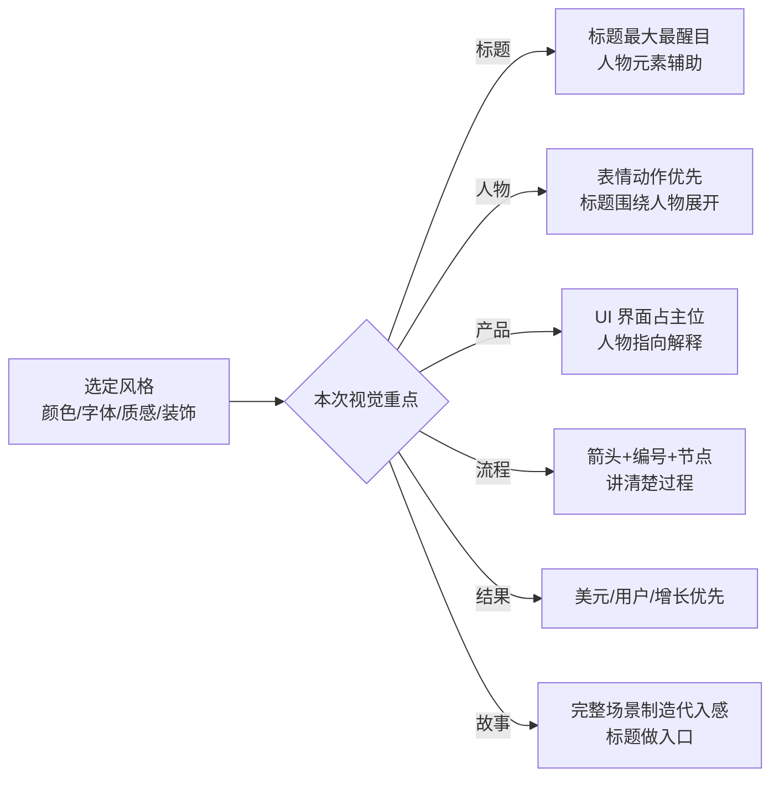

# 拆一个封面 Skill：九种风格是外壳，「风格固定、主次灵活」才是内核

我平时做封面踩过的最大一个坑，不是"风格不好看"，是**九种风格做出来长一个样**。

因为我把风格和版式混在一起写了：风格里顺手规定了人物站左边、标题压右上、元素按固定顺序排。结果九套 Prompt 换了颜色和字体，构图一模一样。读者看不出这是九种风格，只看出一套模板。

最近认真拆了 [peggykangkang02/xialingguo-ip](https://github.com/peggykangkang02/xialingguo-ip)（9 月 10 日建的仓库，五天内 125 star、26 fork），发现它开头第一段就把这件事说清楚了：

> **核心原则是"风格固定，主次灵活"……不能把人物位置误当成风格本身。**

一句话，把我上面那段"九套 Prompt 一个构图"的病根写在脸上了。

这篇不是要夸它，是我自己拆完之后的笔记——它值得抄的其实只有四件事，风格库是最不值钱的那件。

## 第一层：九种风格，本质是一张"视觉语言"清单

它把九种风格各自定义成四件东西：**一句话识别、颜色、结构与元素、适合什么内容**。注意——定义里没有"人物站哪里"。

| 风格 | 一句话识别 | 适合突出 |
| --- | --- | --- |
| 🟠⭐ 暖色手绘教程风 | 奶油纸张 + 手绘图标 + 温暖教程感 | 小白教程、方法论、亲和力 |
| 🟢💻 产品主视觉风 | 产品界面是核心，真人负责讲解引导 | 网站、UI、工具和产品 |
| 🔵⚡ 深色科技爆发风 | 深色空间 + 巨大标题 + 全球网络 | AI 趋势、增长、强冲击 |
| 🟡🟦 撕纸拼贴风 | 撕纸、胶带、照片卡片分层叠放 | 案例、故事、经验、创意 |
| ⚪🟠 编辑杂志风 | 大量留白 + 大字号标题 + 少量细线 | 长文、分析、知识整理 |
| 🟡⚫ 黑金步骤爆款风 | 黑底金字，标题像奖杯一样突出 | 从 0 到 1、收益、强结果 |
| 🟢⚫ 高饱和实测冲击风 | 荧光绿紫红撞色，像"亲自录屏验证" | 实测、复盘、挑战 |
| 🟡🟥 手写结果承诺风 | 粗手写字把"学完能得到什么"写在脸上 | 入门、收益、行动指南 |
| 🟩🌐 产品后台沉浸风 | 深色后台铺满背景，真人站在工作场景前 | 工作流、数据、业务闭环 |

九种风格的样图都是 21:9、约 1916×821 的成品。仓库里还留了一句很诚实的话："已移除'结构化教程风'"——说明这套风格库是被迭代砍过的，不是一次凑齐十个看着整齐。

## 第二层：真正值钱的一句——风格决定语言，视觉重点决定谁是主角

拆掉九种风格，它下面压着一条正交的设计原则：

- **风格**决定颜色、字体、质感、装饰语言
- **视觉重点**决定这一次谁是主角

而"视觉重点"只有六个选项：标题、真人、产品界面、流程、结果、故事场景。

这六个选项才是它真正的杠杆。同一套 🟡⚫ 黑金风，这次突出"从 0 到 1 的步骤"，人物就是前景陪衬；下次突出"第一笔美元"，美元和流量图就顶到主位，标题退缩成入口。**风格不变，主角换人——这才可能用九套风格覆盖几百个选题，而不是九套模板套几百次。**

它明确列了每个重点该怎么调主次：

我自己的教训是：**把"风格"当成了"版式模板"。** 风格应该是形容词，不是名词。我写 `暖色手绘、米白背景、人物在左` 的时候，后半句就把风格写死成了一个模板；正确写法是只给形容词，位置留给"这次突出什么"来定。

## 第三层：怎么收集信息，才不把人问烦

这是最容易被忽略、但决定"用起来爽不爽"的一层。它开场的做法是：**先给一张表单，一次性把所有真正必要的信息摊开**，而不是一句一句盘问。

表单只有 4 项是必答：文章标题/主题、风格、视觉重点、真人 IP。比例、截图、Logo、数据图、文字排版全部标成"可选补充"。

真正见功力的是表单之后的三条规则：

1. **只补问会实质影响结果的缺失项，最多 1–2 项**，不重复问已经答过的内容
2. 没有风格 → 直接推荐 1–2 种，并允许用户回"用第一个"（不需要用户懂设计术语）
3. **不因为缺可选信息就卡住**：默认 21:9；没有产品截图就用"抽象但明确的浏览器窗口、地图、流程和结果元素"顶上

第 3 条是关键。很多 Skill 卡死的原因，就是把"最好有"的输入当成了"必须有"的输入，然后停在那里等人补。它反过来——**缺什么用什么替代品顶上，先把能出的出出来。**

还有一条我很认同：信息够了，**先用一句话复述"风格 + 视觉重点 + 真人姿势 + 比例"，然后直接生成，不再等一次确认**。只有标题可能被改写、或要执行高风险外部操作时才停下来。用户说"直接做/不用问了"就按已有信息走。

## 第四层：两个"不"，比九种风格更能说明一个 Skill 是否成熟

**"不写死真人 IP"。** 这是个公共 Skill，它明说：不预设、也不写死任何人的真人 IP；每位用户自己提供参考图，自己命名（打招呼版 / AI 讲解版 / 举食指版）；而且特别警告一句——**不要把仓库里的样图当作用户的真人素材**。

仓库里躺了 9 张带真人的样图，它却专门写一条禁止把自己的样图当用户素材用。这一点很值：**样图的功能是"选风格"，不是"当素材"。** 我见过不少模板就是把示范图当成默认素材一路用下去，结果所有人生成出来都是同一张脸。

**"不把缩略图当交付"。** 它专门写了一条：生成的是**可发布的高清封面成品**，不是 README 缩略图、低清预览或风格样图；缩略图只用于风格库展示，**不能作为交付结果**。

再加上输出前的自检清单——比例对不对、标题完不完整、主体清不清晰、真人有没有被裁切、重点突不突出——**发现明显错误继续修正，或明确告知需要后期排版，不把错误版本当最终成品交付。**

我自己的 Prompt 里几乎没有这种"交付门槛"。写生成类 Skill 时，我默认模型吐出来的东西就是结果；而它把"什么算成品"写成了显式判据。这一条应该抄。

## 它还留了诚实的位置

中文标题是图片模型的老毛病。它没有硬吹"零错字"，而是：

- 默认仍以"可发布封面"为目标
- 如果标题准确性极其重要，**先提醒用户图片模型的文字风险**，建议生成高清视觉底稿后用 Canva / Figma 排版
- **只有用户同意时**才切换成底稿模式

顺手还列了几条负面清单：不用虚构品牌 Logo（用户提供或明确要求才加）、不要把所有封面做成同一套构图、避免廉价全息投影 / 过量粒子 / 过多发光 / 无意义数据流。

负面清单这一块挺有意思:它拦的不是"做不出来"，是"做得俗"。**"避免无意义的数据流"这种话,只有真的被生成过一堆垃圾图的人,才写得出来。**

## 我抄走了四条

1. **风格是形容词，不是模板。** 风格只管颜色/字体/质感/装饰，构图交给"这次突出什么"。
2. **缺可选信息不要卡住。** 给替代品顶上去，先出结果；"最好有"不等于"必须有"。
3. **写清楚"什么算成品"。** 比例、标题完整性、主体、裁切、重点，逐条判；不合格就说要后期排版，别把半成品当交付。
4. **公共 Skill 要留边界。** 不写死别人的身份素材，也别把自己的样图当用户素材。

至于九种风格本身？那是素材库，抄不抄都行——**你自己的选题库长什么样，风格库就该长什么样。**

## 怎么用

仓库地址：[github.com/peggykangkang02/xialingguo-ip](https://github.com/peggykangkang02/xialingguo-ip)

最快上手就是一句话，其余交给它推荐：

> 调用 xialingguo-ip，帮我做一张文章封面。

想一次到位就按它的四要素给全：

> 用【🟡⚫ 黑金步骤爆款风】做一张 21:9 文章封面。标题是【万字长文｜从 0 到 1 做 Web 出海保姆级教程，教你赚到第一笔美元】。这次突出【从 0 到 1 的步骤和第一笔美元】。使用【举食指版】真人 IP，保持脸、表情和动作不变。

如果你也在给内容流水线做封面，推荐连着看我这三篇：[抖音封面 Skill 的防混图设计](/blog/2026-08-23-douyin-cover-skill/)、[小红书图文管线](/blog/2026-08-23-xiaohongshu-graphic-pipeline/)、[AI 生图的视觉变量公式](/blog/2026-08-23-ai-image-generation-visual-variable-formula/)。封面这件事，最后拼的都是同一件事：**把"风格"和"这次突出什么"拆开。**
