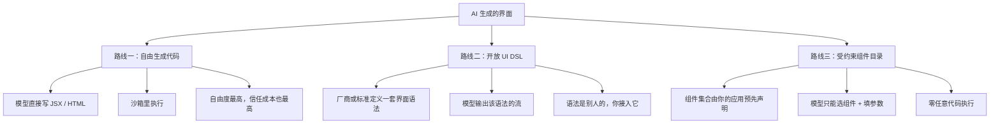
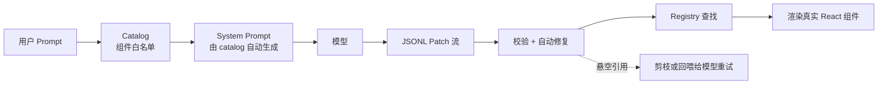
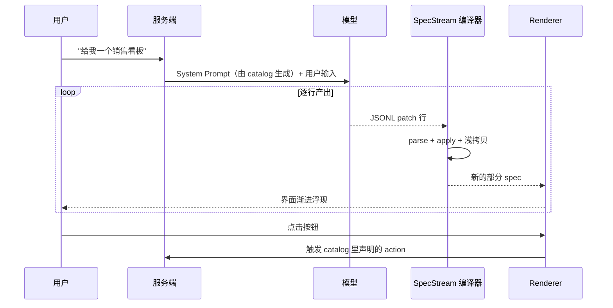

## 先说结论

`vercel-labs/json-render` 这个仓库，我第一次看到它以「The Generative UI framework」自居时是有点怀疑的——2026 年自称 Generative UI 的项目太多了，大多是「让模型吐一段 HTML 塞进 iframe」。

读完 `packages/core` 之后我改了判断。这个项目的核心主张只有一句话：

> **AI 应该决定界面长什么样，但绝不允许它写代码。**

这句话听起来像营销，但它在这里是一串可以逐行验证的工程决策。它的官方文档里那句原话我抄下来了：

> The result is a native UI built from your own components — not an iframe, not markdown, not generated code.

我把它拆成三件事看：**数据结构**（spec 长什么样）、**约束机制**（catalog 如何做到「只能选，不能写」）、**流式协议**（为什么它要自己造一套 patch 格式而不是用 JSON）。这三件事决定了它能干什么、不能干什么，也是这篇文章的主要篇幅。


## 这个赛道其实有三条路线

「AI 生成 UI」听起来是一个需求，实际是三种完全不同的技术路线，分歧点在于：**谁来决定可用组件的集合，以及渲染发生在哪。**



json-render 站的是第三条，而且站得相当彻底。

有意思的是把它的位置放到 Vercel 自家产品线里看会更清楚：AI SDK 那边，属于「自由生成」的 RSC 路线（`streamUI`）已经被官方标注为 experimental，生产建议走 AI SDK UI——也就是 tool-call 映射到组件，本质上同样是受约束路线。**Vercel 内部两条线在 2026 年已经合流到「受约束」这一侧了。** json-render 正好吃这一段。

## 架构拆解：一棵刻意拍扁的树

先看它最核心的数据结构。这是它的 README 里的 spec 例子，也是整篇文章的起点：

```json
{
  "root": "card-1",
  "elements": {
    "card-1": {
      "type": "Card",
      "props": { "title": "Hello" },
      "children": ["button-1"]
    },
    "button-1": {
      "type": "Button",
      "props": { "label": "Click me" },
      "children": []
    }
  },
  "state": {}
}
```

注意 `children` 里存的是**字符串 key**，不是嵌套的对象。整个 UI 是一张平铺的 map，树形关系靠 key 引用建立。

这不是随手的设计，是这件事能不能成立的分水岭。嵌套的 JSON 树对模型很友好，但对**增量**极其不友好——你没法在还没生成完内层的时候先把外层画出来，因为外层在语法上还没闭合。拍扁之后有三个直接收益：

1. **可以逐条流式下发**。模型可以先吐 `/root`，再吐 `/elements/card-1`，UI 就开始长出来了，不用等整个 JSON 闭合。
2. **可以按路径寻址**。每个元素有一个稳定的地址（`/elements/card-1/props/title`），于是「改这一处」变成一个精确操作，而不是重新生成一大段。
3. **可以校验和剪枝**。因为引用是字符串，悬空引用是**可检测的**——这是它整套兜底机制的前提。

代价也很实在，而且源码里到处是代价的痕迹：`children` 既然只是字符串，那它就**天生可以指向不存在的元素**。模型很容易引用一个自己忘了定义的 key。所以 `packages/core/src/spec-validator.ts` 里专门有一个 `missing_child` 错误码，以及一个**有损修复**（lossy fix）——把指向未定义元素的 children 引用直接剪掉。

这个细节值得单独记一笔：**它的 validator 注释里明确建议，如果有重试机会就先别用有损修复，让模型重新生成，最后才剪。**这是我在这份源码里看到的最诚实的一行注释。



## 让它「可预测」的四个机制

「受约束」这句话要靠四层东西兜住，缺一层就会漏。

### 一、catalog：白名单是编译期的

你用 zod 声明有哪些组件、每个组件什么 props，然后 `catalog.prompt()` 会**根据这份声明自动生成 system prompt**——不是拼模板，而是把真实组件名、从 zod 反推出的示例 props 一起构造成 few-shot 样例塞进去。

这带来一个很舒服的性质：**改 catalog 就等于改 prompt，两者不可能不同步。** 我见过太多项目把「工具定义」和「提示词」分开维护，最后漂移得不成样子。

### 二、动态值：只有九种表达式，没有第十种

props 里的值可以是字面量，也可以是表达式。它的解析是一个单趟分发，**顺序即优先级**：

```text
$state → $item → $index → $bindState → $bindItem
      → $cond ($then/$else) → $computed → $template
      → 数组逐项递归 → 对象（先查 directive，否则递归每个字段）→ 字面量
```

关键在于这里**没有任意 JS 求值**。我在 `packages/core/src` 和 `packages/react/src` 里扫过 `eval` / `new Function` / `dangerouslySetInnerHTML`，零命中。`$computed` 调的是**宿主自己注册的函数**，不是模型能编出来的函数名。

到 v0.19.0 它又加了一层 `defineDirective`，让用户可以注册自己的 `$` 前缀表达式（官方预置了 `$format` / `$math` / `$concat` / `$count` / `$truncate` / `$pluralize` / `$join` / `$t`）。directive 的「嵌套由内向外解析」不是靠遍历实现的，而是靠 `resolvePropValue` 把上下文透传下去，于是子表达式自然先解开——**这个设计比它看起来的要省事。**

### 三、校验与修复：把「模型会写错」当默认情况

`validateSpec` 有一组封闭的错误码，我数了下最典型的是这几类：

| 错误码 | 含义 |
| --- | --- |
| `missing_root` / `root_not_found` | 根元素缺失或引用了不存在的 key |
| `missing_child` | children 指向未定义元素 |
| `visible_in_props` / `on_in_props` / `repeat_in_props` / `watch_in_props` | 把元素级字段误写进 props |
| `repeat_without_children` | repeat 容器没给 children |
| `repeat_item_outside_scope` | 在 repeat 作用域外用 `$item` |
| `invalid_visible` | 可见性条件结构非法 |

注意中间那四个 `*_in_props`。它们的存在说明一件事：**模型会反复犯同一个错——把 `visible`、`on`、`repeat` 这些元素级字段塞进 `props` 里。** 这个错误在 prompt 里被反复强调，在 validator 里又被代码检查了一遍，在 autofix 里还有一条**无损修复**专门把它搬回顶层。

同一规则在 prompt、validator、autofix 三处各写一遍，既是它的可靠性来源，也是它的维护成本——这是后话。

### 四、错误边界：坏一个元素，不崩一整页

渲染时 `registry[element.type]` 查不到组件，就 `console.warn` 然后返回 `null`。每个元素外面还包了一个独立的错误边界，出错就渲染成 `null`——**单个元素静默消失，页面继续活着。**

这条和「AI 生成的东西一定会有错」是配套的。我一开始觉得静默消失有点危险（用户不知道少了东西），但换个角度：对生成式界面来说，**局部缺失远好于整页白屏**，而且 devtools 面板会把每次 patch 和 action 都记下来。

## 流式：为什么值得自己造一套 patch 协议

这是我读完最认同的一块设计。

它没有把模型输出当成「一个 JSON 文档」，而是当成**一串 patch 指令**，格式是 JSONL，每条是一行 RFC 6902 JSON Patch：

```jsonl
{"op":"add","path":"/root","value":"card-1"}
{"op":"add","path":"/elements/card-1","value":{"type":"Card","props":{"title":"Hello"},"children":["button-1"]}}
{"op":"add","path":"/elements/button-1","value":{"type":"Button","props":{"label":"Click me"},"children":[]}}
```

客户端拿到的每个 chunk 都是文本，编译器按换行切行、丢掉半行、`JSON.parse` 出 patch，然后 `applySpecStreamPatch` 按 op 逐条打到累积对象上。每应用完一批就**浅拷贝一次触发重渲染**——所以界面是随着模型吐字一点点长出来的。

这个选择的好处是复利式的：既然输出是 patch，那**「首次生成」和「后续修改」就是同一套协议**。改一处文案不需要重新生成整棵树，只需要一行 patch。它甚至把编辑模式做成了三种，让模型自己挑：

- `patch` — RFC 6902，一行一个操作，改局部
- `merge` — RFC 7396，部分对象深合并，`null` 表示删除
- `diff` — 统一 diff，行级文本编辑

另外它还有个 YAML 线格式包，把同一套东西换成 YAML fence 输出，并额外提供 `yaml-edit`（只给变化的部分，客户端深合并）和 AI SDK 的 `TransformStream` 集成。**YAML 那条线我没实测它的效果，只能说机制在那儿。**



## 一个 catalog，二十九种输出

这是我一开始最没看懂、后来觉得最有远见的部分。

`packages/` 下 33 个目录，其中 **29 个是公开的 `@json-render/*` 包**。除了你预期的 React / Vue / Svelte / Solid，还有几个不走寻常路的渲染目标：

| 渲染目标 | 包 |
| --- | --- |
| Web 框架 | react / vue / svelte / solid |
| 移动端 | react-native |
| 文档 | react-pdf / react-email |
| 终端 | ink |
| 视频 | remotion |
| 图片 | image（Satori 出 SVG/PNG） |
| 3D | react-three-fiber（含 Gaussian Splatting） |
| 整站应用 | next / tanstack-start |
| 状态适配 | zustand / jotai / redux / xstate |

同一份 spec，既能渲染成网页，也能变成 PDF、邮件、终端 TUI、一条视频、一张 OG 图、一个 3D 场景。**竞品基本只做 web UI，这是它最硬的一处差异。**

核心的抽象很干净：`@json-render/core` 里**没有任何渲染逻辑**，只有 spec 的语言与语义。这也是它的 StateStore 接口能这么短的原因——只有 `get` / `set` / `update` / `getSnapshot` / `getServerSnapshot?` / `subscribe` 六个方法，于是 zustand、jotai、redux、xstate 四个适配器全部是同一个 `createStoreAdapter` 包出来的薄壳。

代价同样清楚：**语义要在每个渲染器里各实现一遍。** 证据是仓库里有一个测试文件叫 `repeat-schema-parity.test.ts`，它从 9 个渲染器包里各自导入 schema，逐一断言 `repeat` 字段的定义**逐字一致**。

一个测试专门用来防止九个副本漂移——这就是这份架构的账单。

## 从应用角度看：什么时候用，什么时候别碰

先摆硬数据（2026-09-21 实测）：

| 指标 | 数值 |
| --- | --- |
| Stars / Forks | 17,479 / 926 |
| 创建日 → 最新版 | 2026-01-14 → v0.21.0（2026-09-18） |
| 版本数 / 跨度 | 31 个 / 246 天 |
| 发版间隔 | 中位 **3.03 天**，平均 8.23 天 |
| 最长断更 | **101.4 天**（0.19.0 → 0.20.0） |
| `@json-render/core` 月下载 | **5,125,171**（周 1,119,260） |
| 代码规模 | 897 个 ts/tsx，151,703 行 |
| 测试 | 86 个测试文件，1,218 个 `it(` |

发版节奏很说明问题：**1–3 月是狂热期**（几乎一两天一版，一个月从 0.4 冲到 0.15），然后收敛到周级，**然后是 101 天的沉寂**，9 月才恢复。这不是一个稳定的商业产品节奏，是一个实验室项目的节奏。

关于下载量我想说句保留意见：510 万月下载对应 1.7 万 star，比例约 293:1，明显高于典型前端库。合理的解释包括 monorepo 连带安装、CI 缓存、镜像与爬虫。**我没有能证伪它的数据，所以只把它读作「分发通路已经打通」，不等同于「有 510 万真实应用在用」。**

### 三个我认为要打问号的地方

**一、catalog 和 registry 是两份定义，运行时不对账。**

catalog 声明「有哪些组件、props 什么类型」，registry 声明「怎么渲染」。TypeScript 的类型能把 registry 的**键**约束住，但运行时没有强制——registry 漏了某个组件，只会 `console.warn` 然后渲染成 `null`。加上前面说的 schema 在 9 个渲染器包里有 9 份副本，**改一个字段要改 9 处**，这是长期的漂移温床。

**二、安全性靠架构论证，不是文档化防线。**

仓库里**没有 SECURITY.md**。我扫过源码，渲染层确实干净：组件查找是白名单，没有 `eval`，没有任意代码执行，action 必须落到宿主注册的 handler。这个论证是成立的。

但边界在数据和网络层，不在渲染层：`$state` 和 `$template` 能读任意 JSON Pointer，**渲染器不做路径白名单**——如果 state model 里混进了不该给模型看的数据，spec 有办法把它渲染出来。而 MCP 那侧的 iframe CSP 放宽到了任意 https 域。这些没有专门的文档讨论。

**三、官方自己标了四个「别上生产」。**

`docs/a2ui`、`docs/ag-ui`、`docs/openapi`、`docs/adaptive-cards` 四个集成页挂着同一句免责声明：

> The examples are illustrative and may require adaptation for production use.

再加上 v0.20.0 有一条破坏性变更（自定义 renderer bridge 的 `executeAction` 签名改了），以及 Jev 组合引擎整块还在 experimental——**API 面仍在移动，别把「四个概念页」当成已交付能力。**

### 我的判断

**值得学，值得当参考实现，现在还不值得当基础设施押注。**

参考价值在于它的 23 个 example 几乎把这条赛道的边界情形都试了一遍：完全不用 AI 的纯渲染示例（`no-ai`）、3D 关卡编辑器、视频、PDF、终端聊天、甚至嵌进 Stripe Dashboard。**想了解「AI 生成界面」到底有多少种可能，读这一个仓库的 examples 目录就够。**

押注要谨慎的地方在于：它没有自有 DSL、没有协议、没有托管服务，锁定用户的只有「catalog + spec 这一层约定」。好处是零迁移成本，坏处是**容易被上游或下游顺手覆盖**。

真正让我觉得这个方向有前途的不是 dashboard，是 `harness-chat` 那个 example——它把 coding agent 的输出从一大段 markdown 换成了结构化的组件（步骤 / 文件改动 / 终端输出 / 测试结果 / 图表）。**如果这条线成立，json-render 的位置就不只是「一个 UI 库」，而是 agent 的输出层。** 这个想象空间比生成看板大得多。

## 我最想带走的三条

拆完这个仓库，我自己记下来的是三条别的项目可以直接抄的东西：

1. **把「模型会写错」当成默认情况来设计。** 悬空引用剪枝、字段位置纠正、错误边界只吞单个元素——它的可靠性不来自「提示词写得更好」，来自「出错时的行为被明确定义了」。
2. **数据结构决定能力上限。** 扁平元素树这个选择，同时买到了逐条流式、按路径修改、可校验剪枝三件事。换成嵌套树，这三件事一件都做不了。
3. **让约束从一份声明里长出来。** `catalog.prompt()` 从同一份 zod 声明生成提示词，改一边等于改两边。这比「记得同步更新 prompt」可靠得多。

最后说个我觉得挺妙的细节：这个仓库里有个 example 叫 `no-ai`，演示的是手写静态 JSON spec 直接渲染。

**一个自称 Generative UI 的框架，专门留了个示例证明自己不需要 AI。** 这反而是我对它增加信任的地方——它清楚自己首先是「JSON 到 UI 的渲染器」，生成只是上面那层。
