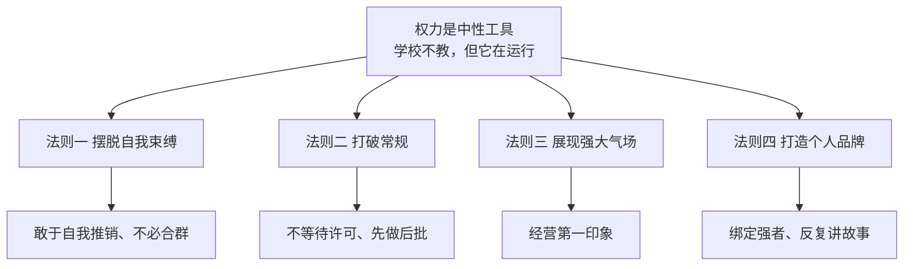
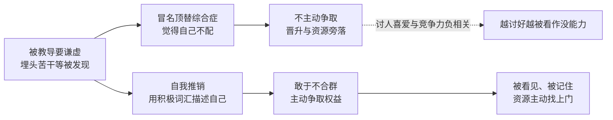
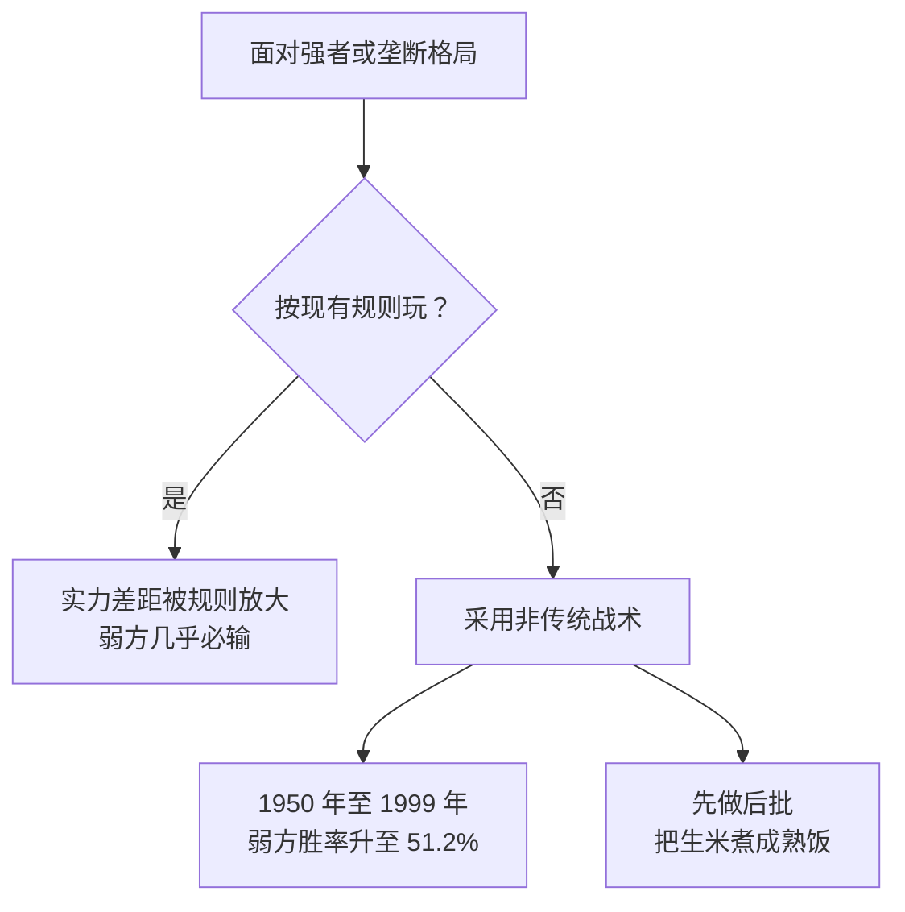

## 先说结论

我一开始是带着抵触点开这个视频的。「权力」在中文语境里天然带负分，容易让人想到算计、站队、办公室政治。

16 分钟看完，我的抵触消了一半，但换了另一种警惕。

这本书真正说的不是「怎么算计别人」。它说的是：**权力是一种中性工具，你不拿，别人就拿走。**

视频转述了 Pfeffer 一句很硬的原话。善良的人如果不争取权力，世界就会被心狠手辣的人操纵。

**这句话我认。**我在公司做 AI 落地，见过太多「活干完了，但没人知道是谁干的」的情况。

技术能力的差距在职业中后期会收敛。真正拉开距离的是另一件事：你做的事，能不能转化成资源和话语权。

图里这四条是视频讲透的部分。它对应原书前四章。

第五章人脉被一句带过，第六、七章直接跳过。这一点我在后面单独说，我认为是这期视频最大的损失。

## 权力为什么是普通人的必修课

Pfeffer 是斯坦福的组织行为学教授。这本书原本是他给 MBA 和总裁班开的课，后来才整理出版。

视频主把它的定位说得很准：学校教了我们一堆知识，唯独没教过怎么获得权力。

我补一句：不是书本里的知识，是现实世界里的权力。

我们从小被教的是埋头苦干、循规蹈矩、是金子总会发光。这套叙事有个隐含前提：**存在一个公平的评审机制，会自动发现你。**

现实里，这个机制不存在。

Pfeffer 的判断更冷：拒绝接受权力运行的现实，等于主动放弃自己的前途。他把权力比作地心引力：你可以不喜欢它，但它一直在起作用。

## 法则一：先解除你自己的封印

这条我最有共鸣，也最不舒服。

书里有个学生 Christine，团队里最年轻、唯一的女性。一个同级别的男同事直接跟领导申请：以后团队都向我汇报。

她的第一反应不是去争。她觉得自己年轻、是女性，争不过。

Pfeffer 提醒她看事实。她是团队里唯一有知名商学院 MBA 的人，数据分析最强，负责的项目收益最高。**她不是没有筹码，她只是没把筹码摆上桌。**

她照做了，赢了这次晋升，之后一路向上。

这张图的右侧分叉是我自己补的。视频把「谦虚」和「推销」讲成两个并列建议，我认为它们是同一个行为的两面。

**你不描述自己，别人就会用最保守的默认版本描述你。**

Pfeffer 还引了一组研究：讨人喜爱的程度与竞争力呈负相关。一个人越想被喜欢，越容易被判断为没能力。

视频里有一句话我记下来了。富人很愿意自我推销、主动建立关系、寻求资源；穷人往往不愿意用这些手段，倾向于合群。这个心理差异本身就是阶层固化的一部分。

他还点名了一个更具体的现象：硅谷亚裔高管的比例远低于印度裔。主要原因是东亚人普遍不喜欢吹嘘、害怕出头。

> 「成功确实需要一点不要脸的精神。」

这句转述有点糙，但我同意它的内核。

## 法则二：规则是为守规矩的人准备的

这条听起来最叛逆，证据却最硬。

书里有个学生想参加好莱坞明星的私人晚宴，就自称福布斯兼职记者给公关发邮件，通过了。临近晚宴时朋友也想去，她只有一个名额，于是直接带人去现场。迎宾一看：来都来了，进去吧。

另一个例子是纽约的规划师 Robert Moses。他建大型项目时，往往到快建完才正式向政府申请批准。政府一看项目都建完了，就批了。

这种先斩后奏，让他成为 20 世纪美国最具影响力的城市规划师。

图里那个 51.2% 是视频转述的数据。军事实力相差五倍以上的战争中，弱方本来没什么机会。但 1950 年到 1999 年间，弱方胜率大幅上升到 51.2%。原因就是采取了非传统战术。

**我没有去核对原书，这个数字只作转述记录。**

Pfeffer 的逻辑很清楚：规则本来就是强者制定的。普通人一直循规蹈矩，上升通道只会更窄。

商业世界同理。面对垄断对手，按现有规则打没戏，颠覆商业模式才可能逆袭。视频拿马斯克举例，说他一直挑战监管部门，为自动驾驶和航天业务开路。

这条我认同，但我想补一个边界。**「先做后批」的成立前提，是你已经建完了，且建的东西确实有价值。** 同样是先斩后奏，做成事叫魄力，做砸了叫事故。

## 法则三：气场这件事，我不敢全盘照抄

先说书中我认同的部分。

人是幕强的，会本能地根据第一印象对待你。Pfeffer 认为外表能预测职业结果，引了两项研究：

- 让学生看一段教授讲课的**无声**视频，给教学水平打分。结果和一整学期上完课的学生评分一致。
- 让 100 个大学生看 50 家财富五百强公司 CEO 的照片，给领导力、能力、可信度打分。结果和公司盈利高度相关。

这两项研究我同样是转述，没有核到原论文的样本与设计。**以貌取人这事不道德，但它确实在发生，而且值得管理。**

我不敢照抄的是后半段。

视频说：表达愤怒让你显得更有权力，表达悲伤、后悔或道歉会让你显得软弱。理由是只有有权力的人才敢打破规则、违反社会期望，所以愤怒会被读成「这人有地位」。

它还拿特朗普举例，说他从不认错、加倍反击。

我对这条的判断是：**它有性别与地位的前置条件，视频完全没提。**

愤怒之所以被读成权力，是因为观察者默认「这个人发得起火」。这个默认不是人人都有。

同样的愤怒表达，落在一个已被认为有地位的人身上是强。落在一个还没被承认的人身上，更容易被读成情绪失控。

而女性、年轻人、职级低的人，恰恰在后一类。

书里自己就承认女性、亚裔是职场中的劣势群体。转头又给一条「愤怒加分」的普适建议。这两处是打架的。

我的做法：**照抄前半段，不照抄后半段。** 前半段是经营仪表、肢体语言、别急着道歉。后半段是把发火当策略。

不道歉不等于要发火。中间还有一大片空间：平静地陈述事实、明确责任边界、提出下一步要求。

## 法则四：品牌是别人替你复述的那个故事

「品牌」这个词听上去很营销，Pfeffer 给的其实是两个具体动作。

第一步，和厉害的人产生联系。他讲了个老故事：有人找罗斯柴尔德男爵借钱。

男爵说我不借。但我可以挽着你的手走过证券交易所大厅。走一圈，到处都有人愿意借给你。

第二步，讲好自己的故事，而且要反复讲。

黑人企业家 Tristan Walker 见人就说自己的创业初心。市场上没有适合黑人毛发的产品，他剃胡子容易长痘。

而硅谷创业者基本是白人，这个市场被忽视了。

故事讲着讲着拉到了投资，公司后来被宝洁收购。

这条最有说服力的是 Deborah Liu 的教训。她在 Facebook 工作 11 年，负责的游戏和营销业务占公司总收入 15%。

但公司太大，没人注意到她做了什么，晋升轮不到她。

后来她换了做法：每遇到一个同事，就说出自己做了什么项目、需要什么资源。其他部门的人知道了来帮忙，新业务因此开辟出来。

成绩被看见之后，她在 2021 年被 Ancestry 挖走当 CEO。

视频里那句总结很直白：你的老板和同事不闲，他们可能根本注意不到你的成就。

「是金子总会发光」这句话，前提是有人拿着灯来找你。

## 视频跳过的三章，才是这本书的下半场

视频主自己说了：第五章讲积极建立人脉，「我觉得没啥稀奇」；第六、七章讲获得权力之后如何使用和巩固，更适合中层管理者，不展开。

第五章这一句带过，我认为是这期视频最大的损失。

理由是逻辑上的。前四章解决的是怎么从无到有拿到权力。而人脉是这四章里每一条的放大器。

自我推销要有听众，打破规则要有人放行，个人品牌要有人替你复述。

**把人脉当成常识略过，等于把前四条的动力源拆掉了。**

第六、七章的跳过我倒是理解。对还没拿到权力的人来说，如何巩固权力确实是下一步的问题。

但这也意味着：这期视频讲的是一本七章书的上半场。如果哪天我真的要啃原版，我会从第五章开始读。

视频主还给了个阅读门槛判断。全书词汇量要求大概在 15,000～20,000，涉及不少学术词汇。

能啃下来基本达到斯坦福 MBA 水平。这个数字是他的个人估计，不是出版社数据。

## 我打算怎么用这四条

看完之后我给自己列了三条要做的、一条明确不做的。

**要做的第一件：把做完的事说出来。** 不是吹，是让信息同步到位。我做 AI 落地，很多成果是「系统跑起来了、效率提升了」。这类事不说，就等于没发生。

**要做的第二件：主动争取资源，而不是等分配。** Pfeffer 那句「不要等环境施舍机会」我认。等分配的人，拿到的永远是上一轮剩下的。

**要做的第三件：给自己准备一个 30 秒版本的故事。** 我在做什么、解决什么问题、需要什么。Deborah Liu 的做法就是这个。

**明确不做的一件：不把「敢于发火」当策略。** 我把道歉换成陈述事实和提下一步要求，但不去表演愤怒。那条建议的前提条件我不具备，硬套的代价我承担不起。

## 最后

这本书改变的不是我的行为，是我对「权力」这个词的默认态度。

我以前把回避权力当成一种道德选择。现在我认为它只是一种**放弃**——放弃的不是道德高地，是你做的事应得的回报。

还有一个疑问留着。Pfeffer 整套论证的样本基本是美国职场，尤其是 MBA 和硅谷这条路径。

它对一个更依赖关系与资历的环境，适用度有多少，我不确定。这个问题得等我真的啃完原版再回来答。

（本文基于夏冰雹 2025-02-04 发布的视频整理。原视频链接见文首 canonical。

视频标题是《斯坦福教授〈权力七法则〉：普通人如何在社会中脱颖而出？》。文中数据均来自该转述，未逐条核对原书。）
