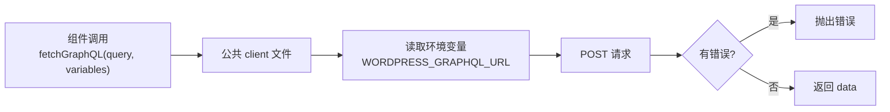

## 先说结论

用 GraphQL 不一定非要引入 Apollo 或 urql 这样的客户端库。在 Next.js 的服务端组件里，一次 `fetch` 就足够完成查询。

但「一次 fetch 够了」不等于「每个组件各写一次 fetch」。

我在跟着 Sandeep Jain 的 headless WordPress 系列做独立站时，前几集为了跑通，取数逻辑是直接写在页面里的。到第五集作者把它抽成了一个公共的 GraphQL client，端点改走环境变量。这一步看似只是整理代码，实际上是把项目从「能跑通」推进到「能维护」。

---

## 散落的 fetch 有什么问题

假设首页要取轮播图和房产列表，关于页要取团队介绍，那么按「各写一次」的写法，三处都要重复这些事：

- 拼出 GraphQL 端点地址
- 设置请求方法与请求头
- 把查询字符串塞进请求体
- 判断响应是否正常
- 出错时给出提示

这些代码每一行都一样，却分散在三四个文件里。

真正的代价不在重复本身，而在**修改时的遗漏**。哪天要给请求加鉴权头，或者换一个端点，就得把所有写过 fetch 的地方都找出来改一遍——漏掉任何一处，那个页面就会静默地继续用旧逻辑。

> [!note]
> 判断标准可以很简单：同一段取数逻辑出现第二次，就该抽出来了。不要等到第五次。

---

## 抽出公共 client

抽完之后，组件侧只剩一次调用，端点、错误处理、请求头都收敛到一个文件里。



**这张图在说什么**：所有组件共用同一条取数通道。端点、错误处理、请求头只写一次，以后要改也只改一处。

这个 client 需要提供三样能力：

**（1）统一的执行入口。** 接收查询字符串，返回数据或错误。

**（2）支持传 variables。** 这一点在下面单独说。

**（3）明确的错误出口。** 出错时给出可诊断的信息，而不是返回 `undefined` 让调用方自己去猜。

---

## 为什么要支持 variables

先看不支持变量时常见的写法——把值拼进查询字符串：

```javascript
const query = `{ property(id: "${slug}") { title } }`;
```

这样写有两个问题。

第一是**注入与转义风险**。如果 `slug` 里出现引号，整个查询字符串的结构会被破坏。

第二是**无法复用**。同一个查询换个参数就要重新拼一次字符串，GraphQL 服务端也失去了复用已解析查询的机会。

正确做法是把值放进 `variables`，查询字符串里只留占位：

```javascript
const query = `query GetProperty($slug: ID!) {
  property(id: $slug) { title }
}`;

fetchGraphQL(query, { slug });
```

这样同一个查询可以服务不同页面。作者在视频里就是用页面 slug 作为变量，让一个查询支撑多个页面，而不用为每个页面复制一份查询。

---

## 端点为什么必须走环境变量

WordPress 的 GraphQL 端点地址，在本地、预发布、生产三个环境里通常是不同的。

如果把它硬编码进源码，每换一个环境就要改一次代码，改完还要重新构建。更麻烦的是，这种改动很容易漏——本地能跑，部署上去才发现地址还是本地的。

放到环境变量里之后，代码只关心「从环境读地址」，具体是什么值由部署环境决定：

```bash
# .env.local
WORDPRESS_GRAPHQL_URL=https://your-site.com/graphql
```

> [!warning]
> `.env.local` 这类文件不应该提交到 Git。否则可能把内部地址甚至密钥推到公开仓库里去。视频里没展开这一点，但这是使用环境变量的基本纪律。

---

## 我踩到的两个问题

**第一个是图片域名。** Next.js 的 `Image` 组件出于安全考虑，只允许加载白名单域名下的图片。本地 WordPress 的图片地址是 `localhost`，不在白名单里，于是报 `Invalid src prop`。

视频里的处理是给 `Image` 加 `unoptimized` 属性跳过优化。这能跑通，但它是「绕过」而不是「解决」——跳过了优化，等于放弃了图片优化带来的体积与加载收益。

更正规的做法是在 `next.config` 里配置 `images.remotePatterns`，把 WordPress 的域名加进白名单。本地开发可以用 `unoptimized` 图快，上生产前应该换成正规配置。

**第二个是查询字段要克制。** 视频开头就强调过，用 GraphQL 的理由之一是「只请求需要的字段」。我在写 client 时保留了这一点：每个页面单独声明自己的查询，不要图省事写一个「取全部字段」的通用查询，否则就浪费了选 GraphQL 的意义。

---

## 我的做法与验证

我在自己的项目里落地这套写法时，动作顺序是这样的：

**（1）先建最小连通。** 写一个页面，直接用 fetch 打一次查询，确认能拿到数据。这一步不抽任何东西，目的只是证明前后端是通的。

**（2）确认通了再抽。** 出现第二处取数时，把重复的端点、请求头、错误处理抽成公共函数，端点同时改成读环境变量。

**（3）逐页核对字段。** 每个页面单独声明自己要的字段，对照页面实际用到的内容删掉多余的。

**（4）本地跑通后换成正规图片配置。** 开发期可以用 `unoptimized` 图快，但在提交前把 WordPress 域名加进 `images.remotePatterns`，再去掉 `unoptimized` 验证一次。

关于验证结果，有几点要如实说明：

- 文中的命令、目录名与组件拆分方式，来自视频演示时的版本，我**没有在本机完整复现整套 WordPress 加 Next.js 环境**。
- `.env.local` 的提交纪律、`images.remotePatterns` 的正规做法，是我基于 Next.js 通用机制的补充，**不是视频里讲的内容**。
- 所以这篇文章的价值是**给出一条可复用的重构路径与判断标准**，而不是一份逐行可照抄的成品代码。真要落地，还需要按自己项目的实际版本调整。

## 什么时候该引入完整的 GraphQL 客户端

抽一个公共 client 之后，大多数场景已经够用。但出现下面这些需求时，就该考虑 Apollo 或 urql 了：

- 需要在客户端做缓存与自动去重
- 需要跨组件共享同一份查询结果
- 需要订阅（subscription）能力
- 需要自动的类型生成与查询校验

在那之前，`fetch` 加一个自己写的 client 是更轻的选择：依赖更少，行为更透明。

---

## 最后

这一集给我最大的提醒不是某个具体写法，而是一句话：**架构决定上限，优化决定下限。**

换成 headless 架构本身不会让站点自动变快。速度来自合理的渲染策略、缓存、克制的字段请求，以及不重复的后端查询。抽公共 client 也是同一类事——它不直接提升性能，但它决定了这个项目后面还能不能改得动。

---

## 附：素材来源

- 视频：[Make Next.js Home Page Dynamic with WordPress + WPGraphQL](https://www.youtube.com/watch?v=eTWL4MECwM4)
- 讲者：Sandeep Jain（13 年 WordPress 与 headless CMS 经验）
- 字幕来源：YouTube 英文字幕（自动字幕，en）
- 证据边界：文中命令、目录与组件名均来自视频演示时的版本；`.env.local` 提交纪律、`images.remotePatterns` 为我的补充，非视频内容
