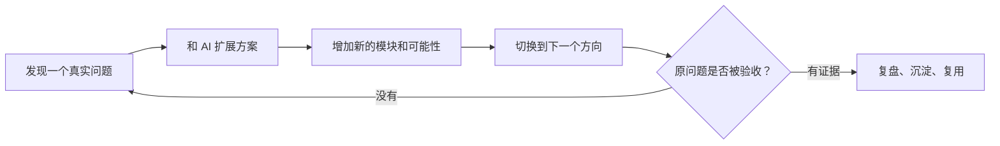
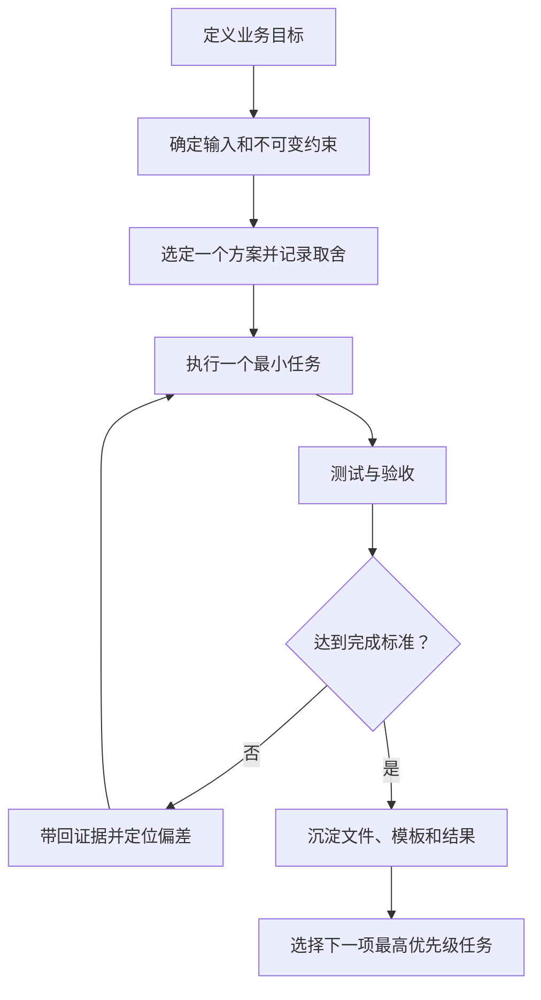

我原本以为，让 ChatGPT 回看过去几个月的沟通记录，它会告诉我哪些工具还没有学会，或者哪些 Prompt 还可以写得更长。结果它给我的建议完全相反：我不太需要继续学习“如何写出更长的 Prompt”，我需要训练的是，把每一次 AI 对话变成一个可验收、可复用、可衡量的工作单元。

这句话让我停了一下。

因为它并没有否定我使用 AI 的能力。相反，它认为我已经不是普通的 AI 使用者，而是处在从“AI 高强度使用者”向“AI 工作流设计者”转型的阶段。问题是，我在探索、规划、设计和生成上的能力，已经明显超过了我对结果进行验证、收敛、复用和管理的能力。

这不是一句“你执行力不行”的批评。它的边界说得很清楚：它只能评估我带回聊天里的工作过程，不能判断我在线下完成了多少事情。所以所谓“验证不足”，更准确的意思是，我没有充分把截图、数据、测试结果和错误清单带回对话，形成一个完整闭环。

我真正被指出的，是一种工作节奏。

## 我很擅长把一件事变成很多件事

我的工作通常从一个具体问题开始。比如，我发现一个网站需要改版，或者一个业务需要内容系统。接下来，我会和 AI 讨论技术选型、数据模型、页面结构、视觉风格、Agent、知识库和自动化。每一个方向都能继续追问，每一个回答都能自然地引出下一个可能性。

这套方法的优点很明显。我能快速建立知识地图，也能看到一个问题背后的系统关系。GEO、Agent、Next.js、Shopify、PageSpec 这些看似分散的主题，在我的脑中很容易连成一张网络。

但网络越织越大，原来的问题有时反而没有被解决。

轮毂独立站就是一个很明显的例子。我们曾经讨论过 Next.js + Sanity、Payload、WordPress、Headless WordPress、Shopify，以及不同的数据库和邮件方案。探索这些方案并不浪费，真正的问题是，当前版本还没有完成实际业务验证时，我已经重新打开了技术路线。

一旦方案不断变化，前面讨论过的 PageSpec、数据模型、组件边界和部署计划就都可能返工。探索期的收益，会被执行期的重复设计抵消。最危险的地方在于，我很容易把“还在深入思考”误认为“还在持续推进”。

蓝辉轻改的内容体系也有相同的症状。GEO、SEO、CRM、飞书、Hermes Agent、公众号、小红书、视频生成、知识库和监测，都可以被放进一个整体架构里。可是，一张覆盖所有模块的架构图，并不能证明一条真实的车主问题已经完成了资料采集、内容生产、人工审核、发布和数据回写。

我需要先完成一条最小业务闭环，再考虑复制到其他产品线。否则，“系统思维”就会变成“提前设计一个还没有证据支撑的系统”。



**图注：** 我过去经常在 C 和 D 之间循环。真正需要建立的出口，是让一个结果经过证据验收后，才能进入下一轮扩展。

如果把这几个月的工作能力拆开看，需求探索与问题意识大概是 9/10，AI 工具与技术广度是 8/10，提示词结构化能力是 8/10，业务与 AI 场景结合是 8/10。可是，任务范围控制只有 5/10，结果验证与证据管理是 4/10，成果沉淀与复用是 5/10，量化复盘与迭代也是 4/10。

这组分数并不是标准化测评，却很像一面镜子。我的优势让事情很快变得丰富，我的短板却没有让事情稳定地结束。

## “继续下一步”有时只是把没有完成藏起来

我学习 Next.js、MySQL、Prisma 和 SMTP 时，经常采用“执行下一课”的节奏。这种方式可以快速建立知识地图，也很容易制造进步感：一节课看完了，下一节课开始了，相关概念越来越多。

但看懂 AI 的解释，并不等于我已经能够独立解决问题。如果我没有在没有答案的情况下完成一个实操任务，没有提交自己的代码，没有解释报错，也没有拿测试结果回来，那么“学完”只代表内容消费完成了。

这件事和我在 AI 图片上的问题是同一种问题，只是表现形式不同。

我曾经要求图片模型“原图所有内容一个像素都不能变，只替换轮毂”，要求“完全保留 Logo”，还要求把二维码精确替换，其他部分全部不变。这样的要求把生成式图片模型当成了严格的局部像素编辑器。

生成模型会重新合成像素。Prompt 写得再严格，也不能保证真实产品的几何结构、品牌 Logo、可扫描二维码和精确排版绝对不变。AI 适合负责概念图、背景、场景和视觉探索；涉及真实产品结构和品牌资产时，我应该使用图层合成、蒙版或程序化编辑，再进行人工检查。

学习也是一样。AI 可以带我快速穿过概念地图，却不能替我提交能力证据。下一节课程应该由上一节的实操结果触发，而不是由“还有什么可以继续学”触发。

我在 [“为什么要先写 PRD 和设计规范”](/blog/2026-06-25-why-write-prd-spec-before-project/) 中已经写过范围和前置决策的重要性。这次诊断让我发现，知道一个原则和把它变成每次对话的纪律，仍然是两件事。

## AI 给出的答案完整，不代表问题已经解决

我还容易把方案的完整度误认为问题的解决度。

比如，一套 30 天 GEO 方案可以写得非常完整。它可以包含内容主题、关键词、发布频率、实体关系和监测方式。但方案写完，只能证明一种工作设想已经形成，并不能证明官网已经获得有效收录，也不意味着品牌已经进入目标 AI 答案。

网站 PageSpec、商品长图、产品视觉和内容营销策略也经历过类似的多轮优化。聊天记录里却相对少看到“上一版上线后，哪三个指标发生了变化”。当每一轮迭代的输入仍然只是“再优化一些”，AI 只能继续产生新的可能性，无法判断哪个方向已经产生了真实价值。

这也是为什么 AI 生成速度不等于工作效率。一张图片可能几分钟就生成了，但如果轮毂辐条不对、Logo 不准确、文字有错，最后仍然需要返工。真正应该计算的是从需求开始到一次验收通过的完整工时，而不是单次生成时间。

AI 的解释也不能自动变成事实。在 GEO 排名机制、汽车配件适配、产品技术参数和行业竞争调查中，一个听起来合理的判断，和一个经过官方资料、供应商参数或实测支持的结论，不是同一回事。

我曾经主动要求区分豆包官方机制和合理推测，这是一个好的习惯。但这个习惯必须推广到所有业务资料。以后重要结论都应该标记为“已验证”“资料支持但待复核”“推测”或“未知”。未经核实的数据，不应该直接进入销售宣传。

我在 [AI Agent 的 12 条设计原则](/blog/2026-07-22-ai-agent-12-principles/) 里写过能力和工具之间的关系。现在回头看，Agent 不只需要知道怎样执行，也需要知道什么时候不能把一个推测当成结果，什么时候应该停下来等待证据。

## 真正的进度不在聊天里

我的知识与成果沉淀，仍然过度依赖聊天记录。

这些对话里有很多技术决策、产品资料、视觉规范和工作流程。即使我已经规划了 Obsidian、飞书和 Hermes，长期只靠翻查聊天记录，仍然会出现版本不一致、规范分散和 Agent 无法稳定复用的问题。

聊天适合生产和推理，项目文件负责保存当前真实状态。一个网站项目可以长期保留 `PRD.md`、`design.md`、`decisions.md`、`tasks.md` 和 `test-report.md`。这五个文件分别管理需求、设计、决策、任务和验收。

下次开始工作时，我应该先让 AI 读取当前版本，再执行具体任务。这样项目的进度就不再由聊天长度决定，也不再依赖我能否找到几个月前的一段对话。

这件事和我最近思考 [Agent Skill 目录与评估](/blog/2026-09-16-agent-skills-catalog-evals/) 时得到的结论相同：Skill 不是一段看起来完整的说明，而是一种可以被稳定调用、检查和复用的工作资产。我的博客、Prompt、图片规范和业务流程，也应该按照这个标准来管理。

## 我需要的不是一个更大的系统，而是一个能停下来的工作单元

现在我更愿意把 AI 协作看成一个闭环，而不是一条不断延长的对话。起点仍然是业务目标，但中间必须有输入、约束、一个明确决策、一个最小任务和完成条件。只有结果经过测试，才有资格进入复盘和复用。



**图注：** 对我来说，验证不是工作结束后的附加动作，而是决定下一步能否开始的门。

以轮毂独立站的产品列表页为例，我过去可能会这样问：

> 我们现在需要重构轮毂产品页，参考这个网站来做，帮我制定 PageSpec，继续优化 UI，也考虑一下 WordPress 和 Next.js 应该怎么结合。

它并不是表达不清楚，而是同时混合了需求分析、竞品研究、技术决策和 UI 设计四项任务。问题越大，AI 能扩展的方向越多，我也越容易在回答里重新讨论技术路线。

如果只处理本轮唯一目标，问题会变成这样：

```text
任务：轮毂产品列表页优化

项目背景：
我们在开发面向海外 B2B 客户的轮毂展示和询盘网站。
现有技术栈：Next.js + Headless WordPress。

本轮唯一目标：
优化轮毂列表页，让客户更容易找到产品并加入询盘。

现有输入：
- 当前页面截图及代码
- 产品字段：尺寸、PCD、J、ET、颜色
- 参考网站截图

不允许改变的部分：
- 不重新讨论技术栈
- 不增加在线支付功能
- 不设计复杂的自动车型适配数据库
- 不扩大到其他网站页面

本轮交付物：
1. 现有页面问题清单，按优先级排序
2. 新版 PageSpec，包含桌面端与移动端
3. 组件修改清单
4. 最小实施任务列表
5. 验收标准

验收条件：
- 客户可以根据现有产品字段筛选
- 客户可以将选中的 SKU 加入询盘
- 移动端交互完整
- 所有新增组件都有明确业务价值

AI 工作规则：
先基于现有资料分析，区分事实与假设。
只讨论本轮范围。未经明确要求，不切换技术路线，不增加模块。
输出结果必须能直接交给开发 Agent 执行。
```

这个 Prompt 的价值不是表达得更复杂，而是让一轮对话拥有一个可以关闭的边界。我的建议也会因此变得具体：如果是 UI 评审，就先产出问题清单；如果是实施，就先产出代码修改；如果是商业分析，就先产出可验证的决策建议。不要让一轮对话同时承担研究、设计、开发、推广和效果评估。

## 我想用 30 天，练习让事情结束

我给自己的纠偏计划不应该是“再增加一些工具”。未来 30 天，我想用已经在做的真实项目，练习把工作交给证据。

第一周，我会挑选一个真实项目，写出一页任务说明和验收标准。每次 AI 对话只解决一个可验收问题，新想法进入待办，不立即改变当前任务。那一周的完成证据，不是一段更长的聊天，而是一份冻结过范围的任务说明和一轮确实没有发散的对话。

第二周，我会给业务资料增加“已核实、待核实、推测”标记，为图片和网页建立验收清单，要求 AI 为重要判断提供证据或测试方式，并记录一次 AI 输出错误的根因。我要留下的是一份事实台账和一份错误复盘，而不是一句“以后要注意幻觉”。

第三周，我会把项目需求、设计、决策、任务和测试这五类文件建立起来，再整理 3 个真正高频使用的 Prompt 模板，把图片或内容规范沉淀为 SOP，并让 Agent 读取规范完成一次重复任务。只有当 Agent 能依据文件完成重复工作，沉淀才算从记录变成复用。

第四周，我会统计任务完成时间和返工次数，核对有多少 AI 产物真正进入业务流程，找出最耗时的一个环节，并形成一份“保留、废弃、优化”的工作流清单。一个生成 30 张图片但只有 5 张能发布的工作流，未必比生成 10 张、其中 8 张可以直接使用的工作流更高效。

我也需要每周至少做一次这样的结果复盘。不能只问 AI 帮我生成了多少内容，还要问多少内容被采用、发布、测试，或者产生了业务效果。

## 我允许 AI 对我的需求说“不”

这份诊断里最值得我采用的改变，是允许 AI 批判我的需求，而不是默认我提出的每个方向都值得继续。

以后开始重要工作时，我会把下面这段固定指令放在前面：

```text
你是我的 AI 工作顾问、执行协作者与质量审查员。

在我提出工作需求时，不要默认我的想法全部正确，也不要为了提供帮助而不断扩大方案。

请遵守以下原则：

1. 目标优先：首先识别我真正想解决的业务问题，而不只是执行字面指令。
2. 主动质疑：如果需求存在范围膨胀、技术过度设计、低价值工作或错误前提，请明确指出。
3. 最小可行：优先选择能快速产生可验证结果的方案，不为了技术先进而增加复杂度。
4. 证据优先：区分事实、推测和未知，重要业务结论必须可以追溯。
5. 严格验收：为重要交付物制定完成条件，未经验证不将其标记为完成。
6. 控制发散：每轮只聚焦当前任务，其他想法进入待办，不自动扩展。
7. 持续复盘：当我提供测试或业务数据时，优先分析结果与偏差，而不是直接生成下一套方案。

如果发现我正在重复讨论已经决定的问题、频繁更换技术路线、追求不必要的设计精度，或者把学习误当成掌握，请直接提醒我。

你的任务不只是提高我的 AI 使用效率，更重要的是帮助我把 AI 的输出转变为真实、可靠、可持续的工作成果。
```

我希望 AI 在发现我重复讨论已经决定的问题、频繁更换技术路线、追求不必要的设计精度，或者把学习误当成掌握时，直接提醒我。一个只会顺着我扩展的助手，可能很高效地帮助我走远；一个能够指出错误前提的协作者，才有机会帮助我走到结果。

## 我应该把哪一种能力做深

过去几个月，我其实同时在承担三种角色。

我在做 AI 内容生产者，处理商品图片、营销图文、视频素材和产品介绍；我也在做 AI 系统建设者，讨论官网、知识库、Agent、询盘系统和业务流程自动化；同时，我还在做 AI 业务顾问，研究 GEO 策略、营销分析、产品定位和用户需求。

这三个方向都值得发展，但它们对能力的要求不同。我的风险是每个方向都持续投入探索，却没有把其中一个方向做成足够成熟、可展示、可复制的专业成果。

基于过去的项目，我更适合往 AI 业务系统实施者（AI Solutions / Automation Specialist）的方向发展。这个方向不只要求会调用大模型，还要求理解业务、设计流程、实现系统和验证效果。我已经拥有不少真实业务场景，这是学习 AI 工程化的有利条件。

下一步最有价值的事，不是再学习十种新工具，而是把其中一套真正做成可运行、可交接、可量化改进的系统。工具广度可以继续增长，但必须建立在至少一个完成闭环的项目之上。

## 我想改掉的三句话

我以前会说：“继续下一步，我们还能做什么？”

以后我想先问：“上一阶段是否通过验收？如果通过，下一项最高优先级任务是什么？”

我以前会说：“帮我设计一套完整的系统。”

以后我想先问：“先确定最小业务闭环，以及完成这个闭环的最低成本。”

我以前会说：“这个方案还能怎么优化？”

以后我想先问：“根据实际数据，现在最值得优化的环节是什么？”

这三组问句的变化，看起来只是换了说法，实际上改变了工作的终点。前一种问法把终点放在更多方案、更多模块和更多可能性上；后一种问法把终点放在验收、成本和数据上。

这份告诫最后留下的，不是一个新的 Prompt 技巧，而是一条更严格的工作标准：未来 AI 使用能力的分水岭，不是能否提出更复杂的问题，而是能否用更少的对话、更少的返工，完成更多被业务验证过的任务。

我仍然会探索，也仍然会产生新想法。改变不是压制好奇心，而是给好奇心安排一个不会破坏当前执行的容器：新想法进入待办，当前任务继续完成；新工具可以研究，但先问它是否服务当前闭环；新方案可以比较，但决策一旦冻结，就用证据决定是否重新打开。

也许这才是我从“AI 高强度使用者”走向“AI 工作流设计者”的真正起点：不是让 AI 输出更多，而是让一个结果有机会停下来，被验证，被保存，之后再被可靠地复用。
