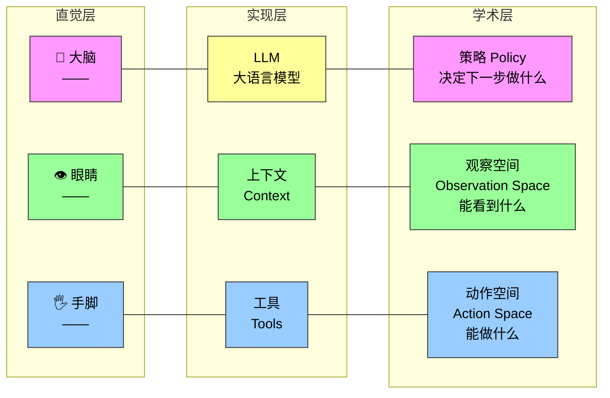
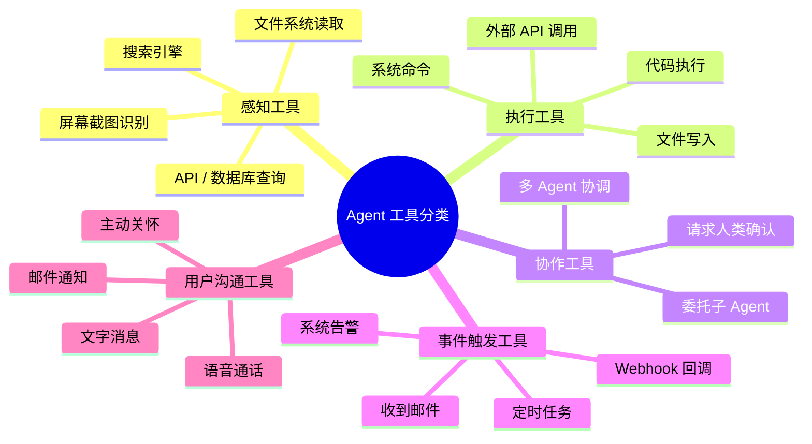
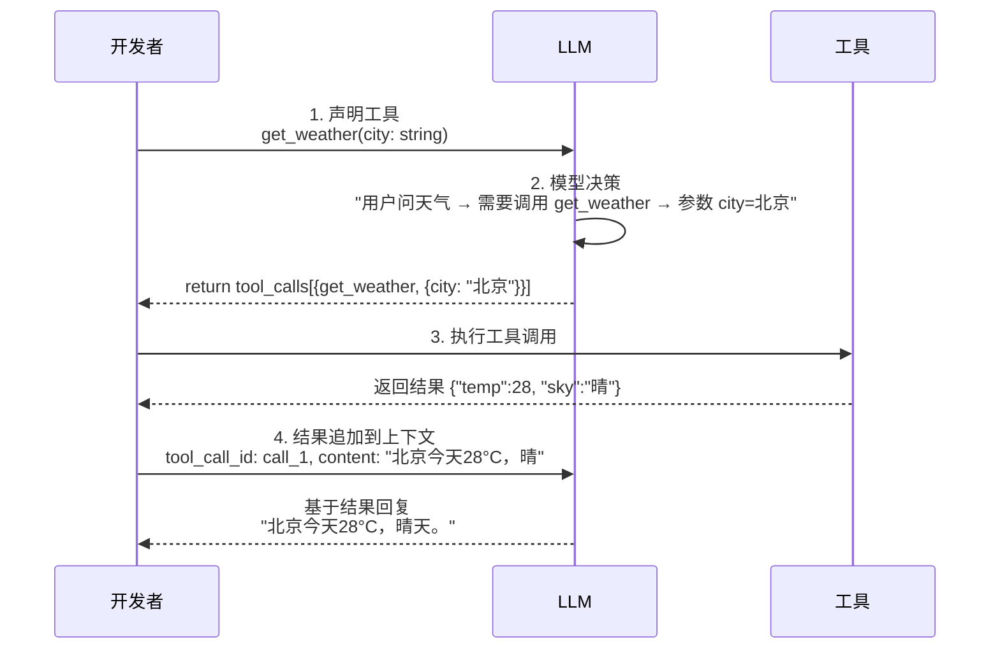
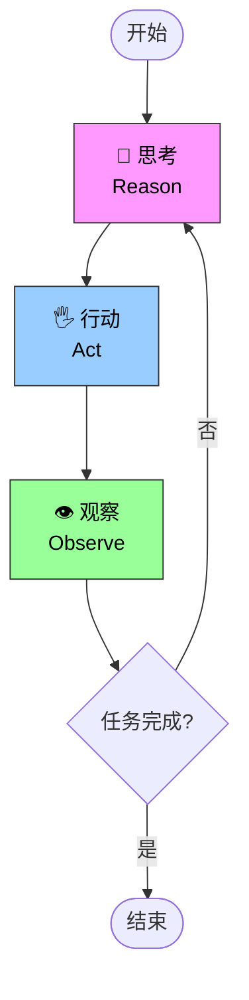

## 从"你问它答"到"它自己干"——我们已经在用 Agent 了

如果你用 **Cursor** 写过代码，看它搜索代码库、编辑多个文件、运行测试直到通过；用 **Deep Research** 调研过一个课题，看它反复搜索、阅读、总结出一份完整报告；用 **Manus** 操控浏览器帮你完成在线任务；让**豆包手机助手**帮你在手机上订票、发消息；或者让 **Pine AI** 替你打电话给运营商协商降低账单——你已经在使用 AI Agent 了。

这些产品形态各异，但有一个共同点：**它们不再是"你问一句、它答一句"的被动对话，而是能够自主规划执行步骤、调用各种工具完成任务，并根据结果不断调整策略的智能系统。**

这就是 Agent 和 Chatbot 的本质区别。

---

## Agent 的核心公式：一个公式，三层理解

现代 Agent 系统的本质可以用一个极简公式表达：

```
Agent = LLM + 上下文 + 工具
```

这个公式每个词都需要做**广义理解**，而不是字面解释。更妙的是，同一件事可以从三个层次去理解，分别对应不同的读者背景：



### 理解一：直觉层（零门槛）

| 类比 | 职责 |
|------|------|
| **大脑** | 负责思考、规划、做决策——理解用户意图，拆解任务，判断下一步做什么 |
| **眼睛** | 提供思考所需的全部信息——当前状况、用户记忆、领域知识、任务进度 |
| **手脚** | 将决策转化为对现实世界的改变——发消息、执行代码、操控界面、调用 API |

这个类比极其好用。不管遇到什么新 Agent 产品，你都可以用这三个维度迅速拆解它。

### 理解二：实现层（工程师视角）

把直觉层翻译成工程术语：

- **LLM 是 Agent 的大脑**——不只是模型参数，而是整个决策内核。能力来源两块：预训练积累的世界知识和语言能力，加上后训练固化的决策策略。后者决定了 Agent 面对复杂情况时的"决策习惯"。
- **上下文是 Agent 的眼睛**——不只是 input 的那段文本，而是 Agent 在每个决策点能看到的**全部信息**：环境信息、用户记忆、领域知识、自身状态、任务进展。上下文窗口就是它"当下能看到的一切"。
- **工具是 Agent 的手脚**——不只是几个 API 函数，而是 Agent 能做的**所有事情的集合**：预定义的工具调用、按需加载的技能、动态生成代码创造新能力、委托子 Agent 协作、主动与用户沟通。

### 理解三：学术层（RL 背景可读，看不懂跳过）

如果你有强化学习背景，这个映射表帮助你快速对齐术语：

| 直觉 | 实现 | 学术概念 | 含义 |
|------|------|----------|------|
| 大脑 | LLM | **策略（Policy）** | 面对当前观察，从所有可选行动中挑出最合适的一个 |
| 眼睛 | 上下文 | **观察空间（Observation Space）** | Agent 能看到、读到、记住、访问的所有信息集合 |
| 手脚 | 工具 | **动作空间（Action Space）** | Agent 能执行的所有操作的集合——从发消息到改代码到操控界面 |

---

## 五种 Agent 产品在三维度上如何展开

用"眼睛-手脚-策略"框架拆解五款主流 Agent，结论一目了然：

| Agent 产品 | 眼睛（感知） | 手脚（行动） | 策略 |
|-----------|-------------|-------------|------|
| **Cursor** 等 Coding Agent | 需求文档、代码库、终端输出 | 代码搜索、文件读写、执行命令 | 增量开发：理解需求→搜索代码→编辑→测试→调试 |
| **Deep Research** 等搜索 Agent | 网络资源、学术数据库、本地文件 | 搜索查询、网页阅读、摘要生成 | 迭代深化：根据已有信息调整搜索方向，逐步综合 |
| **Manus** 等电脑操控 Agent | 电脑屏幕、浏览器、文件系统 | 点击、输入、滚动、截图、执行代码 | 视觉感知+操作：观察屏幕→识别元素→执行→验证 |
| **豆包** 等手机助手 | 手机屏幕、已安装 App | 点击、滑动、输入、打开 App | 意图理解+App 操控：理解需求→定位 App→操作→确认 |
| **Pine AI** 等个人办事 Agent | 用户账户、历史账单、服务商知识库 | 打电话、发邮件、填表单、与用户交互 | 多步骤执行：收集信息→制定策略→联系→谈判→汇报 |

> **关键洞察**：所有 Agent 都是"工具箱"开放式的——内部思考 + 外部行动的组合。区别只在于感知的输入模态不同（代码库 vs 网页 vs 屏幕截图）和行动的环境不同（IDE vs 浏览器 vs 手机 OS vs 电话网络）。

---

## 工具：Agent 的五类手脚

工具是 Agent 与外部世界交互的桥梁。没有工具，Agent 只能"纸上谈兵"；有了工具，它才能真正改变世界。

按**交互方向**把工具分为五类：



其中**事件触发工具**与另外四类有本质区别——它不是 Agent 主动调用的，而是作为外部输入**驱动 Agent 开始执行任务**。比如收到一封新邮件、定时任务到点、Webhook 回调——Agent 是被事件"唤醒"的，而不是主动"伸手"的。

---

## 工具调用（Tool Calling）：Agent 手脚的神经系统

工具调用是现代 LLM Agent 的一项核心能力——它让模型能够通过**结构化的方式**调用外部工具，将 LLM 从一个纯粹的文本生成器转变为能够执行实际操作的智能系统。

### 四步循环



关键点：**开发者只需定义工具和执行工具调用，模型自主完成"要不要调用、调哪个、传什么参数"的决策。** 这个四步循环就是后文的 ReAct 循环的基础。

### 一个重要的设计原则

> **保持工具的通用性，给 LLM 更大的发挥空间。**

具体来说：

- 与其设计一个专用的"计算器"工具 → 不如提供 Python 代码解释器 + 沙盒执行环境
- 与其设计一个"写日志"工具 → 不如提供文件读写工具 + 虚拟文件系统
- 与其封装一个"搜索并总结"工具 → 不如分别提供搜索工具和文本处理工具

**通用工具让 Agent 能通过组合基础能力来创造性地解决问题**——这比预封装的专用工具灵活得多。专用工具假设了 Agent 会怎么用，通用工具让 Agent 自己决定怎么用。

---

## ReAct 循环：Agent 的心跳

ReAct 是 Agent 运行的底层节拍器，它的核心模式非常简单：

```
思考 → 行动 → 观察 → 再思考 → 再行动 → 再观察 → ...
```



每一步的职责：

| 阶段 | 做什么 | 例子 |
|------|--------|------|
| **思考** | 分析当前状态、回顾已收集的信息、规划下一步 | "用户想知道北京天气，我需要调用天气工具" |
| **行动** | 执行具体操作——调用工具、生成回复、请求确认 | 调用 `get_weather(city="北京")` |
| **观察** | 接收工具返回结果、评估效果、更新内部状态 | 收到 `{temp:28, sky:"晴"}`，判断信息是否足够 |

每次循环都会把思考、行动和观察的结果追加到上下文中，这样 Agent 的后续决策可以基于完整的历史记录——这就是 Agent 能处理复杂多步任务的根本原因。

---

## 编排设计模式：从 Workflow 到 Agent 的光谱

并不是所有任务都适合"完全自主的 Agent"。在实际工程中，编排方式是一个**连续光谱**：

| 编排方式 | 特点 | 适用场景 |
|---------|------|---------|
| **确定性 Workflow** | 步骤固定、可预测、无决策分支 | 数据 ETL、固定格式报告生成 |
| **有条件分支的 Workflow** | 预设分支路径，Agent 选择走哪条 | 客服分流、审批流程 |
| **混合模式** | 关键节点 Agent 自主决策，骨架保持可控 | 代码审查流程、文档生成 |
| **自主 Agent** | 全程自主规划、执行、调整 | 开放域调研、复杂编程任务 |

**一个重要原则**：能用确定性 workflow 解决的问题，不要上 Agent。Agent 的自主性带来灵活性，也带来不可预测性和更高的成本。从 workflow 到 Agent 的选择，本质是在**可控性与灵活性之间做权衡**。

---

## 三个学习范式

Agent 的能力不是凭空而来的，有三种不同的学习路径：

| 范式 | 机制 | 类比 | 时间尺度 |
|------|------|------|---------|
| **后训练（Post-training）** | 通过 SFT/RL 固化决策策略到模型权重中 | 通过反复练习形成肌肉记忆 | 模型发布前 |
| **上下文学习（In-Context Learning）** | 在上下文中提供示例、规则、工具描述 | 临时查阅说明书和范例 | 每次会话 |
| **外部化学习（Externalized Learning）** | 通过外部记忆、知识库、工具箱积累经验 | 建立自己的笔记本和工具箱 | 跨会话长期积累 |

三种范式互补，不是互相替代的关系。后训练决定了 Agent 的"底色"，上下文学习提供本次任务的"临场指导"，外部化学习让 Agent 能"越用越强"。

---

## 总结：带走这个思考框架

读完这一章，你不需要记住所有细节，但应该带走一个**分析 Agent 的框架**：

1. **遇到任何新 Agent 产品** → 问三个问题：它的大脑是什么（LLM/策略）？它的眼睛能看到什么（上下文/观察空间）？它的手脚能做什么（工具/动作空间）？
2. **判断 Agent 的能力边界** → 看工具的设计质量和安全约束，而不是看 LLM 本身有多强
3. **评估 Agent 的适用性** → 该任务适合确定性 workflow 还是自主 Agent？灵活性和可控性哪个更重要？
