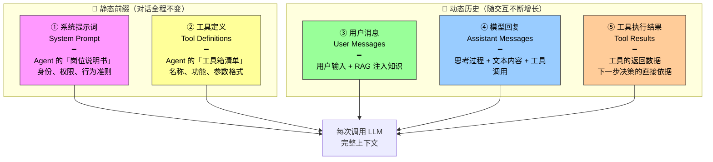
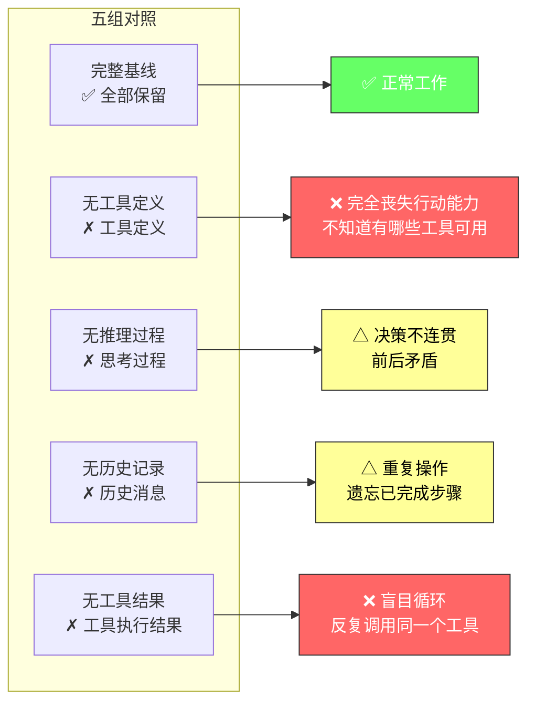

前两节我们分别认识了 Agent 的**大脑**（LLM）和**手脚**（工具），这三缺一中还差一个最容易被低估的组件——**眼睛**。

上下文是 Agent 在每个决策点能看到的全部信息。就像一个人做决策时需要看到桌上摊开的所有资料——任务说明、参考手册、之前的沟通记录、最新的数据反馈——Agent 的上下文窗口就是它的"视野"。"眼瞎"的 Agent，大脑再好也无法做出合理判断。

---

## 上下文五组件：Agent 视野的解剖

从 API 视角看，每次调用 LLM 时的上下文由五个部分构成。它们分成两组：



### ① 系统提示词：Agent 的"岗位说明书"

系统提示词由开发者编写，在整个对话过程中保持不变。它定义了 Agent 的身份、权限和行为准则——相当于入职第一天就贴在工位上的工作守则。

与用户每次输入的消息不同，系统提示词是**前置注入、全程生效**的。它还可以包含：

- **用户记忆**：跨会话保存的偏好、历史行为、背景设定等个性化信息
- **环境状态**：动态注入的当前时间、所在项目、可用资源等

通过提示工程（Prompt Engineering）精心设计系统提示词，我们可以塑造 Agent 的工作方式——就像一个好的岗位说明书能让员工主动做对的事，而不用靠领导反复纠偏。

### ② 工具定义：Agent 的"工具箱清单"

声明 Agent 可用工具的名称、功能描述和参数格式。没有工具定义，Agent 就无法识别和调用任何工具——就是这么绝对。后面会看到消融实验直接证明了这一点。

工具定义与系统提示词一起构成对话中保持不变的**静态前缀**。

### ③ 用户消息：任务的起点

来自用户的输入。但不只是用户打的那行字——用户消息中还可能包含通过 **RAG**（检索增强生成）动态检索注入的外部知识，用来覆盖训练数据截止后的新信息或私有领域知识。

换句话说，用户输入是种子，RAG 是给这颗种子浇的水——上下文由此具备了"联网"感知能力。

### ④ 模型回复：不只是说话

模型之前生成的回复包含最多三个部分：

| 组成部分 | 说明 | 是否一定出现 |
|---------|------|-------------|
| **思考过程**（reasoning） | 内部思考链，保持思维连贯性 | 不一定（取决于模型是否暴露） |
| **文本内容**（content） | 对用户的自然语言回复 | 给出最终回答时出现 |
| **工具调用请求**（tool_calls） | Agent 采取行动的方式 | 决定调用工具时出现 |

在一次回复中三者不一定同时出现：决定调用工具时通常只有 reasoning + tool_calls，给出最终回答时通常是 reasoning + content。但思考过程（reasoning）是连贯决策的关键——剥离它之后会发生什么，消融实验给了一个清晰的答案。

### ⑤ 工具执行结果：行动的反馈

Agent 框架执行工具后返回的结果。这些结果是 Agent 下一步思考的**直接依据**，也让它能够从执行结果中学习、避免重复犯错。

没有这个反馈，Agent 就会回到上一节说的"盲目执行"状态——不知道自己刚才干了什么，也不知道干得对不对。

---

## 消融实验：逐一切掉组件看会发生什么

要验证每个组件是否不可或缺，最直接的方法是**消融实验**（Ablation Study）：就像医生诊断时逐一排除病因——先去掉 A 组件看系统是否还正常，再去掉 B 组件，以此类推，从而判断每个组件的贡献。

实验从五个组件中选取了四个参与消融（系统提示词不参与——因为去掉它等于让 Agent 忘记自己是谁，测试没有意义），结果非常直接：



| 实验组 | 现象 | 根因 |
|--------|------|------|
| **去掉工具定义** | ❌ 完全丧失行动能力 | 不知道有哪些工具、每个工具能干什么、需要什么参数——就像让你修车但不告诉你工具箱在哪 |
| **去掉工具执行结果** | ❌ 盲目循环 | 看不到上一步的反馈 → 不知道自己刚才做了什么 → 反复调用同一个工具 → 无限循环 |
| **去掉思考过程** | △ 决策不连贯 | 剥离了"为什么这么做"的记录 → 新决策与旧决策之间失去了逻辑链条 → 前后矛盾 |
| **去掉历史记录** | △ 重复操作 | 没有记忆 = 从头开始 → 重复执行已完成步骤 → 效率崩溃 |

### 核心洞察

> **上下文决定了 Agent 能看到什么，而 Agent 只能基于它看到的信息做决策。**

这个原则简单到容易被忽视，但它贯穿 Agent 设计的全部环节。就像一个人被蒙住眼睛就无法做出合理判断——不是因为他不会判断，而是因为看不到判断的素材。缺失任何一个上下文组件，Agent 的决策能力都会严重退化：

- 看不到工具定义 → 不知道有哪些"手"可用
- 看不到工具结果 → 不知道自己"刚刚做了什么"
- 看不到思考过程 → 新决策与旧决策"断线"
- 看不到历史记录 → 每一次都像第一轮对话

---

## 从静态到动态：上下文的两层结构

把五个组件重新分组，可以看到上下文有一个清晰的结构：

```
┌────────────────────────────────────────────────┐
│  静态前缀（对话全程不变）                          │
│  ┌──────────────┐  ┌──────────────────────┐     │
│  │ 系统提示词     │  │ 工具定义               │     │
│  │ 身份、规则     │  │ 可用工具、参数格式      │     │
│  └──────────────┘  └──────────────────────┘     │
├────────────────────────────────────────────────┤
│  动态历史（随交互增长，每轮追加）                    │
│  [用户消息] → [模型回复] → [工具结果] →            │
│  [用户消息] → [模型回复] → [工具结果] → ...         │
└────────────────────────────────────────────────┘
```

**静态前缀**给 Agent 奠基——让它知道自己是谁、能做什么。**动态历史**让 Agent 有了时间感——知道已经发生了什么、当前进行到哪一步、下一步应该往哪走。两者缺一不可：只有静态前缀，Agent 每次都是"第一次听到你的需求"，完全不记得上下文；只有动态历史，Agent 不知道自己的身份和能力范围。

---

## 总结：视野决定决策

读完这一节，你应该记住一个原则和三件事。

**一个原则**：Agent 的决策质量上限 = 上下文信息的完整性和质量。不是模型多聪明，而是"它看到了什么"决定了它能做出什么判断。

**三件事**：

| 记住 | 为什么重要 |
|------|-----------|
| 五个组件缺一不可 | 消融实验证明：去掉任何一个，Agent 的行为都会从"正常工作"退化为"循环错误"或"矛盾决策" |
| 静态前缀 + 动态历史 = 完整视野 | 前者给 Agent 身份和能力边界，后者给 Agent 时间感和任务进度 |
| 上下文不是"塞更多文本" | 关键是组件的完整性和信息的结构化，而非窗口大小——信息再多，缺了工具结果照样瞎 |

