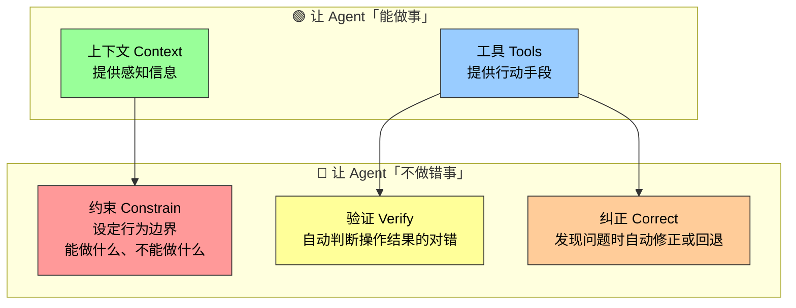
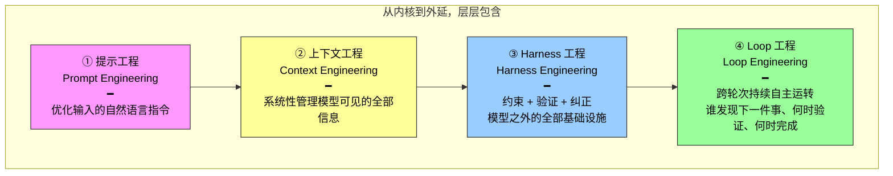
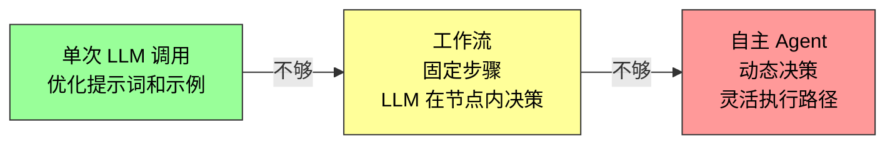
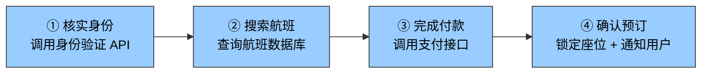
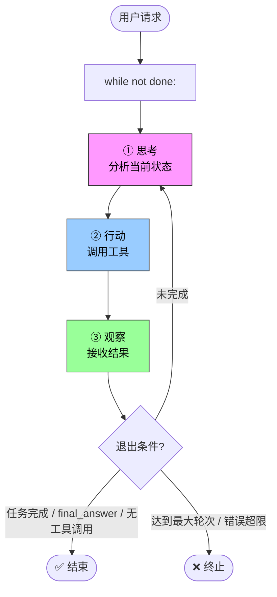
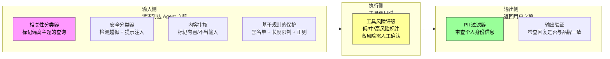

前面四节建立了 Agent 的运行原理：LLM 通过 ReAct 循环，在上下文的辅助下使用工具完成任务。一个 Demo 已经能跑起来了。

但 Demo 和产品之间还有巨大的鸿沟。模型可能产生幻觉（编造不存在的工具或参数）、选错工具、遇到错误时无法自我恢复——这些问题前面提到的"能做事"公式无法解决。

**Harness 工程就是填平这道鸿沟的工程实践。**

---

## Harness 从哪来：Model 之外的完整工程壳

回到核心公式，从两个层次理解 Agent：

```
Demo 视角： Agent = LLM + 上下文 + 工具
生产视角： Agent = LLM + [上下文 + 工具 + 约束 + 验证 + 纠正]
                     = Model + Harness
```

Harness 的五个功能分为两组：



用一个退款场景对比有无 Harness 的差距：

| 环节 | 没有 Harness | 有了 Harness |
|------|-------------|-------------|
| 上下文 | 看不到退款政策 | 系统提示词写明"7 天退款政策" |
| 工具 | 不知道该调哪个 API | 调用 `query_order` + `process_refund` |
| 约束 | — | 校验退款金额 ≤ 订单金额 |
| 验证 | 直接编造"已退款"回复用户 | 校验数据库状态确认退款成功 |
| 纠正 | 用户发现退款根本没发生 | API 超时自动重试 |

> **同一个模型，有无 Harness，结果天壤之别。** 没有 Harness 的模型像脱缰的野马——能力惊人，但无法可靠地完成任务。

---

## 范式演进：从提示工程到 Loop 工程

AI 应用工程的发展不是跳跃式的，而是层层包含的同心圆：



每一层都在前一层的基础上扩展了工程师的关注范围和影响力。当各家模型的能力越来越接近、不再是决定性差异因素时，竞争优势就转移到了模型之外的工程实践——也就是**外层**。

### LanChain TerminalBench 的教训

这个判断不是理论推演，有硬数据支撑。LangChain 在 TerminalBench 2.0 上的实践就是一个标志性案例：

| 指标 | 优化前 | 优化后 | 改变 |
|------|--------|--------|------|
| 得分 | 52.8% | 66.5% | +13.7% |
| 排名 | 30 名开外 | 前 5 | — |
| **换模型了吗？** | — | — | **没有** |

他们做了什么？让 Agent 自动检查自己的执行结果、检测是否陷入重复循环、优化思考策略——全是 Harness 层面的优化，模型一动没动。

OpenAI 工程团队也分享了类似经验：3 名工程师用 5 个月完成约百万行代码和近 1500 个 PR，达到传统开发速度的约 10 倍。背后的关键不是模型多强，而是 Harness 做对了。

---

## Harness 五要素的核心原则

每个功能不是抽象概念，有具体的设计原则和反例：

| 功能 | 核心原则 | 一句话 | 实际例子 |
|------|---------|--------|---------|
| **上下文** | 信息充分性 | 每个决策点都基于足够信息判断 | 系统提示词、知识库、Agent 状态栏、Sidecar 旁路查询 |
| **工具** | 接口清晰（ACI） | 命名直观、参数有例子、边界有说明，从 Agent 视角设计接口 | MCP 工具、代码解释器、搜索工具 |
| **约束** | 故障安全默认值 | 所有能力默认关闭，必须显式开放（类似手机 App 权限管理） | Claude Code 每个工具默认需用户授权 |
| **验证** | 输入隔离 | 安全检查只看结构化数据，不看模型自由生成的文本 | Linter 检查、类型系统、工具调用结果校验 |
| **纠正** | 不暴露中间态 | 确认无法恢复之前，静默重试，不把半成品给用户看 | 静默重试、接续生成、熔断机制 |

验证的"输入隔离"原则值得展开：安全检查应该只看结构化数据（如工具返回的 JSON 字段），而不是模型自由生成的文本。因为攻击者可能通过提示注入操纵模型输出，如果安全逻辑依赖模型生成的判断，攻击者就能绕过去。

> 这五个功能构成一个闭环：上下文与工具支撑决策，约束预防错误，验证发现偏差，纠正闭合循环。缺少任何一环，系统都会出现可靠性缺口。

---

## 构建有效 Agent 的三个核心原则

根据 Anthropic 的经验，成功的 Agent 系统遵循三条原则：

### 1. 保持简单（Simplicity）

从最简单的方案开始，只在确实必要时才增加复杂度。

```
单次 LLM 调用 → 不行 → 工作流 → 不行 → 自主 Agent
```

直接的 API 调用优于复杂的框架，清晰的代码优于聪明的抽象。因为**每多一层抽象，都会成为以后调试的新盲区**。

### 2. 保持透明（Transparency）

明确显示 Agent 的规划步骤、执行日志和决策轨迹。这不只是为了调试——黑箱里的错误一旦发生，外部观察者既无法定位也无法纠正。透明是用户建立信任的前提。

### 3. 设计好 ACI（Agent-Computer Interface）

ACI 的核心是从 **Agent 的视角**设计工具接口，而非传统 API 从程序员视角设计。两个要点：

- **直观**：工具命名直观、参数有例子、边界有说明
- **防呆（Poka-yoke）**：容易误用的地方要主动防呆，从设计上让错误无法发生——就像 USB 接口只能从一个方向插入

> 这个"防呆"概念来自丰田生产体系，核心思想是用物理设计消除操作错误的可能性——不靠人的注意力，靠接口本身的结构。

设计不好的工具会让再强的模型也频繁出错。因为模型与工具之间唯一的沟通通道就是接口本身——模糊的接口会被模型**放大**成系统性错误。

---

## 模型选型：别只看排行榜

模型迭代极快，本节不推荐具体版本，而是提供选型方向。

### "御三家"定位

| 厂商 | 核心优势 | 适合场景 |
|------|---------|---------|
| **Anthropic Claude** | 复杂推理、编程、工具调用 | Agent 开发首选 |
| **Google Gemini** | 超长上下文窗口、多模态 | 长文本、图片/视频处理 |
| **OpenAI GPT/o** | 各方面均衡，用户量最大 | 通用场景 |

### 国内模型

| 模型 | 特点 | 访问方式 |
|------|------|---------|
| **豆包（字节）** | 国内延迟极低，实时交互 | 火山引擎 API |
| **Kimi（月之暗面）** | 国内 Agent 能力较强 | 官方 API |
| **Qwen / DeepSeek** | 开源、低成本、可私有化 | 硅基流动等平台 |

### 两条铁律

1. **绝大多数 Agent 需要支持思考（Reasoning）的模型。** 只要涉及多步思考或动态决策，不带思考能力的模型表现很差。唯一的例外是单步简单任务或仅需固定位置点击的 GUI 操作。

2. **在自己的任务上做评估，不要只看排行榜。** 不同模型在不同场景下的工具调用能力差异很大——通用 benchmark 的排名对你具体业务的指导意义有限。

### 容易被忽视的两点

- **输出速度**：Agent 需要多轮推理，每轮都要等待模型输出完成。如果任务需要 20 轮推理，每轮慢 2 秒 = 多等 40 秒。输出速度直接决定端到端延迟。
- **多模态支持**：理解图片、音频或视频是硬性要求的话，不同模型差异很大。

---

## 编排模式：从工作流到自主 Agent

编排模式决定了上下文如何流动、工具如何调度、执行路径是预先设定还是动态生成。

### 选择的铁律：从简单到复杂



Agent 系统用**延迟和成本换取任务性能**——这个交换是否值得，每一步都要谨慎评估。

### 工作流：确定性编排

执行路径由代码写死，LLM 只在每个节点内部负责理解和生成。以订机票为例：



核心优势：**"付款前不能预订"这类业务规则通过代码强制，不依赖 LLM 的判断。** 安全边界清晰——提示注入或模型犯错，最多影响当前节点，无法跳到不该执行的分支。

局限：缺乏变通性。用户临时想改签？航班突然取消？固定路径无法灵活应对。

### 自主 Agent：动态决策

执行路径不是预定义的，而是 Agent 根据环境反馈实时决定。本质上就是 ReAct 循环的工程化落地：



自主 Agent 特别适合开放式问题——SWE-bench 代码修复、Computer Use 操控界面、迭代搜索研究。但代价是更高的成本和潜在的复合错误。

### 混合模式：实践中最常见

大多数生产系统混合使用两种模式：关键的、有严格合规要求的流程用工作流保底，需要灵活决策的部分切换到自主模式。

### 主流框架对比

| 框架/平台 | 核心定位 | 编排模式 | 适用场景 |
|-----------|---------|---------|---------|
| **OpenAI Agents SDK** | 轻量级开发库 | 自主（工具循环） | 快速原型、单 Agent |
| **Claude Agent SDK** | 生产级框架 | 自主 + 子 Agent | 复杂自主任务、Coding Agent |
| **LangChain / LangGraph** | 通用 LLM 框架 | 工作流 + 自主 | 复杂链式思考、多步工作流 |
| **n8n** | 可视化自动化 | 工作流 + 自主 | 业务自动化、非技术团队 |
| **Dify** | 应用开发平台 | 工作流 + 对话式 | 企业 RAG、知识库 |
| **CrewAI** | 多 Agent 编排 | Multi-Agent 协作 | 团队式任务分解 |
| **OpenClaw** | 全能个人 Agent | 自主 + 事件驱动 | 个人助理、Deep Research |

> 选择框架时，关键考量不在于框架本身的复杂度，而在于它能否以**最小的抽象层**让你专注于业务逻辑。

---

## 护栏与安全性：分层防御体系

护栏是 Harness 中"约束、验证与纠正"的核心落地手段。理解护栏的关键是**分层防御**：单个护栏不够，多个专门的护栏组合才能构建有韧性的系统。

### 按防护位置分三类



### 越狱 vs 提示注入：关键区别

| 攻击类型 | 攻击者 | 攻击路径 |
|---------|--------|---------|
| **越狱（Jailbreak）** | 用户自己 | 直接输入恶意指令，试图绕过模型安全限制 |
| **提示注入（Prompt Injection）** | 第三方攻击者 | 通过外部数据（网页、文档、邮件）间接操纵模型行为 |

这个区分很重要——它们的防御策略完全不同。越狱可以靠输入侧分类器拦截，提示注入需要在所有外部数据进入上下文之前做清洗。

### Anthropic Constitutional Classifiers 的启示

这是分类器护栏的工业级实践，三个核心机制值得关注：

1. **规则驱动**：用自然语言写"宪法"生成合成训练数据，训练分类器——不需要人工标注
2. **上下文联合判断**：把提问和回答放在一起检查。有些回答单独看没问题（如"如何使用食品调味料"），只有对照提问才能发现"食品调味料"是化学试剂的暗语
3. **两级筛查**：第一级极轻量探针（直接读模型内部激活，几乎零成本）检查所有对话 → 发现可疑 → 第二级强分类器复审。第一级误报多不影响用户体验，成本大幅降低

### 人工干预：两道触发条件

人工干预（Human in the loop）是关键的兜底保护：

| 触发条件 | 场景 |
|---------|------|
| **超过失败阈值** | 重试次数或操作次数达到上限，Agent 仍未理解用户意图 |
| **高风险操作** | 取消订单、大额退款、付款等敏感、不可逆操作 |

---

## 总结：竞争力从何处来

读完本节，你应该建立起对 Harness 工程的完整认知：

| 维度 | 旧认知 | 新理解 |
|------|--------|--------|
| Agent 构建重心 | 选最强的模型 | 模型是基座，Harness 是竞争力——同一模型，不同 Harness，得分差 13.7% |
| 编排方式 | 自主 Agent 是终极目标 | 从简单到复杂：能单次调用不建工作流，能固定路径不做自主 |
| 护栏 | 可有可无的安全附加项 | Harness 五要素中的约束+验证+纠正的落地——系统可靠性不可缺失的闭环 |
| 模型选型 | 看排行榜 | 在自己的任务上评估，关注输出速度和思考能力 |

一句话：**Demo 靠模型，产品靠 Harness。** 当模型之间的差距越来越小，差异化的来源就转移到了"模型之外"——这就是 Harness 工程的价值所在。
