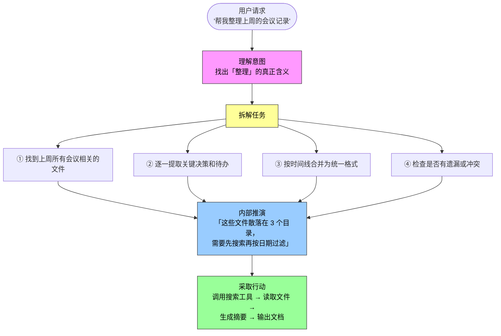
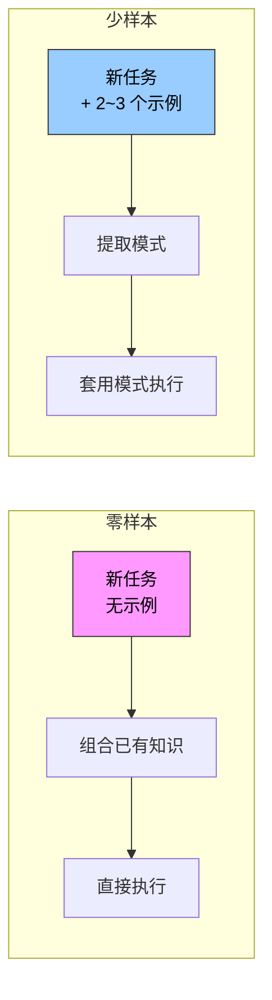
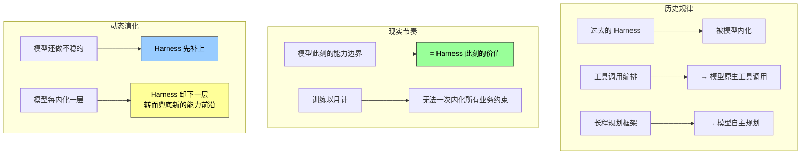

上一节我们建立了 Agent 的完整骨架：Agent = LLM（大脑）+ 上下文（眼睛）+ 工具（手脚）。这一节聚焦核心——**大脑**。

LLM 在 Agent 中做的事情，远不止"听懂问题、生成回答"。它是一个完整的决策引擎，承担三个关键职责：理解用户的真实意图（用户说的往往不是他真正想要的），将模糊或复杂的任务拆解成可执行的步骤，以及在执行过程中持续做出判断——下一步该做什么、要不要调用工具、调哪个、传什么参数。

---

## 内部思考：Agent 的"默念"能力

LLM Agent 有一个容易被忽视但至关重要的能力：**在采取实际行动之前，先进行规划与推演。**



这个过程不改变外部环境——没有调用任何工具，没有写入任何文件——却显著提升了后续行动的质量。Agent 不是先做了再说，而是**先想清楚再动手**。

LLM 为什么能做到这一点？答案藏在预训练中。

模型在预训练阶段从海量互联网文本中习得的，不只是语言规律，更是人类知识中已经沉淀下来的**逻辑规则**——数学定律、因果关系、问题分解策略、推理链条。因此 Agent 的推演不是盲目的随机探索，而是在结构化的知识体系上展开的定向推理。打个比方：它不是在一片漆黑的迷宫里乱撞，而是在一张已经画好的地图上规划路线。

---

## 零样本 vs 少样本：两种"上手"方式

这种结构化推演能力，让 LLM Agent 面对全新任务时也能直接上手。具体有两种表现：

### 零样本泛化（Zero-shot Generalization）

**"没有例子也能做。"**

即使面对从未见过的任务，LLM Agent 也能通过组合已有知识来处理，无需任何示例。你从未教过它写一首关于量子物理的诗，但它能根据已有的语言知识和物理知识，生成一首像样的作品。这不是魔法——是预训练阶段的海量知识为"跨界组合"提供了原料。

### 少样本适应（Few-shot Adaptation）

**"看几个例子就能学会。"**

只需在提示中给出两三个示范例子，模型就能掌握一种新的任务模式。比如给它看几条"用户评论 → 情感标签"的对应关系，它就能学会对新评论做情感分类。



> **一个关键区别**：零样本靠的是预训练知识库的广度，少样本靠的是上下文中的模式匹配速度。两者互补——零样本决定 Agent 的下限（什么都能做一点），少样本决定 Agent 的上限（给对例子就能做好）。

---

## 模型即 Agent：当模型本身成为产品

"模型即 Agent"（Model as Agent）是 AI Agent 发展的最新方向。核心变化在于：先进的模型通过后训练（特别是强化学习）将工具调用能力**内化为原生能力**——何时调用工具、调哪个、传什么参数，都由模型自己决定，无需人工编排。

这意味着什么？过去你需要写一堆 if-else 来决定何时触发什么工具；现在模型自己就能判断"用户这句话的意思是需要搜索，我来调搜索工具"。

### 但这不意味着框架层变不重要了

恰恰相反。模型越强大，围绕模型构建的 **Harness**（工程外壳）就越关键。

Harness 这个词原指马具——套在马身上的缰绳与挽具。它不是为了限制马的奔跑能力，而是把这种力量引导到正确的方向上。换到 Agent 语境里：

| 类比 | 含义 |
|------|------|
| **马（模型）** | 强大但不可预测——能跑很快，也可能跑偏 |
| **缰绳（Harness）** | 上下文管理、工具接口、安全约束、验证纠正 |
| **骑手** | 你——设定目标和边界条件 |

你也可以把它想象成赛车手的整套保障系统：安全带、赛道护栏、进站维修团队。车手（模型）越快，这套系统越重要。

### 关键张力：模型会不会最终"吃掉"所有 Harness？

这悬着一个更深的问题，也是 Rich Sutton 在《苦涩的教训》中揭示的历史规律：研究者一次次把自己对领域的理解编码进系统，短期见效，长期却总是输给能随算力与数据规模持续扩展的通用方法——搜索与学习。

以此衡量：Harness 里的约束、验证与纠正，有多少属于"人的先验"、注定会被模型内化？

**本书的立场是八个字：方向认同，节奏务实。**



> **务实结论**：Harness 工程不是对《苦涩的教训》的抵抗，而是这一教训在工程时间尺度上的实践。模型每变强一步，Harness 就往更前沿的边界退一步——但永远不会消失，只是换了一个阵地。

---

## Agent 的三种学习机制

一些读者一想到 Agent 从经验中学习，就认为一定要训练模型。事实并非如此——后训练并不是 Agent 从经验中学习的唯一方法。

```mermaid
graph TB
    subgraph 后训练
        P1["SFT / RL 训练"] --> P2["固化到模型参数"]
        P2 --> P3["跨任务通用性最强"]
        P3 --> P4["⏱️ 更新成本高<br/>💪 能力永久提升"]
    end
    subgraph 上下文学习
        I1["提示中给出示例"] --> I2["注意力机制快速适配"]
        I2 --> I3["本次会话内有效"]
        I3 --> I4["⏱️ 即时生效<br/>⚠️ 会话结束消失"]
    end
    subgraph 外部化学习
        E1["编写知识库 / 工具代码"] --> E2["外部存储持久化"]
        E2 --> E3["跨会话持续可用"]
        E3 --> E4["⏱️ 需要专门整理<br/>✅ 持久 + 可解释"]
    end

    style P1 fill:#f9f,stroke:#333,color:#000
    style I1 fill:#9cf,stroke:#333,color:#000
    style E1 fill:#9f9,stroke:#333,color:#000
```



### 后训练（Post-training）

通过 SFT（监督微调）和 RL（强化学习）将决策策略固化到模型参数中。本质是将经验"写入"模型的长期记忆。

- **优点**：跨任务通用性最强，能力永久提升
- **代价**：训练周期以月计，更新成本高
- **类比**：系统性学习教科书——学完后能力永久提升，但费时费力

### 上下文学习（In-Context Learning）

通过注意力机制（Attention Mechanism）在上下文中进行模式检索式的快速适配。在提示词中给模型看几条客服对话的处理示例（如"用户投诉 → 安抚 + 补偿方案"），它就能用类似的方式处理新的客服对话。

- **优点**：即时生效，零训练成本
- **代价**：会话结束就消失，本质更接近模式匹配而非真正的学习
- **类比**：临场查阅参考资料——有资料就能做好，合上就忘了

> **需要澄清一个常见误解**：虽然名字叫"学习"，但上下文学习的内部机制更接近**模式匹配**。如果给你看三道相同类型的数学题和答案，然后给你第四道，你大概率能照葫芦画瓢做出来——这就是上下文学习在做的事。但如果第四道题需要一种全新的解题思路，光看前三道题的答案是不够的。上下文学习让模型能套用已见过的模式，但**不能发现全新的规律**——这一点与后训练有本质区别。

### 外部化学习（Externalized Learning）

将知识和流程外部化为知识库与可执行的工具代码。

- **优点**：兼具持久性和可解释性，随时可查阅
- **代价**：需要人工整理和维护
- **类比**：整理个人笔记本——信息持久保存且随时可查，但需要花时间专门整理

### 三种范式的协同

| 维度 | 后训练 | 上下文学习 | 外部化学习 |
|------|--------|-----------|-----------|
| **时间尺度** | 月级，模型发布前 | 秒级，每次会话 | 天级，随用随建 |
| **持久性** | 永久（写入参数） | 临时（会话结束消失） | 持久（外部存储） |
| **通用性** | 跨任务 | 限本次任务 | 限编写范围 |
| **可解释性** | 低（黑盒参数） | 中（提示可见） | 高（代码/文档可见） |
| **更新成本** | 极高 | 极低 | 中等 |

三种范式不是互相替代，而是在不同时间尺度上互补：后训练提供基础能力底色，上下文学习实现本次任务的快速适配，外部化学习确保跨会话的知识积累和可靠性。

---

## 总结：LLM 在 Agent 中的三个角色

读完这一节，你对 LLM 的理解应该从"它是一个很会聊天的模型"升级为：

```
LLM = 推理引擎 + 规划器 + 决策器
```

| 角色 | 做什么 | 关键能力来源 |
|------|--------|------------|
| **推理引擎** | 理解意图、内部推演、在行动前规划 | 预训练阶段习得的逻辑规则和世界知识 |
| **规划器** | 将模糊任务拆解为可执行步骤 | 零样本泛化 + 少样本适应 |
| **决策器** | 判断何时调用工具、调哪个、传什么参数 | 后训练固化的决策策略 |

同时记住那个务实的判断：**模型越强，Harness 越重要。** 不是在抗拒《苦涩的教训》，而是在它兑现之前的工程实践——模型此刻做不到的，我们用 Harness 兜底；模型明天学会了的，我们就把 Harness 撤到新的前沿。

下一节将继续拆解 Agent 的眼睛——上下文（Context）：它不只是一段 prompt，而是 Agent 在每一个决策点能看到的全部世界。
