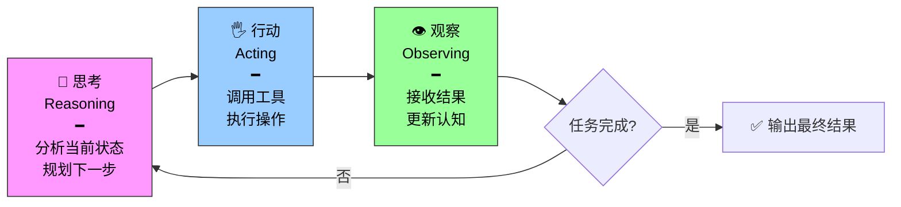
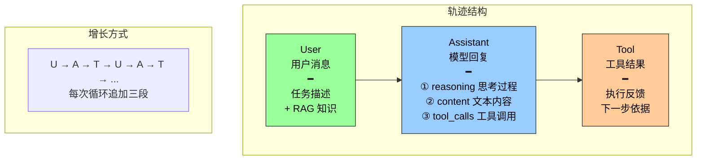
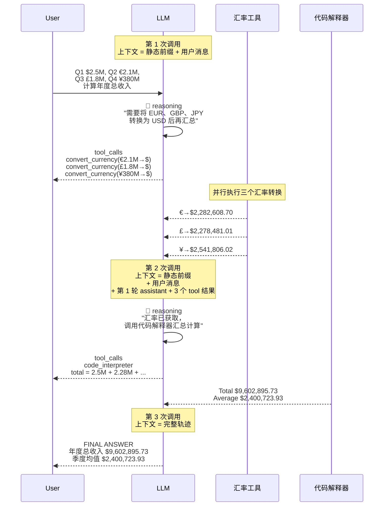
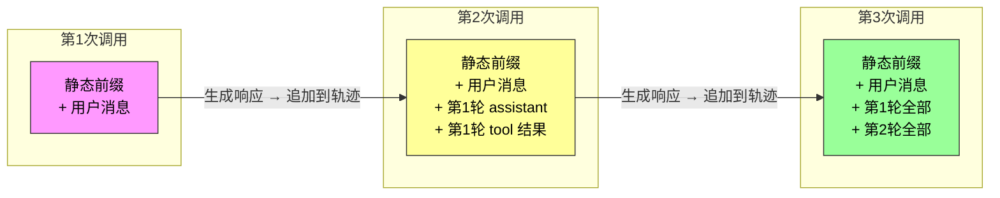

前三节我们分别认识了 Agent 的**大脑**（LLM）、**手脚**（工具）和**眼睛**（上下文）。现在把它们拼起来：这三者是如何协同工作的？

答案就是 ReAct 循环——Agent 运行的**心跳**。

---

## ReAct 不是两步，是三步循环

ReAct 这个名字来自 **Rea**soning + **Act**ing，字面上只有"思考"和"行动"两个词。但实际循环包含**三个环节**：



更直觉的表达：**想 → 做 → 看 → 想 → 做 → 看 → ...**，直到任务完成。

很多人的第一反应是"这不就是多调用几次工具吗"。不是。真正的精妙之处在于**每次循环都能看到前面所有循环的完整记录**——这是"累加"而非"替换"的过程。

---

## 轨迹：Agent 的"记忆结构"

轨迹（Trajectory）是 Agent 在执行任务过程中不断积累的消息历史。每次调用 LLM 时，它接收的完整上下文由两部分组成：

```
完整上下文 = 静态前缀 + 轨迹
```

- **静态前缀** = 系统提示词 + 工具定义（前两节已详述）
- **轨迹** = 用户消息 + 模型回复 + 工具执行结果（随交互不断增长）

轨迹不是一段扁平的文本，而是**结构化分离**的消息序列：



**三种 role 被清晰地区分开来**——这一设计不是语法糖，而是 Agent 可解释性和可调试性的根基。你可以在任何时刻停下来，顺着轨迹看到：用户说了什么、Agent 当时怎么想的、调了什么工具、工具返回了什么。

---

## 一个真实案例：多币种收入汇总

让我们通过一个具体例子来感受轨迹是如何生长起来的。任务：根据四个季度的收入数据（涉及 USD、EUR、GBP、JPY 四种货币），计算年度总收入和季度平均收入。



**仅 3 次迭代、4 次工具调用**就完成了这个涉及多币种转换 + 汇总计算的复杂任务。并且第一次迭代中，三个汇率转换是**并行调用**的——Agent 判断这三个调用互相独立，没有先后依赖，所以一次发出。

---

## 轨迹的伪代码结构

把上面的执行过程翻译成伪代码，可以更清晰地看到轨迹的结构化分离：

```python
trajectory = [
    # ── 任务起点 ──
    {"role": "user", "content": "根据季度收入：Q1 $2.5M, Q2 €2.1M, Q3 £1.8M, Q4 ¥380M，计算年度总收入和季度平均"},

    # ── 第 1 次迭代：识别需要汇率转换 ──
    {
        "role": "assistant",
        "reasoning": "需要将所有货币转换为 USD 再汇总计算",
        "content": "",                    # 没有直接回复用户
        "tool_calls": [
            {"name": "convert_currency", "args": {"amount": 2100000, "from": "EUR", "to": "USD"}},
            {"name": "convert_currency", "args": {"amount": 1800000, "from": "GBP", "to": "USD"}},
            {"name": "convert_currency", "args": {"amount": 380000000, "from": "JPY", "to": "USD"}},
        ]
    },

    # Agent 框架执行工具，追加结果
    {"role": "tool", "content": "EUR → USD: 2,282,608.70"},
    {"role": "tool", "content": "GBP → USD: 2,278,481.01"},
    {"role": "tool", "content": "JPY → USD: 2,541,806.02"},

    # ── 第 2 次迭代：汇总计算 ──
    {
        "role": "assistant",
        "reasoning": "已获得汇率转换结果，现在需要汇总计算",
        "content": "",
        "tool_calls": [
            {"name": "code_interpreter", "args": {"code": "total = 2500000 + 2282608.7 + 2278481.01 + 2541806.02"}}
        ]
    },

    {"role": "tool", "content": "Total: $9,602,895.73, Average: $2,400,723.93"},

    # ── 第 3 次迭代：输出最终答案 ──
    {
        "role": "assistant",
        "reasoning": "所有计算完成，向用户总结结果",
        "content": "年度总收入 $9,602,895.73，季度均值 $2,400,723.93",
        "tool_calls": null
    },
]
```

注意几个关键细节：

1. **系统提示词和工具定义不在轨迹中**——它们作为静态前缀，每次 LLM 调用时自动拼接在轨迹前面
2. **assistant 消息的三个字段不同时出现**：第 1、2 次迭代有 reasoning + tool_calls（没有 content），第 3 次有 reasoning + content（没有 tool_calls）
3. **每次 LLM 调用看到的都是完整轨迹**——第 2 次调用能看到第 1 次的所有消息，第 3 次能看到前两次的全部

---

## 轨迹设计的两个精妙之处

### 精妙之一：上下文的累积性



每次 LLM 调用都能看到完整的轨迹，这让它能够理解：
- 当前处于任务的哪个阶段
- 之前尝试了什么、得到了什么结果
- 哪些步骤已经完成、哪些还需要做

就像人类解决问题时会不断回顾和总结，Agent 通过轨迹保持着对整个任务的**全局认知**。

### 精妙之二：结构化分离

user、assistant（reasoning + content + tool_calls）、tool 三种 role 被清晰分开。这不是为了方便阅读——它带来了三个工程价值：

| 价值 | 说明 |
|------|------|
| **可解释性** | 任何时刻停下来都能读懂：用户要什么、Agent 怎么想的、结果是什么 |
| **可调试性** | 出问题时直接定位到具体环节——是思考错了、工具选错了、还是工具返回了意外结果 |
| **可训练性** | 大量轨迹数据可以总结到知识库，或通过强化学习来训练更好的 Agent 模型 |

---

## 模型即 Agent 的进化：GPT-5.6 的原生 Deep Research

实验 1-3 展示了"模型即 Agent"模式的最新进展。GPT-5.6 将 OpenAI Deep Research 产品的设计理念**内化到了模型层面**。

### Freeform Tool Calling：告别 JSON 转义

传统工具调用要求把所有参数打包成严格的 JSON 格式——就像填表格，格式限制多。Freeform Tool Calling 允许模型直接向工具发送**原始文本**：

| 传统方式 | Freeform 方式 |
|---------|--------------|
| `{"name": "python", "args": {"code": "import numpy\n..."}}` — JSON 转义麻烦 | `type: "custom"` — 直接发送 `import numpy\n...` 原始 Python 代码 |
| 解析开销大，调试困难 | 直奔主题，工具收到什么就执行什么 |

要强调的是，这是 **API 参数格式的演进**，而非模型架构的革新。客户端的工具调用循环（检测 tool_calls → 执行 → 回传结果）逻辑保持不变。

### 意图澄清：先问清楚再动手

GPT-5.6 的一个跨代改进是**意图澄清机制**：面对研究任务，模型不会立即动手执行，而是先通过一系列问题来澄清用户的真实意图。

```
用户: "搜索最近一个月的比特币走势，做技术分析"

GPT-5.6: "您偏好使用哪个数据源（TradingView / CoinGecko / 其他）？
         需要分析哪些技术指标（MA / RSI / MACD / 布林带）？
         是否需要可视化图表？"
```

> 这个机制弥合了"用户说了什么"和"用户真正想要什么"之间的差距——而且是在任务执行之前，不是在返工之后。

配合 Responses API 的内置工具（网络搜索、代码解释器），GPT-5.6 实现了"搜索 → 阅读 → 分析 → 再搜索"的迭代研究闭环，编排循环从客户端移到了 API 服务端。

### Sol / Terra / Luna 三档规格

| 规格 | 定位 | Reasoning Effort 最大档 |
|------|------|------------------------|
| **Sol** | 旗舰前沿模型，最复杂任务 | max（最充分推理时间） |
| **Terra** | 均衡模型，日常工作 | high |
| **Luna** | 快速经济，轻量任务 | medium |

每个规格还支持 **Verbosity**（输出详略）和 **Reasoning Effort**（思考深度）两个参数，让开发者根据任务复杂度做精细控制。

---

## 总结：循环即是能力

读完这一节，你应该更新对 Agent 运行方式的理解：

| 旧认知 | 新理解 |
|--------|--------|
| Agent 就是"给 LLM 接几个工具" | Agent 的本质是结构化轨迹的累积循环——想 → 做 → 看 → 想 → 做 → 看 |
| 轨迹就是日志 | 轨迹是 Agent 的"工作记忆" + 可解释性基建 + 训练数据原料 |
| 模型越强框架越薄 | 模型越强，对框架提出更高的编排要求——意图澄清、并行调度、轨迹管理 |

一句话：ReAct 循环不是"让模型多调用几次工具"，而是**让模型在每次决策时都能看到自己走过的完整路径**。这恰好回到了上一节的核心原则——Agent 只能基于它看到的信息做决策。ReAct 循环确保 Agent 的"视野"不是单张快照，而是一部连续的电影。
