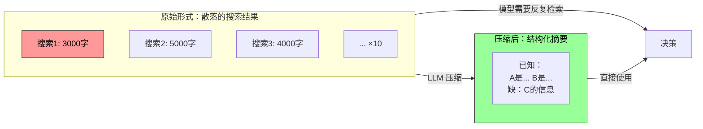
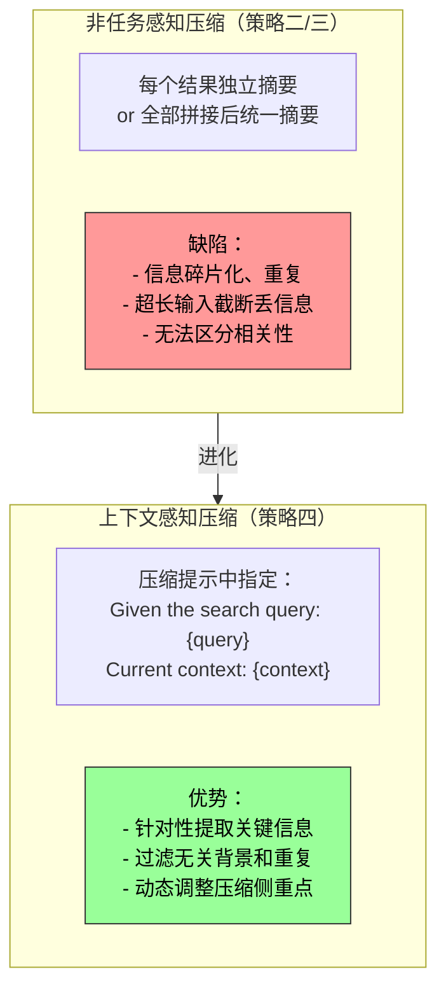
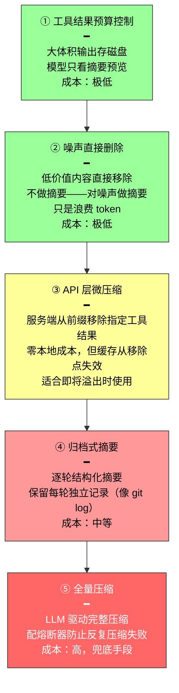
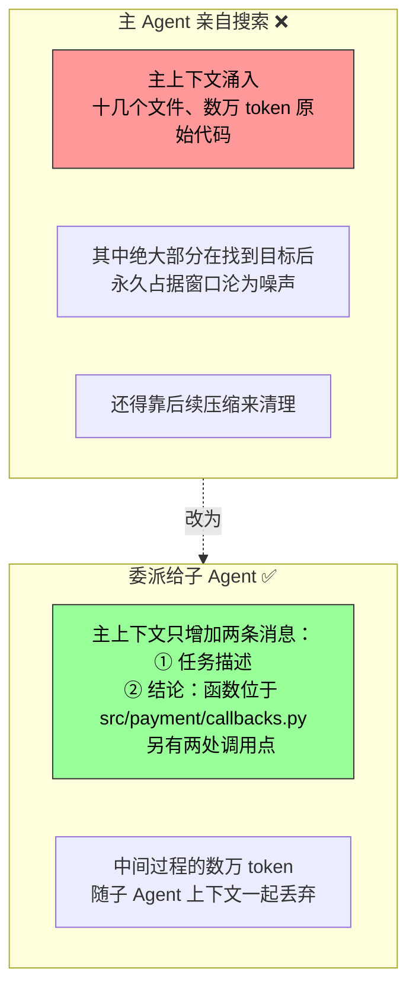

前面几节都在讨论"往上下文里放什么"——提示工程决定写什么，Skills 决定按需加载什么，状态栏决定注入什么元信息。本节讨论相反的方向：**如何从上下文中减少内容。**

---

## 为什么需要压缩：不只是长度问题

压缩上下文有两个截然不同的动机，理解这一点对设计压缩策略至关重要。

### 动机一：长度约束和成本

最直观：上下文窗口有限（比如 128K token），工具调用结果动辄数万字符，几轮交互就撑满窗口，任务被迫中断。同时 token 越多，API 成本越高，推理延迟也急剧上升。

### 动机二：提升思考质量

这是更深层、也更容易被忽视的动机。即使窗口足够大，把所有原始信息堆在上下文里也不是最优选择。

考虑一个场景：Agent 通过 10 次网页搜索积累了信息。这些结果以原始形式散落在上下文各处——第 2 轮的结果在前面，第 9 轮的在后面。当 Agent 需要基于所有信息做最终决策时，它必须在数万 token 中反复"检索"相关片段，注意力被分散，关键信息容易被遗漏。

如果在第 10 次搜索后，先用一次 LLM 调用将已有信息做一次结构化总结——"目前已知：A 是⋯, B 是⋯, 还缺 C 的信息"——模型在后续思考时就可以直接使用精炼的知识，无需从原始数据中重新提取。



这回到了状态栏一节的核心机制：**注意力擅长检索，不擅长归纳。** 状态栏是把算好的结论注入上下文，压缩是把臃肿的原始记录换成算好的结论——两者是同一枚硬币的两面，都在给那台"只有一半"的检索引擎补上缺失的"提炼层"。

---

## 上下文学习的内部机制：检索而非推理

用一个简单例子直观感受"检索而非推理"。

上下文中有一段宠物店的巡查记录：

```
笼子 1：黑猫。笼子 2：白猫。笼子 3：黑猫。笼子 4：黑猫。笼子 5：白猫。
⋯⋯（共 100 个笼子，90 只黑猫、10 只白猫）
```

当你问"黑猫和白猫各有多少只？"时：

| 模式 | 行为 | 代价 |
|------|------|------|
| **不启用思维链** | 很难直接给出正确答案——注意力擅长"笼子 37 里是什么猫？"（检索），不擅长"总共有多少只？"（统计归纳） | 直接答错 |
| **启用思维链** | 逐个数 → 得到答案 | 每次被问到都要从头数一遍，大量思考 token |
| **提前总结** | 上下文中直接写入"黑猫 90 只，白猫 10 只" | 模型直接检索结论，无需重新思考 |

> 在 Agent 场景中，如果这类统计信息需要被反复使用，累积的思考成本会非常高。**压缩的核心价值就是把"需要思考才能用"的数据变成"可直接检索"的知识。**

---

## 上下文腐化：装得下但找不到

一个更隐蔽的问题：**上下文腐化（Context Rot）**。

| 问题 | 现象 | 原因 |
|------|------|------|
| **上下文溢出** | 窗口满了，装不下了 | 硬限制，容易感知 |
| **上下文腐化** | 窗口还有空间，但 Agent 找不到关键信息了 | 注意力被稀释，关键信息埋没在噪声中 |

随着上下文增长，注意力被分散到更多 token 上，每个 token 获得的权重变小。更关键的是，**无关内容一旦占了上下文的大头，Agent 的决策质量就会明显下滑。**

实践中，最常见的失效模式不是窗口不够长，而是**信息密度不对**——偶尔才用到的知识每次都加载、稳定的规则和动态的状态混在一起。模型能看到的内容越来越多，但真正有用的部分越来越难被注意到。就像在一个巨大的图书馆里找一本书，书架上摆的无关书籍越多，找到目标就越难。

Karpathy 提出了一个深刻的洞察：**模型的"记忆差"在某种程度上是特性而非缺陷。** 上下文窗口的有限性迫使模型学会从大量细节中抽象出一般模式——就像人不会记住每次对话的逐字内容，而是提炼出总体印象。

这揭示了压缩的设计原则：与其期望模型从冗长上下文中自动学习，不如**显式地进行知识提炼**。不要让模型被动地在海量信息中检索，而要为它提供经过提炼的结构化知识。

---

## 压缩与 KV Cache：权衡而非矛盾

前面反复强调 KV Cache 要求前缀稳定，但压缩不是要修改上下文中间的内容吗？

关键在于**压缩的时机和位置**：

1. **System Prompt + Tool Definitions 永远不动**——静态前缀，KV Cache 持续缓存
2. **压缩的对象是对话历史中的 tool results**——替换位置之后的缓存失效，但之前的不受影响
3. **这是一个有意识的权衡**：不压缩 → 溢出 → 任务直接失败；压缩后 → 损失部分缓存 → 但上下文可控、信息密度更高

> 最佳实践：**在上下文接近阈值时批量压缩，不要每轮都压。**

---

## 实验 2-9：六种压缩策略量化对比

任务：识别并追踪 OpenAI 联合创始人的职业状态。使用 Kimi K3，刻意将上下文预算限制在 128K 窗口以触发压缩。

不压缩时，7 次工具调用累计返回约 367,000 个字符，第 5 次迭代就超过 128K 限制，任务失败。

| 策略 | Token 用量 | 压缩率 | 迭代次数 | 结果 |
|------|-----------|--------|---------|------|
| **无压缩** | >110K | 100% | 5 | ❌ 溢出失败 |
| **个体摘要** | 123,205 | 6.8% | 12 | ✅ 但信息碎片化，多个页面重复描述同一事件 |
| **组合摘要** | 55,462 | 2.1% | 10 | ✅ 但超长输入时须截断，可能丢失末尾信息 |
| **上下文感知** | **25,198** | **0.9%** | **7** | ✅ 将 147,877 字符压到 1,963 字符仍保留关键信息 |
| **感知+引用** | 45,544 | 1.4% | 17 | ✅ 每条事实附带 URL 来源，可回溯验证 |
| **自适应窗口** | 181,372 | — | 8 | ✅ 前几轮保持完整原文，接近阈值再批量压缩 |

### 上下文感知胜出的原因



多步骤任务中，不同阶段需要的信息密度和类型是不同的——初期需要广泛收集，中期需要精确核验，后期需要综合整合。上下文感知压缩通过动态调整侧重点实现了信息价值最大化。

### 自适应窗口：延迟压缩的智慧

任务初期上下文空间充足，无需急于压缩。只在接近容量限制时才启动：

- **阈值触发**：prompt token 超过窗口 80% 时激活
- **批量压缩**：触发时一次性压缩所有未标记的工具结果
- **防重复保护**：`[COMPRESSED]` 标记确保不重复处理

代价是总 token 用量较大，但前几轮保留了完整原始信息，为初期信息收集提供了最大灵活性。

---

## 生产级五层压缩机制

成熟的 Agent 系统不只用单一策略，而是**分层组合**。以 Claude Code 为参照，五个层次按实现成本从低到高排列：



> 前两层应该优先使用（成本最低），后两层作为兜底（成本高但效果好）。生产数据表明大量会话会困在反复压缩失败的循环中，熔断器避免了持续烧钱。

---

## 压缩的四条设计原则

| # | 原则 | 示例 |
|---|------|------|
| 1 | **信息价值的非均匀分布** | 关键决策点（人员名单）> 支撑证据（新闻细节）> 冗余噪声（导航栏、页脚广告） |
| 2 | **语义完整性** | "Sutskever 于 2024 年 5 月离开 OpenAI"不能压成"Sutskever 离开"——时间和公司名不可丢失 |
| 3 | **任务相关性** | 同样的内容在"找创始人名单"和"了解个人背景"两个任务下应产生不同的压缩结果 |
| 4 | **压缩即理解** | 有效压缩需要深层语义理解。显式压缩结果可审查、可跨会话复用 |

### 压缩的保留优先级

压缩最容易丢失的不是细节本身，而是**早期的架构决策、约束背后的理由和失败的路径**——LLM 通常会优先删除那些看起来还可以重新获取的信息。

生产级系统的建议：

```
1. 架构决策和关键约束  → 不得摘要
2. 已修改的文件列表    → 完整保留
3. 验证状态 (pass/fail) → 必须保留
4. 未解决的 TODO       → 必须保留
5. 工具输出            → 可删除，仅保留 pass/fail 结论

UUID、hash、IP、端口、URL、文件名 → 必须原样保留
（改错一位 PR 编号或 commit hash，后续工具调用直接失效）
```

---

## 隔离优于压缩：子 Agent 上下文隔离

压缩是在信息进入上下文之后做减法。一个更釜底抽薪的思路是：**让大体积的中间信息根本不进入主上下文。**

这就是**子 Agent 上下文隔离**——主 Agent 把"读取大量文件""在代码库中大范围搜索"这类会产生海量中间内容的任务，委派给独立的子 Agent；子 Agent 在自己的上下文中完成探索，只把几百 token 的结论性摘要回传给主 Agent。



这本质上是用**隔离代替压缩**：

| | 压缩 | 隔离 |
|---|------|------|
| 性质 | 有损、需要额外 LLM 调用的事后补救 | 让噪声从一开始就与主上下文绝缘 |
| KV Cache | 压缩点之后的缓存失效 | 主 Agent 前缀完全不受影响 |
| 代价 | 压缩调用本身的 token 成本 | 子 Agent 看不到主 Agent 的完整上下文，任务描述必须自包含 |

Claude Code 的 Task 工具、各类 Deep Research 系统的检索子 Agent，都是这一模式的生产实现。

---

## 总结

| # | 要点 |
|---|------|
| 1 | 压缩有两个动机：控制成本 + 提升思考质量。后者的本质是把"需要思考"变成"可直接检索" |
| 2 | 上下文腐化比溢出更隐蔽——装得下但找不到了。信息密度比窗口大小更关键 |
| 3 | 上下文感知压缩效果最好（token 减少 77%+），因为它把任务意图纳入了压缩决策 |
| 4 | 生产级采用五层压缩：前两层优先（预算控制 + 噪声删除），后两层兜底 |
| 5 | **隔离优于压缩**——让噪声不进主上下文。子 Agent 是最干净的上下文管理手段 |
